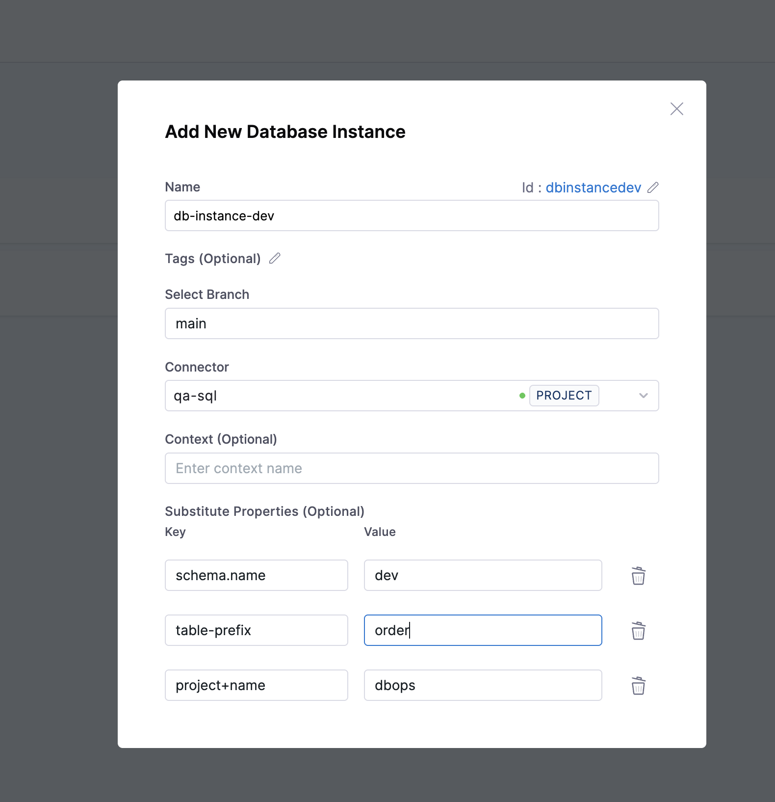

# Substituting Properties in Changelogs
 Substituting properties in changelogs means replacing placeholders (like `${property.name}`) with actual values at runtime.


:::info
The tokens to replace in your changelog are described using the `${property-name}` syntax.
The supported format includes alphanumeric characters, +, -, . , and _. Example `${property+name}`
:::

Here's the YAML for the example:

```yaml
databaseChangeLog:
 # Use ${schema.name} to dynamically pick the schema based on the environment (dev, prod, etc.)
 - changeSet:
    id: 12345
    author: stephen-atwell
    changes:
     - createTable:
        tableName: "${schema.name}.user_details"  # schema.name will be replaced from properties
        columns:
         - column:
            name: id
            type: int

 # Use ${table-prefix} to add a common prefix to all your tables (e.g., myapp_orders etc)
 - changeSet:
    id: 7890
    author: stephen-atwell
    changes:
     - createTable:
        tableName: "${table-prefix}.payments"  # table-prefix will be replaced from properties
        columns:
         - column:
            name: order_id
            type: bigint

 # Use ${project+name} to name constraints dynamically to avoid conflicts across projects
 - changeSet:
    id: 45678
    author: stephen-atwell
    changes:
     - addUniqueConstraint:
        tableName: users
        columnNames: email
        constraintName: "${project+name}_users_email_uk"  # project+name will be replaced from properties
```

## Using property substitution in your changelog
You can set property values from the instance, while creating & updating the instance.
Here is the process:



The tokens of above example will get replaced by the property values, once you run update command.
<details>
<summary>Here is the updated YAML:</summary>

```yaml
databaseChangeLog:
 - changeSet:
    id: 12345
    author: stephen-atwell
    changes:
     - createTable:
        tableName: "dev.user_details"  # schema.name replaced with dev
        columns:
         - column:
            name: id
            type: int

 - changeSet:
    id: 7890
    author: stephen-atwell
    changes:
     - createTable:
        tableName: "order.payments"  # table-prefix replaced with order
        columns:
         - column:
            name: order_id
            type: bigint

 - changeSet:
    id: 45678
    author: stephen-atwell
    changes:
     - addUniqueConstraint:
        tableName: users
        columnNames: email
        constraintName: "dbops_users_email_uk"  # project+name replaced with dbops
```
</details>

## Property Substitution Behavior

### Missing Properties
If the content of `${property-name}` does not match a property, it is left as-is, and it is not removed.
Once a property has been set, it cannot be changed. Only the first definition is used, others are skipped.

Let's look at the below changeset:
```yaml
  - changeSet:
     id: 123
     author: stephen-atwell
     changes:
      - addColumn:
         tableName: person
         columns:
          - column:
             name: ${column.updatedBy}
             type: varchar(10)
     rollback:
      - dropColumn:
         tableName: person
         columnName: state
```

if `${column.updatedBy}` is missing in substitute properties, the token won't be replaced, and it is left as-is,
```sql
ALTER TABLE person ADD [${column.createdBy}] varchar(10);
```

### Escaping Property Substitution
If you don't want a `${property-name}` placeholder to be replaced, add a colon **:** right after the `${`.
For example, `${:property-name}` will always stay as `${property-name}`, even if property-name is defined.

It is often useful when you want to show an example without real substitution:
<details>
<summary>Here is YAML example:</summary>
```yaml
databaseChangeLog:
  - changeSet:
      id: 2
      author: bikram
      changes:
        - comment: "Create table for schema ${:schema.name}"
```
</details>


:::note
You can use property substitution in sql and sqlFile change types. Liquibase calculates the checksum after substitution for sql, but before substitution for sqlFile.
This impacts attributes like runOnChange.
For example, if you set an environment variable ENV_EXAMPLE=value and use it in both sql and sqlFile changesets, then update the database, the value is substituted.
If you later change ENV_EXAMPLE=new_value and run update again, only the sql changeset reruns, because its checksum reflects the substituted value.
:::

