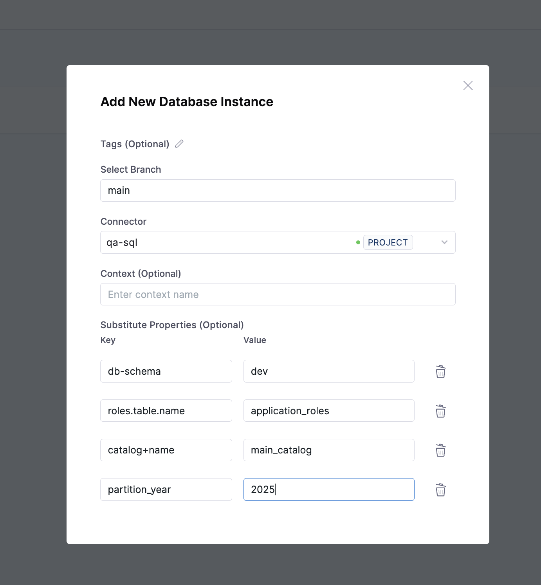

# Substituting Properties in Changelogs
It allows you to define placeholders in your changelog files (such as `${property.name}`) and later replace these placeholders 
with actual values when the changelog is executed. This mechanism is especially useful for managing configurations and ensuring 
flexibility in database migration scripts.

It decouples your database migration logic from environment-specific values, making the whole process of versioning and 
deploying database changes far more efficient and scalable.

:::important
**Minimum versions required**
- db-devops-service - 1.35.x
- drone-liquibase - plugins/drone-liquibase:1.2.0-4.27
- drone-liquibase-mongo - plugins/drone-liquibase:1.2.0-4.27-mongo
- drone-liquibase-spanner - plugins/drone-liquibase:1.2.0-4.27-spanner
:::


:::info
The tokens to replace in your changelog are described using the `${property-name}` syntax.
The supported format includes alphanumeric characters, +, -, . , and _. Example `${property+name}`
:::


## Uses
1. Environment-specific Names
2. Reusability
3. Separation of Concerns
4. Consistency Across Environments
5. Dynamic Configuration

Let's have a look at the below example to understand the above-mentioned uses.

Here's the YAML for the example:
```yaml
databaseChangeLog:
  - changeSet:
      id: 1
      author: stephen-atwell
      changes:
        # Example 1: Environment-Specific Configuration
        # Use ${db-schema} to dynamically pick the schema based on the environment (dev, prod, etc.)
        - createTable:
            tableName: ${db-schema}.users
            columns:
              - column:
                  name: id
                  type: int
              - column:
                  name: username
                  type: varchar(255)
              - column:
                  name: email
                  type: varchar(255)

  - changeSet:
      id: 2
      author: stephen-atwell
      changes:
        # Example 2: Reusability
        # Use ${roles.table.name} to insert some default roles into a roles table, but the actual table name may differ across projects.
        - insert:
            tableName: ${roles.table.name}
            columns:
              - column:
                  name: id
                  valueNumeric: 1
              - column:
                  name: role_name
                  value: "ADMIN"

  - changeSet:
      id: 3
      author: stephen-atwell
      changes:
        # Example 3: Separation of Concerns
        # Use ${catalog+name} and ${db-schema} to stay clean and abstract out database details (like schema or catalog name).
        - createTable:
            tableName: ${catalog+name}.${db-schema}.product_inventory
            columns:
              - column:
                  name: product_id
                  type: int
              - column:
                  name: stock
                  type: int

  - changeSet:
      id: 4
      author: stephen-atwell
      changes:
        # Example 4: Consistency Across Environments (Create Table)
        # use ${db-schema} to define a default schema and default username for multiple operations (create tables, grants, inserts). Instead of copying the same values again and again, you just use properties
        - createTable:
            tableName: ${db-schema}.audit_logs
            columns:
              - column:
                  name: log_id
                  type: int
              - column:
                  name: action
                  type: varchar(255)

  - changeSet:
      id: 5
      author: stephen-atwell
      changes:
        # Example 4: Consistency Across Environments (Insert)
        - insert:
            tableName: ${db-schema}.audit_logs
            columns:
              - column:
                  name: log_id
                  valueNumeric: 1
              - column:
                  name: action
                  value: "DATABASE_INITIALIZED"

  - changeSet:
      id: 6
      author: stephen-atwell
      changes:
        # Example 5: Dynamic Configuration (partition year)
        # Use ${partition_year} to pass the partition_year dynamically.
        - createTable:
            tableName: user_activity_${partition_year}
            columns:
              - column:
                  name: id
                  type: int
              - column:
                  name: activity
                  type: varchar(255)
```

## Using property substitution in your changelog
You can set property values from the instance, while creating & updating the instance.
Here is the process:



The tokens of above example will get replaced by the property values, once you run update command.
<details>
<summary>Here is the updated YAML:</summary>

```yaml
databaseChangeLog:
  - changeSet:
      id: 1
      author: stephen-atwell
      changes:
        # Example 1: Environment-Specific Configuration
        - createTable:
            tableName: dev.users
            columns:
              - column:
                  name: id
                  type: int
              - column:
                  name: username
                  type: varchar(255)
              - column:
                  name: email
                  type: varchar(255)

  - changeSet:
      id: 2
      author: stephen-atwell
      changes:
        # Example 2: Reusability
        - insert:
            tableName: application_roles
            columns:
              - column:
                  name: id
                  valueNumeric: 1
              - column:
                  name: role_name
                  value: "ADMIN"

  - changeSet:
      id: 3
      author: stephen-atwell
      changes:
        # Example 3: Separation of Concerns
        - createTable:
            tableName: main_catalog.dev.product_inventory
            columns:
              - column:
                  name: product_id
                  type: int
              - column:
                  name: stock
                  type: int

  - changeSet:
      id: 4
      author: stephen-atwell
      changes:
        # Example 4: Consistency Across Environments (Create Table)
        - createTable:
            tableName: dev.audit_logs
            columns:
              - column:
                  name: log_id
                  type: int
              - column:
                  name: action
                  type: varchar(255)

  - changeSet:
      id: 5
      author: stephen-atwell
      changes:
        # Example 4: Consistency Across Environments (Insert)
        - insert:
            tableName: dev.audit_logs
            columns:
              - column:
                  name: log_id
                  valueNumeric: 1
              - column:
                  name: action
                  value: "DATABASE_INITIALIZED"

  - changeSet:
      id: 6
      author: stephen-atwell
      changes:
        # Example 5: Dynamic Configuration (partition year)
        - createTable:
            tableName: user_activity_2025
            columns:
              - column:
                  name: id
                  type: int
              - column:
                  name: activity
                  type: varchar(255)
```
</details>

## Property Substitution Behavior

### Missing Properties
If the content of `${property-name}` does not match a property, it is left as-is, and it is not removed.
Once a property has been set, it cannot be changed. Only the first definition is used, others will fail with checksum error.

Let's look at the below changeset:
```yaml
  - changeSet:
     id: 123
     author: stephen-atwell
     changes:
      - addColumn:
         tableName: person
         columns:
          - column:
             name: ${column.updatedBy}
             type: varchar(10)
     rollback:
      - dropColumn:
         tableName: person
         columnName: state
```

if `${column.updatedBy}` is missing in substitute properties, the token won't be replaced, and it is left as-is,
```sql
ALTER TABLE person ADD [${column.createdBy}] varchar(10);
```

### Escaping Property Substitution
If you don't want a `${property-name}` placeholder to be replaced, add a colon **:** right after the `${`.
For example, `${:property-name}` will always stay as `${property-name}`, even if property-name is defined.

It is often useful when you want to show an example without real substitution:
<details>
<summary>Here is YAML example:</summary>
```yaml
databaseChangeLog:
  - changeSet:
      id: 2
      author: bikram
      changes:
        - comment: "Create table for schema ${:schema.name}"
```
</details>


:::note
You can use property substitution in sql and sqlFile change types. Liquibase calculates the checksum after substitution for sql, but before substitution for sqlFile.
This impacts attributes like runOnChange.
For example, if you set an environment variable ENV_EXAMPLE=value and use it in both sql and sqlFile changesets, then update the database, the value is substituted.
If you later change ENV_EXAMPLE=new_value and run update again, only the sql changeset reruns, because its checksum reflects the substituted value.
:::

