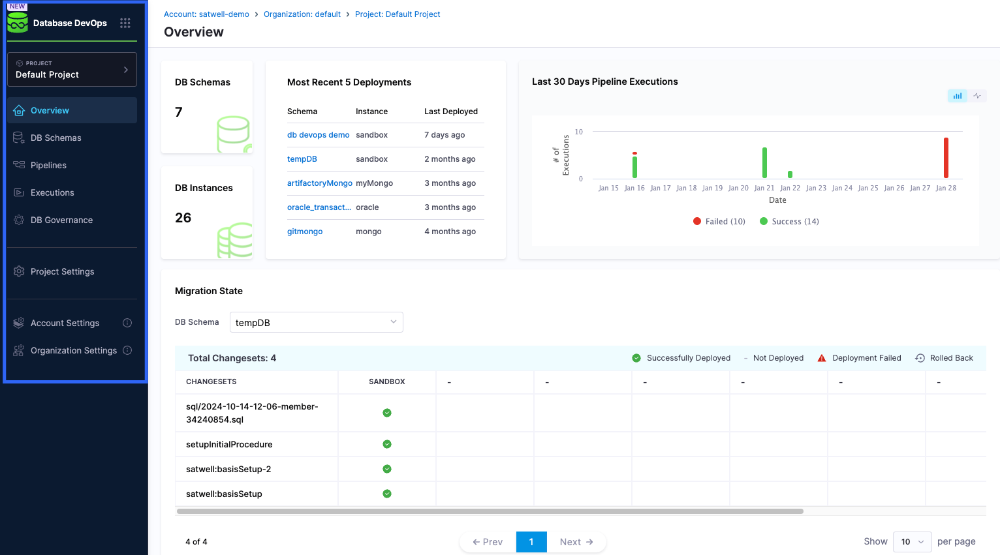
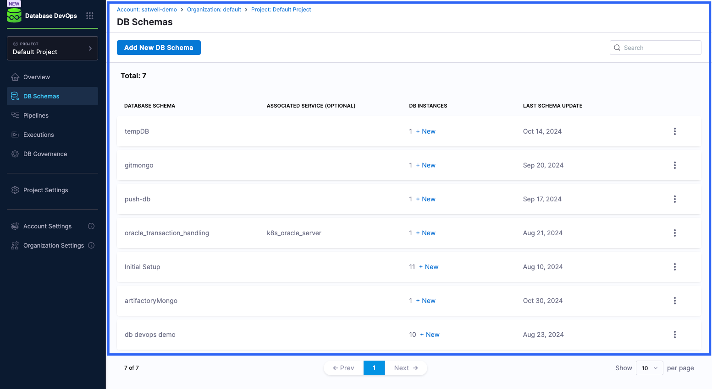
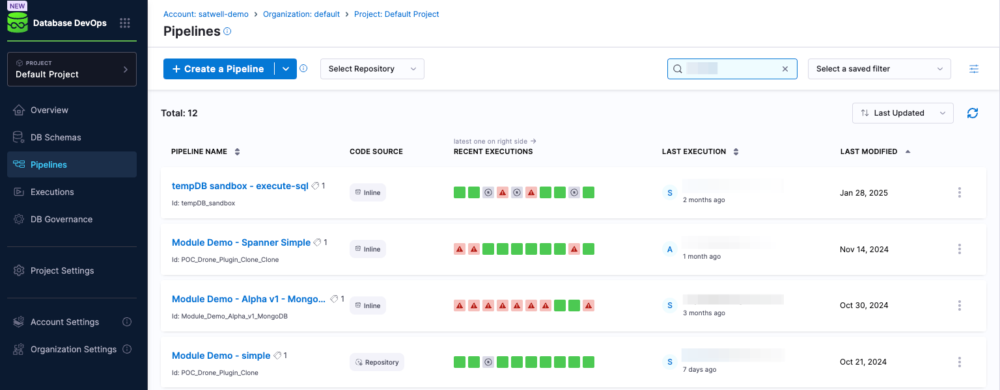
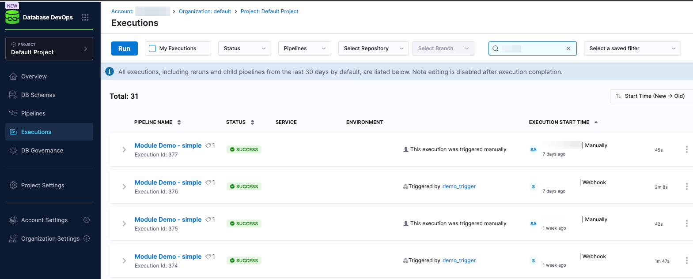

This guide talks you through the UI of Harness Database DevOps. 

## Environment Overview for Database DevOps

 

When you open the Harness Database DevOps module, you will be met with a single pane-of-glass interface that will display an overview of important activities the user may want to know upon using DB DevOps. Here's what you'll be met with:

  - **Left Navigation Menu**: A drop-down menu that will display the multiple options that you can navigate to. 
  - **DB Schemas**: This appears in the top-left under the overview tab. It will show the number of database schemas you have created. 
  - **DB Instances**: This appears directly underneath the **DB Schemas** tab. It shows the number of database instances you have created. 
  - **Most Recent 5 Deployments**: This shows the five most recent deployments that have run. It will display the name of the **schema**, the **instance** it ran on, as well as when it was **last deployed**. 
  - **Last 30 Days Pipeline Executions**: This will show the number of pipeline executions done in the last 30 days from the point of log-in. It will include both failed and successful executions. As the user, you can adjust the type of graph between a bar graph and a line graph. 
  - **Migration State**: This will show the status of recent changesets used. There is also a key on the top right of this setion so you can identify the status displayed in the table. 

## The Unified Environment Overview for Database Schemas

 

When you select the **DB Schemas** on the left navigation menu, you will be met with a single-pane-of-glass interface that displays all database changes across different environments, highlighting pending actions, in-progress modifications, and recently completed updates.

It provides an environment overview of database states in production and non-production environments, allowing for quick assessments of readiness and synchronization. Here's what you will find in the section:

  - **Add New DB Schema**: At the top of the menu, you have the option to create a new schema.
  - **Database Schema**: The name of the database schema. 
  - **Associated Service**: The associated service the schema is related to. 
  - **DB Instances**: The number of database schemas associated with a database schema. 
  - **Last Schema Update**: The date of when the schema was last updated.
  - **Three Point Menu**: Selecting this at the end of a highlighted database schema gives you the option to edit the database schema details and to delete it. 

## The Overview of the Harness Database DevOps Pipelines 

  

On the DB DevOps **Pipelines** UI, you are provided with a detailed, yet simple, overview which provides information that are useful for understanding what is happening in your environments. Here's what you will find on the Harness Database DevOps **Pipelines** interface:

 - **Pipeline Name**: The name of the pipeline
 - **Code Source**: The source of the code whether it be inline or in a repository. 
 - **Recent Executions**: The status of the pipeline executions with the latest staus being on the right of the status bar. 
 - **Last execution**: The name of the person who last ran the pipeline and when it was ran. This is displayed in an estimate in days, months or years underneath the name of the user. 
 - **Last modified**: This is the date of when the pipeline was last modified. 

## Database DevOps Executions Overview 

