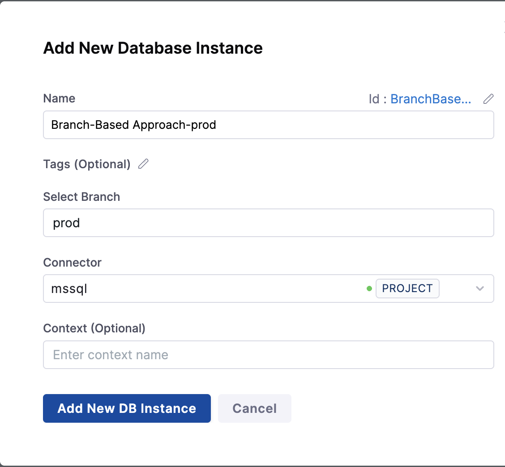
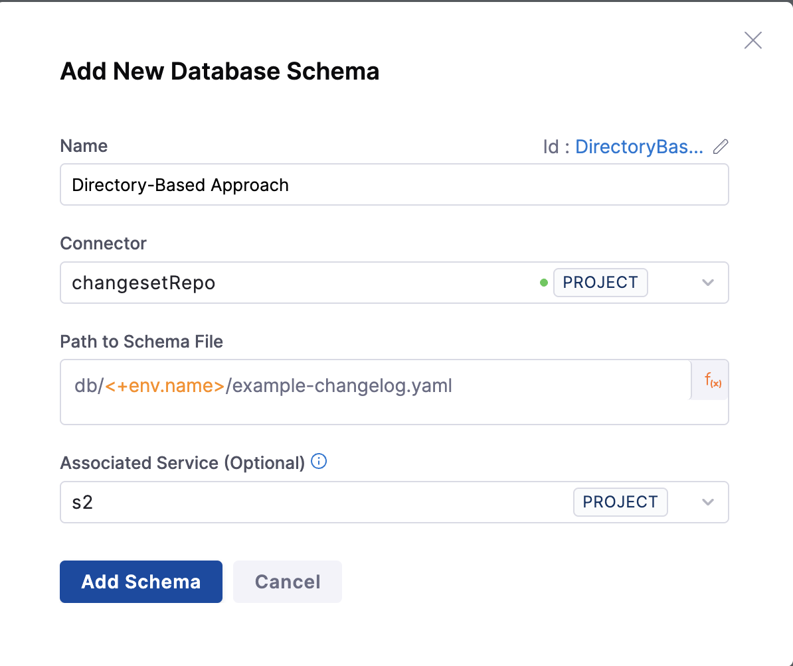

This guide explains how to effectively manage changelog file directories. A well-organized changelog file directory structure is crucial for maintaining database changes across multiple instances and environments.

## Using includeAll for Efficient Change Management

Organizing your changelog files properly is important as your database projects grow. A clear and consistent folder structure makes it easier to track changes, review updates, and handle different environments like development, testing, and production.

The `includeAll` tag helps manage changelog files more easily. When specified in your master changelog file, it automatically includes all changelog files from a specified directory in alphabetical order.

### Advantages
1. **Automatic File Discovery**: No need to manually list each changelog file in your master changelog.
2. **Simplified Maintenance**: Add new changelog files to the directory without modifying the master changelog.
3. **Predictable Ordering**: Files are processed in alphabetical order, making it easy to control execution sequence.
4. **Reduced Human Error**: Eliminates the risk of accidentally omitting changelog files from the master list.

:::warning Important Best Practice
Each changeset should contain only one DML/SQL statement. This is especially crucial for proper rollback handling in databases like Oracle. Multiple statements in a single changeset can make rollbacks complex and potentially unreliable.
:::

Example usage in a master changelog:

```yaml
# db/changelog-master.yaml
databaseChangeLog:
  - includeAll:
      path: db/changelog/releases/
      errorIfMissingOrEmpty: true
      relativeToChangelogFile: true
```

:::note
The path specified in `includeAll` should be relative to the location of the changelog file that contains this statement.
:::

## Directory Structure Approaches

There are several approaches to organizing your changelog files based on your needs and scale. Here are the recommended patterns:

### 1. Organization by Release and Feature

You may want to set up a hierarchical directory structure using a separate directory for each release and a changelog for each feature with changes specific to that release.

:::tip
Use a consistent naming convention for your changelog files (e.g., `001-feature-name.yaml`, `002-feature-name.yaml`) to ensure they are processed in the intended order when using `includeAll` as the files are processed in **alphabetical order**.
:::

For example, the "accounts.yaml" file under the "1-0-0" directory creates a new table, and the "accounts.yaml" file in the "1-0-1" directory alters the same table.

 ``` bash
db/
├── release/
│   ├── 1-0-0/
│   │   ├── accounts.yaml
│   │   └── cart.yaml
│   ├── 1-0-1/
│   │   ├── accounts.yaml
│   │   └── cart.yaml
│   └── 1-1-0/
│       ├── accounts.yaml
│       ├── cart.yaml
│       └── new-feature.yaml
└── changelog-master.yaml           # Main changelog file, includes all changes across releases.
```

Here are the examples for each file in the release-based structure:

**changelog-master.yaml**
```yaml
databaseChangeLog:
  - includeAll:
      path: db/releases/
      errorIfMissingOrEmpty: false
      relativeToChangelogFile: true
```
**release/1-0-0/accounts.yaml**
```yaml
databaseChangeLog:
  - changeSet:
      id: 1
      author: stephen-atwell
      changes:
        - createTable:
            tableName: accounts
            columns:
              - column:
                  name: id
                  type: INT
                  autoIncrement: true
                  constraints:
                    primaryKey: true
              - column:
                  name: name
                  type: VARCHAR(50)
                  constraints:
                    nullable: false
                    unique: true
```

**release/1-0-1/accounts.yaml**
```yaml
databaseChangeLog:
  - changeSet:
      id: 003
      author: stephen-atwell
      changes:
        - createIndex:
            indexName: idx_on_id
            tableName: accounts
            columns:
              - column:
                  name: id
      rollback:
        - dropIndex:
            indexName: idx_on_id
            tableName: accounts
```

**Pros:**
- Clear version history and tracking of changes
- Easy rollback to specific releases
- Better organization for complex applications with multiple features
- Simplifies release planning and deployment
- Makes it easier to maintain release notes

**Cons:**
- Can become complex with many releases
- May have redundant changes across releases
- Harder to get a complete view of a single feature's evolution
- More challenging to manage dependencies between features

### 2. Organization by Entity/Service

This structure groups changes by entity or microservice:

```bash
db/
├── feature/
│   ├── accounts.yaml
│   └── cart.yaml
└── changelog-master.yaml
```

We can refer the above examples to understand the structure of changelogs, only the hierarchy of directories is getting changed here.

**Pros:**
- Clear separation of concerns
- Easy to locate changes for specific entities
- Better for microservices architecture
- Simplified maintenance of individual services
- Easier to manage team ownership of different components

**Cons:**
- Can be challenging to manage cross-entity dependencies
- May complicate release management
- Harder to track chronological order of changes
- Could lead to redundant changes across services

### 3. Single Changelog Approach

A simplified structure with one main changelog (recommended for small projects):

``` yaml
databaseChangeLog:
  - changeSet:
      id: "001"
      author: stephen-atwell
      changes:
        - createTable:
            tableName: users
            columns:
              - column:
                  name: id
                  type: int
                  autoIncrement: true
                  constraints:
                    primaryKey: true
              - column:
                  name: name
                  type: varchar(255)
  
  - changeSet:
      id: "002"
      author: stephen-atwell
      changes:
        - addColumn:
            tableName: users
            columns:
              - column:
                  name: email
                  type: varchar(255)

```

**Pros:**
- Simple to understand and implement
- Easy to track chronological order of changes
- Good for small projects or proof of concepts
- Quick to get started
- Clear linear progression of changes

**Cons:**
- Becomes unwieldy as project grows
- Difficult to manage multiple features or services
- Higher risk of merge conflicts in team settings
- Harder to maintain in the long term
- Challenging to roll back specific changes

## Managing Multiple Instances

There are two primary approaches to managing multiple database instances:

### 1. Branch-Based Approach

Use different branches for different environments:

```
main branch     → Development
qa branch       → QA
prod1 branch    → Production Instance 1
prod2 branch    → Production Instance 2
```

Below attached screen shows the structure of branch-based approach, where we have created `prod` instance for specfic production environment.



**Pros:**
- Clear separation of environments
- Easy rollback using git history
- Environment-specific configurations

**Cons:**
- Frequent conflicts when multiple developers work on the same changelog file
- Complex resolution process for database schema changes
- Difficulty in managing environment-specific configurations
- Challenging to roll back specific changes

### 2. Directory-Based Approach

Maintain instance-specific directories in the main branch:

``` bash
db/
├── envs/
│   ├── qa/
│   │   ├── master.yaml
│   │   ├── release-1.0.0/
│   │   │   ├── 001-initial-schema.yaml
│   │   │   └── 002-seed-data.yaml
│   │   └── release-1.1.0/
│   │       ├── 001-add-user-preferences.yaml
│   │       └── 002-update-product-tables.yaml
│   ├── prod1/
│   │   ├── master.yaml
│   │   ├── release-1.0.0/
│   │   │   ├── 001-initial-schema.yaml
│   │   │   └── 002-prod1-specific-config.yaml
│   │   └── release-1.1.0/
│   │       └── 001-performance-optimizations.yaml
│   └── prod2/
│       ├── master.yaml
│       └── release-1.0.0/
│           ├── 001-initial-schema.yaml
│           └── 002-prod2-specific-config.yaml
```

Below attached screen shows the structure of directory-based approach, where we are taking the path to specfic directory from **environment variable**.



**Pros:**
- All configurations in one place
- Easier to manage shared changes
- Better visibility of instance-specific changes

**Cons:**
- Harder to track chronological order of changes
- May have redundant changes across instances
- Challenging to manage dependencies between instances


:::info
Please add a note that, we could use any file format for storing the changelogs. The syntax must be valid, including the correct file extension for the changelog (SQL/YAML/XML/JSON). If the syntax is incorrect, the step will fail, leading to potential issues in the process.
:::

## Recommendations

Choose your changelog structure based on the size of your project, team setup, and deployment complexity:

| **Use Case**                                | **Recommended Approach**  | **Why It Works**                                                         |
| ------------------------------------------- | ------------------------- | ------------------------------------------------------------------------ |
| Small or early-stage projects               | Single Changelog          | Simple to maintain, easy to follow, minimal setup                        |
| Growing teams or increasing complexity      | Release- or Feature-based | Enables modularity, better collaboration, and easier tracking of changes |
| Large apps with multiple microservices      | Entity/Service-based      | Allows separation of concerns and team-specific ownership                |
| Shared schema with some env-specific tweaks | Directory-based           | Maintains consistency while allowing environment-level customization     |


This table provides a quick reference for selecting the most suitable changelog structure based on your project's specific needs and complexity. It highlights the recommended approach and explains why it is effective for each use case.

## References
- [Directory Structure Approaches](https://support.liquibase.com/hc/en-us/articles/29383071573659-How-to-Structure-a-Complex-Changelog)

