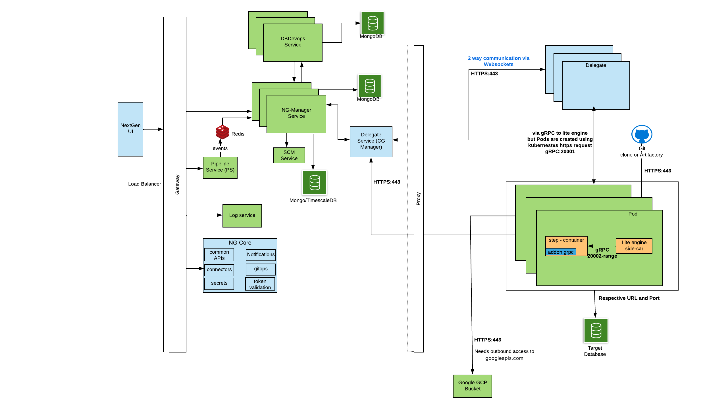

Welcome to the Harness Database DevOps Product Documentation. This guide will assist you in  integrating database operations into your application deployment workflows. Our Database DevOps module enables you to manage database schemas, orchestrate changes, and ensure consistency across all your environments. Let's dive into how Harness Database DevOps can streamline your database change management and enhance your overall deployment strategy.

## Before you begin, review the following:

- [All about Database DevOps](/docs/database-devops/overview.md)

## Harness DB DevOps Architecture

:::info
Before you can access Harness Database DevOps, you must have Harness enable the following feature flag, `DBOPS_ENABLED`. To enable the feature flag, please contact [Harness Support](mailto:support@harness.io).
:::

The Harness delegate is crucial to [Harness Database DevOps](/docs/database-devops/overview.md) because it gives us access to your infrastructure on which we execute jobs that require database network connectivity. The Harness Delegate acts as an agent that facilitates the connection between the [Harness CI/CD](../../continuous-integration/get-started/overview.md) pipeline and the database. It enables the execution of database changes in a secure and efficient manner. The Delegate can be configured to connect to various database instances, ensuring that the right credentials and access parameters are used for each environment.

## Communication Protocol between Services and Customer Infra

Key Notes
1. Outbound Control
    - All the communications shown in the diagram operate as part of a single execution flow.
    - It is not possible to selectively disable individual communications, as doing so would break the orchestration pipeline.
2. Delegate Communication
    - The Harness Delegate is the primary component responsible for initiating communication back to Harness SaaS.
    - For more details on how the Delegate functions, see the [Delegate Overview](https://developer.harness.io/docs/platform/delegates/delegate-concepts/delegate-overview/).
3. Log Shipping
    - During task execution, outbound access to "`googleapis.com`" over port 443 is required to ship step logs.
    - This can be avoided by changing the account-level setting:
    **Account Settings** → **Default Settings** → **Continuous Integration** → **Upload Logs via Harness**. When enabled, logs are shipped directly to Harness SaaS, removing the dependency on googleapis.com.

### Network Communication

| **Initiator**          | **Protocol/Port**                                              | **Destination**                | **Harness URL / Endpoint**                     |
| ---------------------- | -------------------------------------------------------------- | ------------------------------ | ---------------------------------------------- |
| NextGen UI             | HTTPS :443                                                     | Gateway                        | `https://app.harness.io/gateway`               |
| Gateway                | HTTPS :443                                                     | NG Core                        | `https://app.harness.io/ng/api/*`              |
| Gateway                | HTTPS :443                                                     | Log Service                    | `https://app.harness.io/log-service/*`         |
| Gateway                | HTTPS :443                                                     | Pipeline Service               | `https://app.harness.io/pipeline-service/*`    |
| Pipeline Service       | HTTPS :443                                                     | NG Manager Service             | `https://app.harness.io/ng-manager/*`          |
| NG Manager             | HTTPS :443                                                     | DB DevOps Service              | `https://app.harness.io/dbdevops/*`            |
| NG Manager             | HTTPS :443                                                     | SCM Service                    | `https://app.harness.io/scm/*`                 |
| Delegate               | WSS (WebSockets over HTTPS) :443                               | Delegate Service (CG Manager)  | `wss://app.harness.io/delegate-service/*`      |
| Delegate               | gRPC :20001                                                    | Lite Engine                    | Internal (Pod)                                 |
| Lite Engine            | gRPC :20001                                                    | Step Container (Pods)          | Internal (Pod)                                 |
| Step Container         | DB Driver (Postgres :5432 / Mongo :27017 / MySQL :3306 / etc.) | Target Database                | Customer DB                                    |
| Delegate               | HTTPS :443                                                     | Git / Artifact Repositories    | External URLs                                  |
| Delegate / Lite Engine | HTTPS :443                                                     | `googleapis.com` (Log Uploads) | External (unless disabled via account setting) |

## Understanding How Secret's Info is Sent to Build Pods

1. All secret requests are first sent as expressions from Harness to Delegates, where they are decrypted inside the Pod init request.
2. Decrypted secrets are added as Kubernetes Secrets in the same namespace where build pods are deployed.
3. Those secrets are referenced inside the Pod definition using imagePullSecrets.

:::info
Container registry credentials are stored as .dockercfg type secret in Kubernetes secret, allowing the Pod to pull images from the specified registry in the stepGroup.
:::
