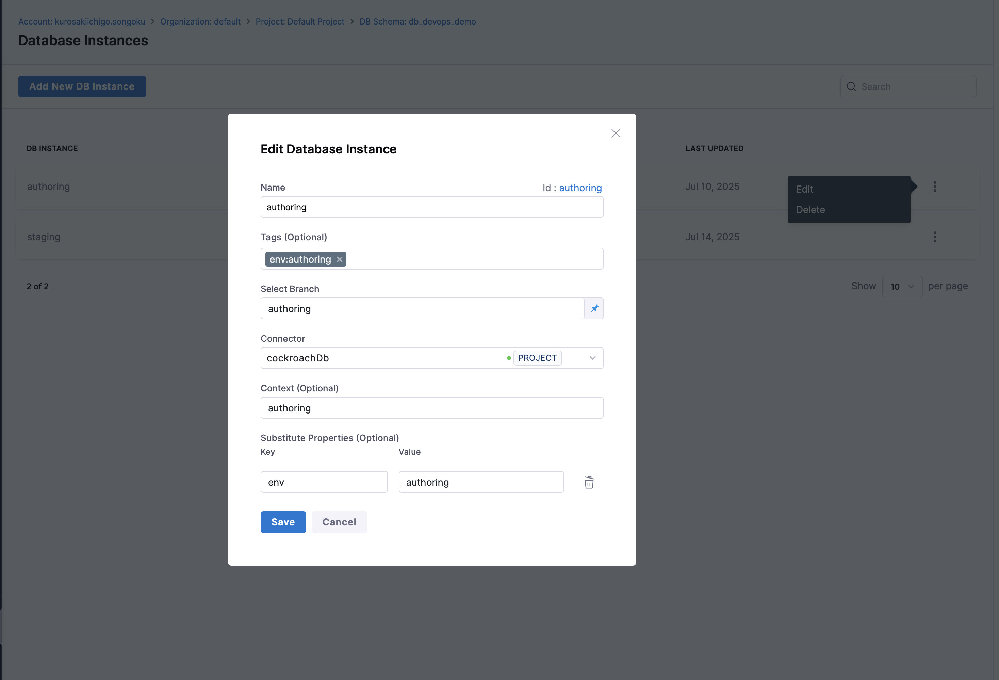

import { FAQ } from '@site/src/components/AdaptiveAIContent';
import DocImage from '@site/src/components/DocImage';

A **tag** in Harness Database DevOps is a marker that identifies the state of your database at a specific point in time. Tags represent versions, releases, or checkpoints and are essential for enabling targeted rollbacks and traceable deployments.

Tags are recorded in the `DATABASECHANGELOG` table, a Liquibase-managed audit table that tracks every [changeset](/docs/database-devops/concepts/glossary/changeset) applied to your database. You can create tags using either the `tag` command (manual, applied at deployment time) or the `tagDatabase` Change Type (changelog-driven, version-controlled alongside your schema).

## Tag command

The `tag` command marks the current database state by writing a label to the most recent row in the `DATABASECHANGELOG` table. No changeset is created or executed; it is a metadata-only operation.

When you use the Harness Database DevOps apply step, tagging works in two phases:

1. The apply step checks whether the current database state is tagged before applying changes. If no tag exists at that point, it creates one automatically to guarantee a rollback target before any new changesets run.
2. After all changesets are applied, the apply step writes a post-deployment tag using the name you provided in the tag input field on the step configuration.

:::note
The post-deployment tag is skipped when a deployment applies zero changesets. If no changes were deployed, no new tag is written. Go to [Tag Database Changeset](/docs/database-devops/features/tag-database-changeset) to learn how to record a tag anchor even on no-op deployments.
:::



## tagDatabase change type

The `tagDatabase` Change Type embeds a tag inside a changeset, making it part of your version-controlled changelog. When Liquibase executes this changeset, it inserts a new row into the `DATABASECHANGELOG` table containing the specified tag.

```yaml
databaseChangeLog:
  - changeSet:
      id: tagDatabase-example
      author: john-doe
      changes:
        - tagDatabase:
            tag: version_1.1
```

### Behavior

- Inserts a new row into `DATABASECHANGELOG` with the specified tag value.
- Can be used as a target for `update-to-tag` (deploy only up to this tag) and `rollback` (revert all changes after this tag).
- Cannot be combined with other Change Types in the same changeset due to Liquibase XSD schema restrictions. Attempting to combine them causes a Liquibase validation error before any SQL is executed.

## When to use which

| Use case | Use `tag` | Use `tagDatabase` |
|---|---|---|
| Manual tagging before rollback testing | ✅ | ❌ |
| Changelog-driven version tracking | ❌ | ✅ |
| CI/CD-based release tagging | ❌ | ✅ |
| Creating lightweight checkpoints | ✅ | ❌ |

The `tag` command suits one-off, runtime checkpoints (for example, tagging before a hotfix). The `tagDatabase` Change Type suits repeatable, release-aligned tagging baked into your changelog.

## Best practices

- Tag after every application release to mark a known stable database state.
- Use semantic versioning for tag names: `v1`, `v1.1`, `v2`.
- Ensure tags reflect meaningful checkpoints so rollbacks target predictable states.

### Sample tag flow

```text
changeset1
changeset2
tag v1
changeset3
tag v1.1
changeset4
changeset5
tag v2
```

This structure allows rollbacks to specific versions based on real release points.

| **Tag** | **Includes changes** |
|---|---|
| **v1** | changeset1, changeset2 |
| **v1.1** | changeset3 |
| **v2** | changeset4, changeset5 |

## Frequently asked questions

<FAQ
  question="Can I roll back to a tag using Harness?"
  mode="docs"
  fallback="Yes. Use the rollback command with a tag name to revert all changesets applied after that tag. Harness supports rollback strategies via the pipeline rollback step."
/>

<FAQ
  question="Should I tag before or after a release?"
  mode="docs"
  fallback="Tag immediately after deploying a release. This creates a stable checkpoint with a name that matches the release, making rollback targets intuitive. The Harness apply step automatically creates a pre-deployment tag as well, so a rollback point always exists before new changes are applied."
/>

<FAQ
  question="Does tagging affect my database schema or data?"
  mode="fallback-only"
  fallback="No. Tags are metadata entries in the DATABASECHANGELOG table only. They do not modify your database schema or data."
/>

<FAQ
  question="Can I preview which changesets will be rolled back by a tag?"
  mode="docs"
  fallback="Yes. Use the rollback SQL preview command or review Harness pipeline logs to see which changesets will be reverted before executing a rollback."
/>

## Related concepts

- [Tag Database Changeset](/docs/database-devops/features/tag-database-changeset): Configure the apply step to record a tag anchor even on no-op deployments.
- [Automatic and custom rollback](/docs/database-devops/concepts-and-features/automatic-and-custom-rollback): Set up rollback strategies in Harness Database DevOps pipelines.
- [What is a Changeset?](/docs/database-devops/concepts/glossary/changeset): Understand the unit of change that tags mark in the DATABASECHANGELOG table.
- [Using rollback tags with apply schema step](/docs/database-devops/use-database-devops/using-rollback-tags): Step-by-step guide to configuring rollback targeting with tags.
