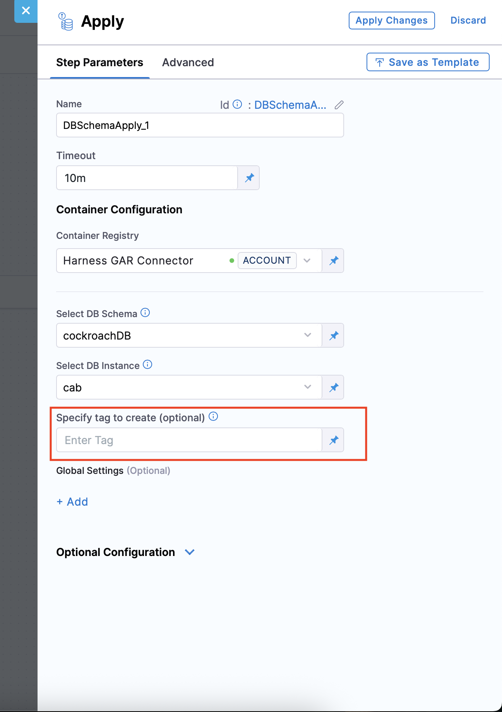

import Head from '@docusaurus/Head';

<Head>
  <meta name="title" content="Understanding Tags in Harness Database DevOps" data-rh="title"/>
  <meta
    name="description"
    content="Learn how tags work in Harness Database DevOps to mark database states, support rollback strategies, and align deployments with application releases."
  />
  <script type="application/ld+json">
    {`
      {
        "@context": "https://schema.org",
        "@type": "FAQPage",
        "mainEntity": [
          {
            "@type": "Question",
            "name": "What is the difference between tag and tagDatabase?",
            "acceptedAnswer": {
              "@type": "Answer",
              "text": "The 'tag' command applies a tag manually to the latest row in the DATABASECHANGELOG table, while 'tagDatabase' is a formal Change Type embedded in the changelog, allowing version-controlled tagging."
            }
          },
          {
            "@type": "Question",
            "name": "Can I roll back to a tag using Harness?",
            "acceptedAnswer": {
              "@type": "Answer",
              "text": "Yes. You can use the rollback command with a tag to revert all changes made after that tag. Harness supports rollback strategies via the pipeline and rollback steps."
            }
          },
          {
            "@type": "Question",
            "name": "Should I tag before or after a release?",
            "acceptedAnswer": {
              "@type": "Answer",
              "text": "It is a best practice to apply a tag immediately after deploying a release. This creates a stable checkpoint to revert to in case of future failures."
            }
          },
          {
            "@type": "Question",
            "name": "Does tagging impact my database structure or data?",
            "acceptedAnswer": {
              "@type": "Answer",
              "text": "No. Tags are metadata entries in the DATABASECHANGELOG table and do not modify your database schema or data."
            }
          },
          {
            "@type": "Question",
            "name": "Can I preview which changes will be rolled back by a tag?",
            "acceptedAnswer": {
              "@type": "Answer",
              "text": "Yes. You can use the rollback SQL preview or Harness pipeline logs to view which changesets will be reverted before executing a rollback to a tag."
            }
          }
        ]
      }
    `}
  </script>
</Head>

A **tag** in Harness Database DevOps is a marker that identifies the state of your database at a specific point in time. Tags are commonly used to represent versions, releases, or checkpoints and are critical for enabling targeted rollbacks and traceable deployments.

Tags are recorded in the `DATABASECHANGELOG` table and can be created using either:

- The `tag` command (manual tagging) - You can specify a custom tag name in the input field on the apply step when deploying through Harness pipelines
- The `tagDatabase` Change Type (changelog-driven tagging)

## Tag Command
The `tag` command marks the current database state without requiring a changeset. When using the Harness Database DevOps apply step:

1. The apply step automatically checks if the current database state is tagged before applying changes.
2. After deployment, the apply step can optionally tag the final database state with the tag name you specified in the input field.

:::note
If no tag exists, it creates one at the end of the apply step to ensure rollback capability.
:::

This tagging system ensures you always have defined rollback points before and after deployments.



This command adds the `env:authoring` tag to the most recent row in the `DATABASECHANGELOG` table.

## tagDatabase Change Type

The tagDatabase Change Type applies a tag within a changeset, allowing it to be version-controlled in source along with the rest of your changelog.

```yaml
databaseChangeLog:
  - changeSet:
      id: tagDatabase-example
      author: john-doe
      changes:
        - tagDatabase:
            tag: version_1.1
```
### Behavior

- Inserts a new row into DATABASECHANGELOG containing the specified tag.
- Can be used with update-to-tag or rollback commands.
- Cannot be combined with other Change Types in the same changeset due to XSD schema restrictions.

## When to Use Which?
| Use Case                               | Use `tag` | Use `tagDatabase` |
| -------------------------------------- | --------- | ----------------- |
| Manual tagging before rollback testing | ✅         | ❌                 |
| Changelog-driven version tracking      | ❌         | ✅                 |
| CI/CD-based release tagging            | ❌         | ✅                 |
| Creating lightweight checkpoints       | ✅         | ❌                 |

## Tagging Best Practices

- Tag after every application release to mark a known stable database state.
- Use semantic versioning: v1, v1.1, v2.
- Ensure tags reflect meaningful checkpoints to support safe rollback strategies.

### Sample Tag Flow
```tree
changeset1
changeset2
tag v1
changeset3
tag v1.1
changeset4
changeset5
tag v2
```
This setup allows rollbacks to specific versions based on real release points.

| Tag  | Includes Changes       |
| ---- | ---------------------- |
| v1   | changeset1, changeset2 |
| v1.1 | changeset3             |
| v2   | changeset4, changeset5 |

## Conclusion

Tags in Harness Database DevOps offer a robust mechanism for version control, rollback targeting, and deployment transparency. By automatically ensuring tags exist before all deployments Harness enhances your ability to manage database changes reliably. Integrating tagging into your release workflow ensures predictable rollbacks and auditable database histories aligned with your CI/CD pipelines.

## FAQ
### 1. Can I roll back to a tag using Harness?
Yes. You can use the rollback command with a tag to revert all changes made after that tag. Harness supports rollback strategies via the pipeline and rollback steps.

### 2. Should I tag before or after a release?
It is a best practice to apply a tag immediately after deploying a release. This creates a stable checkpoint to revert to in case of future failures. By tagging immediately after release you can intuitively name the tag to match the release name. Additionally ensuring a tag exists before release is critical to ensuring you can always roll back -- The Harness apply step does this automatically for you.

### 3. Does tagging impact my database structure or data?
No. Tags are metadata entries in the DATABASECHANGELOG table and do not modify your database schema or data.

### 4. Can I preview which changes will be rolled back by a tag?
Yes. You can use the rollback SQL preview or Harness pipeline logs to view which changesets will be reverted before executing a rollback to a tag.