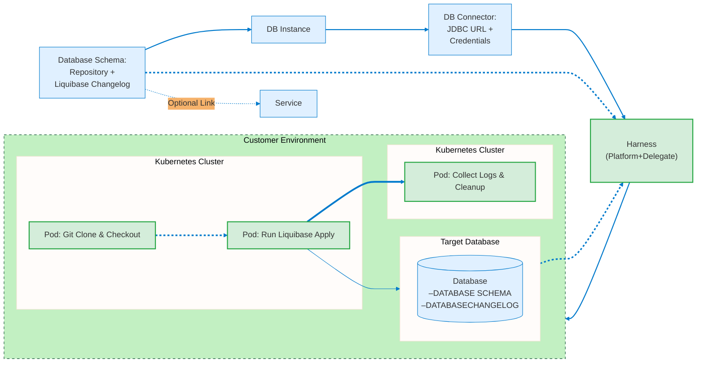
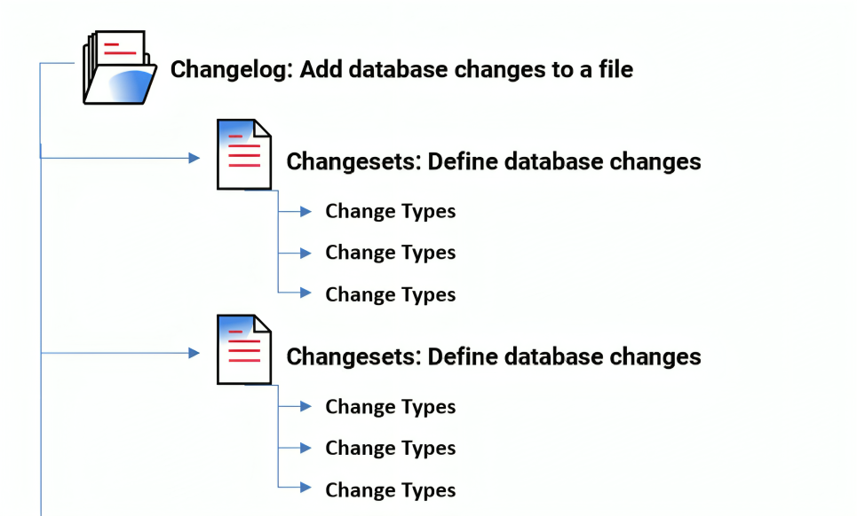

import BetaIcon from '/img/icon_beta.svg';

<BetaIcon />

This topic covers basic terminology and concepts related to Database DevOps. For general Harness Platform terminology and concepts, go to [Harness key concepts](/docs/platform/get-started/key-concepts.md). For information about using DB DevOps, go to [Harness Database DevOps onboarding guide](/docs/database-devops/get-started/onboarding-guide.md).

## Database

A database is an organized collection of structured information, or data, that is stored and managed electronically, typically in a computer system. Databases are designed to support the storage, retrieval, modification, and deletion of data in a way that ensures data integrity, security, and performance.



## Database Schemas

A database schema is the structure of a database, e.g. what tables and columns and indexes exist. In the context of Harness DB DevOps, there is an entity called a 'schema’ that is a collection of DDL or DML changes that can be applied to a database. Today this collection is in the form of a liquibase changelog checked into git or artifactory.

## Database Instances 

A database instance associates a database schema to a database connection. It represents the intersection of the database's structural definition (the schema) with the actual data environment where the schema is implemented.

```bash
Schema Organization
├── Schema A
│   ├── Instance I1
│   └── Instance I2
├── Schema B
│   ├── Instance P1
│   ├── Instance P2
│   └── Instance P3
└── Schema C
    ├── Instance E1
    └── Instance E2
```
**In this hierarchy**: Each schema can have multiple instances. 
Schema B, for example, has three instances, while Schemas A and C each have two instances.

## Database Connection

A database connection refers to the specific parameters and credentials used to establish a secure link between the Harness platform and an individual database server. This connection is done through a JDBC (Java Database Connectivity) URL, which specifies the location of the database server, and is authenticated using a username and password. The connection is made via a Harness Delegate, which allows secure access to the database, even when the database instance is not internet-accessible. This setup enables Harness to execute SQL scripts, orchestrate database changes, and manage schema versions as part of the CI/CD pipeline, all while adhering to security best practices. 

## Data Definition Language (DDL)

As mentioned earlier under the definition of Database Schema, DDL refers to the SQL commands used to define or modify the structure of the database schema itself. This includes operations that create, alter, or drop database objects such as tables, indexes, views, and constraints. Some examples include the following: 

```sql
CREATE TABLE Employees (ID INT, Name VARCHAR(100), Department VARCHAR(50));
```

```sql
ALTER TABLE Employees ADD COLUMN Salary DECIMAL(10, 2);
```

```sql
TRUNCATE TABLE Employees;
```

## Data Manipulation Language (DML)

DML refers to SQL commands used for managing data within the database objects defined by DDL, such as tables. DML operations allow users to insert, update, delete, and retrieve data stored in the database. Some examples include the following:

```sql
INSERT INTO Employees (ID, Name, Department) VALUES (1, 'Jane Doe', 'HR');
```

```sql
UPDATE Employees SET Salary = 60000 WHERE ID = 1;
```

```sql
DELETE FROM Employees WHERE ID = 1;
```

## SQL (Structured Query Lanaguage)

SQL (Structured Query Language) databases are relational databases that use a structured query language to define and manipulate data. They are designed to store data in tables with fixed schemas, where each table consists of rows and columns. The relationships between tables are defined through foreign keys. Liquibase can define changes via SQL scripts, or via yaml changesets that are compiled at runtime into SQL.

## NO-SQL (Not Only SQL)

NoSQL (Not Only SQL) databases, on the other hand, are non-relational databases designed to store and retrieve data in ways that are different from traditional relational databases. They can store unstructured, semi-structured, or structured data without requiring a predefined schema. An example of this is MongoDB.

## Apply

Apply refers to the process of executing database schema changes in a target database environment. In Harness DB DevOps, Apply is a fundamental operation that:
1. Compares the current state of the database with the changelog
2. Identifies which changes need to be applied
3. Executes the necessary changelog in the correct order
4. Records the successful application of changes to prevent re-application

## Rollback 

A rollback in the context of deployment refers to the process of reverting an application or system to a previous stable state after a new deployment has failed or introduced critical issues. This action is taken to minimize downtime and restore the application to its last known good configuration.

## Liquibase

An open source database change control CLI tool that is leveraged used by Harness DB DevOps.

## Understanding Changelog and Changesets

### Changelog
A Changelog is a file that defines all the changes made to your database. This helps audit your database and execute any changes that not applied.
When you want to modify your database, simply add a new changeset and specify its operation as a Change Type. For example, you may add a changeset to create a new table, and another changeset to drop a primary key.

### Changeset
Changesets are the fundamental units of database change tracking. Each changeset represents a change to your database schema.
It is a best practice to specify only one type of change per changeset. Doing so avoids failed auto-commit statements that can leave the database in an unexpected state.

Here are the key concepts:
1. **Unique Identification**: Each changeset requires two identifiers:
   - `id`: A unique identifier for the change.
   - `author`: The person responsible for the change.
    :::info

    A changeset is uniquely tagged by both the author and id attributes (author:id), as well as the changelog file path (The name of the changeset file that defines the change).

    :::

2. **Change Tracking**: Once a changeset is executed, it's tracked in a special table `DATABASECHANGELOG` to ensure it's never run twice.




### File Format

The format of your changeset depends on the file type of your changelog, which can be SQL, XML, YAML, or JSON


#### SQL Example 
``` SQL Example
--liquibase formatted sql

--changeset stephen-atwell:1
CREATE TABLE products (
      id INT PRIMARY KEY,
      name VARCHAR(255)
);

--changeset stephen-atwell:2
CREATE INDEX idx_products_name ON products(name);
```


#### YAML Example
``` YAML Example
databaseChangeLog:
  -  changeSet:  
      id:  1
      author: stephen-atwell
      changes:
        -  createTable:
            tableName: company
            columns:
              -  column:
                  name: address
```

#### XML Example
``` XML Example
<changeSet  id="1"  author="stephen-atwell">
    <createTable  tableName="company">
        <column  name="address"  type="varchar(255)"/>
    </createTable>
</changeSet>
```

#### JSON Example
``` JSON Example
{
  "changeSet": {
    "id": "1",
    "author": "stephen-atwell",
    "changes": [
      {
        "createTable": {
          "tableName": "company",
          "columns": [
            {
              "column": {
                "name": "address"
              }
            }
          ]
        }
      }
    ]
  }
}
