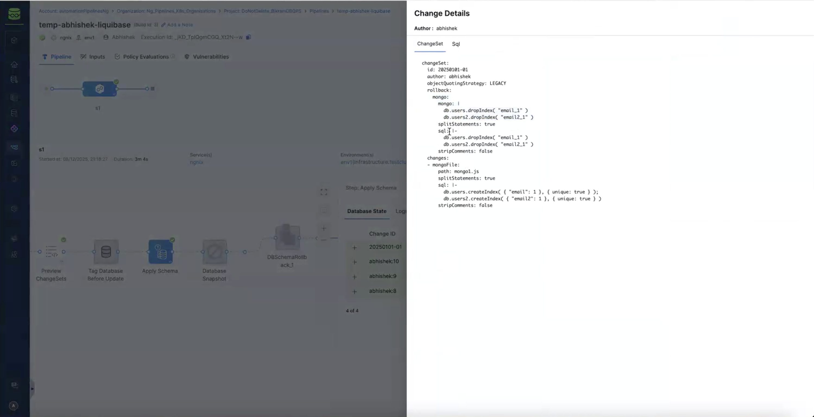

import Tabs from '@theme/Tabs';
import TabItem from '@theme/TabItem';


This guide provides examples of commonly used MongoDB changesets, including collection management, indexing, document operations, and custom run commands.  For end-to-end guidance, see [Generate MongoDB Changelog](../get-started/mongodb-changelog-generation.md) and [MongoDB Changelog Example](../get-started/get-started-with-changelogs.md).  

The Harness Database DevOps enables teams to apply MongoDB schema and data changes using MongoDB-aware execution logic, purpose-built for NoSQL workloads using the native `mongosh` runtime. This ensures that MongoDB changes are executed with full fidelity to MongoDB semantics safely operationalize schema changes across development, testing, and production environments.

## What is Native Execution for MongoDB?

MongoDB differs fundamentally from relational databases. Schema evolution often includes:
- Collection-level changes
- Index lifecycle management
- Document updates
- Schema validation rules
- Administrative or custom database commands

The MongoDB Native Executor ensures these changes are executed exactly as MongoDB expects, preserving native semantics and runtime behavior. Key characteristics:
- No relational abstraction layer.
- MongoDB-aware execution model.
- Support for MongoDB query language.

The Harness Database DevOps MongoDB Native Executor supports common and advanced MongoDB workflows used in production environments. Learn More about [supported MongoDB change types](../concepts/mongodb-command.md).

## How can I run my existing MongoSH files in a Pipeline?

Harness Database DevOps supports two flexible approaches for defining MongoDB changesets. Both approaches integrate seamlessly into the standard pipeline execution flow, approvals, and governance model. The remainder of the pipeline lifecycle remains consistent with other database types.

<Tabs>
<TabItem value="Inline MongoDB Script">
In this approach, you define a MongoDB changeset and provide the MongoDB script directly within the changeset definition.
This method is well-suited for:

- Small or self-contained changes
- Quick schema or data updates
- Readable, review-friendly pull requests

```yaml
databaseChangeLog:
  - changeSet:
      id: create-users-collection
      author: devteam@example.com
      runWith: mongosh
      changes:
        - mongo:
            mongo: |
                db.users.insertOne({ name: "Alice", age: 30 });
                db.users.createIndex({ email: 1 }, { unique: true });
```

### How it works?
- You specify a MongoDB change name.
- The MongoDB script (JavaScript-based MongoDB commands) is provided inline.
- During pipeline execution, the script is executed natively against the target MongoDB instance.

This approach enables rapid iteration while maintaining full traceability and audit history.
</TabItem>
<TabItem value="MongoDB Script File Reference">
In this approach, the changeset references a file path that contains the MongoDB JavaScript script.
This method is recommended for:

- Large or complex MongoDB scripts
- Reusable operational logic
- Cleaner separation of logic and configuration

```yaml
databaseChangeLog:
  - changeSet:
      id: create-users-collection
      author: devteam@example.com
      runWith: mongosh
      changes:
        - mongoFile:
            path: scripts/create_users_collection.js
```

In above example, the `create_users_collection.js` file might contain:

```javascript
db.users.insertOne({ name: "Alice", age: 30 });
```

### How it works?
- The changeset references the path to a `.js` file stored in version control.
- The file contains MongoDB-native commands.
- At runtime, the pipeline loads and executes the script against the configured MongoDB instance.

This pattern improves maintainability and keeps large scripts out of inline definitions.
</TabItem>
</Tabs>



## MongoDB ChangeTypes Reference
The following sections provide examples of commonly used MongoDB changesets in Liquibase, including collection management, indexing, document operations, and custom run commands.

### Collection Operations
Manage MongoDB collections with changesets.  

#### Create Collection
```yml
- changeSet:
    id: create-collection-1
    author: devteam@company.com
    changes:
      - createCollection:
          collectionName: users
```

#### Drop Collection
```yml
- changeSet:
    id: drop-collection-1
    author: devteam@company.com
    changes:
      - dropCollection:
          collectionName: users
```

### Index Operations
Define and manage indexes for optimized query performance.

#### Create Index
```yml
- changeSet:
    id: create-index-1
    author: devteam@company.com
    changes:
      - createIndex:
          collectionName: users
          keys: '{email: 1}'
          options: '{unique: true, name: "idx_email_unique"}'
```

#### Drop Index
```yml
- changeSet:
    id: drop-index-1
    author: devteam@company.com
    changes:
      - dropIndex:
          collectionName: users
          keys: '{email: 1}'
```


### Document Operations
Insert or manage documents directly in MongoDB collections.

#### Insert One Document
```yaml
- changeSet:
    id: insert-user-1
    author: devteam@company.com
    changes:
      - insertOne:
          collectionName: users
          document: >
            {
              "name": "John Doe",
              "email": "john@example.com",
              "age": 30
            }
```

#### Insert Many Documents
```yaml
- changeSet:
    id: insert-users-bulk
    author: devteam@company.com
    changes:
      - insertMany:
          collectionName: users
          documents: >
            [
              {
                "name": "Jane Smith",
                "email": "jane@example.com",
                "age": 25
              },
              {
                "name": "Bob Johnson",
                "email": "bob@example.com",
                "age": 35
              }
            ]
```

### Generic Run Command
Execute raw MongoDB commands when no direct Liquibase abstraction exists.

#### Basic Run Command
```yaml
- changeSet:
    id: run-command-1
    author: devteam@company.com
    changes:
      - runCommand:
          command: >
            {
              "createIndexes": "users",
              "indexes": [
                {
                  "key": {"name": 1},
                  "name": "idx_name"
                }
              ]
            }
```

#### Run Command with Validation
```yaml
- changeSet:
    id: add-validation-schema
    author: devteam@company.com
    changes:
      - runCommand:
          command: >
            {
              "collMod": "users",
              "validator": {
                "$jsonSchema": {
                  "bsonType": "object",
                  "required": ["name", "email"],
                  "properties": {
                    "name": {"bsonType": "string"},
                    "email": {"bsonType": "string"}
                  }
                }
              }
            }
```

### Complete Example Changelog
A full example demonstrating collections, indexes, inserts, and schema validation.

```yaml
databaseChangeLog:
  - changeSet:
      id: devteam:1
      author: devteam@company.com
      comment: Create users collection
      changes:
        - createCollection:
            collectionName: users
      
  - changeSet:
      id: devteam:2
      author: devteam@company.com
      comment: Create indexes
      changes:
        - createIndex:
            collectionName: users
            keys: '{name: 1}'
            options: '{name: "idx_name"}'
        - createIndex:
            collectionName: users
            keys: '{email: 1}'
            options: '{unique: true, name: "idx_email_unique"}'

  - changeSet:
      id: devteam:3
      author: devteam@company.com
      comment: Insert initial data
      changes:
        - insertOne:
            collectionName: users
            document: >
              {
                "name": "John Doe",
                "age": 30,
                "email": "john@example.com"
              }

  - changeSet:
      id: devteam:4
      author: devteam@company.com
      comment: Add validation using runCommand
      changes:
        - runCommand:
            command: >
              {
                "collMod": "users",
                "validator": {
                  "$jsonSchema": {
                    "bsonType": "object",
                    "required": ["name", "email"],
                    "properties": {
                      "name": {"bsonType": "string"},
                      "email": {"bsonType": "string"}
                    }
                  }
                }
              }
```
### Admin Command
Use `adminCommand` for database-level administrative operations such as retrieving server status, listing databases, or renaming collections. This change maps directly to the MongoDB [db.adminCommand](https://www.mongodb.com/docs/manual/reference/method/db.adminCommand/) method and is backed by `liquibase.ext.mongodb.change.AdminCommandChange`.
Unlike `runCommand`, which executes in the current database context, **`db.adminCommand()` always runs against the `admin` database**, regardless of where it is invoked.
```yml
- changeSet:
    id: admin-command-rename-collection
    author: devteam@company.com
    changes:
      - adminCommand:
          command: >
            {
              "renameCollection": "test.orders",
              "to": "test.orders-2016"
            }
```

## Best Practices & Usage Notes

  1. **Rollback Considerations** - MongoDB operations like `insertOne` and `insertMany` are not automatically reversible. Always plan rollbacks explicitly e.g., by including a corresponding delete or drop changeset if needed.

  2. **Index Naming Conventions** - Use clear, descriptive index names (`idx_email_unique`, `idx_name`) to avoid collisions and simplify debugging. MongoDB auto-generates index names if not provided, which can make schema management inconsistent across environments.

  3. **Idempotency** - Liquibase tracks applied changesets by ID and author. Re-running the same changelog will not re-apply changes, which makes migrations safer across multiple environments. Ensure your changeset IDs remain unique and descriptive.

  4. **Environment-Specific Data** - Avoid inserting environment-specific data (like test users or secrets) directly in production changelogs. Instead, use Liquibase contexts to conditionally run certain changesets.

  5. **Use runCommand Wisely** - `runCommand` is powerful but bypasses Liquibase’s higher-level abstractions. It does not support automatic rollbacks (hence the RollbackImpossibleException).

## Choosing the Right Approach
The choice between inline scripts and file-based scripts depends on your team's workflow, script complexity, and maintainability needs. Consider the following guidelines:

| **Use Case**                | **Recommended Approach**  |
| --------------------------- | ------------------------- |
| Small or quick updates      | Inline MongoDB script     |
| Large or complex logic      | File-based MongoDB script |
| Reusable scripts            | File-based MongoDB script |
| Simple schema or data fixes | Inline MongoDB script     |


## Conclusion

Whether MongoDB changes are defined using inline scripts or external script files, the execution model remains consistent and enterprise ready. All changes run using **`mongosh`** as the execution runtime, are fully version-controlled, and flow through standard pipeline governance—including approvals and policy checks. MongoDB commands execute natively, with comprehensive logs, execution status, and audit trails captured automatically.

As a result, MongoDB changes follow the same **governed Database DevOps lifecycle** as other database workloads in **Harness Database DevOps**, enabling teams to move fast without compromising control, compliance, or operational confidence.
