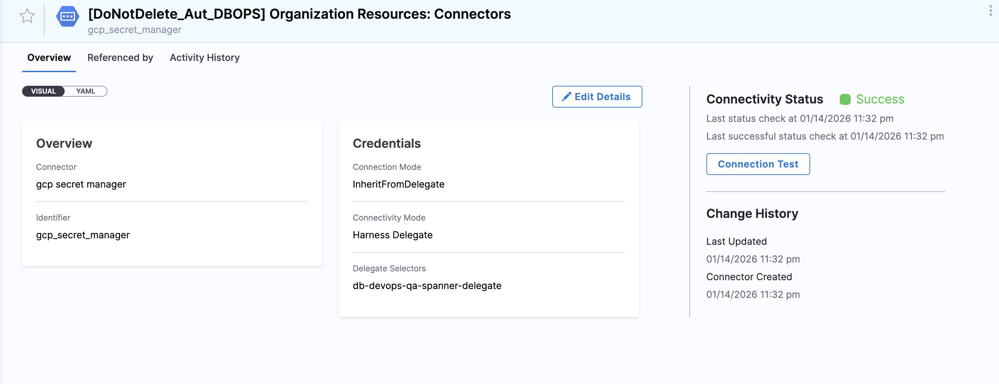
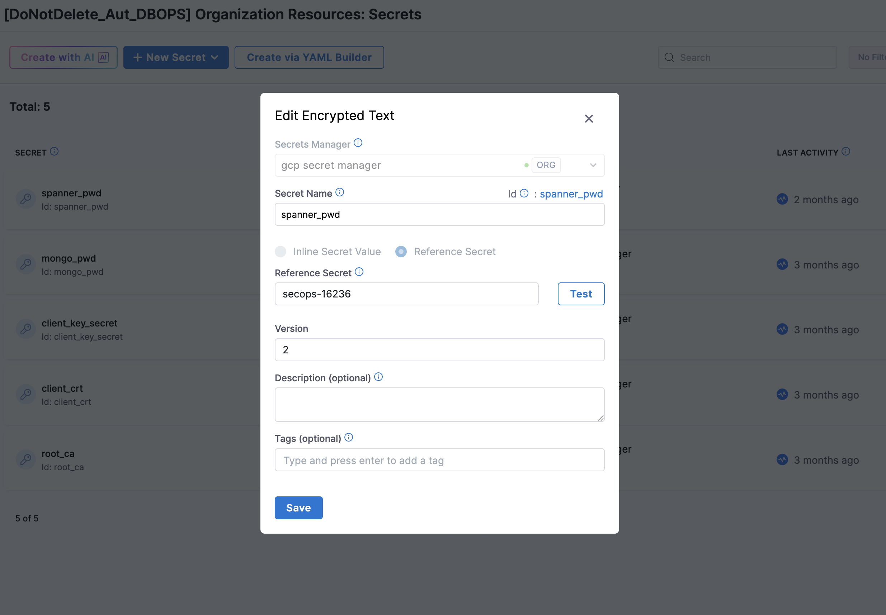
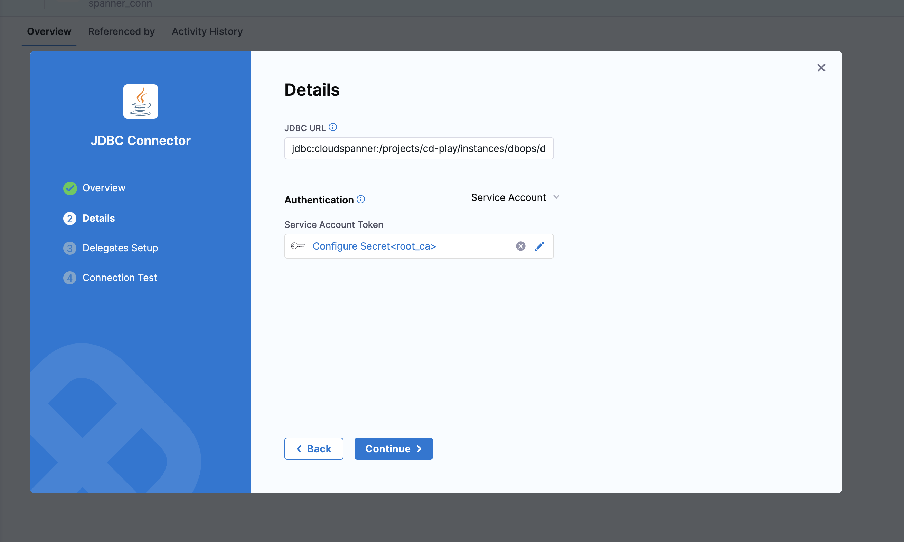
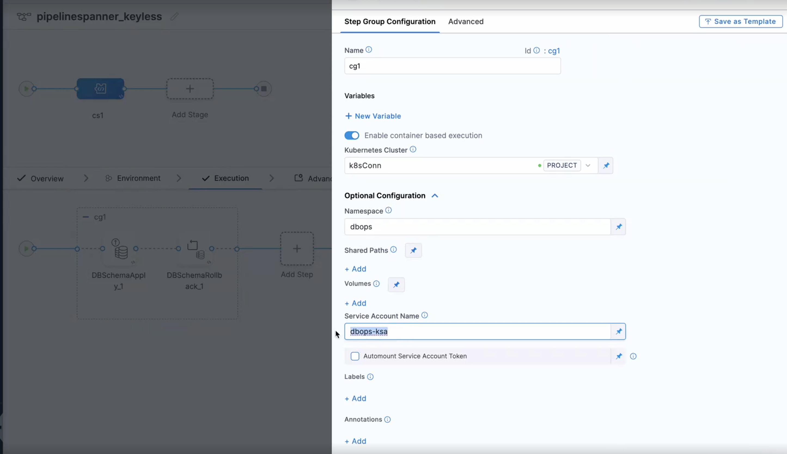

## What is keyless authentication in GCP?

Keyless authentication allows applications to access Google Cloud services without storing service account keys, using IAM and Workload Identity instead.
In this model, a Kubernetes Service Account (KSA) is mapped to a Google Service Account (GSA) with the necessary IAM permissions. The Harness Delegate running in your cluster can then authenticate to Google Cloud Spanner (or other GCP databases) using the GSA's permissions without needing a JSON key file.

## How It Works?

1. The **Harness Delegate** runs inside your Kubernetes cluster  
2. It uses a **Kubernetes Service Account (KSA)**  
3. The KSA is mapped to a **Google Service Account (GSA)** using Workload Identity  
4. The GSA is granted IAM permissions to access Google Cloud databases  
5. JDBC connections are authenticated automatically via IAM  

## What are the prerequisites for connecting Google Cloud Spanner to Harness?

Ensure the following are in place:

- A **Google Cloud Spanner instance and database**
- A **GKE cluster with Workload Identity enabled**
- A **Harness Delegate installed in the cluster**
- Permissions to manage IAM roles and service accounts in GCP


### Step 1: Create a Google Service Account (GSA)

Create a service account in your GCP project:

```bash
gcloud iam service-accounts create spanner-access-sa \
  --display-name="Spanner Access Service Account"
```
Grant the following roles:

```bash
gcloud projects add-iam-policy-binding <project-id> \
  --member="serviceAccount:spanner-access-sa@<project-id>.iam.gserviceaccount.com" \
  --role="roles/spanner.databaseUser"

gcloud projects add-iam-policy-binding <project-id> \
  --member="serviceAccount:spanner-access-sa@<project-id>.iam.gserviceaccount.com" \
  --role="roles/spanner.databaseAdmin"
```

### Step 2: Create a Kubernetes Service Account (KSA)

```bash
kubectl create namespace dbops
kubectl create serviceaccount dbops-ksa --namespace dbops
```

### Step 3: Bind KSA to GSA (Workload Identity)

#### Annotate the Kubernetes Service Account:

```bash
kubectl annotate serviceaccount dbops-ksa \
  --namespace dbops \
  iam.gke.io/gcp-service-account=spanner-access-sa@<project-id>.iam.gserviceaccount.com
```

Grant IAM permission for the KSA to impersonate the GSA:

```bash
gcloud iam service-accounts add-iam-policy-binding \
  spanner-access-sa@<project-id>.iam.gserviceaccount.com \
  --member="serviceAccount:<project-id>.svc.id.goog[dbops/dbops-ksa]" \
  --role="roles/iam.workloadIdentityUser"
```

### Step 4: Configure RBAC for Runtime Execution

Create Role:

```bash
kubectl create role dbops-runtime-role \
  --namespace=dbops \
  --verb=get,list,watch,create,update,patch,delete \
  --resource=pods,pods/status,secrets,events
```
Bind Role to Service Account:

```bash
kubectl create rolebinding dbops-runtime-role-binding \
  --namespace=dbops \
  --role=dbops-runtime-role \
  --serviceaccount=dbops:dbops-ksa
```

:::info important
During the setup, a secret is created in GCP Secret Manager (for example: `secops-16236` in the following example).

You must use exact secret name in the **Reference Secret** field when configuring the secret in Harness. Any mismatch will result in authentication or connection failures.
:::

### Step 5: Configure Harness Delegate
Ensure your delegate uses the Kubernetes Service Account:

```yaml
spec:
  template:
    spec:
      serviceAccount: dbops-ksa
      serviceAccountName: dbops-ksa

```

### Step 6: Create JDBC Connector in Harness

1. Use the GCP Secret Manager in Harness to reference delegate credentials.


2. Using the secret manager created, we create a secret reference the key.


- **Secret Manager**: GCP Secret Manager
- **Secret Name**: `Spanner Access Service Account`
- **Reference Secret**: `secops-16236` (example secret name created in GCP Secret Manager)

3. Create a JDBC connector in Harness, using the following configuration:



JDBC URL Format - `jdbc:cloudspanner:/projects/<project-id>/instances/<instance-id>/databases/<database-name>?lenient=true`

Connector Configuration
- Authentication Type: Service Account
- Credential: Use delegate-based authentication (no key required)

### Step 7: Test the Connection
Verify the delegate is connected and healthy

Test the JDBC connector in Harness to ensure it can successfully connect to Google Cloud Spanner using keyless authentication.

### Using Keyless Authentication in Pipelines
When configuring your pipeline steps that interact with Google Cloud Spanner, ensure you select the JDBC connector that is set up for keyless authentication.

When creating the step group for the pipeline, we will have to provide the associated service account name in the step group for the service account field.




## Best Practices
- Use keyless authentication for production workloads
- Follow least-privilege IAM principles
- Avoid storing service account keys
- Monitor delegate health and scaling

If you encounter any issues during setup, refer to the [Troubleshooting Guide](../troubleshooting/troubleshooting.md) or reach out to Harness support for assistance.