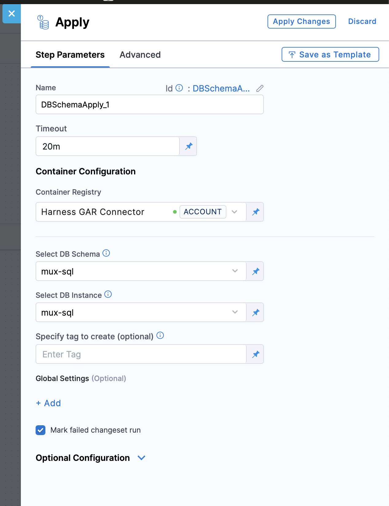

The **Mark Changeset Ran** option is available in the Apply Schema step under Harness Database DevOps. When enabled, it gives you the option to mark failed changesets as ran in the database changelog table, even if they do not execute successfully. This feature helps align rollback execution with failed database changes, ensuring rollback scripts can be applied when needed

## How it works

By default, if **Mark Failed Changeset Ran** is not selected, any changeset that fails during the Apply Schema step stays unexecuted. This means the same changeset will be retried the next time the pipeline runs. In this case, rollback steps won’t be aware of the failed changeset, so no rollback action is taken for it.

When you select **Mark FailedChangeset Ran**, Harness marks failed changesets as **ran** in the database changelog table, even though they didn’t apply successfully. This prevents them from being retried in later runs. More importantly, if your pipeline has a rollback step that rolls back to the Apply Schema step’s pre-start tag, the rollback will now include rollback scripts for those failed changesets.

This can be useful if you are deploying complex SQL scripts that perform multiple DML statements within a single script against databases that implicitly commit transactions on DML changes (for example, Oracle). In such cases, rollback scripts often need to handle partial rollbacks, which are more complicated to write but necessary for reliable recovery.

## Step-by-step: Enable Mark Changeset Ran

1. In your pipeline, add or edit an **Apply Schema** step.  
2. Under **Global Settings**, check the option:  
   - **Mark failed changeset run**.  
3. Save your changes and run the pipeline.  
4. If any changeset fails:
   - The failed changeset is marked as ran.  
   - If a rollback step exists (and rollback scripts are defined), it can roll back to the pre-start tag and attempt to clean up the failed changeset.

## Example workflow

**Pipeline structure:**
- Step 1: Apply Schema (with *Mark Changeset Ran* checked)  
- Step 2: Rollback (configured with pre-start tag of Step 1)  

**Scenario:**  
- A changeset `001_add_users_table.sql` fails to apply.  
- Harness marks it as ran in the changelog.  
- Rollback step executes the rollback script for `001_add_users_table.sql`.  

This ensures rollback steps include failed changesets and allow cleanup where rollback scripts are defined.

## When to use Mark Changeset Ran

Use this option when:

* ✅ You want rollback steps to include failed changesets and automatically clean them up.
* ✅ You are deploying SQL scripts with multiple DML statements against databases that implicitly commit.

Avoid using this option if your workflow depends on retrying failed changesets in later runs instead of rolling them back.

## FAQ

### Does this feature skip failed changesets in future runs?
Yes. Failed changesets are marked as ran, so they won’t be retried in later Apply Schema runs. However, marking them as ran ensures they are included in rollback execution if you later roll back to a tag or point in time before the failed changeset.

### Is this the same as Liquibase’s `mark-ran` command?
Yes, this option is Liquibase-compatible. Harness leverages the same mechanism but integrates it directly into the CI/CD workflow.  

### What happens if I disable this option?
Failed changesets remain pending in the changelog and will retry on the next pipeline run. Rollback will not include them.  

### Does it affect audit and tracking?
Yes. Failed changesets are recorded in the changelog table.