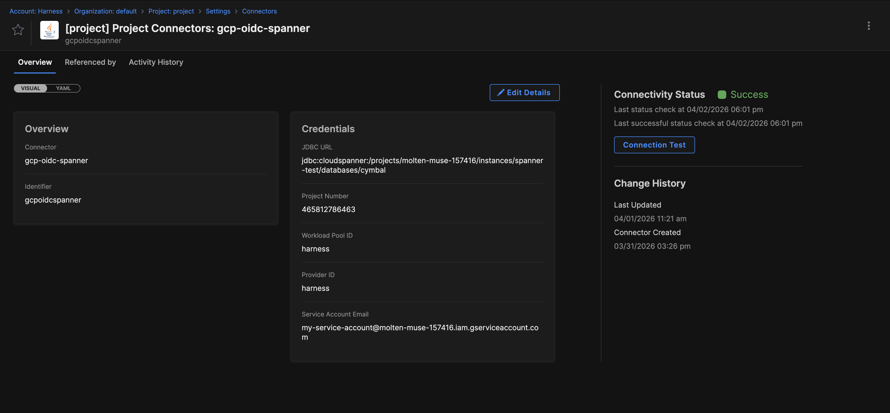
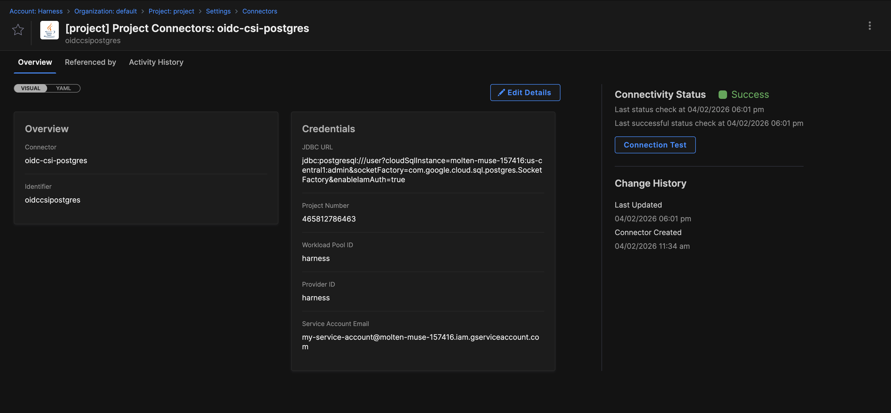
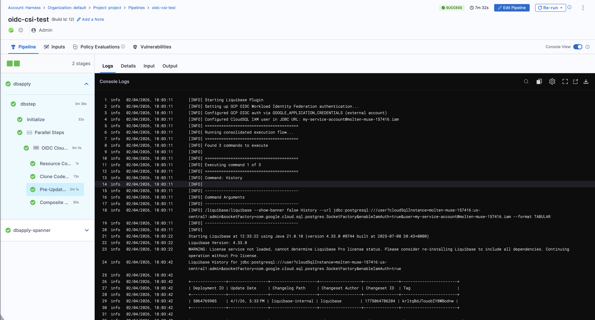

import BrowserOnly from '@docusaurus/BrowserOnly';
import { Troubleshoot } from '@site/src/components/AdaptiveAIContent';

OpenID Connect (OIDC) authentication enables your database connectors to authenticate with GCP databases without storing long-lived service account keys. Harness exchanges a short-lived OIDC token for temporary GCP credentials at runtime.

:::note GKE-specific alternative
If your delegate runs in GKE, you can use GKE Workload Identity instead of OIDC. Go to [Set up keyless authentication for Google Cloud databases](/docs/database-devops/features/keyless-authentication) for a GKE-native approach that maps Kubernetes Service Accounts directly to Google Service Accounts.
:::

This topic assumes you have experience with [GCP workload identity providers](https://cloud.google.com/iam/docs/workload-identities).

## Prerequisites

- **GCP Workload Identity Federation:** A configured Workload Identity Pool and OIDC provider in your GCP project. Go to [Workload Identity Federation](https://cloud.google.com/iam/docs/workload-identity-federation) to set up federation.
- **OIDC provider configuration:** The provider must be configured with the correct issuer URL for your Harness account cluster. Go to [Set up the GCP workload identity provider](#set-up-the-gcp-workload-identity-provider) for configuration details.
- **Service account:** A GCP service account with appropriate database permissions (Cloud Spanner Database User role or CloudSQL IAM user permissions). Go to [Service accounts](https://cloud.google.com/iam/docs/service-account-overview) to create and configure service accounts.
- **Service account access grant:** The service account must grant access to your Harness account ID via workload identity pool attribute conditions. Go to [Grant access to the service account](#grant-access-to-the-service-account) for configuration steps.
- **Database instance:** A Cloud Spanner instance or CloudSQL PostgreSQL/MySQL instance with IAM authentication enabled.
- **Harness project access:** Connector creation permissions in your Harness project. Go to [RBAC in Harness](/docs/platform/role-based-access-control/rbac-in-harness) to configure roles.


## How OIDC authentication works

When you configure a JDBC connector with OIDC authentication:

1. **Token generation:** Harness generates a short-lived OIDC token (JWT) that identifies the pipeline execution or connection test request.
2. **Token exchange:** The token is exchanged for a GCP OAuth2 access token using Workload Identity Federation:
   - **Connection test:** Exchange happens on the delegate.
   - **Pipeline execution:** Exchange happens inside the plugin container using GCP Security Token Service (STS).
3. **Service account impersonation:** The access token is used to impersonate the specified service account, which has database permissions.
4. **Database connection:** The database connection is established using the impersonated service account credentials.

This flow eliminates the need to store service account keys in Harness or your delegate environment. The GCP access token is short-lived (1 hour) and a new token is generated for each pipeline execution or connection test.

## Supported databases

OIDC authentication is available for the following GCP database types:

- **Cloud Spanner:** Uses OAuth2 access token authentication via the `oauthToken` JDBC connection property.
- **CloudSQL PostgreSQL:** Uses the CloudSQL Socket Factory with IAM authentication and credentials file.
- **CloudSQL MySQL:** Uses the CloudSQL Socket Factory with IAM authentication and credentials file.

Generic PostgreSQL or MySQL databases without CloudSQL Socket Factory are not supported.

## JDBC URL formats

OIDC authentication requires specific URL formats for each database type.

### Cloud Spanner URL format

```
jdbc:cloudspanner:/projects/PROJECT_ID/instances/INSTANCE_NAME/databases/DATABASE_NAME
```

**Example:**
```
jdbc:cloudspanner:/projects/my-project/instances/spanner-test/databases/cymbal
```

### CloudSQL PostgreSQL URL format

```
jdbc:postgresql:///DATABASE_NAME?cloudSqlInstance=PROJECT_ID:REGION:INSTANCE_NAME&socketFactory=com.google.cloud.sql.postgres.SocketFactory&enableIamAuth=true
```

**Example:**
```
jdbc:postgresql:///mydb?cloudSqlInstance=my-project:us-central1:my-instance&socketFactory=com.google.cloud.sql.postgres.SocketFactory&enableIamAuth=true
```

**Required parameters:**
- `cloudSqlInstance`: Instance connection name in the format `project-id:region:instance-name`.
- `socketFactory`: Must be `com.google.cloud.sql.postgres.SocketFactory`.
- `enableIamAuth`: Must be `true`.

### CloudSQL MySQL URL format

```
jdbc:mysql:///DATABASE_NAME?cloudSqlInstance=PROJECT_ID:REGION:INSTANCE_NAME&socketFactory=com.google.cloud.sql.mysql.SocketFactory&enableIamAuth=true
```

**Example:**
```
jdbc:mysql:///mydb?cloudSqlInstance=my-project:us-central1:my-instance&socketFactory=com.google.cloud.sql.mysql.SocketFactory&enableIamAuth=true
```

**Required parameters:**
- `cloudSqlInstance`: Instance connection name in the format `project-id:region:instance-name`.
- `socketFactory`: Must be `com.google.cloud.sql.mysql.SocketFactory`.
- `enableIamAuth`: Must be `true`.

If any required parameter is missing, the connection test will fail with a validation error before attempting to connect.

## Set up the GCP workload identity provider

Before configuring your JDBC connector, set up a workload identity provider in GCP that trusts Harness as an OIDC issuer.

### Create identity provider and pool

Set up an [identity provider](https://cloud.google.com/iam/docs/manage-workload-identity-pools-providers#manage-providers) in GCP Workload Identity Federation with the following configuration:

- **Name:** Enter any name for the provider (for example, `harness-oidc-provider`).
- **Issuer URL:** The Harness OIDC issuer URL depends on your account cluster. Use the format `https://app.harness.io/ng/api/oidc/account/YOUR_HARNESS_ACCOUNT_ID`.
  
  You can get your Harness account ID from any Harness URL, such as `https://app.harness.io/ng/#/account/ACCOUNT_ID/home/get-started`.

  If your account is on a different cluster, use the appropriate issuer URL:
  - **Prod-1 (app.harness.io):** `https://app.harness.io/ng/api/oidc/account/YOUR_ACCOUNT_ID`
  - **Prod-2 (app.harness.io/gratis):** `https://app.harness.io/gratis/ng/api/oidc/account/YOUR_ACCOUNT_ID`
  - **Prod-3 (app3.harness.io):** `https://app3.harness.io/ng/api/oidc/account/YOUR_ACCOUNT_ID`

- **Attribute mapping:** Configure the following mappings to extract claims from the Harness OIDC token:
  - `google.subject = assertion.sub`
  - `attribute.account_id = assertion.account_id`

Go to [Managing workload identity pools](https://cloud.google.com/iam/docs/manage-workload-identity-pools-providers#pools) to create the pool and provider.

### Grant access to the service account

After creating the workload identity pool and provider, grant Harness access to the service account that has database permissions:

1. In the GCP Console, go to **IAM & Admin** > **Service Accounts**.
2. Select the service account that has database permissions (for example, Cloud Spanner Database User role or CloudSQL IAM user permissions).
3. Select **Permissions** > **Grant Access**.
4. Under **New principals**, select the workload identity pool.
5. Under **Add principals matching**, select **Only identities matching the filter**.
6. Enter the attribute condition: `attribute.account_id = "YOUR_HARNESS_ACCOUNT_ID"`.

This configuration ensures that only OIDC tokens issued by Harness for your account can impersonate the service account.

:::info Important
The attribute condition should filter by `account_id` only. Do not add conditions that filter by pipeline-specific attributes, as connection test tokens and pipeline execution tokens include different custom attributes. A pool condition that is too restrictive will cause connection tests to succeed but pipeline executions to fail.

Go to [Manage access to service accounts](https://cloud.google.com/iam/docs/manage-access-service-accounts) to configure access grants.
:::

## Configure OIDC authentication for Cloud Spanner

1. **Create a JDBC connector:** In your Harness project, go to **Connectors** and select **New Connector**. Choose **JDBC**.
2. **Enter connection details:** In the **Connection URL** field, enter your Cloud Spanner JDBC URL in the format:
   ```
   jdbc:cloudspanner:/projects/YOUR_PROJECT_ID/instances/YOUR_INSTANCE/databases/YOUR_DATABASE
   ```
   Replace `YOUR_PROJECT_ID`, `YOUR_INSTANCE`, and `YOUR_DATABASE` with your Cloud Spanner resource identifiers.

3. **Select OIDC authentication:** In the **Authentication** section, select **OIDC** as the auth type.
4. **Configure GCP OIDC details:**
   - **Provider Type:** Select **GCP**.
   - **Project Number:** Enter your GCP project number (numeric identifier, not project ID). Go to the [GCP Console dashboard](https://console.cloud.google.com/home/dashboard) to find the project number.
   - **Workload Pool ID:** Enter the Workload Identity Pool ID you created in [Set up the GCP workload identity provider](#set-up-the-gcp-workload-identity-provider). This is the `Pool ID` value shown in the GCP Console under **IAM & Admin** > **Workload Identity Federation**.
   - **Provider ID:** Enter the OIDC provider ID within the pool. This is the `Provider ID` value shown when you select the provider in the GCP Console.
   - **Service Account Email:** Enter the email of the service account that has Spanner Database User permissions (for example, `db-sa@project.iam.gserviceaccount.com`).
5. **Test the connection:** Select **Test Connection** to verify that the delegate can authenticate and connect to Cloud Spanner.

   The connection test runs on the delegate and exchanges the Harness OIDC token for a GCP access token before connecting to the database.

   

---

## Configure OIDC authentication for CloudSQL

1. In your Harness project, go to **Connectors** and select **New Connector**. Choose **JDBC**.
2. In the **Connection URL** field, enter your CloudSQL JDBC URL with the following required parameters:
    - **PostgreSQL format:** `jdbc:postgresql:///YOUR_DATABASE?cloudSqlInstance=PROJECT_ID:REGION:INSTANCE_NAME&socketFactory=com.google.cloud.sql.postgres.SocketFactory&enableIamAuth=true`

    - **MySQL format:** `jdbc:mysql:///YOUR_DATABASE?cloudSqlInstance=PROJECT_ID:REGION:INSTANCE_NAME&socketFactory=com.google.cloud.sql.mysql.SocketFactory&enableIamAuth=true`

    In above URLs, replace the placeholders with your CloudSQL resource identifiers:
    - `YOUR_DATABASE`: The database name within the CloudSQL instance.
    - `PROJECT_ID:REGION:INSTANCE_NAME`: Your CloudSQL instance connection name (for example, `my-project:us-central1:my-instance`).

   :::info Important
   Required URL parameters for OIDC authentication:**
   - `cloudSqlInstance`: The CloudSQL instance connection name in the format `project-id:region:instance-name`.
   - `socketFactory`: The CloudSQL Socket Factory class for your database type:
     - PostgreSQL: `com.google.cloud.sql.postgres.SocketFactory`
     - MySQL: `com.google.cloud.sql.mysql.SocketFactory`
   - `enableIamAuth=true`: Enables IAM authentication.

   If any of these parameters are missing, the connection test will fail with a validation error.
   :::

3. Select OIDC authentication: In the Authentication section, select **OIDC** as the auth type.
4. Configure GCP OIDC details:
   - **Provider Type:** Select **GCP**.
   - **Project Number:** Enter your GCP project number (numeric identifier, not project ID). Go to the [GCP Console dashboard](https://console.cloud.google.com/home/dashboard) to find the project number.
   - **Workload Pool ID:** Enter the Workload Identity Pool ID you created in [Set up the GCP workload identity provider](#set-up-the-gcp-workload-identity-provider). This is the `Pool ID` value shown in the GCP Console under **IAM & Admin** > **Workload Identity Federation**.
   - **Provider ID:** Enter the OIDC provider ID within the pool. This is the `Provider ID` value shown when you select the provider in the GCP Console.
   - **Service Account Email:** Enter the email of the service account that has CloudSQL IAM user permissions (for example, `db-sa@project.iam.gserviceaccount.com`).

5. Select **Test Connection** to verify that the delegate can authenticate and connect to CloudSQL.

   The connection test runs on the delegate and uses the CloudSQL Socket Factory to establish an IAM-authenticated connection.

   

**Username derivation:** The database username is derived automatically from the service account email:
- **PostgreSQL:** Strips the `.gserviceaccount.com` suffix. For example, `db-sa@project.iam.gserviceaccount.com` becomes `db-sa@project.iam`.
- **MySQL:** Uses the prefix before the `@` symbol. For example, `db-sa@project.iam.gserviceaccount.com` becomes `db-sa`.

Ensure that a database user with this username exists in your CloudSQL instance and is granted appropriate permissions. Go to [CloudSQL IAM authentication](https://cloud.google.com/sql/docs/postgres/authentication) to create IAM database users.

## Use OIDC connectors in pipelines

When you reference a JDBC connector with OIDC authentication in a Database DevOps step (Liquibase or Flyway), Harness automatically handles the token exchange and authentication flow.

### Pipeline execution flow

1. **Token generation:** Harness generates a pipeline-scoped OIDC token (JWT) that includes custom attributes identifying the pipeline, organization, project, and connector.
2. **Environment variables:** The following environment variables are passed to the plugin container:
   - `PLUGIN_GCP_OIDC_TOKEN`: Harness OIDC JWT.
   - `PLUGIN_GCP_OIDC_WORKLOAD_POOL_ID`: Workload Identity Pool ID.
   - `PLUGIN_GCP_OIDC_PROVIDER_ID`: OIDC Provider ID.
   - `PLUGIN_GCP_OIDC_PROJECT_ID`: GCP Project Number.
   - `PLUGIN_GCP_OIDC_SERVICE_ACCOUNT_EMAIL`: Service Account Email.
3. **Token exchange in plugin:** The plugin container exchanges the Harness OIDC token for a GCP access token using GCP Security Token Service (STS). This exchange happens inside the plugin container and the GCP access token never leaves the customer infrastructure.
4. **Database authentication:** The plugin uses the GCP access token to authenticate with the database:
   - **Cloud Spanner:** Token is passed as the `oauthToken` JDBC connection property.
   - **CloudSQL:** Token is written to a credentials file and the CloudSQL Socket Factory handles authentication.
5. **Plugin image selection:** For CloudSQL PostgreSQL/MySQL connectors with OIDC authentication, Harness automatically selects the CloudSQL-compatible plugin image that includes the Socket Factory.

No additional configuration is required in the step definition. The token exchange and authentication are fully automated.

**Example pipeline execution:**

The following screenshot shows a successful Database DevOps Apply step execution using OIDC authentication for both Cloud Spanner and CloudSQL databases:



---

## Connector JSON structure

The OIDC connector uses a polymorphic structure that supports multiple cloud providers. The current implementation supports GCP, and the schema is designed to allow future extension to AWS and Azure without breaking changes.

<details>
<summary>Connector JSON Structure</summary>

**CloudSQL PostgreSQL example:**
```json
{
  "connector": {
    "name": "CloudSQL OIDC Connector",
    "identifier": "cloudsql_oidc",
    "type": "Jdbc",
    "spec": {
      "connectionUrl": "jdbc:postgresql:///mydb?cloudSqlInstance=my-project:us-central1:my-instance&socketFactory=com.google.cloud.sql.postgres.SocketFactory&enableIamAuth=true",
      "auth": {
        "type": "Oidc",
        "spec": {
          "providerType": "Gcp",
          "providerSpec": {
            "type": "Gcp",
            "spec": {
              "projectNumber": "145904791365",
              "workloadPoolId": "harness-identity-pool",
              "providerId": "harness-oidc-provider",
              "serviceAccountEmail": "db-sa@my-project.iam.gserviceaccount.com"
            }
          }
        }
      }
    }
  }
}
```
</details>
<details>
<summary>Keyless Connector JSON Structure</summary>

**Cloud Spanner example:**
```json
{
  "connector": {
    "name": "Spanner OIDC Connector",
    "identifier": "spanner_oidc",
    "type": "Jdbc",
    "spec": {
      "connectionUrl": "jdbc:cloudspanner:/projects/my-project/instances/my-instance/databases/my-database",
      "auth": {
        "type": "Oidc",
        "spec": {
          "providerType": "Gcp",
          "providerSpec": {
            "type": "Gcp",
            "spec": {
              "projectNumber": "145904791365",
              "workloadPoolId": "harness-identity-pool",
              "providerId": "harness-oidc-provider",
              "serviceAccountEmail": "db-sa@my-project.iam.gserviceaccount.com"
            }
          }
        }
      }
    }
  }
}
```
</details>

## Troubleshooting

<BrowserOnly fallback={<div>Loading troubleshooting information...</div>}>
{() => {
  const { Troubleshoot } = require('@site/src/components/AdaptiveAIContent');
  return (
    <>
      <Troubleshoot
        issue="Connection test fails with 'Token exchange failed' for OIDC authentication"
        mode="docs"
        fallback="Verify that the Workload Identity Pool and Provider IDs are correct in the connector configuration. Ensure the pool and provider trust Harness as an OIDC issuer. Go to Workload Identity Federation in the GCP Console to review federation settings."
      />
      <Troubleshoot
        issue="CloudSQL connection fails with 'Unable to find CloudSQL instance' when using OIDC"
        mode="docs"
        fallback="Ensure the connection URL includes the cloudSqlInstance parameter in the format project-id:region:instance-name. Verify that enableIamAuth=true is set in the URL. Confirm that the service account has cloudsql.instances.connect permission."
      />
      <Troubleshoot
        issue="CloudSQL connection test fails with 'Missing required URL parameters' error"
        mode="docs"
        fallback="OIDC authentication for CloudSQL requires three URL parameters: cloudSqlInstance, socketFactory, and enableIamAuth=true. Verify that all three parameters are present in your connection URL. The socketFactory must be com.google.cloud.sql.postgres.SocketFactory for PostgreSQL or com.google.cloud.sql.mysql.SocketFactory for MySQL."
      />
      <Troubleshoot
        issue="Database user not found error when connecting with OIDC to CloudSQL"
        mode="docs"
        fallback="The database username is derived from the service account email. For PostgreSQL, create a user named service-account-name@project-id.iam (strips .gserviceaccount.com). For MySQL, create a user named service-account-name (prefix before @). Ensure the IAM user exists in the database and has appropriate permissions."
      />
      <Troubleshoot
        issue="Cloud Spanner connection fails with 'Invalid OAuth token' when using OIDC"
        mode="docs"
        fallback="Verify that the service account email has the required Spanner IAM role (roles/spanner.databaseUser or higher). Ensure the project number (not project ID) is used in the connector configuration. Check that the Workload Identity Pool binding includes the service account."
      />
      <Troubleshoot
        issue="Pipeline execution fails with 'OIDC token not found' in Database DevOps step"
        mode="docs"
        fallback="This error indicates that the OIDC token generation failed during pipeline execution. Verify that the connector is configured with valid OIDC credentials. Ensure the delegate has network access to Harness token services. Check the delegate logs for token exchange errors."
      />
      <Troubleshoot
        issue="Test connection succeeds but pipeline execution fails with IAM permission errors"
        mode="docs"
        fallback="Connection test and pipeline execution generate OIDC tokens with different custom attributes. Ensure your Workload Identity Pool attribute mapping and conditions accept both connector validation and pipeline execution contexts. Check that the pool conditions do not filter based on pipeline-specific attributes."
      />
    </>
  );
}}
</BrowserOnly>

## Next steps

Now that you have configured OIDC authentication, you can use your connector in Database DevOps pipelines. Go to [Create a Database DevOps pipeline](/docs/database-devops/use-database-devops/get-started/onboarding-guide/) to build automated database change workflows.
