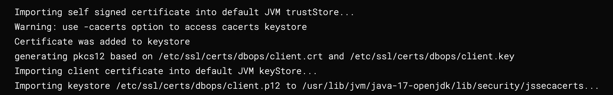

This document provides a comprehensive guide to configuring databases with SSL, including secret and delegate configurations, setting up for JDBC test connections, and pipeline permissions. It covers the necessary steps to set up and manage certificates for secure communication between database and other services.

## 1. Clone
Harness Database DevOps supports multiple source types for schema cloning and connecting to databases. SSL support varies based on the source type and integration method. The table below outlines SSL compatibility and configuration requirements for each supported source:
| Functionality Type | SSL Support | Transport Layer | Cert Management | Notes |
| ------------ | ----------- | --------------- | ------------------ | ------------ |
| Git (Schema Cloning)         | ✅ Yes       | HTTPS           | Mounted certs (`/etc/ssl/certs/ca-bundle.crt`) | [More Info](https://developer.harness.io/docs/continuous-integration/use-ci/set-up-build-infrastructure/k8s-build-infrastructure/configure-a-kubernetes-build-farm-to-use-self-signed-certificates/) |
| Artifactory (Schema Cloning) | ❌ No        | HTTP            | N/A                                            | SSL not supported for Artifactory-based schema cloning                                                                                                                                               |
| Database Connections (JDBC)  | ✅ Yes       | JDBC over SSL   | Requires importing DB certs into truststore    | See [Connector Setup Guide](https://developer.harness.io/docs/database-devops/use-database-devops/set-up-connectors/)                                                                                |

## 2. Pre-requisites
Before proceeding, ensure you have the following components and versions in place:
* CA Bundle - `ca.crt` (commonly contains `ca.crt`, used by both client and server)
    - Generate [CA certificate](https://developer.harness.io/docs/platform/delegates/secure-delegates/delegate-mtls-support/#create-a-ca-certificate)
    - Manage [CA bundles and secrets](https://developer.harness.io/docs/continuous-integration/use-ci/set-up-build-infrastructure/k8s-build-infrastructure/configure-a-kubernetes-build-farm-to-use-self-signed-certificates/#enable-self-signed-certificates)
    :::info Important Note
    In most setups, the same CA signs both ends of the connection. If your environment uses distinct CAs for client and server, ensure both are trusted in the CA bundle.
    :::
* Client Certificate - `client.crt` and `client.key` needs to be manually created by the user.
  - Learn how to Generate [client certificates](https://developer.harness.io/docs/platform/delegates/secure-delegates/delegate-mtls-support/#create-a-client-certificate)
* `CI_MOUNT_VOLUMES` and `ADDITIONAL_CERTS_PATH` delegate environment variables
  - We cannot use `DESTINATION_CA_PATH` since we need to mount different certificates to the build pod
*  Review supported configurations for your database type: [Set up Connectors for Database DevOps](https://developer.harness.io/docs/database-devops/use-database-devops/set-up-connectors)

:::info note
**Minimum versions**
* **db-devops-service** -  `1.32.x`
* **drone-liquibase** -  `plugins/drone-liquibase:1.1.0-4.27`
* **drone-liquibase-mongo** -  `plugins/drone-liquibase:1.1.0-4.27-mongo`
* **drone-liquibase-spanner** -  `plugins/drone-liquibase:1.1.0-4.27-spanner`
:::

## 3. Secret Configuration

Create a SSL Kubernetes secret with all certs:
```shell
kubectl create secret -n <namespace> generic dbops-ssl-secret \
  --from-file=ca.bundle \
  --from-file=client.crt \
  --from-file=client.key
```

:::info note
Ensure that the key names (`ca.bundle`, `client.crt`, `client.key`) match exactly with what your database client expects. For example, if the client expects `ca.crt`, rename the file accordingly before creating the secret.
```shell
kubectl create secret -n <namespace> generic dbops-ssl-secret \
  --from-file=ca.crt=ca.bundle \
  --from-file=client.crt \
  --from-file=client.key
```
:::

## 4. Delegate Configuration

Modify the delegate manifest file to include a volume mount.

1. Add the following YAML under `spec.template.spec.containers`

```shell
volumeMounts:
  - mountPath: /opt/harness-delegate/ca-bundle/
    name: custom-certs
    readOnly: true
```

2. Add the following under `spec.template.spec`. Add the secret name with the value you used when you created the kubernetes secret.

```shell
securityContext:
  fsGroup: 1001
volumes:
  - name: custom-certs
    secret:
      secretName: dbops-ssl-secret
      defaultMode: 400
```

`dbops-ssl-secret` is the name of the secret created in the previous step. Ensure that the secret name matches.

3. Set Environment Variables

```shell
- name: ADDITIONAL_CERTS_PATH
  value: "/opt/harness-delegate/ca-bundle/ca.bundle"
- name: CI_MOUNT_VOLUMES
  value: "/opt/harness-delegate/ca-bundle/ca.bundle:/etc/ssl/certs/dbops/root_ca.crt,/opt/harness-delegate/ca-bundle/client.key:/etc/ssl/certs/dbops/client.key,/opt/harness-delegate/ca-bundle/client.crt:/etc/ssl/certs/dbops/client.crt"
```

:::info note
When using `CI_MOUNT_VOLUMES`, the mounted file paths must be:
  * `/etc/ssl/certs/dbops/root_ca.crt`
  * `/etc/ssl/certs/dbops/client.crt`
  * `/etc/ssl/certs/dbops/client.key`
Also, you must set the `ADDITIONAL_CERTS_PATH` environment variable when using `CI_MOUNT_VOLUMES`.
:::


## 5. JDBC Test Connection

```shell
- name: INIT_SCRIPT
  value: |-
    openssl pkcs12 -export -in /opt/harness-delegate/ca-bundle/client.crt -inkey /opt/harness-delegate/ca-bundle/client.key -out client.p12 -name client_pkcs12 -password pass:changeit
    keytool -importkeystore -destkeystore $JAVA_HOME/lib/security/jssecacerts -srckeystore client.p12 -srcstoretype PKCS12 -alias client_pkcs12 -storepass changeit -srcstorepass changeit -noprompt
```

The `INIT_SCRIPT` environment variable in the Harness Delegate is used to execute a startup script that generates `client.p12` from `client.crt` and `client.key` and imports it into java keystore `$JAVA_HOME/lib/security/jssecacerts`

:::info note
* `INIT_SCRIPT` is required because the JDBC Test Connection runs inside the delegate container.
* The delegate automatically imports `ca.bundle` into the default trust store (`$JAVA_HOME/lib/security/cacerts`).
* Learn more: [Override trust store for delegates](https://developer.harness.io/docs/platform/delegates/secure-delegates/trust-store-override-for-delegates/)
:::


## 6. Pipeline Permissions
To import keys into the system trust store, the DB step must have access to the build pod. For example, If you need to run the step as root (e.g., for `ApplySchema`), set `runAsUser: 0` in your step config:

```shell
# spec.template.spec.containers.image.securityContext
  runAsUser: "0"
```
This ensures the step has the necessary permissions to update keystores.

### Verfication
If the setup is successful, logs in the step will look like below:


## References
* [Using Self-Signed Certificates in Kubernetes Build Farm](https://developer.harness.io/docs/continuous-integration/use-ci/set-up-build-infrastructure/k8s-build-infrastructure/configure-a-kubernetes-build-farm-to-use-self-signed-certificates/)
* [Installing Delegates with Custom Certificates](https://developer.harness.io/docs/platform/delegates/secure-delegates/install-delegates-with-custom-certs/)
* [Delegate MTLS Support](https://developer.harness.io/docs/platform/delegates/secure-delegates/delegate-mtls-support/)
