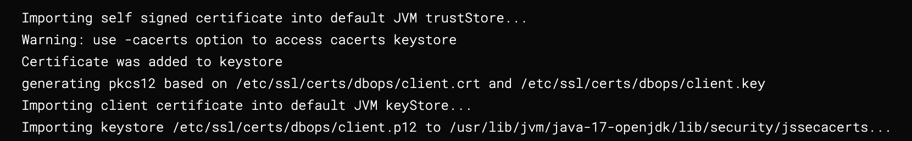

This document provides a comprehensive guide to configuring databases with SSL, including secret and delegate configurations, setting up for JDBC test connections, and pipeline permissions. It covers the necessary steps to set up and manage certificates for secure communication between database and other services.

## 1. SSL Support by Integration Type

SSL handling differs based on how Database DevOps interacts with external systems. Use the table below to confirm support and configuration scope.

| Functionality Type | SSL Support | Transport Layer | Cert Management | Notes |
| ------------ | ----------- | --------------- | ------------------ | ------------ |
| Git (Schema Cloning)         | ✅ Yes       | HTTPS           | Mounted certs (`/etc/ssl/certs/ca-bundle.crt`) | [More Info](https://developer.harness.io/docs/continuous-integration/use-ci/set-up-build-infrastructure/k8s-build-infrastructure/configure-a-kubernetes-build-farm-to-use-self-signed-certificates/) |
| Artifactory (Schema Cloning) | ❌ No        | HTTP            | N/A                                            | SSL not supported for Artifactory-based schema cloning |
| Database Connections (JDBC)  | ✅ Yes       | JDBC over SSL   | Requires importing DB certs into truststore    | See [Connector Setup Guide](https://developer.harness.io/docs/database-devops/use-database-devops/set-up-connectors/) |

:::info Reference Architecture
Harness Database DevOps reuses the same Kubernetes build infrastructure mechanisms as Harness CI for certificate handling.

If you are unfamiliar with certificate mounting in Kubernetes build pods, review: 👉 Configure a Kubernetes build farm to [use self-signed certificates](https://developer.harness.io/docs/continuous-integration/use-ci/set-up-build-infrastructure/k8s-build-infrastructure/configure-a-kubernetes-build-farm-to-use-self-signed-certificates/)
:::

## 2. Prepare Required Certificates

Ensure you have the following files available locally:

* CA Bundle - `ca.crt` (commonly contains `ca.crt`, used by both client and server)
    - Generate [CA certificate](https://developer.harness.io/docs/platform/delegates/secure-delegates/delegate-mtls-support/#create-a-ca-certificate)
    - Manage [CA bundles and secrets](https://developer.harness.io/docs/continuous-integration/use-ci/set-up-build-infrastructure/k8s-build-infrastructure/configure-a-kubernetes-build-farm-to-use-self-signed-certificates/#enable-self-signed-certificates)

    :::info Important Notes
    - In most environments, a single CA signs both client and server.
    - If separate CAs are used, both must be included in the CA bundle.
    - For databases such as Microsoft SQL Server, make sure you are using the correct **CA/root/intermediate certificate chain** needed to trust the server certificate. A server/leaf certificate by itself may not be sufficient and can still result in PKIX path building failures.
    :::

* Client Certificate - `client.crt` and `client.key` needs to be manually created by the user. Learn how to Generate [client certificates](https://developer.harness.io/docs/platform/delegates/secure-delegates/delegate-mtls-support/#create-a-client-certificate). Certificates are mounted once on the delegate and selectively injected into build pods using `CI_MOUNT_VOLUMES`.

:::info note
**Minimum versions**
* **db-devops-service** -  `1.32.x`
* **drone-liquibase** -  `plugins/drone-liquibase:1.1.0-4.27`
* **drone-liquibase-mongo** -  `plugins/drone-liquibase:1.1.0-4.27-mongo`
* **drone-liquibase-spanner** -  `plugins/drone-liquibase:1.1.0-4.27-spanner`
:::

:::info How SSL trust is applied
There are three places where certificate configuration can matter:

- **Delegate container trust**: controlled by `ADDITIONAL_CERTS_PATH`
- **Ephemeral build pod / Database DevOps step trust**: controlled by `CI_MOUNT_VOLUMES`
- **JDBC test connection inside the delegate**: may additionally require `INIT_SCRIPT` if client certificates need to be imported into the Java truststore

If SSL works in one place but fails in another, verify which runtime is actually failing before changing the certificate configuration.
:::

## 3. Create the Kubernetes Secret

Create a Kubernetes secret containing all certificates.

```shell
kubectl create secret -n <namespace> generic dbops-ssl-secret \
  --from-file=ca.bundle \
  --from-file=client.crt \
  --from-file=client.key
```

:::info note
Ensure that the key names (`ca.bundle`, `client.crt`, `client.key`) match exactly with what your database client expects. If your database client expects ca.crt instead of ca.bundle:

```shell
kubectl create secret -n <namespace> generic dbops-ssl-secret \
  --from-file=ca.crt=ca.bundle \
  --from-file=client.crt \
  --from-file=client.key
```
:::

## 4. Mount Certificates into the Delegate

1. Modify the delegate manifest file to include a volume mount. Add the following YAML under `spec.template.spec.containers`

```shell
volumeMounts:
  - mountPath: /opt/harness-delegate/ca-bundle/
    name: custom-certs
    readOnly: true
```

2. Add the following under `spec.template.spec`. Add the secret name with the value you used when you created the kubernetes secret.

```shell
securityContext:
  fsGroup: 1001
volumes:
  - name: custom-certs
    secret:
      secretName: dbops-ssl-secret
      defaultMode: 0440
```

`dbops-ssl-secret` is the name of the secret created in the previous step. Ensure that the secret name matches.

3. Set Environment Variables
  - `ADDITIONAL_CERTS_PATH` ensures the delegate trusts the CA
  - `CI_MOUNT_VOLUMES` injects certs into ephemeral build pods
  - **`DESTINATION_CA_PATH` cannot be used because multiple certs must be mounted independently**

:::important warning
**Do not use `DESTINATION_CA_PATH` when using `CI_MOUNT_VOLUMES` to mount certificates into build pods. Instead, use the `ADDITIONAL_CERTS_PATH` environment variable to specify the path to the certificates on the delegate.**
:::

Add the following environment variables to the delegate:

```shell
- name: ADDITIONAL_CERTS_PATH
  value: "/opt/harness-delegate/ca-bundle/ca.bundle"

- name: CI_MOUNT_VOLUMES
  value: "/opt/harness-delegate/ca-bundle/ca.bundle:/etc/ssl/certs/dbops/root_ca.crt,/opt/harness-delegate/ca-bundle/client.key:/etc/ssl/certs/dbops/client.key,/opt/harness-delegate/ca-bundle/client.crt:/etc/ssl/certs/dbops/client.crt"
```

:::info note
When using `CI_MOUNT_VOLUMES`, the mounted file paths must be:
  * `/etc/ssl/certs/dbops/root_ca.crt`
  * `/etc/ssl/certs/dbops/client.crt`
  * `/etc/ssl/certs/dbops/client.key`

These destination paths are required for the Database DevOps step and should not be changed.

Also, you must set the `ADDITIONAL_CERTS_PATH` environment variable when using `CI_MOUNT_VOLUMES`.
:::

:::warning Mount path guidance
Avoid mounting additional certificate secrets as nested directories under `/opt/harness-delegate/ca-bundle/` (for example, `/opt/harness-delegate/ca-bundle/mssql/`) when the delegate is expected to scan/import certificates from that location.

Prefer exposing certificate files directly under `/opt/harness-delegate/ca-bundle/`, or add the required certificate into the existing secret already mounted there.
:::

**Why this matters ?**

  - `ADDITIONAL_CERTS_PATH` ensures the delegate trusts the database CA
  - `CI_MOUNT_VOLUMES` injects certs into ephemeral build pods
  - **`DESTINATION_CA_PATH` is not used because multiple certs must be mounted independently**

Restart the delegate after applying changes.

## 5. Enable JDBC SSL Truststore Support

Add the following to the delegate environment:

```shell
- name: INIT_SCRIPT
  value: |-

    openssl pkcs12 -export -in /opt/harness-delegate/ca-bundle/client.crt -inkey /opt/harness-delegate/ca-bundle/client.key -out client.p12 -name client_pkcs12 -password pass:changeit

    keytool -importkeystore -destkeystore $JAVA_HOME/lib/security/jssecacerts -srckeystore client.p12 -srcstoretype PKCS12 -alias client_pkcs12 -storepass changeit -srcstorepass changeit -noprompt
```

**What this does ?**
- Combines client cert and key into a PKCS12 file
- Imports it into the Java truststore
- Enables JDBC SSL authentication during test connections

:::info note
* `INIT_SCRIPT` is required because the JDBC Test Connection runs inside the delegate container.
* The delegate automatically imports `ca.bundle` into the default trust store (`$JAVA_HOME/lib/security/cacerts`).
* Learn more: [Override trust store for delegates](https://developer.harness.io/docs/platform/delegates/secure-delegates/trust-store-override-for-delegates/)
:::

### Verification

If the setup is successful, logs in the step will look like below:


You can also validate the mounted files inside the delegate pod:

```shell
kubectl exec -it <delegate-pod> -n <namespace> -- printenv | grep -E 'ADDITIONAL_CERTS_PATH|CI_MOUNT_VOLUMES|DESTINATION_CA_PATH'
kubectl exec -it <delegate-pod> -n <namespace> -- ls -l /opt/harness-delegate/ca-bundle/
```

## Troubleshoot Common Issues

| Issue | Likely Cause | Resolution |
| ---- | ---- | ---- |
| SSL handshake failure | CA not trusted | Verify `ADDITIONAL_CERTS_PATH` points to the correct CA bundle |
| JDBC test fails | Client cert not imported | Check `INIT_SCRIPT` |
| Works locally, fails in pipeline | Certs not mounted in build pod | Verify `CI_MOUNT_VOLUMES` and confirm the files exist at `/etc/ssl/certs/dbops/...` |
| `keytool` reports `Is a directory` | Mounted path resolves to a directory instead of a file | Check the secret mount layout and avoid nested directory mounts under `/opt/harness-delegate/ca-bundle/` |
| PKIX error persists after mounting certs | Wrong certificate type or incomplete certificate chain | Confirm you are using the correct CA/root/intermediate certificate chain, not only the server certificate |
| Changes not applied | Delegate not restarted | Restart delegate |

## References
* [Installing Delegates with Custom Certificates](https://developer.harness.io/docs/platform/delegates/secure-delegates/install-delegates-with-custom-certs/)
* [Delegate MTLS Support](https://developer.harness.io/docs/platform/delegates/secure-delegates/delegate-mtls-support/)
