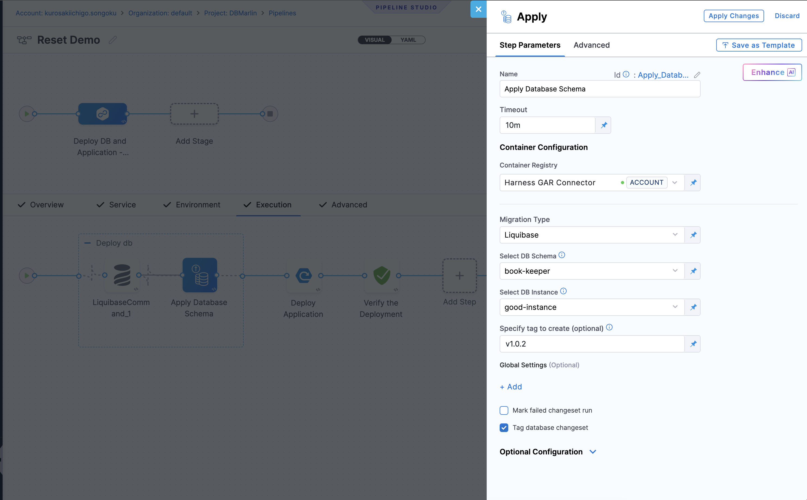

The **Tag Database Changeset** option is available on the Apply Schema step under Harness Database DevOps. When enabled, it ensures that a post-deployment tag is recorded even when a deployment applies zero changesets, giving every deployment a stable rollback anchor regardless of whether schema changes were made.

## Why this matters

By default, Harness skips the post-tag apply when a deployment results in zero applied changesets (a no-op deployment). This means no tag row is written to `DATABASECHANGELOG` for that run.

In multi-service release workflows this creates a gap: if you need to roll back all services to a consistent state, a service that had a no-op deployment has no tag anchor for that release. Rolling back in sync across services becomes unreliable.

**Tag Database Changeset** closes this gap by writing a synthetic changeset row into `DATABASECHANGELOG` with the post-tag value, even when there are no real schema changes to apply.

## How it works

When **Tag Database Changeset** is enabled and a deployment results in zero applied changesets, Harness checks whether the post-tag already exists as the latest row in `DATABASECHANGELOG`: 
   - **Tag already exists on the latest row:** Harness skips insertion and logs a notice.
   - **No tag on the latest row:** Harness updates that row with the tag value directly. No synthetic row is created.
   - **A different tag on the latest row:** Harness inserts a synthetic tag-marker row with a stable identity so rollback can detect and clean it up:
     - **Changelog path:** `liquibase-internal`
     - **Author:** `harness`
     - **ID:** `harness_<sanitizedTag>` (non-alphanumeric characters in the tag are replaced with `_`; for example `1.1.0-4.33` becomes `harness_1_1_0_4_33`)
     - The row is recorded with status `EXECUTED` and synced to Harness migration state and command execution history.

When a deployment applies **one or more changesets**, the post-tag runs normally and no synthetic row is created, regardless of whether the checkbox is enabled.

## Enable Tag Database Changeset

1. In your pipeline, add or edit an **Apply Schema** step.
2. In the Apply Schema step, under **Specific Tag to Create**, add the tag value you want to use for the post-deployment tag.
3. Under **Global Settings**, check the option:
   - **Tag Database Changeset** (disabled by default).
4. Save your changes and run the pipeline.

## Rollback behavior

When rolling back to a tag, Harness performs additional cleanup for synthetic tag-marker rows:

- After the rollback completes, Harness removes synthetic tag-marker rows that occur after the rollback target tag.
- The synthetic marker row for the rollback target tag itself is preserved as the rollback anchor.
- Each removed orphan row is logged in the step output as `Rolling Back Changeset: <changeset-id>`.

## When to use Tag Database Changeset

Use this option when:

- You deploy across multiple services and need every service to have a tag anchor for each release, including releases where a service had no schema changes.
- You rely on rollback-to-tag for synchronized multi-service rollbacks.

Do not enable this option if:

- You do not use post-tags on the Apply Schema step (the option has no effect without a configured post-tag value).
- Your workflow treats no-op deployments as non-events and does not require a tag anchor for them.

## FAQ

### Does this option affect deployments that apply changesets?

No. When one or more changesets are applied, the post-tag runs normally and no synthetic row is created. The option only changes behavior when zero changesets are applied.

### What happens if I run the same pipeline twice with no new changesets?

On the first run, if the post-tag does not yet exist, Harness creates the synthetic row. On the second run, Harness detects the tag already exists on the latest row and skips insertion, logging a notice.

### Is the synthetic row visible in the Harness changeset history?

Yes. The synthetic tag-marker row is synced to migration state and command execution history with a `Success` status, so it appears alongside real changeset deployments.

### Can I roll back to a synthetic tag-marker row?

Yes. Rollback-to-tag treats the synthetic row as a valid rollback anchor. After rolling back to it, Harness cleans up any orphan synthetic marker rows that occurred after the target tag.

### Does this replace the `preStartTag` that Harness creates before the deployment?

No. The `preStartTag` (created before the Apply Schema step runs) and the post-tag (created after) serve different purposes. Tag Database Changeset only affects the post-tag behavior on no-op deployments. Go to [Rollback Tags with Apply Schema](/docs/database-devops/use-database-devops/using-rollback-tags) to understand how `preStartTag` works.
