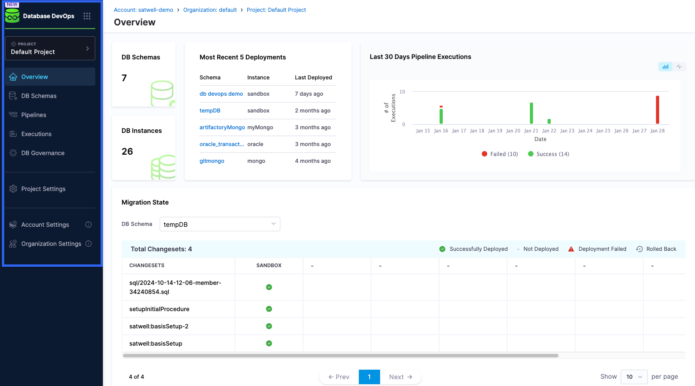
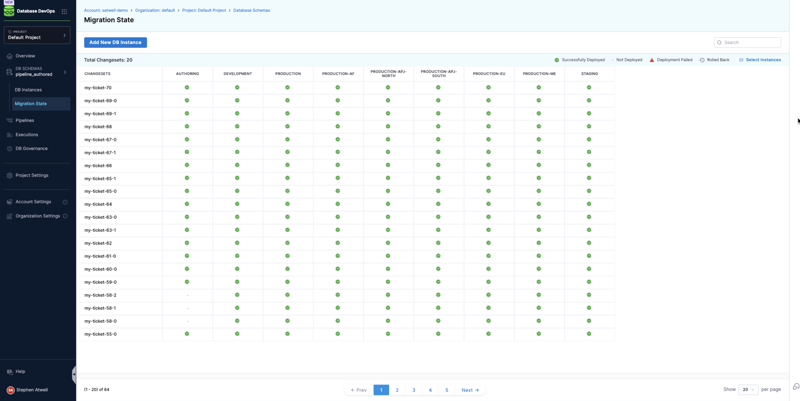
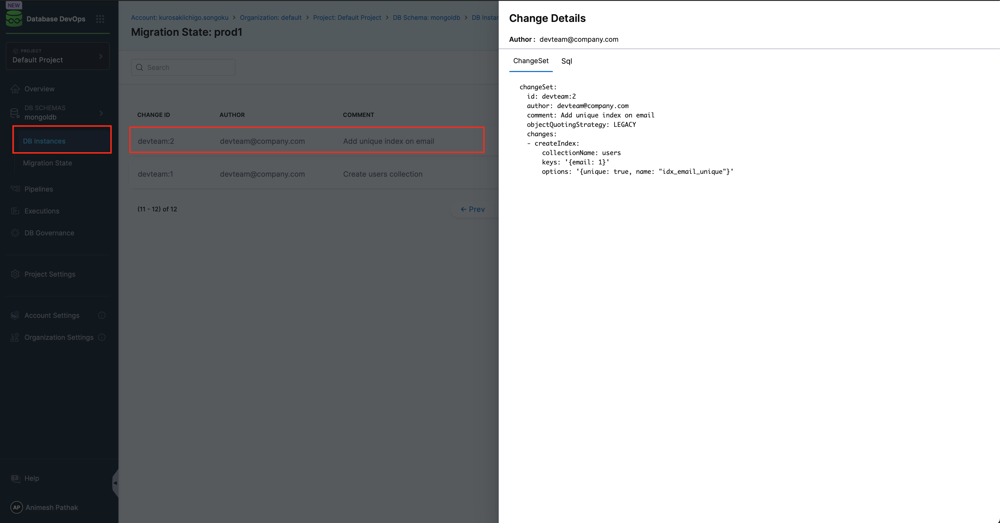

This guide talks you through the UI of Harness Database DevOps. 

## Environment Overview for Database DevOps

 

When you open the Harness Database DevOps module, you will encounter a single-pane interface that will display an overview of important activities relevant to using DB DevOps. Here's what you can expect:

  - **Left Navigation Menu**: A drop-down menu displaying multiple navigation options. 
  - **DB Schemas**: Located at the top-left under the overview tab, this section shows the number of database schemas you have created. 
  - **DB Instances**: This appears directly beneath the **DB Schemas** tab and indicates the number of database instances you have created. 
  - **Most Recent 5 Deployments**: This section displays the five most recent deployments, including the name of the **schema**, the **instance** it ran on, and the **last deployed** date. 
  - **Last 30 Days Pipeline Executions**: This shows the number of pipeline executions in the last 30 days from the point of login, including both failed and successful executions. It will include both failed and successful executions. Users can toggle between a bar graph and a line graph for visualization. 
  - **Migration State**: This indicates the status of recent changesets. A key in the top right of this section helps identify the statuses displayed in the table.

## The Unified Environment Overview for Database Schemas

 

When you click on **DB Schemas** section from the left-hand menu. Then, select the database schema you want to check. Once selected, click on the **Migration State** option under one of the connected DB Instances. This will open a clear, single-page view that shows all the changes linked to that schema in the database, whether they are pending, currently in progress, or already completed.

This overview provides insights into the database states in both production and non-production environments, allowing for quick assessments of readiness and synchronization. Here’s what you will find in this section:

  - **Add New DB Schema**: At the top of the menu, you have the option to create a new schema.
  - **Database Schema**: The name of the database schema. 
  - **Associated Service**: The service associated with the schema. 
  - **DB Instances**: The number of database instances linked to the schema. 
  - **Last Schema Update**: The date of when the schema was last updated.
  - **Three Point Menu**: Selecting this at the end of a highlighted database schema provides options to edit the schema details or delete it. 

## The Overview of the Harness Database DevOps Pipelines 

  

On the DB DevOps **Pipelines** UI, you are provided with a detailed, yet straightforward overview that offers userful information 
for understanding the status of the pipelines in your environments. Here's what you will find on the Harness Database DevOps **Pipelines** interface:

 - **Pipeline Name**: The name of the pipeline
 - **Code Source**: The source of the code, whether it be inline or stored in a repository. 
 - **Recent Executions**: The status of recent pipeline executions, with the latest status displayed on the right of the status bar. 
 - **Last execution**: The name of the person who last ran the pipeline and the dates it was executed, displayed in an estimate of
 hours, days, months or years beneath the user's name. 
 - **Last modified**: The date of when the pipeline was last modified. 

## Viewing ChangeSets in the Harness Database DevOps UI

Clicking on a ChangeSet opens the detail pane on the right-hand side of the UI. This panel provides two tabs:

- **ChangeSets (YAML)**: Displays the structured YAML definition of the applied change, including metadata such as the ID, author, object strategy, and specific change operation (e.g., createIndex).
- **SQL**: For script-based changes, this tab shows the actual SQL that was executed, ensuring transparency and auditability for database administrators and platform engineers.

Within the Migration State tab of the Harness Database DevOps platform, users are provided with clear visibility into the applied ChangeSets across database environments. This view is instrumental in tracking schema-level changes and understanding the evolution of your data models over time. Here’s what you’ll find in the Migration State interface:

- **Change ID**: A unique identifier for each ChangeSet, often scoped by team or environment for traceability (e.g., `devteam:2`).
- **Author**: The email address of the individual or service account or author name responsible for creating the ChangeSet.
- **Comment**: A descriptive message associated with the ChangeSet to indicate the purpose or context of the change.
- **Changes**: A detailed list of schema-level actions applied in the ChangeSet, such as `createIndex`, `addColumn` or `dropTable`. This allows DB admins and developers to quickly assess what structural updates were made to the database without manually inspecting scripts.

## Database DevOps Executions Overview 

The Harness DB DevOps **Executions** UI provides a comprehensive view of the execution statuses of your pipelines. Here’s a detailed breakdown of the elements you will find on the DB DevOps **Executions** interface: 

 - **Pipeline Name**: This column displays the name of the pipeline that was executed, allowing users to easily identify which pipeline is being referenced. 
 - **Status**: The current status of the pipeline execution, showing whether it has passed or failed. This is crucial for quickly assessing the outcome of recent deployments.
 - **Service**: This lists the service associated with the pipeline, providing context on which application or service the changes were applied to.
 - **Environment**: The environment in which the pipeline was executed, such as development, staging, or production, helping users understand the context of the deployment.
 - **Execution Start Time**: The name of the person who last initiated the pipeline execution, along with the date and time it was executed. The time is presented in a user-friendly format, estimating hours, days, months, or years beneath the user's name, which aids in tracking when changes were made.
