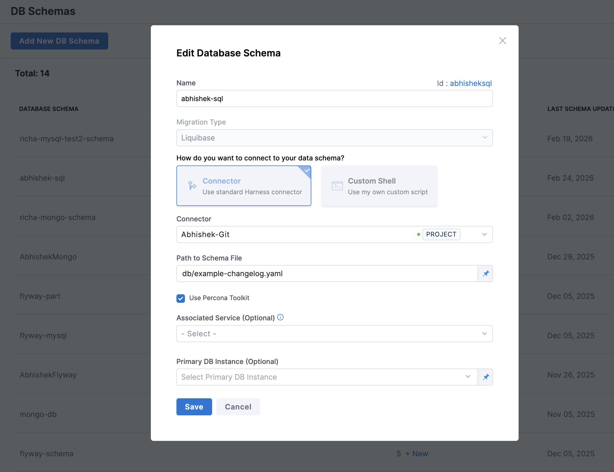
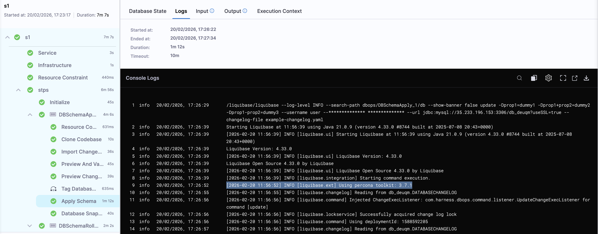

Harness Database DevOps provides optional integration with Percona Toolkit for MySQL when using Liquibase-based schema management. This feature enables teams to apply database modifications with minimal locking and reduced risk to production workloads. Enabling Percona Toolkit introduces a safety-first execution model designed for high-scale and production-critical environments.

## Why Use Percona Toolkit for MySQL?
Standard MySQL schema changes (e.g., ALTER TABLE) can result in:
- Long-running table locks
- Application downtime or degraded performance
- Replication lag in clustered environments

Percona Toolkit mitigates these risks by executing schema changes using pt-online-schema-change, which:
- Creates a shadow table with the desired schema
- Copies data incrementally in small chunks
- Uses triggers to keep data synchronized
- Performs an atomic table swap with minimal lock time

## Enabling Percona Toolkit in Harness DB DevOps
During Database Schema creation, you can enable Percona Toolkit using the provided checkbox:
1. Navigate to the Database Schema creation page in Harness DB DevOps.
2. Fill in the required details for your MySQL database connection and Select Liquibase as your schema configuration.
3. Check the box labeled "Use Percona Toolkit" to activate the integration.
  
    - **Disabled (default)**: Liquibase executes changelogs directly using native MySQL operations
    - **Enabled**: Eligible schema changes are executed using Percona Toolkit for migration
Even when disabled, migrations will still run successfully. However, this may introduce locking and downtime risks in production environments.
4. Save your configuration and proceed with your schema management workflow.

Once enabled, Percona Toolkit will be used for MySQL schema changes.



## Limitations of Percona Toolkit for MySQL
While Percona Toolkit enables safer schema changes, not all DDL operations are supported. Understanding these limitations is critical to avoid unexpected failures during deployment.

Below are representative examples of DDL changes that may not be supported or require special handling:
### 1. Operations Involving Foreign Keys
Adding or dropping foreign keys can be problematic because:
- The tool creates a shadow table and swaps it
- Foreign key constraints may break during the swap process
Example:
```sql
ALTER TABLE orders
ADD CONSTRAINT fk_customer
FOREIGN KEY (customer_id) REFERENCES customers(id);
```

### 2. Tables Without a Primary Key or Unique Index
`pt-online-schema`-change requires a PRIMARY KEY or UNIQUE INDEX to chunk data safely
Example:
```sql
CREATE TABLE logs (
  message TEXT,
  created_at TIMESTAMP
);
```
This table cannot be safely migrated using Percona Toolkit.

### 3. Certain ALTER Operations (Edge Cases)
Some schema changes are either unsupported or risky:
- Changing storage engine in some configurations
- Dropping primary keys
- Complex column reordering
- Renaming columns in certain MySQL versions
Example:
```sql
ALTER TABLE users DROP PRIMARY KEY;
```
Not supported safely due to row identification requirements.

## Required MySQL Permissions
To successfully execute schema changes using Percona Toolkit, the database user must have the following privileges:
- `ALTER` on the target table
- `CREATE` and `DROP` on the database (for shadow table management)
- `SELECT` on the target table (for data copying)
- `INSERT` and `UPDATE` on the target table (for triggers)

Percona Toolkit significantly enhances the safety of MySQL schema changes, but it is not universally compatible with all DDL operations. A clear understanding of supported patterns, combined with proper permissions and validation, is essential to ensure predictable, zero-downtime deployments in Harness Database DevOps.