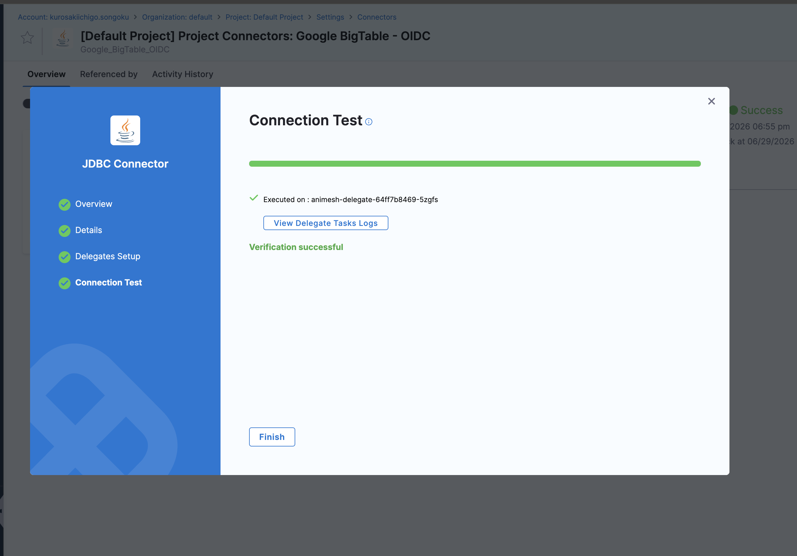

--- 
title: Get started with Google Cloud BigTable.
description: Configure Harness Database DevOps to manage Google Cloud BigTable schema changes using Liquibase-based change types.
keywords: [bigtable, harness db devops, google cloud, gcp, liquibase, column family, gc rules, changelog]
tags: [gcp, bigtable, dbdevops]
unlisted: true
sidebar_position: 7
slug: /database-devops/use-database-devops/get-started-bigtable
--- 

This guide explains how to connect Harness Database DevOps to Google Cloud BigTable and manage schema changes using declarative YAML changelogs. You will create tables, column families, and garbage collection rules through a Liquibase-based extension purpose-built for BigTable's native gRPC API.

## Before you begin

- Active Harness account with Database DevOps module enabled.
- A Google Cloud project with BigTable API enabled and at least one BigTable instance provisioned.
- Permissions to manage BigTable tables and column families (`bigtable.tables.create`, `bigtable.tables.update`, `bigtable.tables.delete`).
- Permissions to create connectors and Database DevOps pipelines in Harness. Go to [RBAC in Harness](/docs/platform/role-based-access-control/rbac-in-harness) to configure roles.

## BigTable schema concepts

BigTable is a wide-column NoSQL database. Its schema model differs from relational databases:

- **Table:** The top-level container, identified by a table ID within a BigTable instance.
- **Column family:** A logical grouping of columns within a table. All columns within a family share the same garbage collection policy. You define column families at schema design time.
- **Garbage collection (GC) rules:** Policies that automatically delete stale cell versions from a column family. BigTable stores multiple timestamped versions of each cell value. GC rules control how many versions or how long versions are retained.

Unlike SQL databases, BigTable has no `CREATE TABLE` DDL. Harness Database DevOps handles this through custom Liquibase change types that call the BigTable Admin API directly via gRPC.

## OIDC / Workload Identity
When the Harness runner operates on a GCP-managed environment (GKE, Cloud Run, Compute Engine), it can use Application Default Credentials via Workload Identity without a key file. No additional credential configuration is required when Workload Identity is properly configured for the runner's service account. 

## Connect to BigTable

The BigTable connection URL uses the following format:

| Scenario | URL |
|   -| --|
| Default app profile | `bigtable:my-gcp-project/my-instance` |
| Named app profile | `bigtable:my-gcp-project/my-instance?app-profile=analytics` |

To create a BigTable connector in Harness:

1. In your Harness project, go to **Connectors** under **Project Setup**.
2. Select **New Connector**, then select **Google Cloud BigTable** under **Cloud Providers**.
3. Enter a **Name** for the connector (for example, `gcp-bigtable-prod`).
4. Enter the **Connection URL** in the format above.
5. Under **Credentials**, select **OIDC / Workload Identity**. The runner uses Application Default Credentials from the GCP-managed environment.

6. Select **Save and Continue** to test the connection.
  

## Supported change types

Harness Database DevOps supports four change types for BigTable. Each maps directly to a BigTable Admin API operation. 

### createBigtableTable

Creates a new BigTable table. You can define one or more column families and their GC rules in the same changeset.

**Properties:**

| Property | Required | Description |
|   -|   -|    -|
| `tableName` | Yes | The ID of the table to create. |
| `columnFamilies` | No | List of column family definitions. You can add families after table creation using `createColumnFamily`. |
| `columnFamilies[].familyName` | Yes | Column family name. |
| `columnFamilies[].gcRule` | No | GC rule object. Supports `maxNumVersions`, `maxAge`, `union`, and `intersection`. Omit to store all versions indefinitely. |

**Example — Create a table with two column families:**

```yaml
databaseChangeLog:
  - changeSet:
      id: create-users-table
      author: harness
      changes:
        - createBigtableTable:
            tableName: users
            columnFamilies:
              - familyName: profile
                gcRule:
                  maxAge: 90d
              - familyName: activity
                gcRule:
                  maxNumVersions: 10
```

**Example — Create a table with no column families:**

```yaml
databaseChangeLog:
  - changeSet:
      id: create-events-table
      author: harness
      changes:
        - createBigtableTable:
            tableName: session_events
```

**Example — Create a table with composite GC rules:**

```yaml
databaseChangeLog:
  - changeSet:
      id: create-metrics-table
      author: harness
      changes:
        - createBigtableTable:
            tableName: metrics
            columnFamilies:
              - familyName: raw
                gcRule:
                  intersection:
                    - gcRule:
                        maxAge: 7d
                    - gcRule:
                        maxNumVersions: 5
              - familyName: aggregated
                gcRule:
                  union:
                    - gcRule:
                        maxAge: 365d
                    - gcRule:
                        maxNumVersions: 1
              - familyName: labels
```

### createColumnFamily

Adds a new column family to an existing table. Use this change type when you need to extend a table's schema after initial creation.

**Properties:**

| Property | Required | Description |
|   -|   -|    -|
| `tableName` | Yes | The ID of the existing table. |
| `familyName` | Yes | The column family name to create. |
| `gcRule` | No | GC rule object. Supports `maxNumVersions`, `maxAge`, `union`, and `intersection`. Omit to retain all versions indefinitely. |

**Example — Add a column family with a max-age rule:**

```yaml
databaseChangeLog:
  - changeSet:
      id: cf-maxage
      author: harness
      changes:
        - createColumnFamily:
            tableName: users
            familyName: sessions
            gcRule:
              maxAge: 7d
```

**Example — Add a column family with a version-based rule:**

```yaml
databaseChangeLog:
  - changeSet:
      id: cf-basic
      author: harness
      changes:
        - createColumnFamily:
            tableName: users
            familyName: profile
            gcRule:
              maxNumVersions: 3
```

**Example — Add a column family with a union rule:**

```yaml
databaseChangeLog:
  - changeSet:
      id: cf-union
      author: harness
      changes:
        - createColumnFamily:
            tableName: orders
            familyName: audit_log
            gcRule:
              union:
                - gcRule:
                    maxNumVersions: 5
                - gcRule:
                    maxAge: 90d
```

**Example — Add a column family with an intersection rule:**

```yaml
databaseChangeLog:
  - changeSet:
      id: cf-intersection
      author: harness
      changes:
        - createColumnFamily:
            tableName: products
            familyName: metadata
            gcRule:
              intersection:
                - gcRule:
                    maxNumVersions: 2
                - gcRule:
                    maxAge: 30d
```

**Example — Add a column family with no GC rule:**

```yaml
databaseChangeLog:
  - changeSet:
      id: cf-no-gc-rule
      author: harness
      changes:
        - createColumnFamily:
            tableName: events
            familyName: raw_data
```

### deleteColumnFamily

Removes a column family and all its data from a table. This operation is irreversible. Harness Database DevOps tracks this changeset in the `DATABASECHANGELOG` table so it does not re-execute on subsequent runs.

**Properties:**

| Property | Required | Description |
|   -|   -|    -|
| `tableName` | Yes | The ID of the table containing the column family. |
| `columnFamilyName` | Yes | The name of the column family to delete. |

:::tip
Run `deleteColumnFamily` in a separate changeset from `createColumnFamily` operations on the same table. This ensures Harness Database DevOps can track each operation independently and roll back selectively if needed.
:::

**Example — Remove a deprecated column family:**

```yaml
databaseChangeLog:
  - changeSet:
      id: 7
      author: harness
      changes:
        - deleteColumnFamily:
            tableName: users
            columnFamilyName: legacy_data
```

**Example — Remove multiple column families in sequence:**

```yaml
databaseChangeLog:
  - changeSet:
      id: 8
      author: harness
      changes:
        - deleteColumnFamily:
            tableName: events
            columnFamilyName: raw_v1

  - changeSet:
      id: 9
      author: harness
      changes:
        - deleteColumnFamily:
            tableName: events
            columnFamilyName: raw_v2
```
### modifyColumnFamilyGCRule

Updates the garbage collection rule on an existing column family. Use this change type to tighten or relax data retention policies without recreating the column family.

**Properties:**

| Property | Required | Description |
|   -|   -|    -|
| `tableName` | Yes | The ID of the table containing the column family. |
| `columnFamilyName` | Yes | The name of the column family to modify. |
| `gcRule` | Yes | The new GC rule object to apply. Supports `maxNumVersions`, `maxAge`, `union`, and `intersection`. |

**Example — Reduce retention to one version per cell:**

```yaml
databaseChangeLog:
  - changeSet:
      id: tighten-profile-gc
      author: harness
      changes:
        - modifyColumnFamilyGCRule:
            tableName: users
            columnFamilyName: profile
            gcRule:
              maxNumVersions: 1
```

**Example — Extend retention to 1 year:**

```yaml
databaseChangeLog:
  - changeSet:
      id: extend-raw-retention
      author: harness
      changes:
        - modifyColumnFamilyGCRule:
            tableName: metrics
            columnFamilyName: raw
            gcRule:
              maxAge: 365d
```

**Example — Apply an intersection rule to reduce storage costs:**

```yaml
databaseChangeLog:
  - changeSet:
      id: tighten-events-gc
      author: harness
      changes:
        - modifyColumnFamilyGCRule:
            tableName: activity
            columnFamilyName: events
            gcRule:
              intersection:
                - gcRule:
                    maxAge: 30d
                - gcRule:
                    maxNumVersions: 3
```

## Create a changelog file

Create a YAML changelog file in your repository. A single changelog can contain multiple changesets targeting the same or different tables.

**Example — Full schema setup for a new instance:**

```yaml
databaseChangeLog:
  - changeSet:
      id: create-users
      author: platform-team
      changes:
        - createBigtableTable:
            tableName: users
            columnFamilies:
              - familyName: profile
                gcRule:
                  maxAge: 90d
              - familyName: activity
                gcRule:
                  maxNumVersions: 20
              - familyName: preferences
                gcRule:
                  maxAge: 180d

  - changeSet:
      id: create-session-events
      author: harness
      changes:
        - createBigtableTable:
            tableName: session_events
            columnFamilies:
              - familyName: events
                gcRule:
                  intersection:
                    - gcRule:
                        maxAge: 30d
                    - gcRule:
                        maxNumVersions: 5
              - familyName: metadata
                gcRule:
                  maxNumVersions: 1

  - changeSet:
      id: create-feature-flags
      author: platform-team
      changes:
        - createBigtableTable:
            tableName: feature_flags
            columnFamilies:
              - familyName: flags
```