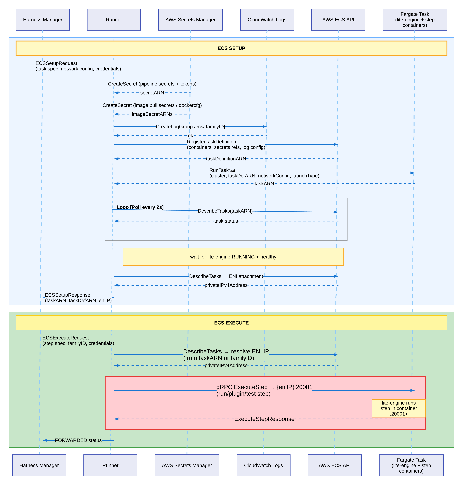

This guide explains how to deploy the Harness Database DevOps runner on Amazon ECS with Fargate and configure the required AWS infrastructure to execute Database DevOps pipelines.

## Prerequisites

- Permissions to create and manage ECS clusters, task definitions, IAM roles, VPC networking, and security groups.
- Active Harness account with Database DevOps module enabled.
- Permissions to create AWS connectors, delegates, and Database DevOps pipelines. Go to [RBAC in Harness](/docs/platform/role-based-access-control/rbac-in-harness) to configure roles.
- Obtain a delegate token from Harness to authenticate the runner. Go to [Create a delegate token](https://developer.harness.io/docs/platform/delegates/secure-delegates/secure-delegates-with-tokens/) for instructions.

## Architecture overview



## Setup AWS infrastructure

The runner requires the following AWS resources. You can create them manually or use the automated script provided.

### Network architecture

Build tasks need outbound internet connectivity to pull Docker images, communicate with Harness Manager, and push logs to CloudWatch. Choose one of the following network architectures:
    - Use public subnets with an Internet Gateway for simplest setup. 
    - If your organization requires private subnets, use a NAT Gateway for outbound connectivity.
    - VPC Endpoints for outbound connectivity.

**Requirements:**
- 2 subnets in different Availability Zones
- Internet access for pulling Docker images and connecting to Harness
- Enable auto-assign public IP if using public subnets

### Security group configuration

Create one security group for both runner and build tasks:
- **Inbound:** Allow TCP port `20001` from same security group (for runner-to-task communication)
- **Outbound:** Allow all traffic to `0.0.0.0/0` (or restrict to ports `443, 80, 22` if required)

### IAM roles

Create two IAM roles with trust policy for `ecs-tasks.amazonaws.com`.

#### Task Execution Role

Used by ECS to start tasks. Attach the AWS managed policy `AmazonECSTaskExecutionRolePolicy`, plus this inline policy:

<details>
<summary>CloudWatch Logs and Secrets Manager policy</summary>

```json
{
  "Version": "2012-10-17",
  "Statement": [
    {
      "Effect": "Allow",
      "Action": [
        "logs:CreateLogGroup",
        "logs:CreateLogStream",
        "logs:PutLogEvents"
      ],
      "Resource": "*"
    },
    {
      "Effect": "Allow",
      "Action": "secretsmanager:GetSecretValue",
      "Resource": "*"
    }
  ]
}
```

</details>

#### Task Role

Used by the runner to manage build tasks. Create this inline policy:

<details>
<summary>Runner task policy (replace EXECUTION_ROLE_ARN with your execution role ARN)</summary>

```json
{
  "Version": "2012-10-17",
  "Statement": [
    {
      "Effect": "Allow",
      "Action": [
        "ecs:RegisterTaskDefinition",
        "ecs:DeregisterTaskDefinition",
        "ecs:RunTask",
        "ecs:StopTask",
        "ecs:DescribeTasks",
        "ecs:DescribeTaskDefinition",
        "ecs:ListTasks",
        "ecs:TagResource"
      ],
      "Resource": "*"
    },
    {
      "Effect": "Allow",
      "Action": "iam:PassRole",
      "Resource": "EXECUTION_ROLE_ARN"
    },
    {
      "Effect": "Allow",
      "Action": [
        "ec2:DescribeNetworkInterfaces",
        "ec2:DescribeSubnets",
        "ec2:DescribeSecurityGroups"
      ],
      "Resource": "*"
    },
    {
      "Effect": "Allow",
      "Action": [
        "logs:CreateLogGroup",
        "logs:TagResource",
        "logs:PutRetentionPolicy"
      ],
      "Resource": "*"
    },
    {
      "Effect": "Allow",
      "Action": [
        "secretsmanager:CreateSecret",
        "secretsmanager:DeleteSecret",
        "secretsmanager:TagResource",
        "secretsmanager:GetSecretValue"
      ],
      "Resource": "*"
    }
  ]
}
```

</details>

### Create the required resources

Create the following AWS resources using the AWS Console, AWS CLI, Terraform, or your preferred infrastructure-as-code tool:

1. **ECS Cluster:** Create a Fargate-enabled ECS cluster in your chosen region.
2. **VPC and Subnets:** Use an existing VPC or create a new one with at least 2 subnets in different Availability Zones.
3. **Internet Gateway or NAT Gateway:** Attach based on your chosen network architecture (Option A, B, or C above).
4. **Route Tables:** Configure routes for internet connectivity (`0.0.0.0/0` to IGW or NAT Gateway).
5. **Security Group:** Create a security group with the inbound and outbound rules specified above.
6. **IAM Roles:** Create the Task Execution Role and Task Role with the permissions specified in the tables above.
7. **ECR Repository:** (Optional) Create an ECR repository to store the runner image, or use an existing container registry.

After creating these resources, note down the following values - you'll need them for deployment:

- **Region:** `us-east-1` (or your chosen region)
- **Cluster Name:** Example: `runner-ecs-cluster`
- **Subnet IDs:** Example: `subnet-xxxxx`, `subnet-yyyyy`
- **Security Group ID:** Example: `sg-xxxxx`
- **Task Execution Role ARN:** Example: `arn:aws:iam::123456789012:role/ecs-task-execution-role`
- **Task Role ARN:** Example: `arn:aws:iam::123456789012:role/ecs-runner-task-role`
- **ECR Repository URI:** Example: `123456789012.dkr.ecr.us-east-1.amazonaws.com/harness-runner`

## Deploy the runner on ECS

### Get the runner image

Contact Harness Support to obtain the Database DevOps runner Docker image. You'll receive:
- **Runner image URI:** The container image location (ECR or Docker Hub)
- **Image tag:** The specific version to use (for example, `latest` or `1.0.0`)

### Create the runner task definition

1. In Harness, go to **Account Settings** > **Account Resources** > **Delegates**.
2. Select **New Delegate** > **Docker**.
3. Copy the following values displayed in the setup wizard:
   - **Harness Account ID:** Your unique account identifier (6-character alphanumeric code)
   - **Delegate Token:** Authentication token for the delegate
   - **Manager Endpoint:** `https://app.harness.io/gratis` (for Harness SaaS) or your self-managed platform URL

   :::tip
   Store the delegate token securely. Consider using AWS Secrets Manager to store the token and reference it in the task definition using the `secrets` field instead of `environment`. Go to [Specifying sensitive data](https://docs.aws.amazon.com/AmazonECS/latest/developerguide/specifying-sensitive-data.html) in the AWS documentation.
   :::

4. Go to the AWS ECS Console.
5. Select **Task Definitions**, then select **Create new task definition**.
6. Choose **Fargate** as the launch type.
7. Configure the task:
   - **Task CPU:** 1 vCPU (1024) - minimum recommended
   - **Task memory:** 2 GB (2048) - minimum recommended
   - **Task execution role:** Select the execution role ARN you created earlier (must have `secretsmanager:GetSecretValue` if using secrets)
   - **Task role:** Select the task role ARN you created earlier (this role is inherited by the AWS connector via "Assume IAM Role on Delegate")
8. Add a container:
   - **Container name:** `harness-runner-ecs`
   - **Image:** Paste the runner image URI provided by Harness Support
   - **Environment variables:** Add the following:
     - `ACCOUNT_ID`: Your Harness account ID (from step 3)
     - `DELEGATE_TOKEN`: Delegate token from Harness (from step 3) - or use `secrets` field for better security
     - `MANAGER_HOST_AND_PORT`: Manager endpoint (from step 3)
     - `DELEGATE_NAME`: Choose a descriptive name (for example, `ecs-dbdevops-runner`)
     - `NEXT_GEN`: `true`
   - **Logging:** Enable CloudWatch Logs
     - **Log driver:** `awslogs`
     - **Log group:** `/ecs/harness-runner-ecs` (will be auto-created by the execution role)
     - **Region:** Your AWS region
     - **Stream prefix:** `ecs`
9. Select **Create**.

### Deploy as an ECS service

1. In the ECS Console, go to your ECS cluster.
2. Select **Create Service**.
3. Configure the service:
   - **Launch type:** Fargate
   - **Task definition:** Select the runner task definition you just created
   - **Service name:** `harness-runner-ecs` (or your preferred name)
   - **Number of tasks:** 1 (start with 1; you can scale later for high availability)
   - **Deployment configuration:** Rolling update
4. Configure networking:
   - **VPC:** Select your VPC
   - **Subnets:** Select the 2 subnets you created (must be in different AZs)
   - **Security group:** Select the runner security group you created
   - **Auto-assign public IP:** ENABLED (if using public subnets), DISABLED (if using private subnets with NAT Gateway)
5. (Optional) Configure load balancing if you need external access to the runner (not typically required).
6. (Optional) Configure auto-scaling based on CPU or memory utilization.
7. Select **Create Service**.
8. Wait for the task to reach **RUNNING** status (check the **Tasks** tab in the service).

### Verify runner connectivity

1. In Harness, go to **Delegates** under **Project Setup** (or **Account Settings** > **Account Resources** > **Delegates**).
2. Verify the ECS runner appears with status **Connected**.
3. Note the delegate name or tags - you'll use these when creating the AWS connector.
4. If not connected, check CloudWatch logs for errors:

   ```bash
   aws logs tail /ecs/harness-runner-ecs --follow --region $AWS_REGION --since 5m
   ```

## Create an AWS connector

The runner authenticates to AWS using a Harness AWS connector. Database DevOps supports the **Assume IAM Role on Delegate** authentication method, which allows the runner to inherit IAM permissions from its ECS task role.

:::info
With **Assume IAM Role on Delegate**, the connector uses the IAM task role attached to the runner's ECS task. You do not need to provide AWS access keys or credentials. The task role you created earlier (with ECS, CloudWatch, and Secrets Manager permissions) is automatically used.
:::

1. In your Harness project, go to **Connectors** under **Project Setup**.
2. Select **New Connector**, then select **AWS** under **Cloud Providers**.
3. Enter a **Name** for the connector (for example, `aws-ecs-runner`).
4. Select **Continue**.
5. Under **Credentials**, select **Assume IAM Role on Delegate**.
6. (Optional) Select **Enable cross-account access (STS Role)** if you need to assume a role in a different AWS account. Enter the cross-account role ARN.
7. Select the **Test Region** (defaults to `us-east-1`). Choose the region where your runner is deployed.
8. Select **Continue**.
9. Under **Select Connectivity Mode**, select **Connect through a Harness Delegate**.
10. Select **Only use Delegates with all of the following tags** and enter the delegate name or tags from the verification step above, or select **Use any available Delegate**.
11. Select **Save and Continue** to test the connection. The connection test confirms that the runner can authenticate to AWS using its task role.

The connector will be used in your Database DevOps pipeline to authenticate AWS operations. Go to [Add an AWS connector](/docs/platform/connectors/cloud-providers/add-aws-connector) for detailed connector configuration options.

## Infrastructure auto-discovery

The runner automatically discovers its infrastructure settings from the ECS task metadata when running on Fargate. This provides zero-configuration deployments.

When the runner starts, it:
1. Queries the ECS Task Metadata Endpoint to retrieve the task ARN.
2. Calls AWS APIs (`DescribeTasks`, `DescribeNetworkInterfaces`) to discover:
   - Cluster name and region
   - Subnet IDs and security groups
   - Execution role ARN
3. Caches these values for the runner's lifetime.

Build tasks automatically inherit the runner's infrastructure settings. No environment variables or manual configuration needed.

## Configure a Database DevOps pipeline

1. In Harness, create a new Database DevOps pipeline.
2. In the pipeline **Infrastructure** settings, select the AWS connector you created earlier.
3. The runner will execute pipeline steps in ECS tasks.
4. Design your pipeline with the following considerations:

   :::info important
   ECS Fargate enforces a maximum of 10 containers per task. In Database DevOps pipelines, each step in a step group may run as a separate container. To avoid exceeding this limit, place **Apply** and **Rollback** steps in separate step groups.
   :::

5. Execute the pipeline and monitor logs in Harness and CloudWatch.

## Best practices

- Use public subnets with Internet Gateway (Option A) unless you have specific compliance requirements.
- Design pipelines with modularity to avoid exceeding the 10-container limit per task.
- Use delegate tags to target specific runners for different environments.
- Monitor CloudWatch logs to identify early signs of issues.
- Manually update the runner image every 3-6 months (auto-update is not supported for ECS delegates).

If you encounter any issues, refer to the [ECS Troubleshooting guide](/docs/database-devops/troubleshooting/ecs-troubleshooting) for common problems and solutions.