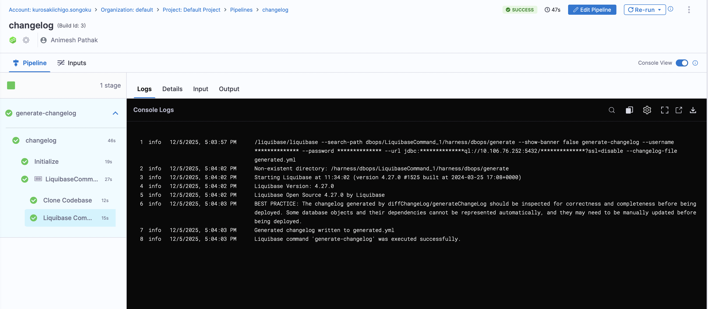

import Tabs from '@theme/Tabs';
import TabItem from '@theme/TabItem';

A changelog is a collection of database changes that can be applied to a database. It serves as a version-controlled record of changes, allowing teams to manage and track modifications to the database schema and data.

Harness DBOps offers multiple methods to generate changelogs for your database. This document outlines the various approaches available and provides step-by-step guidance for each.

- [Generate Changelog from Command](#steps-to-create-a-changelog-with-the-generate-changelog-command)
- [Pointing to SQL Files](#steps-to-create-a-changelog-with-sql-files)

## Setup Changelog

<Tabs>
<TabItem value="Using existing SQL files">

You can create a changelog by pointing to SQL files in your git repository. This method is useful if you have existing SQL scripts that you want to use as changelogs.
This approach allows you to leverage your existing SQL files without needing to convert them into a specific changelog format.

### Steps to Create a Changelog with SQL Files

1. Place your SQL files it in a subfolder named `sql` in git repository.
2. Ensure that the SQL files are named in a way that reflects their order of execution. 
:::info 
For example, you can use a naming convention like `V1__create_table.sql`, `V2__add_column.sql`, etc.
:::
3. Each SQL file should contain the SQL statements that define the changes you want to apply to your database schema.
4. Add `changelog.yml` to your git repository. In this file, include the following configuration to reference the SQL files:

```yaml
databaseChangeLog:
  - includeAll:
      path: sql
      relativeToChangelogFile: true
```

#### Advanced Usage Options
If you need an order other than alphabetical, or want to leverage advanced features of changes, or a mixture of YAML/SQL based changes, you can use the sqlFile change type in a YAML changeset:

```yaml
databaseChangeLog:
  - changeSet:
      id: execute-specific-sql-file
      author: sonichigo
      changes:
        - sqlFile:
            path: sql/specific_script.sql
            relativeToChangelogFile: true
```

For customers with an existing directory of scripts to run in alphabetical order, you can leverage `includeAll` and then follow it with additional YAML changesets to run after the referenced scripts:
```yaml
databaseChangeLog:
  # First run all SQL files in the directory alphabetically
  - includeAll:
      path: sql/existing-scripts
      relativeToChangelogFile: true
      
  # Then run additional changesets after all the SQL files
  - changeSet:
      id: additional-changes-after-sql-files
      author: sonichigo
      changes:
        - createTable:
            tableName: new_feature_table
            columns:
              - column:
                  name: id
                  type: INT
                  constraints:
                    primaryKey: true
```
</TabItem>


<TabItem value="Generate Changelog Command">
You can create a changelog by using the `generate-changelog` command. This method is useful if you want to generate a changelog based on the current state of your database. This approach allows you to create a changelog file that reflects the current state of your database schema.

### Steps to Create a Changelog with the `generate-changelog` Command

1. Under `DBOps` in the Harness UI, navigate to `DB Schema`.
2. Click on the `Add DB Schema` button.

3. Click on the `Add DB Instance` button.
4. Go to `Pipeline` and click on the `Create a Pipeline` button.
5. Click on the `Add Stage` button and select `custom stage`.
6. In the `Stage` section, create `Add Step Group` as the stage type.
:::warning note 
Toggle on the "Enable container based execution".
:::
7. In the `Step Group` section, select `Add Step` as the step type. Under "DB DevOps", select `Liquibase Command` as the step type.
8. By default the name is "**LiquibaseCommand_1**".

- **Select DB Schema**: The DB Schema we created on Step 2.
- **Select DB Instance**: The Instance we created on Step 3.
- **Command**: The command to be executed. In this case, we will use `generate-changelog` to generate a changelog file.
9. Click `Apply Changes` and Save the Pipeline.
10. Click on the `Run` button to run the pipeline.
11. Once the pipeline is executed successfully, you will find the changelog file in the specified path.


#### Commit to Git Repository
You can commit the generated changelog file to your git repository using the `Run Command` step in the pipeline. This allows you to version control your changelog file and keep track of changes over time. Otherwise, once the pipeline is executed, pods will be deleted and the changelog file will be lost.

1. In the Pipeline, under the `Step Group` section, add a new step `Run Command` as the step type.

- **Name**: The name of the step.
- **Registry Type**: The type of registry to use. We can use `Third Party Registry` or `Harness Artifact Registry`. 
- **Container Registry**: The container registry to use. This is the location where the image is stored. In this case, we will use Docker Hub as the registry.
- **Image**: The name of the image to use. In this case, we will use `alpine/git`.
- **Shell**: The shell to use. We can use `bash` or `sh`, depending on the image used.
- **Command**: The command to be executed. In this case, we will use following command to commit the changelog file to the git repository:
  ```bash
  git init

  # Configure Git user
  git config --global user.email <User Email>
  git config --global user.name <User Name>
  git config --global user.password <PAT Token> ## PAT saved in Harness Secrets Manager

  git add generated.yml ## Our changelog file name which we generated in the previous step
  git commit -m "generated changelog from running instance" -s

  # Get current branch name
  CURRENT_BRANCH=$(git rev-parse --abbrev-ref HEAD)

  # Add remote repository
  git remote add origin <User Email>:<PAT>@<Git Repo URL>.git ## Artifact Registry URL with https:// after @

  # Push to remote using the current branch name
  git push -u origin $CURRENT_BRANCH -f
  ```
3. Click on `Apply Changes`. Save the Pipeline and click on the `Run` button to run the pipeline.


</TabItem>
</Tabs>

## How changesets work
A changeset is the smallest deployable unit of change to a database. When using database DevOps practices, changesets can be applied or rolled back individually. Which changesets have been applied are tracked inside the database itself in a tracking table called  `databasechangelog`. 

A changeset looks somthing like this:

```yaml
databaseChangeLog:
  - changeSet:
      id: product-table
      author: animesh
      labels: products-api 
      comment: Creating product table for REST API
      changes:
        - createTable:
            tableName: products
            columns:
              - column:
                  name: id
                  type: SERIAL
                  constraints:
                    primaryKey: true
              - column:
                  name: name
                  type: VARCHAR(100)
                  constraints:
                    nullable: false
              - column:
                  name: price
                  type: NUMERIC(10,2)
                  constraints:
                    nullable: false
                  defaultValue: 0.00
```

The change management system only executes new changesets or those with modified checksums and records successful executions in the tracking table. If a changeset fails, it will not be recorded in the tracking table, and you can re-run it later. This allows for easy rollback and re-application of changesets as needed.

The database tracking table is used by default, and can be overridden by setting the `database-changelog-table-name` global parameter.