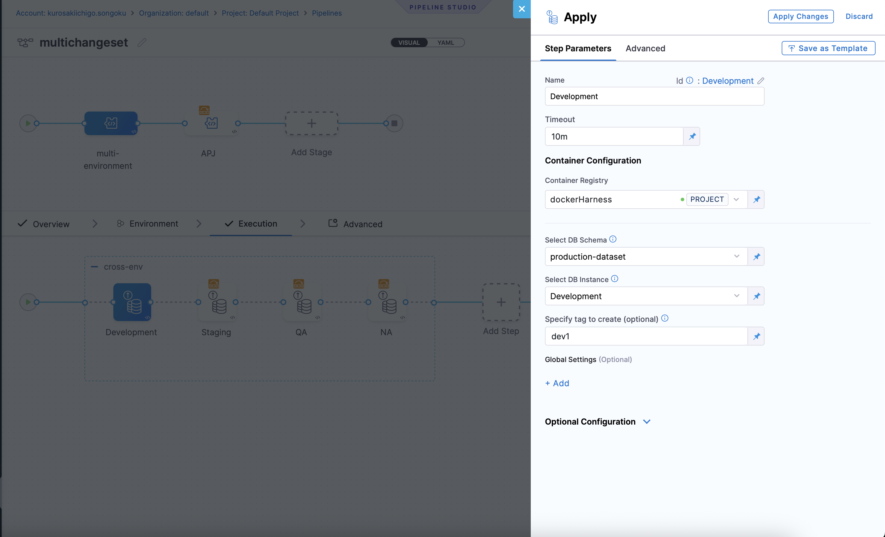
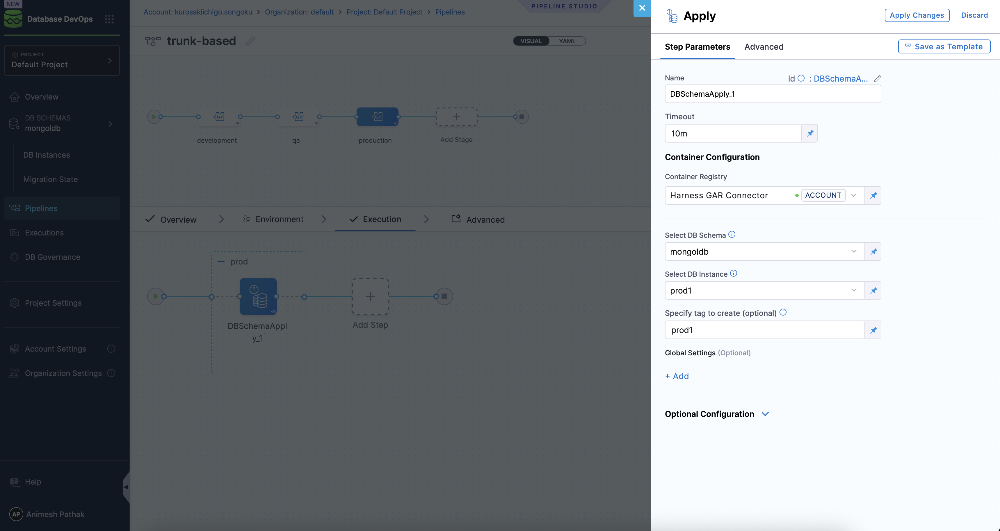

import Tabs from '@theme/Tabs';
import TabItem from '@theme/TabItem';

Harness Database DevOps supports **trunk-based development** for managing database schema changes. This strategy relies on a single Git branch (usually `main` or `trunk`) and leverages pipeline logic and contextual controls to manage environment-specific deployments. Trunk-based development simplifies Git workflows, reduces merge conflicts, and accelerates the flow of changes across your CI/CD pipeline.

Trunk-based development in Harness Database DevOps revolves around a single Git branch serving as the source of truth for all schema changes. Here's a quick overview:

1. Developers commit changes to `main`.
2. A Harness pipeline watches this branch for changes.
3. Based on context variables or pipeline logic, the system applies those changes to the appropriate environment.
4. Environments are defined in the pipeline, not in the Git structure.
5. Each environment can include approval gates, rollback logic, and verifications.
6. Visibility, audit logs, and drift detection are automatically managed via the Harness UI.

## Steps to Implement Trunk-Based Development in Harness

<Tabs>
<TabItem value="tab1" label="Context-based Filtering">
Harness supports Liquibase-style contexts to manage changes across environments from a single changelog file. In most cases, context-based filtering is applied at the **database instance level**—each instance (e.g., Dev, QA, Prod) is configured with a context label like `dev`, `qa`, or `prod`. When the pipeline executes a `DBSchemaApply` step, Harness applies only the changesets matching the context tied to that specific DB instance.

This allows you to reuse the same changelog file, while ensuring each environment receives only the changes intended for it. Combined with a multi-stage pipeline structure, this forms a **hybrid deployment strategy**: context-based filtering with explicit promotion control.

### 1. **Set Up Your Git Repository**  
1. Commit your Liquibase changelogs or SQL scripts to a centralized Git repo.
2. Use clear naming conventions like `changelogs/<YYYY-MM-DD>_<feature>.sql`.  

### 2. **Create a Database Schema in Harness**
1. Navigate to **Database Management > Schemas**
2. Click **New Schema**, connect to your Git repo, and configure your database instance(s).
3. Ensure your changelogs are structured to include environment-specific contexts (e.g., `context: dev, qa, prod`).

### 3. Connect with Database Instance 

Before we can deploy our Database Schema, we need to connect a database instance to which we can deploy it. Here’s how:

1. Under "DB Instances", click  “Add New DB Instance".
2. Click New JDBC Connector and Enter Name, JDBC URL & credentials, select the harness delegate, then Save and Finish.
   - **Name** - A name to identify the database instance.
   - **JDBC URL** - The JDBC connection string for your database instance. Learn More about [JDBC connection strings](https://developer.harness.io/docs/database-devops/use-database-devops/set-up-connectors/).
   - **Username** - The username to connect to the database.
   - **Password** - The password for the database user.
   - **Delegate** - The Harness Delegate that will run the database operations.
3. Add the Contexts (e.g., `dev`, `qa`, `prod`) to the database instance.
4. Click `Add Database Instance`.
   
### 4. **Create Your Pipeline**
1. Go to **Pipelines** and select **New Pipeline**
2. Add a `DBSchemaApply` step for each environment (e.g. `Dev`, `QA`, `Prod`)
3. In each step
   - Select the appropriate database instance.
   - Ensure the instance is configured with the right `context` label (e.g., dev, qa, prod). Harness will automatically apply only those changesets tagged with this context.


### 5. **Configure Triggers**
   - Go to your pipeline settings
   - Add a **Git trigger** that listens to the `main` branch
   - Select “On Push” or “On Pull Request” depending on your workflow
   > 📘 [How to configure Git triggers in Harness →](https://developer.harness.io/docs/platform/triggers/tutorial-cd-trigger/)

### 6. **Set Up Approvals & Rollbacks**
   - Insert **Approval steps** after lower environments (e.g. promote to QA only after Dev is verified)
   - Add **rollback steps** using `DBRollback` or manual SQL if needed

</TabItem>
<TabItem value="tab2" label="Trunk-Based Pipeline">
Harness enables a declarative, pipeline-driven implementation of trunk-based development using **Liquibase contexts** and **multi-stage pipelines**. This strategy avoids environment-specific changelog files and instead applies a shared changelog selectively, based on the context configured in each pipeline stage.

### How It Works

1. All changes are committed to `main`
2. Environment-specific changesets live in dedicated folders
3. Harness triggers the pipeline when files change under `dev/`, `qa/`, or `prod/`.
   - The pipeline stages are defined to apply changes based on the folder structure.
   - Each stage corresponds to an environment (e.g., `dev`, `qa`, `prod`).
   - The pipeline uses `DBSchemaApply` steps to apply changes from the respective folder.
4. Each pipeline stage targets a specific folder path

This approach avoids environment drift, improves auditability, and accelerates promotion cycles.

### File Structure

For teams migrating from legacy systems or preferring physical separation, Harness supports `changedFiles` triggers to detect and apply changes from specific folders.

```tree
main/
  release/
    dev/
      2025-08-03-feature-x.yaml
    qa/
      2025-08-10-feature-x.yaml
    prod/
      2025-08-15-feature-x.yaml
```
### Example Changelog

In the pipeline, you only need to specify the context value per environment, and Harness will filter the changesets accordingly.

```yaml
# 2025-08-03-feature-x.yaml
databaseChangeLog:
  - changeSet:
      id: add-users-table
      author: animesh
      context: dev,qa
      changes:
        - createTable:
            tableName: users
            columns:
              - column:
                  name: id
                  type: uuid
              - column:
                  name: name
                  type: varchar(255)
```



### Why This Works as a Trunk-Based Pattern

| Feature                    | Context-Based               | Folder-Based                            |
| -------------------------- | --------------------------- | --------------------------------------- |
| Single Git Branch (`main`) | ✅   Yes                     | ✅  Yes                                  |
| Environment Filtering      | ✅ Via `context`             | ✅ Via folder path                       |
| Sequential Promotion       | ✅ Native to pipeline stages | ✅ Controlled via triggers and approvals |
| GitOps Friendly            | ✅ Strong integration        | ✅ Compatible                            |
| Prevents Drift             | ✅ Enforced by context       | ⚠️ Requires process discipline          |

</TabItem>
</Tabs>

✅ Now, every time you commit to `main`, Harness will:
> - Detect the change
> - Trigger your pipeline
> - Apply the change to the correct environment
> - Log every action for audit, verification, and rollback


## Conclusion

Trunk-based development in Harness Database DevOps empowers teams to manage schema changes with agility, consistency, and confidence. By centralizing changes in a single branch and orchestrating environment-specific deployments through pipelines and contexts, this approach simplifies delivery workflows while improving traceability and compliance.

Harness provides out-of-the-box support for Liquibase contexts, multi-environment pipeline steps, approval strategies, and Git-based automation—making it easy to scale database delivery alongside application deployments. Whether you're just getting started or modernizing legacy workflows, trunk-based development offers a streamlined, GitOps-friendly path to continuous database evolution.


## FAQs

### 1. Can I use trunk-based development if my team currently uses environment-specific branches?

Yes. While trunk-based development centralizes changes in a single branch (`main`), Harness supports both trunk-based and environment-by-branch workflows. You can start transitioning incrementally by adopting context-based changelogs and defining pipelines that selectively apply changes by environment.

### 2. What if I have multiple environments, how do I control where changes get applied?

Harness lets you define one pipeline with multiple stages, each targeting a specific environment. You can:

* Use separate `DBSchemaApply` steps for `dev`, `qa`, `prod`, etc.
* Pass context labels or use pipeline conditions to control execution.
* Gate each environment with manual approvals or automated verification steps.

### 3. Do I need to write separate changelogs for each environment?

No. You can use a single changelog file and annotate changesets with Liquibase-style contexts (e.g., `context: dev`, `context: prod`). Harness reads these contexts during deployment and applies only the relevant changes for the target environment.

### 4. How do I handle rollback in trunk-based development?

Harness supports rollbacks through the `DBRollback` step. You can:

* Commit rollback scripts to your Git repo alongside the main changelogs.
* Trigger rollback pipelines manually or as part of a failure strategy.
* Use Harness approvals to control rollback execution in higher environments.

Harness supports associating rollback SQL with each changeset by tagging them or linking dedicated rollback files, depending on your changelog strategy. [Learn how to configure rollbacks →](https://developer.harness.io/docs/database-devops/use-database-devops/rollback-for-database-schemas)
