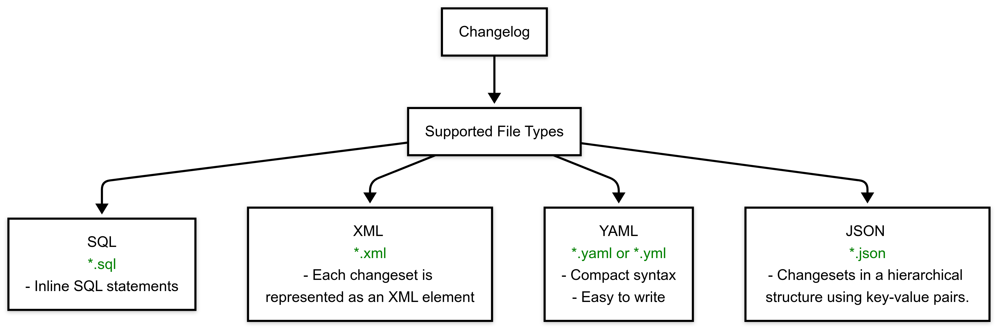

import BetaIcon from '/img/icon_beta.svg';

<BetaIcon />

# Database DevOps Key Concepts

This topic covers basic terminology and concepts related to Database DevOps. For general Harness Platform terminology and concepts, go to [Harness key concepts](/docs/platform/get-started/key-concepts.md). For information about using DB DevOps, go to [Harness Database DevOps onboarding guide](onboarding-guide.md).

## Database

A database is an organized collection of structured information, or data, that is stored and managed electronically, typically in a computer system. Databases are designed to support the storage, retrieval, modification, and deletion of data in a way that ensures data integrity, security, and performance.

### Database Schemas

A database schema is the structure of a database, e.g. what tables and columns and indexes exist. In the context of Harness DB DevOps, there is an entity called a 'schema’ that is a collection of DDL or DML changes that can be applied to a database. Today this collection is in the form of a liquibase changelog checked into git or artifactory.

### Database Instances 

A database instance associates a database schema to a database connection. It represents the intersection of the database's structural definition (the schema) with the actual data environment where the schema is implemented.

```bash
Database Instance
├── Database 1
│   ├── Schema A
│   │   ├── Table 1
│   │   └── Table 2
│   └── Schema B
│       ├── Table 3
│       └── View 1
└── Database 2
    ├── Schema C
    │   └── Table 4
    └── Schema D
        ├── Table 5
        └── Stored Procedure 1

```
**In this hierarchy**:
- One database instance can host multiple databases
- One database can contain multiple schemas
- Each schema can contain multiple database objects

### Database Connection

A database connection refers to the specific parameters and credentials used to establish a secure link between the Harness platform and an individual database server. This connection is done through a JDBC (Java Database Connectivity) URL, which specifies the location of the database server, and is authenticated using a username and password. The connection is made via a Harness Delegate, which allows secure access to the database, even when the database instance is not internet-accessible. This setup enables Harness to execute SQL scripts, orchestrate database changes, and manage schema versions as part of the CI/CD pipeline, all while adhering to security best practices. 

### Data Definition Language (DDL)

As mentioned earlier under the definition of Database Schema, DDL refers to the SQL commands used to define or modify the structure of the database schema itself. This includes operations that create, alter, or drop database objects such as tables, indexes, views, and constraints. Some examples include the following: 

```
CREATE TABLE Employees (ID INT, Name VARCHAR(100), Department VARCHAR(50));
```

```
ALTER TABLE Employees ADD COLUMN Salary DECIMAL(10, 2);
```

```
TRUNCATE TABLE Employees;
```

### Data Manipulation Language (DML)

DML refers to SQL commands used for managing data within the database objects defined by DDL, such as tables. DML operations allow users to insert, update, delete, and retrieve data stored in the database. Some examples include the following:

```
INSERT INTO Employees (ID, Name, Department) VALUES (1, 'Jane Doe', 'HR');
```

```
UPDATE Employees SET Salary = 60000 WHERE ID = 1;
```

```
DELETE FROM Employees WHERE ID = 1;
```

### SQL (Structured Query Lanaguage)

SQL (Structured Query Language) databases are relational databases that use a structured query language to define and manipulate data. They are designed to store data in tables with fixed schemas, where each table consists of rows and columns. The relationships between tables are defined through foreign keys. Liquibase can define changes via SQL scripts, or via yaml changesets that are compiled at runtime into SQL.

### NO-SQL (Not Only SQL)

NoSQL (Not Only SQL) databases, on the other hand, are non-relational databases designed to store and retrieve data in ways that are different from traditional relational databases. They can store unstructured, semi-structured, or structured data without requiring a predefined schema. An example of this is MongoDB.

### Rollback 

A rollback in the context of deployment refers to the process of reverting an application or system to a previous stable state after a new deployment has failed or introduced critical issues. This action is taken to minimize downtime and restore the application to its last known good configuration.

### Liquibase

An open source database change control CLI tool that is leveraged used by Harness DB DevOps.

## Understanding Changelog and Changesets

### Changelog
A collection of database changes that can be applied to a database. It includes an individual unit of change known as a changeset.

### Changeset
Changesets are the fundamental units of database change tracking. Each changeset represents an atomic change to your database schema or data. Here are the key concepts:

### Change
An individual change as part of a changeset.

1. **Unique Identification**: Each changeset requires two identifiers:
   - `id`: A unique identifier for the change
   - `author`: The person responsible for the change

2. **Change Tracking**: Once a changeset is executed, it's tracked in a special table (typically called DATABASECHANGELOG) to ensure it's never run twice.

3. **File Name**: The name of the changeset file that defines the change.

### Changelog
A collection of database changes that can be applied to a database. It includes an individual unit of change known as a changeset.

### File Format

The format of your changeset depends on the file type of your changelog, which can be SQL, XML, YAML, or JSON



##### SQL Example 
``` SQL Example
--liquibase formatted sql
--changeset John Snow:1
CREATE TABLE products (
      id INT PRIMARY KEY,
      name VARCHAR(255)
);
```

##### XML Example
``` XML Example
<changeSet  id="1"  author="John Snow">
    <createTable  tableName="company">
        <column  name="address"  type="varchar(255)"/>
    </createTable>
</changeSet>
```

##### YAML Example
``` YAML Example
databaseChangeLog:
  -  changeSet:  
      id:  1
      author: John Snow
      changes:
        -  createTable:
            tableName: company
            columns:
              -  column:
                  name: address
```

##### JSON Example
``` JSON Example
{
  "changeSet": {
    "id": "1",
    "author": "John Snow",
    "changes": [
      {
        "createTable": {
          "tableName": "company",
          "columns": [
            {
              "column": {
                "name": "address"
              }
            }
          ]
        }
      }
    ]
  }
}
```
