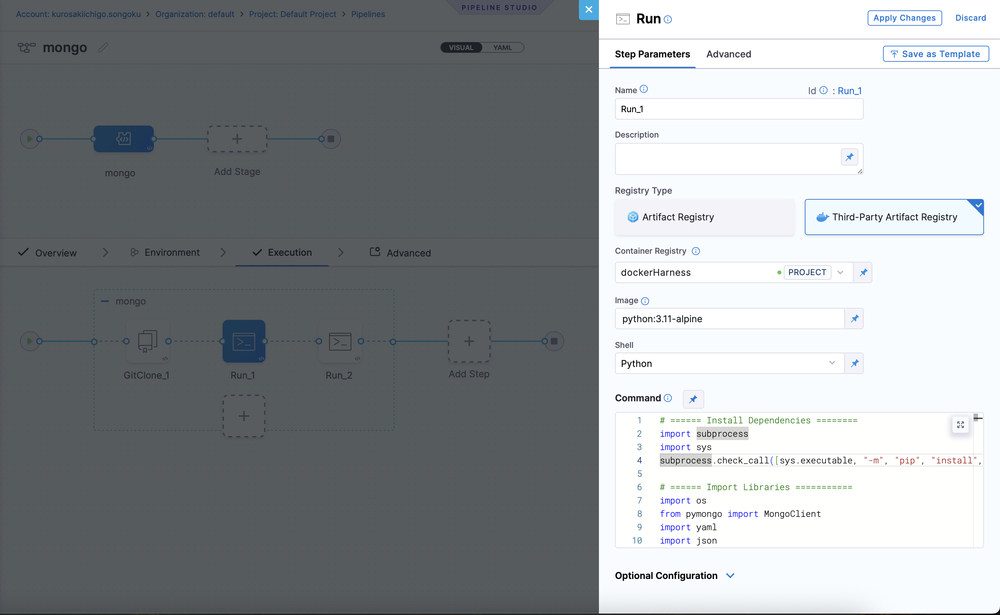
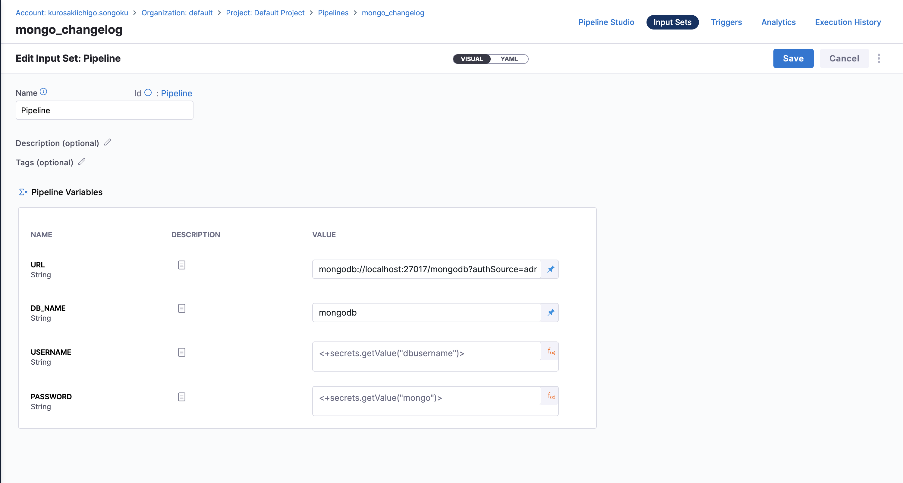
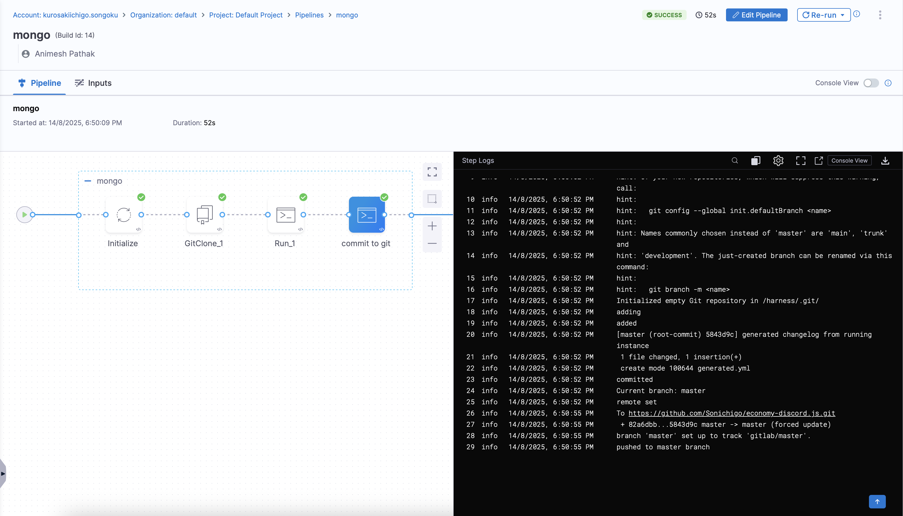

import CommitToGit from "./../snippets/commit-to-git.md";
import Tabs from '@theme/Tabs';
import TabItem from '@theme/TabItem';

Harness Database DevOps enables teams to integrate database schema changes into Git-driven workflows.
When onboarding an existing **MongoDB** database, you can use the `MongoDB.py` Python script to extract the current schema and generate a **Liquibase-compatible changelog**.
This changelog can then be versioned in Git and used in subsequent deployments, ensuring auditability and consistency across environments.

By automating this process in a Harness pipeline, you can:
- Avoid manual changelog creation for legacy or existing databases
- Standardize schema tracking using Liquibase-compatible formats (JSON or YAML)
- Keep your database changes version-controlled with peer review

:::info
For the SQL version of changelog generation, refer to our [Get Started with Changelogs](https://developer.harness.io/docs/database-devops/get-started/get-started-with-changelogs) guide which includes examples for SQL changelogs.
:::

## Prerequisites

If you're unfamiliar with generating or structuring a changelog file, you may want to explore our general [build a changelog](https://developer.harness.io/docs/database-devops/use-database-devops/get-started/build-a-changelog) guide first, it covers generating SQL changelog, schema migration fundamentals, best practices, and format patterns. Before implementing the pipeline, ensure the following:

- Pipeline execution environment can connect to your MongoDB instance  
- The Git connector used in the pipeline has **commit** permissions  
- MongoDB credentials have **read-only** access for schema extraction

## Pipeline Implementation

### Create a New Pipeline

1. Go to your Harness pipeline.
2. Click on "**Create a Pipeline**"
3. In the Stage, select "Custom" and then create a "Step Group".
4. Add the **GitClone** step.
5. Then add a new step, **Run**

- **Container Registry**: used to pull images from private or public registries.
- **Image**: "`python:latest`"
- **Shell**: "`Python`"
- **Command**: Add the following script under the command palette:

```bash
# ====== Install Dependencies ========
import subprocess
import sys

subprocess.check_call([sys.executable, "-m", "pip", "install", "pymongo", "pyyaml"])

# ====== Import Libraries ===========
import os
import yaml
from bson import json_util
from pymongo import MongoClient
from pymongo.errors import OperationFailure

# === CONFIG ===
MONGO_URI = "<+pipeline.variables.URL>"
DATABASE_NAME = "<+pipeline.variables.DB_NAME>"
MONGO_USER = "<+pipeline.variables.USERNAME>"
MONGO_PASSWORD = "<+pipeline.variables.PASSWORD>"
OUTPUT_FILE = "/harness/dbops/chart/dbchangelog/<+pipeline.variables.DB_NAME>/baseline/generated.yml"
AUTHOR = "Harness"
CHANGESET_ID = "baseline-collections"

SKIP_COLLECTIONS = {"DATABASECHANGELOGLOCK", "DATABASECHANGELOG"}
SKIP_PREFIXES = ("system.",)
INDEX_OPTION_EXCLUDE_FIELDS = {"key", "v", "ns"}

def to_json_string(value):
    if value is None:
        value = {}
    return json_util.dumps(value)

def build_index_options(index_name, index_data):
    options = {"name": index_name}

    for field, value in index_data.items():
        if field in INDEX_OPTION_EXCLUDE_FIELDS or field == "name":
            continue
        options[field] = value

    return options

# === SETUP ===
client = MongoClient(
    MONGO_URI,
    username=MONGO_USER or None,
    password=MONGO_PASSWORD or None,
)

try:
    db = client[DATABASE_NAME]

    # === BUILD YAML STRUCTURE ===
    changesets = []

    for obj in db.list_collections():
        name = obj["name"]
        obj_type = obj.get("type", "collection")

        if name in SKIP_COLLECTIONS:
            print(f"skipping Liquibase collection: {name}")
            continue

        if name.startswith(SKIP_PREFIXES):
            print(f"skipping internal MongoDB collection: {name}")
            continue

        if obj_type != "collection":
            print(f"skipping non-collection object: {name} ({obj_type})")
            continue

        try:
            changes = []

            # Reuse collection options from list_collections output
            collection_options = obj.get("options", {})
            changes.append(
                {
                    "createCollection": {
                        "collectionName": name,
                        "options": to_json_string(collection_options or {}),
                    }
                }
            )

            indexes = db[name].index_information()
            print(f"processing indexes for collection: {name}\n{to_json_string(indexes)}")

            for index_name, index_data in indexes.items():
                if index_name == "_id_":
                    continue

                index_fields = index_data["key"]
                index_for_changelog = {}

                for field_name, direction in index_fields:
                    index_for_changelog[field_name] = direction

                index_options = build_index_options(index_name, index_data)

                change = {
                    "createIndex": {
                        "collectionName": name,
                        "keys": to_json_string(index_for_changelog),
                        "options": to_json_string(index_options),
                    }
                }

                if index_options.get("unique") is True:
                    change["createIndex"]["unique"] = True

                changes.append(change)

            changesets.append(
                {
                    "changeSet": {
                        "id": f"{CHANGESET_ID}-{name}",
                        "author": AUTHOR,
                        "changes": changes,
                    }
                }
            )

        except OperationFailure as exc:
            print(f"skipping collection {name} due to authorization/metadata error: {exc}")
            continue

    # Final YAML structure
    changeset = {
        "databaseChangeLog": changesets
    }

    # === WRITE TO FILE ===
    output_dir = os.path.dirname(OUTPUT_FILE)
    if output_dir:
        os.makedirs(output_dir, exist_ok=True)

    yaml_output = yaml.safe_dump(changeset, sort_keys=False)

    with open(OUTPUT_FILE, "w") as f:
        f.write(yaml_output)

    print(f"YAML baseline changelog with indexes written to: {OUTPUT_FILE}")
    print("\nGenerated YAML:\n")
    print(yaml_output)

finally:
    client.close()
```

In the above script:
- Set the pipeline variables `URL`, `DB_NAME`, `USERNAME`, and `PASSWORD` to your MongoDB connection values.
- Set `OUTPUT_FILE` to the changelog path you want generated in your repo.
- Change `AUTHOR` and `CHANGESET_ID` to match your changelog naming convention.



<CommitToGit />

#### Final Result:
<Tabs>
<TabItem value="Visual Overview" alt="Visual Overview">


</TabItem>
<TabItem value="YAML Overview" alt="YAML Overview">

```yml
pipeline:
  name: mongo_changelog
  identifier: mongo
  projectIdentifier: default_project
  orgIdentifier: default
  tags: {}
  stages:
    - stage:
        name: mongo
        identifier: mongo
        description: "Generate MongoDB Changelog and commit to Git Repo"
        type: Custom
        spec:
          execution:
            steps:
              - stepGroup:
                  name: mongo
                  identifier: mongo
                  steps:
                    - step:
                        type: GitClone
                        name: Clone Repository
                        identifier: GitClone_1
                        spec:
                          connectorRef: multienv
                          repoName: dbops
                          build:
                            type: branch
                            spec:
                              branch: main
                    - step:
                        type: Run
                        name: Generate Changelog
                        identifier: Run_1
                        spec:
                          connectorRef: dockerHarness
                          image: python:latest
                          shell: Python
                          command: |-
                            # ====== Install Dependencies ========
                            import subprocess
                            import sys

                            subprocess.check_call([sys.executable, "-m", "pip", "install", "pymongo", "pyyaml"])

                            # ====== Import Libraries ===========
                            import os
                            import yaml
                            from bson import json_util
                            from pymongo import MongoClient
                            from pymongo.errors import OperationFailure

                            # === CONFIG ===
                            MONGO_URI = "<+pipeline.variables.URL>"
                            DATABASE_NAME = "<+pipeline.variables.DB_NAME>"
                            MONGO_USER = "<+pipeline.variables.USERNAME>"
                            MONGO_PASSWORD = "<+pipeline.variables.PASSWORD>"
                            OUTPUT_FILE = "/harness/dbops/chart/dbchangelog/<+pipeline.variables.DB_NAME>/baseline/baseline-changelog.yml"
                            AUTHOR = "Harness"
                            CHANGESET_ID = "baseline-collections"

                            SKIP_COLLECTIONS = {"DATABASECHANGELOGLOCK", "DATABASECHANGELOG"}
                            SKIP_PREFIXES = ("system.",)
                            INDEX_OPTION_EXCLUDE_FIELDS = {"key", "v", "ns"}

                            def to_json_string(value):
                                if value is None:
                                    value = {}
                                return json_util.dumps(value)

                            def build_index_options(index_name, index_data):
                                options = {"name": index_name}

                                for field, value in index_data.items():
                                    if field in INDEX_OPTION_EXCLUDE_FIELDS or field == "name":
                                        continue
                                    options[field] = value

                                return options

                            # === SETUP ===
                            client = MongoClient(
                                MONGO_URI,
                                username=MONGO_USER or None,
                                password=MONGO_PASSWORD or None,
                            )

                            try:
                                db = client[DATABASE_NAME]

                                # === BUILD YAML STRUCTURE ===
                                changesets = []

                                for obj in db.list_collections():
                                    name = obj["name"]
                                    obj_type = obj.get("type", "collection")

                                    if name in SKIP_COLLECTIONS:
                                        print(f"skipping Liquibase collection: {name}")
                                        continue

                                    if name.startswith(SKIP_PREFIXES):
                                        print(f"skipping internal MongoDB collection: {name}")
                                        continue

                                    if obj_type != "collection":
                                        print(f"skipping non-collection object: {name} ({obj_type})")
                                        continue

                                    try:
                                        changes = []

                                        # Reuse collection options from list_collections output
                                        collection_options = obj.get("options", {})
                                        changes.append(
                                            {
                                                "createCollection": {
                                                    "collectionName": name,
                                                    "options": to_json_string(collection_options or {}),
                                                }
                                            }
                                        )

                                        indexes = db[name].index_information()
                                        print(f"processing indexes for collection: {name}\n{to_json_string(indexes)}")

                                        for index_name, index_data in indexes.items():
                                            if index_name == "_id_":
                                                continue

                                            index_fields = index_data["key"]
                                            index_for_changelog = {}

                                            for field_name, direction in index_fields:
                                                index_for_changelog[field_name] = direction

                                            index_options = build_index_options(index_name, index_data)

                                            change = {
                                                "createIndex": {
                                                    "collectionName": name,
                                                    "keys": to_json_string(index_for_changelog),
                                                    "options": to_json_string(index_options),
                                                }
                                            }

                                            if index_options.get("unique") is True:
                                                change["createIndex"]["unique"] = True

                                            changes.append(change)

                                        changesets.append(
                                            {
                                                "changeSet": {
                                                    "id": f"{CHANGESET_ID}-{name}",
                                                    "author": AUTHOR,
                                                    "changes": changes,
                                                }
                                            }
                                        )

                                    except OperationFailure as exc:
                                        print(f"skipping collection {name} due to authorization/metadata error: {exc}")
                                        continue

                                # Final YAML structure
                                changeset = {
                                    "databaseChangeLog": changesets
                                }

                                # === WRITE TO FILE ===
                                output_dir = os.path.dirname(OUTPUT_FILE)
                                if output_dir:
                                    os.makedirs(output_dir, exist_ok=True)

                                yaml_output = yaml.safe_dump(changeset, sort_keys=False)

                                with open(OUTPUT_FILE, "w") as f:
                                    f.write(yaml_output)

                                print(f"YAML baseline changelog with indexes written to: {OUTPUT_FILE}")
                                print("\nGenerated YAML:\n")
                                print(yaml_output)

                            finally:
                                client.close()
                    - step:
                        type: Run
                        name: Commit to Git Repo
                        identifier: Run_2
                        spec:
                          connectorRef: dockerHarness
                          image: alpine/git
                          shell: Sh
                          command: |-
                            ls -la
                            git init

                            # Configure Git user
                            git config --global user.email "John.Doe@xyz.com"
                            git config --global user.name "John Doe"
                            git config --global user.password "<+secrets.getValue("github")>"

                            echo "adding"
                            git add .
                            echo "added"
                            git commit -m "generated changelog from running instance"
                            echo "committed"

                            # Get current branch name
                            CURRENT_BRANCH=$(git rev-parse --abbrev-ref HEAD)
                            echo "Current branch: $CURRENT_BRANCH"

                            # Add remote repository
                            git remote add gitlab https://animesh.pathak%40harness.io:<+secrets.getValue("github")>@github.com/Sonichigo/economy-discord.js.git
                            echo "remote set"

                            # Push to remote using the current branch name
                            git push -u gitlab $CURRENT_BRANCH -f
                            echo "pushed to $CURRENT_BRANCH branch"
                  stepGroupInfra:
                    type: KubernetesDirect
                    spec:
                      connectorRef: db
            rollbackSteps: []
          serviceDependencies: []
        tags: {}
        delegateSelectors:
          - animesh-delegate
  variables:
    - name: URL
      type: String
      description: MongoDB URL
      required: true
      value: <+input>
    - name: DB_NAME
      type: String
      description: Mongo Database Name
      required: true
      value: <+input>
    - name: USERNAME
      type: String
      description: Mongo Database Username
      required: true
      value: <+input>
    - name: PASSWORD
      type: Secret
      description: Mongo Database Password
      required: true
      value: <+input>
```
</TabItem>
</Tabs>
This step will ensure that the generated changelog file is committed to your Git repository, allowing you to track changes and maintain version control over your database schema changes.

## Best Practices
- Store changelogs in a dedicated folder (e.g., `/db/changelog/`)
- Validate changelog generation in a staging pipeline before committing to production branches
- Parameterize connection details using Harness pipeline variables
- Always use a read-only MongoDB user for schema extraction
By integrating this process into Harness pipelines, you ensure repeatable, auditable, and version-controlled database schema onboarding.

## FAQs

### 1. Can I change the changelog filename?
Yes. Update the OUTPUT_FILE variable in the script to set a custom filename.

### 2. Does it support JSON output instead of YAML?
Currently, the script outputs YAML. You can modify the yaml.dump section to use json.dump if JSON output is preferred.

### 3. How are indexes handled?
All non-_id indexes are included in the changelog with createIndex changes. The script preserves uniqueness flags.

### 4. How do I avoid including Liquibase internal collections?
The script automatically excludes DATABASECHANGELOG and DATABASECHANGELOGLOCK collections.
