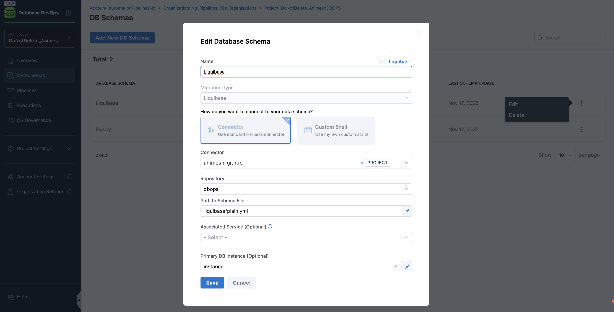

import Tabs from '@theme/Tabs';
import TabItem from '@theme/TabItem';
import BetaIcon from '/img/icon_beta.svg';

<BetaIcon />

This onboarding guide accelerates your adoption journey by walking you through the essential setup steps from defining your database schemas to deploying versioned changes consistently across environments. Whether you use Liquibase or Flyway configurations, Harness orchestrates the full migration lifecycle within your Kubernetes infrastructure, ensuring predictable, auditable, and scalable database operations.

## Prerequisites

Before beginning the walkthroughs in this guide, ensure you have:
| Item | Details / Link |
| --- | --- |
| Harness account | Database DevOps License (go to “[Subscription Overview and Management](/docs/platform/subscriptions-licenses/subscriptions/#modules-with-no-direct-developer-tracking-consumption-entitlements)”) |
| Kubernetes cluster | Kubernetes Cluster ≥ v1.18, Harness Delegate installed ([Delegate setup guide](https://developer.harness.io/docs/platform/delegates/install-delegates/overview/)) |
| Database credentials | JDBC‑compatible database; user with DDL/DML privileges. (see “[JDBC connection strings](https://developer.harness.io/docs/database-devops/use-database-devops/set-up-connectors/)”) |
 
<DocVideo src="https://app.tango.us/app/embed/ba735b58-3767-43c3-940f-661cd09b01c9?skipCover=false&defaultListView=false&skipBranding=true&makeViewOnly=true&hideAuthorAndDetails=true" title="Create and Run DB Pipeline in Harness"/>

## Setting up Database DevOps with Liquibase and Flyway
Harness supports both Liquibase Compatible and Flyway Compatible configurations, but the setup varies based on your preferred workflow. Before configuring your DB Schema, ensure your repository follows the correct structure and that your migration files adhere to the chosen framework’s conventions.

:::info note
If you already use liquibase or flyway, you can skip to the section [Configuring Your DB Schema](#2-configure-your-database-schema).
:::

### 1. Prepare Your Migration Framework (Flyway or Liquibase)
<Tabs>
<TabItem value="Liquibase Compatible" label="Liquibase Compatible">
If you're new to Liquibase, there are two main ways to create your initial changelog:

- Use existing SQL files: Recommended if you already manage your schema through SQL scripts.
- Generate a changelog: Auto-generate a changelog by diffing an existing database.
For more details on both options, refer to [How to Build a Changelog guide](https://developer.harness.io/docs/database-devops/use-database-devops/get-started/build-a-changelog/).

1. Create Git Repo to store your DB schema files.
2. Under repo, create folder sql/ and add ordered `*.sql` files
3. Add changelog.yml at root with:

```yml
databaseChangeLog:
  - includeAll:
      path: sql
```
Use semantic versioning in file names (e.g., "`V1__init.sql`", "`V2__add_table.sql`") for clarity and consistency.
:::info tip
Use semantic file names ("`V1__init.sql`", "`V2__add_table.sql`").
:::

</TabItem>
<TabItem value="Flyway Compatible" label="Flyway Compatible">
If you're new to Flyway, start by creating migration files that follow Flyway's naming conventions and folder structure. Learn more about [Flyway Migration Files](https://developer.harness.io/docs/database-devops/concepts/flyway-migrations-file-structure).

1. Create a Git repository containing your schema directory.
2. All migrations are stored under a folder such as "sql/migrations".
3. Files follow Flyway’s naming rules:
    - Versioned: V1__init.sql, V2_add_table.sql
    - Undo (optional): U2_remove_table.sql
This structure enables Flyway and Harness to consistently detect, version, and apply schema changes.

</TabItem>
</Tabs>

### 2. Configure your Database Schema

The database schema defines a set of SQL changes that can be deployed to one or more database instances. Here is how we will configure it:

1. On the module picker, choose `DB DevOps` in your harness account.

2. In the left hand nav, choose `DB Schemas` and Click `Add New DB Schema`.

   - **Name** - A Schema Name to identify the database configuration.
   - **Migration Type** -  Liquibase Compatible or Flyway Compatible.
   - **Connector** - Code Repositories hosted on either GitHub, Azure, GitLab, BitBucket or etc.
   - **Path to Schema File** - The path within the repository where your Liquibase changelog file is located.
   - **Primary DB Instance** - The primary database instance where the Liquibase changelog will be initially applied. (In case of using [LLM Authoring Change](https://developer.harness.io/docs/database-devops/use-database-devops/configure-llm-for-database-devops/), this field is mandatory to set up the schema correctly.)

:::info
To learn more about Git connectors settings, reference this [Harness Git connector settings](../../platform/connectors/code-repositories/ref-source-repo-provider/git-connector-settings-reference.md) documentation for more.
:::

### 3.Connect with Database Instance 

Before we can deploy our Database Schema, we need to connect a database instance to which we can deploy it. Here’s how:

1. Under "DB Instances", click  “Add New DB Instance".
2. Select main (or your environment branch).
3. Click New JDBC Connector and Enter Name, JDBC URL & credentials, select the harness [delegate](../../platform/delegates/delegate-concepts/delegate-overview.md), then Save and Finish.
   - **Name** - A name to identify the database instance.
   - **JDBC URL** - The JDBC connection string for your database instance. Learn More about [JDBC connection strings](https://developer.harness.io/docs/database-devops/use-database-devops/set-up-connectors/).
   - **Username** - The username to connect to the database.
   - **Password** - The password for the database user.
   - **Delegate** - The Harness Delegate that will run the database operations.
4. Click `Add Database Instance`.

### 4. Configure your Deployment Pipeline

A deployment pipeline deploys your database changes when it runs. In addition to deploying your database, it can also deploy application changes, and have other logic such as requiring a manual approval. Here are some steps on how to create a simple pipeline that deploys a schema change to a database instance anytime it changes in git:

1. Under Pipelines, Click Create a Pipeline.
2. Click on Add Stage and Choose Custom stage.
3. Choose Add step group and Turn on Enable Containerized Stage.
4. Choose the Kubernetes cluster you'd like to run on.
5. Click Add Step and Choose the Apply Schema step under DB DevOps.
6. For the step name, enter "Deploy Database Schema".
   
   - **Name**: Name of the step, by default the name is "DBSchemaApply_1". 
   - **Timeout**: The timeout limit is the maximum allowable time a stage or pipeline can run.
   - **Migration Type**: Liquibase Compatible or Flyway Compatible.
   - **Select DB Schema**: The DB Schema we created on Step 2.
   - **Select DB Instance**: The Instance we created on Step 3.
   - **Tag (Optional)**: You can add custom tags to each deployment. In case it is left empty, harness will add the tag during the deployment.
7. Click `Apply Changes` and Save the Pipeline.
8. Now, click on "Run" and wait for your pipeline to complete.

<Tabs>
<TabItem value="Visual Overview" label="Visual Overview" default>


</TabItem>
<TabItem value="YAML Overview" label="YAML Overview">

```yml
pipeline:
  name: dbops-liquibase-pipeline
  identifier: dbopsliquibasepipeline
  projectIdentifier: DoNotDelete_AnimeshDBOPS
  orgIdentifier: Ng_Pipelines_K8s_Organisations
  tags: {}
  stages:
    - stage:
        name: dbops
        identifier: dbops
        description: "Deploy schema to DB instance using Liquibase"
        type: Custom
        spec:
          execution:
            steps:
              - stepGroup:
                  name: cs
                  identifier: cs
                  steps:
                    - step:
                        type: DBSchemaApply
                        name: DBSchemaApply_1
                        identifier: DBSchemaApply_1
                        spec:
                          connectorRef: account.harnessImage
                          migrationType: Liquibase
                          dbSchema: Liquibase
                          dbInstance: instance
                          tag: "123"
                        timeout: 10m
                    - step:
                        type: DBSchemaRollback
                        name: DBSchemaRollback_1
                        identifier: DBSchemaRollback_1
                        spec:
                          connectorRef: account.harnessImage
                          migrationType: Liquibase
                          dbSchema: Liquibase
                          dbInstance: instance
                          tag: v1.0.0
                        timeout: 10m
                  stepGroupInfra:
                    type: KubernetesDirect
                    spec:
                      connectorRef: dbops
            rollbackSteps: []
          serviceDependencies: []
        tags: {}
```
</TabItem>
</Tabs>

## Conclusion

By completing the steps in this onboarding guide, you now have a fully operational Database DevOps workflow powered by Harness. Your schemas are version-controlled, your database instances are securely connected, and your pipelines are ready to execute repeatable, automated schema deployments using Liquibase or Flyway. This foundation sets the stage for enterprise-grade governance, faster release cycles, and improved developer productivity.

As you operationalize more environments, explore advanced capabilities such as rollback automation, LLM-powered change authoring, and integrated CI/CD workflows. For troubleshooting or deeper architectural guidance, visit the Database DevOps documentation or engage with our support team—we’re committed to helping you scale with confidence. If you need more support with database setup, pipeline troubleshooting, or common runtime errors, be sure to visit the [Database DevOps Troubleshooting Guide](https://developer.harness.io/docs/database-devops/troubleshooting/) or reach out to [Our Support Team](https://www.harness.io/demo/database-devops). 

We're here to help you get the most out of Harness Database DevOps!
