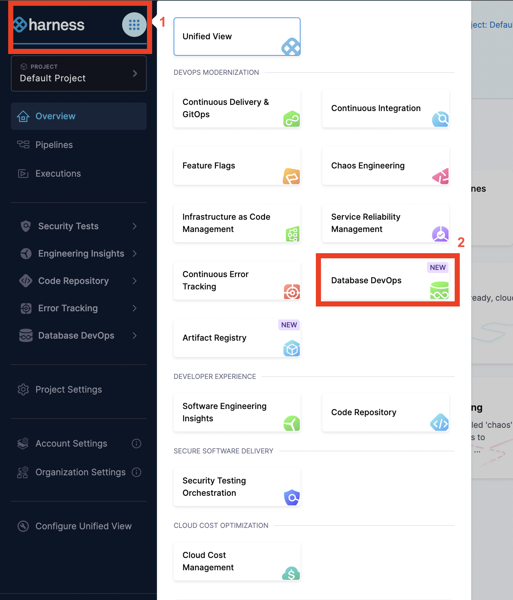
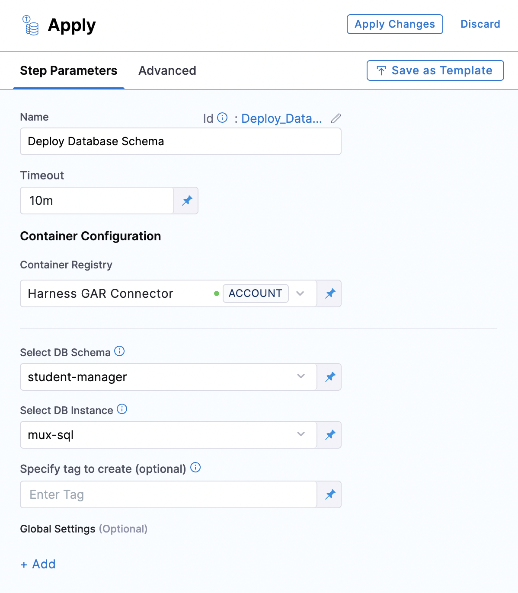

import BetaIcon from '/img/icon_beta.svg';

<BetaIcon />

This guide introduces you to the robust capabilities of Harness DB DevOps, providing a streamlined approach to managing and securing your database operations.  When you define a pipeline in Harness DB DevOps, we dynamically orchestrate a series of jobs within your Kubernetes cluster. These jobs are responsible for cloning your Liquibase changelogs from Git, applying schema changes using Liquibase, and managing logs and cleanup post-execution. 

## Prerequisites

Before beginning the walkthroughs in this guide, ensure you have:
| Item | Details / Link |
| --- | --- |
| Harness account | Database DevOps Feature flag enabled (see “[Enabling Feature Flags](https://developer.harness.io/docs/database-devops/dbdevops-supported-platforms/)”) |
| Kubernetes cluster | Kubernetes Cluster ≥ v1.18, Harness Delegate installed ([Delegate setup guide](https://developer.harness.io/docs/platform/delegates/install-delegates/overview/)) |
| Database credentials | JDBC‑compatible database; user with DDL/DML privileges |
 
## Setting Database DevOps

### 1. Create a Liquibase changelog

:::info Important Note
If you're new to Liquibase, there are two main ways to create your initial changelog:

1. Use existing SQL files – Recommended if you already manage your schema through SQL scripts.
2. Generate a changelog – Auto-generate a changelog by diffing an existing database.
For more details on both options, refer to [How to Build a Changelog guide](https://developer.harness.io/docs/database-devops/use-database-devops/get-started/build-a-changelog/).

If you already use liquibase, you can skip to the section [Configuring Your DB Schema](#2-configure-your-database-schema).
:::

1. Create Git Repo to store your DB schema files.
2. Under repo, create folder sql/ and add ordered `*.sql` files
3. Add changelog.yml at root with:

```yml
databaseChangeLog:
  - includeAll:
      path: sql
```
Use semantic versioning in file names (e.g., "V1__init.sql", "V2__add_table.sql") for clarity and consistency.
:::info tip
Use semantic file names ("V1__init.sql", "V2__add_table.sql").
:::

### 2. Configure your Database Schema

The database schema defines a set of SQL changes that can be deployed to one or more database instances. Here is how we will configure it:

1. On the module picker, choose `DB DevOps` in your harness account.

2. In the left hand nav, choose `DB Schemas` and Click `Add New DB Schema`.

   - **Name** - A Schema Name to identify the database configuration.
   - **Connector** - Code Repositories hosted on either GitHub, Azure, GitLab, BitBucket or etc.

:::info
To learn more about Git connectors settings, reference this [Harness Git connector settings](../../platform/connectors/code-repositories/ref-source-repo-provider/git-connector-settings-reference.md) documentation for more.
:::

### 3.Connect with Database Instance 

Before we can deploy our Database Schema, we need to connect a database instance to which we can deploy it. Here’s how:

1. Under "DB Instances", click  “Add New DB Instance".
2. Select main (or your environment branch).
3. Click New JDBC Connector and Enter Name, JDBC URL & credentials, select the harness [delegate](../../platform/delegates/delegate-concepts/delegate-overview.md), then Save and Finish.
   - **Name** - A name to identify the database instance.
   - **JDBC URL** - The JDBC connection string for your database instance. Learn More about [JDBC connection strings](https://developer.harness.io/docs/database-devops/use-database-devops/set-up-connectors/).
   - **Username** - The username to connect to the database.
   - **Password** - The password for the database user.
   - **Delegate** - The Harness Delegate that will run the database operations.
4. Click `Add Database Instance`.

### 4. Configure your Deployment Pipeline

A deployment pipeline deploys your database changes when it runs. In addition to deploying your database, it can also deploy application changes, and have other logic such as requiring a manual approval. Here are some steps on how to create a simple pipeline that deploys a schema change to a database instance anytime it changes in git:

1. Under Pipelines, Click Create a Pipeline.
2. Click on Add Stage and Choose Custom stage.
3. Choose Add step group and Turn on Enable Containerized Stage.
4. Choose the Kubernetes cluster you'd like to run on.
5. Click Add Step and Choose the Apply Database Schema step under DB DevOps.
6. For the step name, enter "Deploy Database Schema".
   
   - **Name**: Name of the step, by default the name is "DBSchemaApply_1". 
   - **Timeout**: The timeout limit is the maximum allowable time a stage or pipeline can run.
   - **Select DB Schema**: The DB Schema we created on Step 2.
   - **Select DB Instance**: The Instance we created on Step 3.
   - **Tag (Optional)**: You can add custom tags to each deployment. In case it is left empty, harness will add the tag during the deployment.
7. Click `Apply Changes` and Save the Pipeline.
8. Now, click on "Run" and wait for your pipeline to complete.


## Conclusion

This onboarding guide helped you get started with Harness Database DevOps onboarding by showing you how to configure your database schema, connect your database instances, create and run a deployment pipeline, and plan resources for scaling. By following these steps, you can deploy Liquibase changelogs from Git, apply schema changes automatically, and monitor your database DevOps processes in Kubernetes without downtime.

If you need more support with database setup, pipeline troubleshooting, or common runtime errors, be sure to visit the [Database DevOps Troubleshooting Guide](https://developer.harness.io/docs/database-devops/troubleshooting/) or reach out to our support team. We're here to help you get the most out of Harness Database DevOps!
