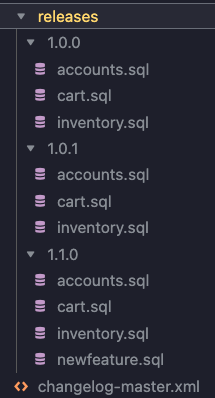
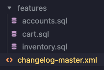

# Working with SQL File Directories

This guide explains how to effectively manage SQL file directories. A well-organized SQL file directory structure is crucial for maintaining database changes across multiple instances and environments.

## Directory Structure Approaches

There are several approaches to organizing your SQL files based on your needs and scale. Here are the recommended patterns:

### 1. Organization by Release and Feature

You may want to set up a hierarchical directory structure using a separate directory for each release and a changelog for each feature with changes specific to that release.

For example, the "accounts.sql" file under the "1.0.0" directory creates a new table, and the "accounts.sql" file in the "1.0.1" directory alters the same table.





**Pros:**
- Clear version history and tracking of changes
- Easy rollback to specific releases
- Better organization for complex applications with multiple features
- Simplifies release planning and deployment
- Makes it easier to maintain release notes

**Cons:**
- Can become complex with many releases
- May have redundant changes across releases
- Harder to get a complete view of a single feature's evolution
- More challenging to manage dependencies between features

### 2. Organization by Entity/Service

This structure groups changes by entity or microservice:




**Pros:**
- Clear separation of concerns
- Easy to locate changes for specific entities
- Better for microservices architecture
- Simplified maintenance of individual services
- Easier to manage team ownership of different components

**Cons:**
- Can be challenging to manage cross-entity dependencies
- May complicate release management
- Harder to track chronological order of changes
- Could lead to redundant changes across services

### 3. Single Changelog Approach

A simplified structure with one main changelog (recommended for small projects):

``` bash
<databaseChangeLog>
    <changeSet id="001" author="bikram">
        <createTable tableName="users">
            <column name="id" type="int" autoIncrement="true">
                <constraints primaryKey="true" />
            </column>
            <column name="name" type="varchar(255)" />
        </createTable>
    </changeSet>

    <changeSet id="002" author="bikram">
        <addColumn tableName="users">
            <column name="email" type="varchar(255)" />
        </addColumn>
    </changeSet>
</databaseChangeLog>

```

**Pros:**
- Simple to understand and implement
- Easy to track chronological order of changes
- Good for small projects or proof of concepts
- Quick to get started
- Clear linear progression of changes

**Cons:**
- Becomes unwieldy as project grows
- Difficult to manage multiple features or services
- Higher risk of merge conflicts in team settings
- Harder to maintain in the long term
- Challenging to roll back specific changes

## Managing Multiple Instances

There are two primary approaches to managing multiple database instances:

### 1. Branch-Based Approach

Use different branches for different environments:

```
main branch     → Development
qa branch       → QA
prod1 branch    → Production Instance 1
prod2 branch    → Production Instance 2
```

**Advantages:**
- Clear separation of environments
- Easy rollback using git history
- Environment-specific configurations

### 2. Directory-Based Approach

Maintain instance-specific directories in the main branch:

```
db/
├── master.xml
├── changelog.properties
├── instances/
│   ├── qa/
│   │   └── changes/
│   ├── prod1/
│   │   └── changes/
│   └── prod2/
│       └── changes/
└── common/
    └── changes/
```

**Advantages:**
- All configurations in one place
- Easier to manage shared changes
- Better visibility of instance-specific changes

**Cons:**
- Harder to track chronological order of changes
- May have redundant changes across instances
- Challenging to manage dependencies between instances

## Recommendations

- For small to medium projects, start with the single changelog approach
- As the project grows, transition to release/feature-based organization
- For multiple instances, choose the branch-based approach if environments are significantly different
- Use directory-based approach when instances share most changes but need instance-specific configurations
