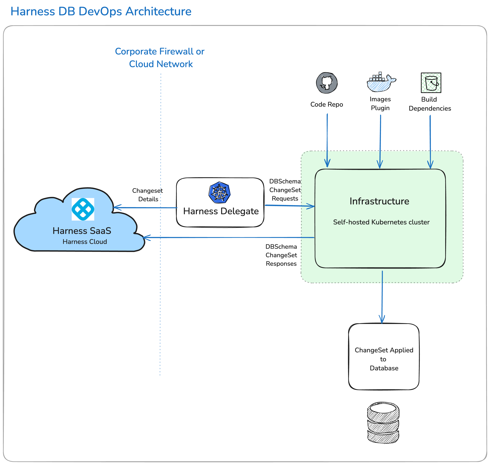

Harness Database DevOps helps customers integrate database changes seamlessly into their application deployment pipelines. It provides a centralized way to manage database schemas and enforce governance policies, all while enabling developers and DBAs to collaborate more effectively on database changes.

Harness Database DevOps bridges the gap between application delivery and database management, empowering customers to ship software faster and more reliably.

Harness DB DevOps provides a way to:

 - **Facilitate scalability:** Automating provisioning and configuration management allow databases to scale efficiently in response to increasing loads, ensuring optimal performance and availability. 
 - **Improve collaboration and efficiency:** Integrating databases changes into the DevOps pipeline, team can collaborate more effectively. This helps reduces silos and improve communication, leading to more efficient workflows helping to identify and resolved issues faster.
 - **Increase reliability and stability:** The automation of testing and deployment processes ensures that changes are consistent and less prone to human error. 
 - **Streamline Change Management**: Managing database schema changes becomes more efficient with version control and automated deployments.
 - **Enhanced Security and Compliance**: Automated processes ensure that security policies are consistently applied across all environments, and compliance checks can be integrated into the CI/CD pipeline. 
 - **Orchestration of Database Changes**: Harness Database DevOps allows for the orchestration of database changes in a manner similar to application code deployments. This means that database changes can be managed through pipelines, ensuring that they are executed in a controlled and automated way. This orchestration helps to eliminate the manual processes that often slow down deployments when database changes are involved.

## Harness DB DevOps Architecture

:::info
Before you can access Harness Database DevOps, you must have Database DevOps module enabled. To access the module, contact [Harness Support](mailto:support@harness.io).
:::

 

:::info note
Harness now streams large, transient, runtime-only payloads (such as logs, test results, and database schema diffs) directly from short-lived plugin pods to the SaaS platform over outbound TLS. This enhancement avoids Delegate resource bottlenecks and improves scalability. All secrets and sensitive data continue to remain strictly within customer infrastructure, with the Delegate enforcing all orchestration and authentication.
:::

The Harness Database DevOps architecture is built around the Harness Delegate, which plays a crucial role in managing database change operations. This delegate operates within your environment whether that is a local network, virtual private cloud, or Kubernetes cluster, ensuring seamless integration with your existing infrastructure. 

The [Harness Delegate](../platform/delegates/delegate-concepts/delegate-overview.md) serves as the bridge between the Harness Manager in your SaaS instance and your database instances, code repositories, and cloud providers. It facilitates the orchestration of database changes by connecting to your version control systems and artifact repositories, allowing for efficient management of database migrations and updates.

You have the flexibility to store your database scripts and artifacts either internally or on public platforms like GitHub. The delegate is responsible for spinning up pods on a Kubernetes cluster to executing database change jobs and applying migrations as specified in your deployment pipelines. This Kubernetes cluster must have network access to your databases, and the delegate must have access to the cluster. By leveraging the harness delegate neither the database server, nor the Kubernetes cluster, needs to be internet accessible. It also collects and transmits data back to the Harness Manager, which can be utilized for orchestration, monitoring, debugging, and analytics.

Upon successful completion of a database deployment pipeline, the system can apply changes to the designated database instances, based on your pipeline configuration. Harness Database DevOps captures detailed logs and outputs from each deployment, enabling you to review and analyze the results both during and after the execution of your database operations. 

This comprehensive approach ensures that your database changes are managed efficiently and effectively, aligning with best practices in Database DevOps.

## Harness DB DevOps Images List

Harness publishes `plugins/drone-liquibase` with `x.y.z-{liquibaseVersion}`, where `x.y.z` follows Harness semantic versioning.
Here are some examples of Harness DB Devops images and their purposes:

* `plugins/download-artifactory`: Used for downloading artifacts from Artifactory.
* `plugins/drone-liquibase:x.y.z-{liquibaseVersion}`: Default Liquibase plugin for database operations.
* `harness/drone-git`: Used to clone Git repositories.
* `plugins/drone-liquibase:x.y.z-{liquibaseVersion}-mongo`: Liquibase plugin for MongoDB.
* `plugins/drone-liquibase:x.y.z-{liquibaseVersion}-spanner`: Liquibase plugin for Google Spanner.
* `plugins/drone-flyway:x.y.z-{flywayVersion}`: Flyway plugin for database operations.
* `plugins/drone-flyway-mongo:x.y.z-{flywayVersion}-mongo`: Flyway plugin for MongoDB.
* `plugins/drone-flyway-spanner:x.y.z-{flywayVersion}-spanner`: Flyway plugin for Google Spanner.
Go to [Release Notes](http://developer.harness.io/release-notes/database-devops) to view the complete and latest list of images and their tags.

## Configure Harness DB Devops Image Versions

By default, Harness uses predefined images. Customers can override these defaults using API endpoints.

### Get Default Configurations

Retrieve the latest default Harness DB Devops image versions:

```sh
curl -i -X GET \
  https://app.harness.io/v1/dbops/execution-config/get-default-config \
  -H 'Harness-Account: $YOUR_HARNESS_ACCOUNT_ID' \
  -H 'X-API-KEY: $API_KEY'
```

Response:

```json
{
  "artifactoryTag": "plugins/download-artifactory:1.0.0",
  "defaultTag": "plugins/drone-liquibase:1.18.0-4.33",
  "gitCloneTag": "harness/drone-git:1.6.4-rootless",
  "mongoTag": "plugins/drone-liquibase:1.18.0-4.33-mongo",
  "spannerTag": "plugins/drone-liquibase:1.18.0-4.33-spanner"
}
```

### Get Customer-Specific Overrides

Send a get-customer-config request to get the build images that your DB DevOps pipelines currently use. When overridesOnly is true, which is the default value, this endpoint returns the non-default images that your pipeline uses.

```sh
curl -i -X GET \
https://app.harness.io/v1/dbops/execution-config/get-customer-config \
-H "Harness-Account: $YOUR_HARNESS_ACCOUNT_ID" \
-H "X-API-KEY: $API_KEY"
```

### Update Image Configuration

Override the default image versions with a new tag:

```sh
curl -i -X POST \
https://app.harness.io/v1/dbops/execution-config/update-config \
--header "Harness-Account: $YOUR_HARNESS_ACCOUNT_ID" \
--header "X-API-KEY: $API_KEY" \
--header 'Content-Type: application/json' \
--data-raw '[
  {
    "field": "gitCloneTag",
    "value": "harness/drone-git:1.5.6-rootless"
  },
  {
    "field": "mongoTag",
    "value": "plugins/drone-liquibase:1.18.0-4.33-mongo"
  },
  {
    "field": "spannerTag",
    "value": "plugins/drone-liquibase:1.18.0-4.33-spanner"
  }
]'
```

### Reset Image Configuration to Defaults

Reset specific images to their default versions:

```sh
curl -i -X POST \
https://app.harness.io/v1/dbops/execution-config/reset-config \
--header "Harness-Account: $YOUR_HARNESS_ACCOUNT_ID" \
--header "X-API-KEY: $API_KEY" \
--header 'Content-Type: application/json' \
--data-raw '[
    {
    "artifactoryTag",
    "defaultTag",
    "gitCloneTag",
    "mongoTag",
    "spannerTag"
    }
]'
```

### Delete Overrides

Delete all custom overrides for your account:

```sh
curl -i -X DELETE \
"https://app.harness.io/v1/dbops/execution-config" \
--header "Harness-Account: $YOUR_HARNESS_ACCOUNT_ID" \
--header "X-API-KEY: $API_KEY"
```

## Harness Database DevOps vs Liquibase and Flyway

Harness Database DevOps is a pipeline-native orchestration layer built on top of migration tools like Liquibase and Flyway that is not a replacement for them. It adds governance, approval gates, drift detection, and full CI/CD integration that standalone tools do not provide.

Go to [Harness Database DevOps vs Liquibase vs Flyway](https://www.harness.io/blog/harness-database-devops-vs-liquibase-vs-flyway) to understand how Harness extends these tools with enterprise-grade delivery capabilities.

## Frequently asked questions

### What is Harness DBOps Image Pulls?
By default, when a DBOps pipeline runs, the Harness Delegate uses a [Docker connector](/docs/platform/connectors/cloud-providers/ref-cloud-providers/docker-registry-connector-settings-reference.md) to make an anonymous outbound connection to pull the Harness DBOps images from the public container registry where they are stored.

### What if I do not want to pull images anonymously?
You can use credentialed access if you do not want the Harness Delegate to pull images anonymously. Go to [Connect to the Harness container image registry](/docs/platform/connectors/artifact-repositories/connect-to-harness-container-image-registry-using-docker-connector) to set up credentialed access.

### I do not want to pull images from a public registry
Harness DBOps images are stored in a public container registry. If you do not want to pull the images directly from the public registry, you can pull Harness images from your own private registry. Go to [Connect to the Harness container image registry](/docs/platform/connectors/artifact-repositories/connect-to-harness-container-image-registry-using-docker-connector.md) to configure each of these options.

### How to override LiteEngine or CIAddOn image in DBOps?
Go to [Harness CI image updates](/docs/continuous-integration/use-ci/set-up-build-infrastructure/harness-ci#harness-ci-image-updates) to override using CI APIs.
To use a private registry for the above images, override the default harnessImage connector at the account level. Go to [Configure Harness to always use credentials to pull Harness images](/docs/platform/connectors/artifact-repositories/connect-to-harness-container-image-registry-using-docker-connector/#configure-harness-to-always-use-credentials-to-pull-harness-images) to set this up.

### Can Harness Database DevOps be used to migrate databases from Azure SQL to Google Cloud SQL (or across any cloud providers)?

Harness Database DevOps is an orchestration layer, not a data migration or replication tool, and it does not move data between databases or cloud providers. For a cross-cloud move, use a dedicated data migration service (such as Azure Database Migration Service or `pg_dump/pg_restore`) to transfer the existing data to the target. Harness DB DevOps then orchestrates the schema migration portion: it applies your Liquibase or Flyway changelogs to the target database, manages approval gates, sequences the rollout across environments, and records the deployment audit trail. The two tools are complementary: the migration service handles data transfer, and Harness handles the controlled schema deployment on the target.

## Reference

Go to [Docker Hub](https://hub.docker.com/r/plugins/drone-liquibase/tags) to view all available images and tags directly.

## Next steps

- Go to [Harness DB DevOps](https://app.harness.io/) to try it yourself.
- Go to [Contact Sales](https://www.harness.io/company/contact-sales?utm_source=harness_io&utm_medium=cta&utm_campaign=platform&utm_content=main_nav) to request a demo.