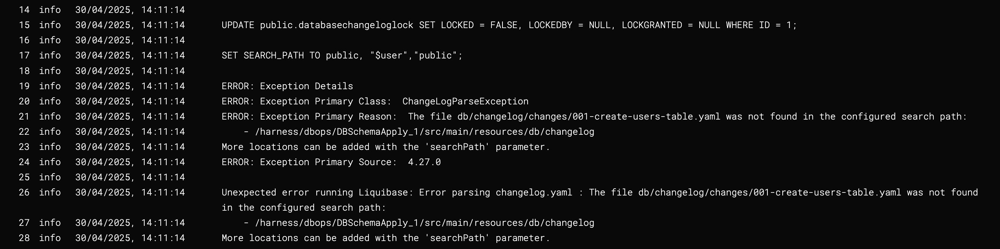
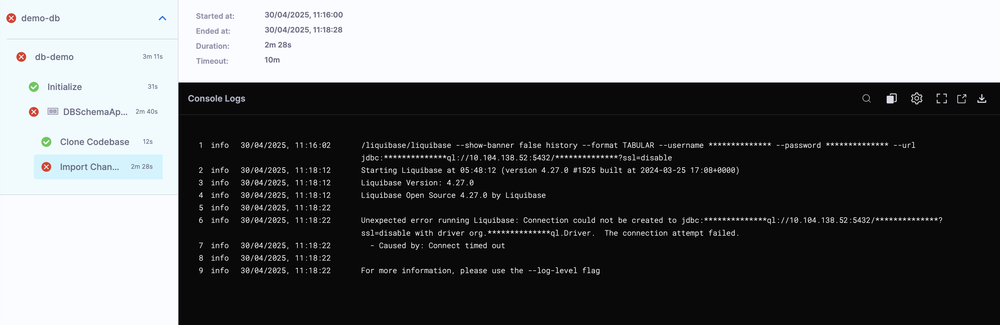
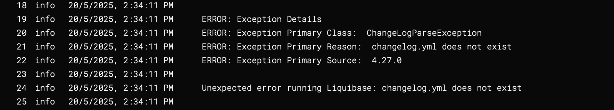
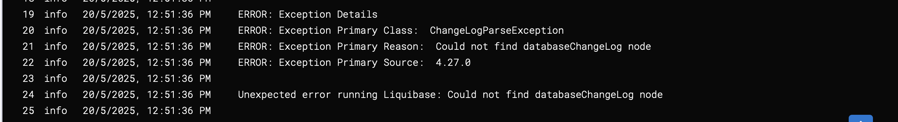
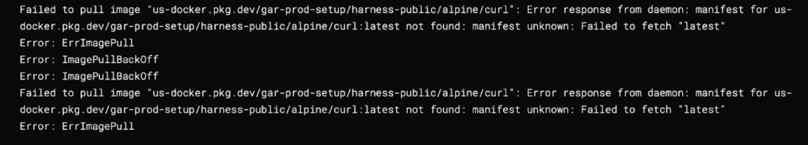
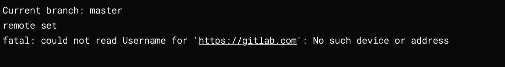

import Tabs from '@theme/Tabs';
import TabItem from '@theme/TabItem';

This guide outlines common issues encountered while using Harness Database DevOps and their corresponding solutions.


## 1. `searchPath` Parameter Issue
 
When working with a changelog file that includes other changelog files, Liquibase might throw an error due to improper handling of file paths. This can occur when the "file" path is not set correctly: 

**Error Message**:



**Example usage in a master changelog:**
```yaml
## db/changelog/changelog.yaml
databaseChangeLog:
  - include:
      file: db/changelog/changes/001-create-users-table.yaml
  - include:
      file: db/changelog/changes/002-add-sample-data.yaml
```

**How to Solve**:

The `searchPath` parameter is used to specify the schema search order for database objects. If the changelog file includes other changelogs, ensure that the paths are correctly specified relative to location of the master changelog file, which is considered the master file. 

For example, if the master changelog is located in `db/changelog/master.yaml`, the path to the included changelogs should be relative to that file. Correct example:

```yaml
## db/changelog/changelog.yaml
databaseChangeLog:
  - include:
      file: changes/001-create-users-table.yaml
  - include:
      file: changes/002-add-sample-data.yaml
```
This way, Liquibase can correctly resolve the paths to the included changelogs, and the error should be resolved.

## 2. JDBC Connection Timeout

Harness DB DevOps fails to establish a JDBC connection within the default timeout period. This can occur especially with databases like MSSQL that may take longer to start up.

**Error Message**:



**How to Solve**:

- Ensure the database instance is up and reachable over the network.
- Consider increasing the timeout value if your database takes longer to initialize.
- For MSSQL, consider a startup window of up to 20 minutes.

## 3. `changelog.yaml` does not exist

Liquibase throws this error when it cannot find the changelog file. This can occur when the path is incorrect or the file is missing.

**Error Message**:



**How to Solve**:
- Verify that the changelog file exists at the specified location.
- Ensure the filename and path in your configuration exactly match the file in your repository or working directory.
- Cross-check for typos or incorrect directory structures.

## 4. Could not find `databaseChangeLog` node

This error comes up when Harness DB DevOps cannot find the `databaseChangeLog` node in the changelog file. This can occur if the file is not formatted correctly or is missing the required node. This issue typically surfaces when the changelog file contains unexpected content. 

:::info
Most common occurence of this issue will be while setting up DB Schema with a custom script.
:::
**Error Message**:



**Example** for such a incorrect custom script:

```sh
if [ ! -d "db" ]; then
  mkdir db
  curl https://api.github.com/repos/Sonichigo/mux-sql/main/liquibase.yml -o db/changelog.yml
fi
```

Above we have an invalid API call to fetch the changelog file, which resulted in an error response, which was mistakenly written to the changelog output file. As a result, instead of a valid changelog XML or YAML, the file contained an error log or HTML/JSON response and when the system attempted to run `Preview & Validate SQL`, it failed due to the absence of the required `databaseChangeLog` node.

**How to Solve**:

Ensure while fetching the changelog file, you are calling the correct API endpoint and the response is in the expected format. You can also check the contents of the changelog file to ensure it contains the correct `databaseChangeLog` node, after the API call. 

**Example** for a correct custom script:
```sh
if [ ! -d "db" ]; then
  mkdir db
  curl -H 'Accept: application/vnd.github.v3.raw' -L https://api.github.com/repos/Sonichigo/mux-sql/contents/liquibase.yml?ref=main -o db/changelog.yml
fi
```

## 5.  ImagePullError of `alpine/curl:latest`

When using the Custom Script step to set up a DB schema in a pipeline with the default container registry (Harness Docker Registry), you may encounter an `ImagePullError` for the `alpine/curl:latest` image. This happens as the image available in the specified default docker registry contains only related to Harness Platform.

**Error Message**:



**How to Solve**:

Ensure you are using the correct container registry for your environment. Follow the official [Harness documentation](https://developer.harness.io/docs/platform/connectors/cloud-providers/ref-cloud-providers/docker-registry-connector-settings-reference/) to configure this custom Docker Registry. Make sure that in the new Docker Registry Connector, the `alpine/curl:latest` image is available.

## 6. Authentication Error: could not read Username

While adding a remote repository and pushing changes in a pipeline or shell environment, you may encounter an authentication error. This typically occurs when the credentials for the remote repository are not set up in a specified manner.

**Error Message**:



**How to Solve**:

Use a properly formatted Git URL that includes:

- The email address (URL encoded) as the username.
- A secret-based Personal Access Token (PAT) for secure authentication.

**Example** for a properly formatted URL:
```sh
git remote add origin https://my.email%40gmail.com:<+secrets.getValue("PAT_TOKEN")>@gitlab.com/Sonichigo/generate-changelog.git
git push -u origin main
```
:::info note
- Replace `my.email@gmail.com` with your Git account email (URL-encoded as %40 for @).
- Replace `PAT_TOKEN` with the name of the Harness secret containing your GitLab PAT.
- Make sure the secret is securely stored in Harness under **Project Settings → Secrets**.
:::