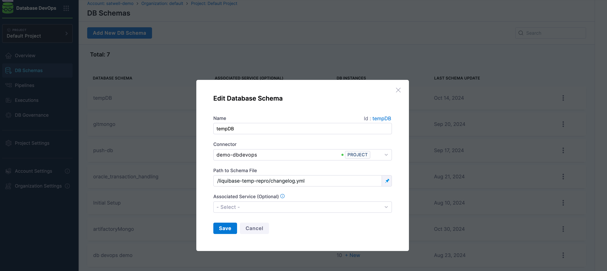

## Building a Liquibase Changelog 

A Liquibase changelog is a collection of database changes that can be applied to a database. It serves as a version-controlled record of changes, allowing teams to manage and track modifications to the database schema and data. 

:::info
Have a read of the [Harness DB DevOps onboarding guide](../get-started/onboarding-guide.md) if you would like to know more about how to set up Database DevOps, configure a database and more. 
:::

### Setting up Liquibase

Before you start, we encourage you to install [Liquibase](https://www.liquibase.com/download). This is because Harness DB DevOps currently supports deploying sql changes through a [Liquibase changelog](https://docs.liquibase.com/concepts/changelogs/home.html). 

### Pointing to a Directory of SQL Files

To point Liquibase at a directory of SQL files, you'll need to create a top-level changelog file, in XML or YAML format, that references the SQL files. 

 1. Create a changelog titled `changelog.xml` **or** `changelog.yaml` in your project directory. 
 2. In your changelog file, reference the directory of SQL files. Each SQL file will be treated as a 
  separate changeset. Here's an example of how to structure the XML changelog: 

    ```yaml
     databaseChangeLog:
     - changeSet:
         id: "1"
         author: "authorName"
         changes:
           - sqlFile:
               path: "path/to/your/sql/file1.sql"
    - changeSet:
         id: "2"
         author: "authorName"
         changes:
           - sqlFile:
               path: "path/to/your/sql/file2.sql"
    ```

 3. Within Harness Database DevOps, select the *DB Schemas** option. 
 4. Select the three dots on the right hand side of the database schema that you will be amending. A pop up menu should appear. 
 5. Under the **Path to Schema File**, enter the path to the changelog you created. 
 6. Click **Save**. 

    

### What is a changeset?

A changeset in database management is a discrete unit of change to the database schema. For Liquibase, a changeset:

 - contains one or more database changes (like creating tables, adding columns, or updating data)
 - Is uniquely identified by combination of:
    -- author
    -- id
    -- changelog file path

On the subject of Liquibase and how it is used with Harness Database DevOps, Liquibase will check for a tracking table (`databasechangelog`)to see which changesets have been executed. It will, also, 
calculate a checksum of each change. It only executes new changesets or those with modified checksums and records successful executions in the tracking table. 

    ```yaml
    databaseChangeLog:
    - changeSet:
        id: "1"
        author: "janet"
        changes:
          - createTable:
              tableName: "users"
              columns:
                - name: "id"
                  type: "int"
                  constraints:
                    primaryKey: true
                - name: "name"
                  type: "varchar(255)"
    ```

This system provides robust database schema management by ensuring changes are tracked, versioned, and 
executed exactly once across all environments. The version control and unique execution guarantees enable 
multiple developers to safely collaborate on database changes while maintaining consistent, repeatable 
deployments across different environments.
