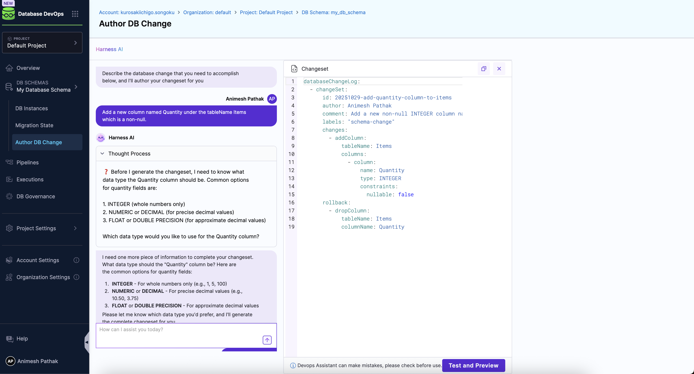
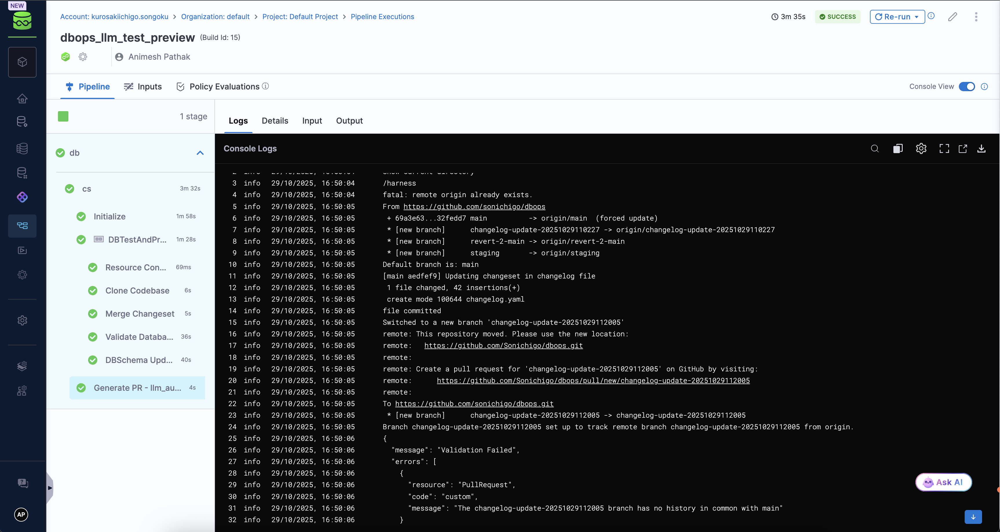

import Tabs from '@theme/Tabs';
import TabItem from '@theme/TabItem';

This guide explains how to enable an LLM-driven change authoring workflow in Harness Database DevOps that generates migration artifacts (e.g., Liquibase changesets or SQL migration scripts), commits them to a temporary branch, and opens a Pull Request (PR) against a target Git branch for review and CI validation. The workflow preserves GitOps principles (auditability, review gates, CI checks) while accelerating authoring through LLM assistance.

## Prerequisites
Before configuring LLM change authoring, ensure you have the following prerequisites in place:
- An active Harness account with Database DevOps enabled.
- Access to a Git repository where database migration artifacts will be stored.


<Tabs>
<TabItem value="Interactive Guide" label="Interactive Guide">

<DocVideo src="https://app.tango.us/app/embed/9d325a7b-a158-4cfd-a0a3-6327247c4905?skipCover=false&defaultListView=false&skipBranding=true&makeViewOnly=true&hideAuthorAndDetails=true" title="Configure Harness AI and DB Schema" />

</TabItem>
<TabItem value="Step-by-Step Guide" label="Step-by-Step Guide" default>

### Step 1: Enable Harness AI in Harness
1. Log in to your Harness account.
2. Navigate to **Account Settings** > **Default Settings** > **Harness AI**.
3. Toggle the **Harness AI** switch to enable it for your account.
4. Then click on **Database DevOps** and in **LLM Authoring Test and Commit Pipeline** field point to the LLM pipeline identifier, e.g., `dbops_llm_test_preview` which we will create in the next step.

### Step 2: Create a Pipeline with LLM Change Authoring
1. Go to the **Pipelines** section in Harness.
2. Click on **Create Pipeline**, and click on Add Stage and select the Custom Stage
3. Provide the desired name for your pipeline, and click on **Add**. (Make sure that the pipeline identifier is same as mentioned in LLM pipeline identifier in step 1)
4. Create a New Step Group.
5. Click on **Add Step** and select the **DB Test and Preview** step from the list of available steps.

  
  :::note important
  Leave schema and instance set as runtime input, i.e., `<+input>`, as these will be provided by the LLM change authoring.
  :::
6. Click on Add Step again and select the Run Step from the list of available steps.
7. Configure the **Run step** to create a Pull Request in your Git repository with the generated migration artifacts. Use the following script as a reference, replacing placeholders with your actual values:
```bash
#!/bin/bash
set -e  # Exit on any error

cd dbops/DBTestAndPreview_1

# Configure Git user
git config --global user.email "<User Email>"
git config --global user.name "<User Name>"

# Add remote (with PAT from Harness secrets)
REMOTE_URL="https://<User Email>%40<domain.com>:<+secrets.getValue("github")>@github.com/<username>/<repository_name>.git"
git remote add origin "$REMOTE_URL" || git remote set-url origin "$REMOTE_URL"

# Fetch remote to get default branch info
git fetch origin

# Get the default branch from remote (main/master)
DEFAULT_BRANCH=$(git remote show origin | grep 'HEAD branch' | awk '{print $NF}')
if [ -z "$DEFAULT_BRANCH" ]; then
    DEFAULT_BRANCH="main"
fi
echo "Default branch is: $DEFAULT_BRANCH"

# Stage and commit changes. Adjust the file name as per your DB Schema file Name.
git add changelog.yaml 

git commit -m "Updating changeset in changelog file"
echo "file committed"

# Create a new branch name with timestamp
NEW_BRANCH="changelog-update-$(date +%Y%m%d%H%M%S)"
git checkout -b "$NEW_BRANCH"

# Push new branch
git push -u origin "$NEW_BRANCH"

# Create Pull Request and capture response
PR_RESPONSE=$(curl -s -X POST \
    -H "Authorization: token <+secrets.getValue("github")>" \
    -H "Accept: application/vnd.github+json" \
    https://api.github.com/repos/<username>/<repository>/pulls \
    -d @- <<EOF
    {
        "title": "Automated changelog update",
        "head": "$NEW_BRANCH",
        "base": "$DEFAULT_BRANCH"
    }
EOF
)

echo "$PR_RESPONSE"

# Extract html_url using grep and sed
PR_URL=$(echo "$PR_RESPONSE" | grep '"html_url"' | head -1 | sed -E 's/.*"html_url": *"([^"]+)".*/\1/')

echo "Pull request created: $PR_URL"
```
### Step 3: Author your first DB Change

1. Select your Database DevOps project from the Harness dashboard.
2. Navigate to your desired Database Schema.
3. Click on Edit Schema to open the schema details page and select the **Primary DB Instance (Optional)** from the dropdown.
4. Click on the **Author DB Change** tab.
5. In the **Author DB Change** chat window, mention the changes you want to make to the database schema. For example, you can type:
   ```
   Add a new column named Quantity under the tableName Items which is a non-null, with integer datatype.
   ```
   

5. Once satisfied with the changes, Click on the **Test and Preview** button. The LLM will process your request and generate the appropriate migration artifacts (e.g., changesets or SQL scripts).
6. You can monitor the pipeline execution status via the Chat Window. Once the pipeline completes successfully, a Pull Request will be created in your Git repository with the generated migration artifacts since the pipeline is configured to create a Pull Request. 

<Tabs>
<TabItem value="Visual Pipeline Example" label="Visual Pipeline Example">



</TabItem>
<TabItem value="Pipeline YAML Example" label="Pipeline YAML Example">

```yaml
pipeline:
  name: dbops_llm_test_preview
  identifier: dbops_llm_test_preview
  projectIdentifier: default_project
  orgIdentifier: default
  tags: {}
  stages:
    - stage:
        name: db
        identifier: DBTestAndPreview
        description: "LLM Change Authoring Stage"
        type: Custom
        spec:
          execution:
            steps:
              - stepGroup:
                  name: cs
                  identifier: cs
                  steps:
                    - step:
                        type: DBTestAndPreview
                        name: DBTestAndPreview_1
                        identifier: DBTestAndPreview_1
                        resources:
                          limits:
                            memory: 0.5Gi
                            cpu: "1"
                        spec:
                          connectorRef: dockerHarness
                          dbSchema: <+input>
                          dbInstance: <+input>
                          changeset: <+input>
                        timeout: 20m
                    - step:
                        type: Run
                        name: Generate PR -  llm_authoring_demo
                        identifier: Generate_PR_llm_authoring_demo
                        spec:
                          connectorRef: dockerHarness
                          image: prontotools/alpine-git-curl
                          shell: Sh
                          command: |-
                            #!/bin/bash
                            set -e  # Exit on any error

                            echo "show current directory"
                            pwd

                            cd dbops/DBTestAndPreview_1

                            # Configure Git user
                            git config --global user.email "john.doe@gmail.xyz"
                            git config --global user.name "john doe"

                            # Add remote (with PAT from Harness secrets)
                            REMOTE_URL="https://john.doe%40gmail.xyz:<+secrets.getValue("<GIT_TOKEN>")>@github.com/<username>/<repository>.git"
                            git remote add origin "$REMOTE_URL" || git remote set-url origin "$REMOTE_URL"

                            # Fetch remote to get default branch info
                            git fetch origin

                            # Get the default branch from remote (main/master)
                            DEFAULT_BRANCH=$(git remote show origin | grep 'HEAD branch' | awk '{print $NF}')
                            if [ -z "$DEFAULT_BRANCH" ]; then
                                DEFAULT_BRANCH="main"
                            fi
                            echo "Default branch is: $DEFAULT_BRANCH"

                            # Stage and commit changes
                            git add changelog.yaml

                            git commit -m "Updating changeset in changelog file"
                            echo "file committed"

                            # Create a new branch name with timestamp
                            NEW_BRANCH="changelog-update-$(date +%Y%m%d%H%M%S)"
                            git checkout -b "$NEW_BRANCH"

                            # Push new branch
                            git push -u origin "$NEW_BRANCH"

                            # Create Pull Request and capture response
                            PR_RESPONSE=$(curl -s -X POST \
                                -H "Authorization: token <+secrets.getValue("github")>" \
                                -H "Accept: application/vnd.github+json" \
                                https://api.github.com/repos/<username>/<repository>/pulls \
                                -d @- <<EOF
                                {
                                    "title": "Automated changelog update",
                                    "head": "$NEW_BRANCH",
                                    "base": "$DEFAULT_BRANCH"
                                }
                            EOF
                            )

                            echo "$PR_RESPONSE"

                            # Extract html_url using grep and sed
                            PR_URL=$(echo "$PR_RESPONSE" | grep '"html_url"' | head -1 | sed -E 's/.*"html_url": *"([^"]+)".*/\1/')

                            echo "Pull request created: $PR_URL"
                          outputVariables:
                            - name: CHANGESET_PR_LINK
                              type: String
                              value: PR_URL
                            - name: DEFAULT_BRANCH
                              type: String
                              value: DEFAULT_BRANCH
                            - name: NEW_BRANCH
                              type: String
                              value: NEW_BRANCH
                  stepGroupInfra:
                    type: KubernetesDirect
                    spec:
                      connectorRef: db
                      namespace: harness-delegate-ng
                      containerSecurityContext:
                        runAsUser: "0"
        failureStrategies:
          - onFailure:
              errors:
                - AllErrors
              action:
                type: MarkAsFailure
  variables:
    - name: dbInstance
      type: String
      description: "Database instance name"
      required: false
      value: <+input>
    - name: dbSchema
      type: String
      description: "Database schema name"
      required: false
      value: <+input>
```
</TabItem>
</Tabs>

</TabItem>
</Tabs>