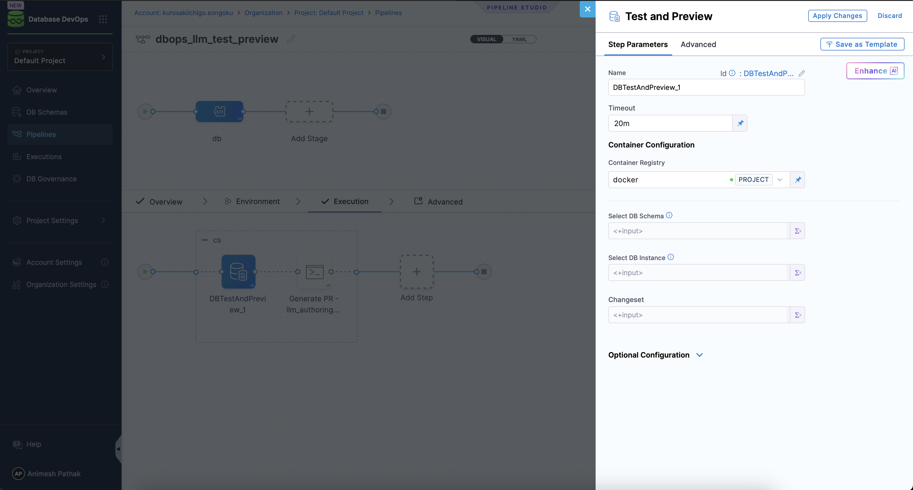
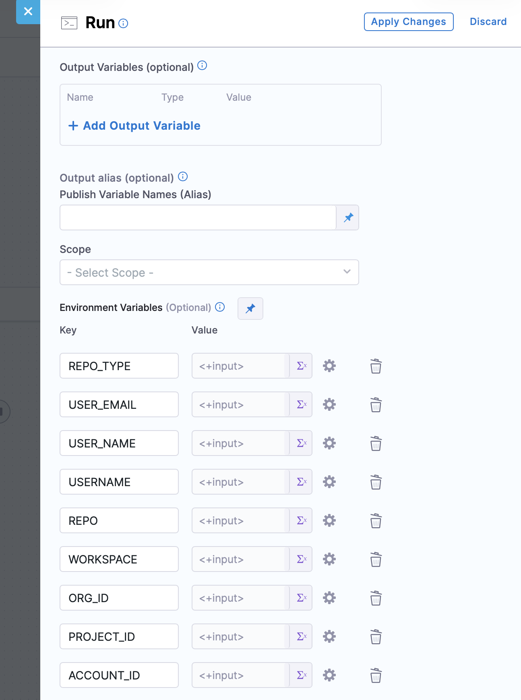
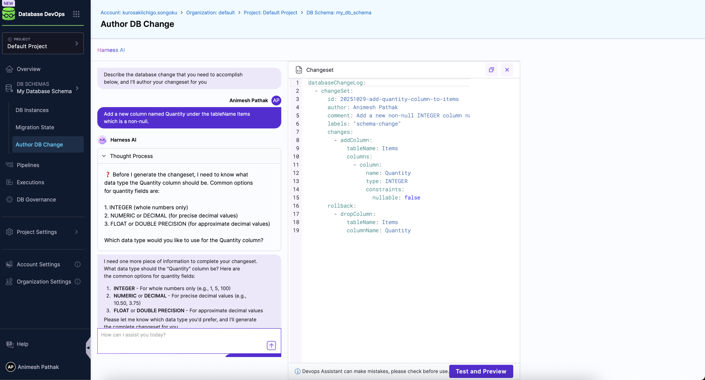
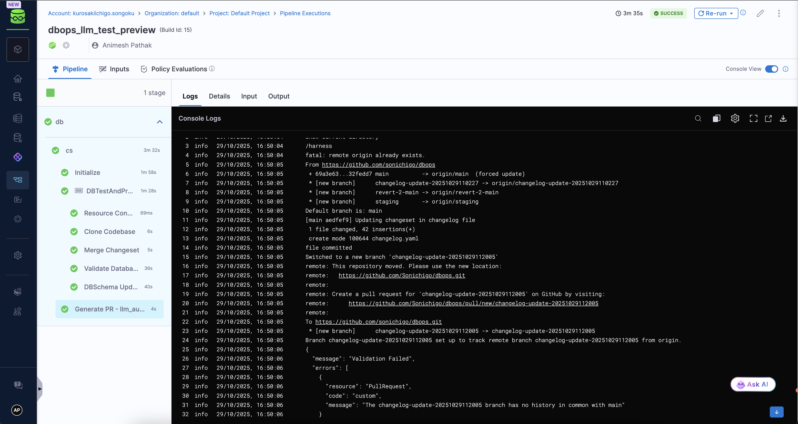

import Tabs from '@theme/Tabs';
import TabItem from '@theme/TabItem';

This guide explains how to enable an LLM-driven change authoring workflow in Harness Database DevOps that generates migration artifacts (e.g., Liquibase changesets or SQL migration scripts), commits them to a temporary branch, and opens a Pull Request (PR) against a target Git branch for review and CI validation. The workflow preserves GitOps principles (auditability, review gates, CI checks) while accelerating authoring through LLM assistance.

## Prerequisites
Before configuring LLM change authoring, ensure you have the following prerequisites in place:
- An active Harness account with Database DevOps enabled.
- Access to a Git repository where database migration artifacts will be stored.


<Tabs>
<TabItem value="Interactive Guide" label="Interactive Guide">

<DocVideo src="https://app.tango.us/app/embed/9d325a7b-a158-4cfd-a0a3-6327247c4905?skipCover=false&defaultListView=false&skipBranding=true&makeViewOnly=true&hideAuthorAndDetails=true" title="Configure Harness AI and DB Schema" />

</TabItem>
<TabItem value="Step-by-Step Guide" label="Step-by-Step Guide" default>

### Step 1: Enable Harness AI in Harness
1. Log in to your Harness account.
2. Navigate to **Account Settings** > **Default Settings** > **Harness AI**.
3. Toggle the **Harness AI** switch to enable it for your account.
4. Then click on **Database DevOps** and in **LLM Authoring Test and Commit Pipeline** field point to the LLM pipeline identifier, e.g., `dbops_llm_test_preview` which we will create in the next step.

### Step 2: Create a Pipeline with LLM Change Authoring
1. Go to the **Pipelines** section in Harness.
2. Click on **Create Pipeline**, and click on Add Stage and select the Custom Stage
3. Provide the desired name for your pipeline, and click on **Add**. (Make sure that the pipeline identifier is same as mentioned in LLM pipeline identifier in step 1)
4. Create a New Step Group.
5. Click on **Add Step** and select the **DB Test and Preview** step from the list of available steps.

  
  :::note important
  Leave schema and instance set as runtime input, i.e., `<+input>`, as these will be provided by the LLM change authoring.
  :::
6. Click on Add Step again and select the Run Step from the list of available steps.
7. Configure the **Run step** to run the following script to create a Pull Request in your Git repository with the generated migration artifacts. First, add a **pipeline variable** (or step input) named **$REPO_TYPE** with allowed values: "github", "bitbucket", "harness". Then use the following unified script, replacing the common placeholders with your actual values:

```bash
#!/bin/bash
set -e

# All configuration is read from step environment variables — no edits needed below.

cd dbops/DBTestAndPreview_1

git config --global user.email "$USER_EMAIL"
git config --global user.name  "$USER_NAME"

# ── Set remote URL based on repo type ────────────────────────────────────────
case "$REPO_TYPE" in
  github)
    ENCODED_EMAIL="${USER_EMAIL//@/%40}"
    REMOTE_URL="https://${ENCODED_EMAIL}:<+secrets.getValue("github")>@github.com/${USERNAME}/${REPO}.git"
    ;;
  bitbucket)
    REMOTE_URL="https://${USERNAME}:<+secrets.getValue("account.bitbucket")>@bitbucket.org/${WORKSPACE}/${REPO}.git"
    ;;
  harness)
    REMOTE_URL="https://git:<+secrets.getValue("harness_api_token")>@app.harness.io/git/${ORG_ID}/${PROJECT_ID}/${REPO}.git"
    ;;
  *)
    echo "ERROR: Unsupported REPO_TYPE '${REPO_TYPE}'. Must be github, bitbucket, or harness."
    exit 1
    ;;
esac

# ── Push to a new branch ─────────────────────────────────────────────────────
git remote remove origin 2>/dev/null || true
git remote add origin "$REMOTE_URL"
git fetch origin

DEFAULT_BRANCH=$(git remote show origin | grep 'HEAD branch' | awk '{print $NF}')
DEFAULT_BRANCH="${DEFAULT_BRANCH:-main}"
echo "Default branch: $DEFAULT_BRANCH"

git add db/changelog.yml # Adjust path and filenameas needed
git commit -m "Updating changeset in changelog file"

NEW_BRANCH="changelog-update-$(date +%Y%m%d%H%M%S)"
git checkout -b "$NEW_BRANCH"
git push -u origin "$NEW_BRANCH"

# ── Open a Pull Request ───────────────────────────────────────────────────────
case "$REPO_TYPE" in
  github)
    PR_RESPONSE=$(curl -s -X POST \
      -H "Authorization: token '<+secrets.getValue("github")>'" \
      -H "Accept: application/vnd.github+json" \
      "https://api.github.com/repos/${USERNAME}/${REPO}/pulls" \
      -d "{\"title\":\"Automated changelog update\",\"head\":\"${NEW_BRANCH}\",\"base\":\"${DEFAULT_BRANCH}\"}")
    PR_URL=$(echo "$PR_RESPONSE" | grep '"html_url"' | head -1 | sed -E 's/.*"html_url": *"([^"]+)".*/\1/')
    ;;
  bitbucket)
    PR_RESPONSE=$(curl -s -X POST \
      -u "${USERNAME}:<+secrets.getValue("account.bitbucket")>" \
      -H "Content-Type: application/json" \
      "https://api.bitbucket.org/2.0/repositories/${WORKSPACE}/${REPO}/pullrequests" \
      -d "{\"title\":\"Automated changelog update\",\"source\":{\"branch\":{\"name\":\"${NEW_BRANCH}\"}},\"destination\":{\"branch\":{\"name\":\"${DEFAULT_BRANCH}\"}},\"close_source_branch\":true}")
    PR_URL=$(echo "$PR_RESPONSE" | grep -o '"html":{"href":"[^"]*"' | sed 's/"html":{"href":"//;s/"$//')
    ;;
  harness)
    PR_RESPONSE=$(curl -s -X POST \
      "https://app.harness.io/code/api/v1/repos/${REPO}/pullreq?accountIdentifier=${ACCOUNT_ID}&orgIdentifier=${ORG_ID}&projectIdentifier=${PROJECT_ID}" \
      -H "Content-Type: application/json" \
      -H "x-api-key: <+secrets.getValue("harness_api_token")>" \
      -d "{\"title\":\"Automated changelog update\",\"source_branch\":\"${NEW_BRANCH}\",\"target_branch\":\"${DEFAULT_BRANCH}\",\"is_draft\":false}")
    PR_NUMBER=$(echo "$PR_RESPONSE" | grep -o '"number":[0-9]*' | head -1 | sed 's/"number"://')
    PR_URL="https://app.harness.io/ng/account/${ACCOUNT_ID}/module/code/orgs/${ORG_ID}/projects/${PROJECT_ID}/repos/${REPO}/pull-requests/${PR_NUMBER}"
    ;;
esac

echo "Pull request created: $PR_URL"
export CHANGESET_PR_LINK="$PR_URL"
```

Setup the following environment variables in the Run step configuration, ensuring that sensitive values like `github`, `bitbucket`, and `harness_api_token` are stored securely in Harness secrets and referenced appropriately:

| **Variable Name** | **Type**   | **Description**                                                      | **Example**                                         |
| ------------- | ------ | ---------------------------------------------------------------------------- | --------------------------------------------------- |
| REPO_TYPE     | String | Target Git provider                                                          | github, bitbucket, harness                          |
| USER_EMAIL    | String | Git commit author email                                                      | [jane.doe@example.com](mailto:jane.doe@example.com) |
| USER_NAME     | String | Git commit author name                                                       | Jane Doe                                            |
| USERNAME      | String | Git provider username (GitHub/Bitbucket only)                                | janedoe                                             |
| REPO          | String | Repository name (GitHub/Bitbucket only)                                      | my-database-repo                                    |
| WORKSPACE     | String | Workspace slug (Bitbucket only)                                              | mycompany                                           |
| ORG_ID        | String | Organization identifier (Harness Code only)                                  | default                                             |
| PROJECT_ID    | String | Project identifier (Harness Code only)                                       | my_project                                          |
| ACCOUNT_ID    | String | Account identifier (Harness Code only)                                       | abc123                                              |



:::info note
If the target Git provider is **Harness Code**, ensure that the `REPO_TYPE` is set to **harness**.
:::

### Step 3: Author your first DB Change

1. Select your Database DevOps project from the Harness dashboard.
2. Navigate to your desired Database Schema.
3. Click on Edit Schema to open the schema details page and select the **Primary DB Instance (Optional)** from the dropdown.
4. Click on the **Author DB Change** tab.
5. In the **Author DB Change** chat window, mention the changes you want to make to the database schema. For example, you can type:
   ```
   Add a new column named Quantity under the tableName Items which is a non-null, with integer datatype.
   ```
   

5. Once satisfied with the changes, Click on the **Test and Preview** button. The LLM will process your request and generate the appropriate migration artifacts (e.g., changesets or SQL scripts).
6. You can monitor the pipeline execution status via the Chat Window. Once the pipeline completes successfully, a Pull Request will be created in your Git repository with the generated migration artifacts since the pipeline is configured to create a Pull Request. 

<Tabs>
<TabItem value="Visual Pipeline Example" label="Visual Pipeline Example">



</TabItem>
<TabItem value="Pipeline YAML Example" label="Pipeline YAML Example">

```yaml
pipeline:
  name: dbops_llm_test_preview
  identifier: dbops_llm_test_preview
  projectIdentifier: default_project
  orgIdentifier: default
  tags: {}
  stages:
    - stage:
        name: db
        identifier: DBTestAndPreview12
        description: "This stage is used for testing the LLM generated changeset and creating a PR with the changeset file in the git repository"
        type: Custom
        spec:
          execution:
            steps:
              - stepGroup:
                  name: cs
                  identifier: cs
                  steps:
                    - step:
                        type: DBTestAndPreview
                        name: DBTestAndPreview_1
                        identifier: DBTestAndPreview_1
                        resources:
                          limits:
                            memory: 0.5Gi
                            cpu: "1"
                        spec:
                          connectorRef: dockerHarness
                          dbSchema: <+input>
                          dbInstance: <+input>
                          changeset: <+input>
                        timeout: 20m
                    - step:
                        type: Run
                        name: Generate the PR - LLM Authoring
                        identifier: Script_Verification
                        spec:
                          connectorRef: testDefault
                          image: prontotools/alpine-git-curl
                          shell: Sh
                          command: |-
                            #!/bin/bash
                            set -e

                            # All configuration is read from step environment variables — no edits needed below.

                            cd dbops/DBTestAndPreview_1

                            git config --global user.email "$USER_EMAIL"
                            git config --global user.name  "$USER_NAME"

                            # ── Set remote URL based on repo type ────────────────────────────────────────
                            case "$REPO_TYPE" in
                              github)
                                ENCODED_EMAIL="${USER_EMAIL//@/%40}"
                                REMOTE_URL="https://${ENCODED_EMAIL}:<+secrets.getValue("github")>@github.com/${USERNAME}/${REPO}.git"
                                ;;
                              bitbucket)
                                REMOTE_URL="https://${USERNAME}:<+secrets.getValue("account.bitbucket")>@bitbucket.org/${WORKSPACE}/${REPO}.git"
                                ;;
                              harness)
                                REMOTE_URL="https://git:<+secrets.getValue("harness_api_token")>@app.harness.io/git/${ORG_ID}/${PROJECT_ID}/${REPO}.git"
                                ;;
                              *)
                                echo "ERROR: Unsupported REPO_TYPE '${REPO_TYPE}'. Must be github, bitbucket, or harness."
                                exit 1
                                ;;
                            esac

                            # ── Push to a new branch ─────────────────────────────────────────────────────
                            git remote remove origin 2>/dev/null || true
                            git remote add origin "$REMOTE_URL"
                            git fetch origin

                            DEFAULT_BRANCH=$(git remote show origin | grep 'HEAD branch' | awk '{print $NF}')
                            DEFAULT_BRANCH="${DEFAULT_BRANCH:-main}"
                            echo "Default branch: $DEFAULT_BRANCH"

                            git add db/changelog.yml
                            git commit -m "Updating changeset in changelog file"

                            NEW_BRANCH="changelog-update-$(date +%Y%m%d%H%M%S)"
                            git checkout -b "$NEW_BRANCH"
                            git push -u origin "$NEW_BRANCH"

                            # ── Open a Pull Request ───────────────────────────────────────────────────────
                            case "$REPO_TYPE" in
                              github)
                                PR_RESPONSE=$(curl -s -X POST \
                                  -H "Authorization: token '<+secrets.getValue("github")>'" \
                                  -H "Accept: application/vnd.github+json" \
                                  "https://api.github.com/repos/${USERNAME}/${REPO}/pulls" \
                                  -d "{\"title\":\"Automated changelog update\",\"head\":\"${NEW_BRANCH}\",\"base\":\"${DEFAULT_BRANCH}\"}")
                                PR_URL=$(echo "$PR_RESPONSE" | grep '"html_url"' | head -1 | sed -E 's/.*"html_url": *"([^"]+)".*/\1/')
                                ;;
                              bitbucket)
                                PR_RESPONSE=$(curl -s -X POST \
                                  -u "${USERNAME}:<+secrets.getValue("account.bitbucket")>" \
                                  -H "Content-Type: application/json" \
                                  "https://api.bitbucket.org/2.0/repositories/${WORKSPACE}/${REPO}/pullrequests" \
                                  -d "{\"title\":\"Automated changelog update\",\"source\":{\"branch\":{\"name\":\"${NEW_BRANCH}\"}},\"destination\":{\"branch\":{\"name\":\"${DEFAULT_BRANCH}\"}},\"close_source_branch\":true}")
                                PR_URL=$(echo "$PR_RESPONSE" | grep -o '"html":{"href":"[^"]*"' | sed 's/"html":{"href":"//;s/"$//')
                                ;;
                              harness)
                                PR_RESPONSE=$(curl -s -X POST \
                                  "https://app.harness.io/code/api/v1/repos/${REPO}/pullreq?accountIdentifier=${ACCOUNT_ID}&orgIdentifier=${ORG_ID}&projectIdentifier=${PROJECT_ID}" \
                                  -H "Content-Type: application/json" \
                                  -H "x-api-key: <+secrets.getValue("harness_api_token")>" \
                                  -d "{\"title\":\"Automated changelog update\",\"source_branch\":\"${NEW_BRANCH}\",\"target_branch\":\"${DEFAULT_BRANCH}\",\"is_draft\":false}")
                                PR_NUMBER=$(echo "$PR_RESPONSE" | grep -o '"number":[0-9]*' | head -1 | sed 's/"number"://')
                                PR_URL="https://app.harness.io/ng/account/${ACCOUNT_ID}/module/code/orgs/${ORG_ID}/projects/${PROJECT_ID}/repos/${REPO}/pull-requests/${PR_NUMBER}"
                                ;;
                            esac

                            echo "Pull request created: $PR_URL"
                            export CHANGESET_PR_LINK="$PR_URL"
                          envVariables:
                            REPO_TYPE: <+input>
                            USER_EMAIL: <+input>
                            USER_NAME: <+input>
                            USERNAME: <+input>
                            REPO: <+input>
                            WORKSPACE: <+input>
                            ORG_ID: <+input>
                            PROJECT_ID: <+input>
                            ACCOUNT_ID: <+input>
                        failureStrategies:
                          - onFailure:
                              errors:
                                - AllErrors
                              action:
                                type: Ignore
                      contextType: Pipeline
                  stepGroupInfra:
                    type: KubernetesDirect
                    spec:
                      connectorRef: db
                      namespace: harness-delegate-ng
                      containerSecurityContext:
                        runAsUser: "0"
        failureStrategies:
          - onFailure:
              errors:
                - AllErrors
              action:
                type: MarkAsFailure
  variables:
    - name: dbInstance
      type: String
      description: ""
      required: false
      value: <+input>
    - name: dbSchema
      type: String
      description: ""
      required: false
      value: <+input>
```
</TabItem>
</Tabs>

</TabItem>
</Tabs>