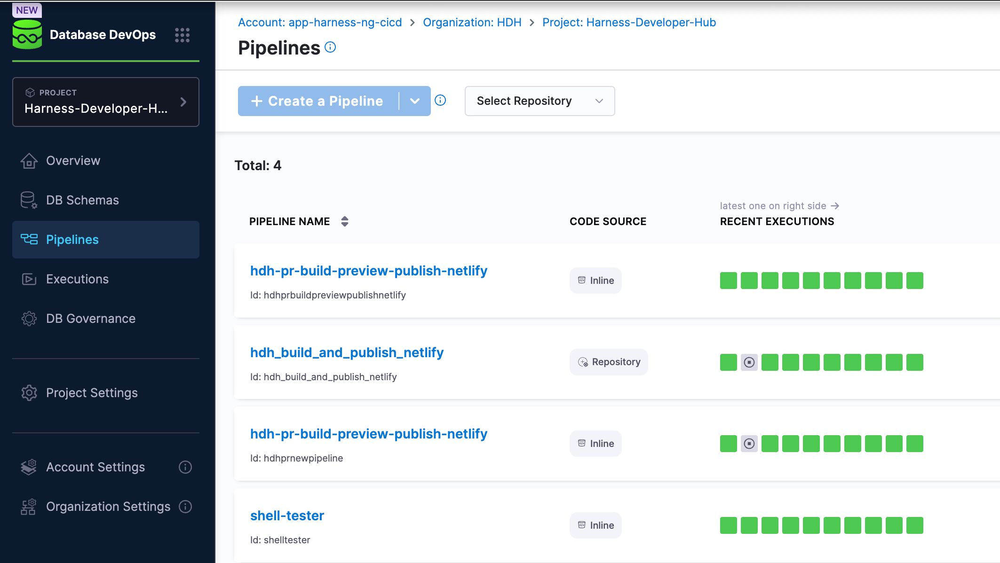

    

# Create a pipeline in Database DevOps

1. In Harness, go to the **Database DevOps** module and select your **Project**. 
 2. Ensure that the database schema you want to deploy is already set up. You can find the steps about how to create your database schema in the [Deploying Database Schemas documentation](./deploying-database-schema.md).  
 3. Select **Create a new pipeline**.  
 4. In the pipeline configuration, add the stage, or multiple stages, that align with the actions you want to perform. The options are:
  a. **Add a Stage for Database Deployment**: a stage that will handle the deployment of your database schema changes. 
  b. **Add a Stage for Application Deployment**: This stage will manage the deployment of your application code. 
 5. Configure the Database Deployment stage to your liking if it's a step you've added. 
 6. Configure the Application Deployment stage to your liking if it's a step you've added. 
 7. Continue following the steps, set up the rollback mechanisms and validate the pipeline configuration. 
 9. Once the pipeline is configured to your liking, select **Save pipeline**.

:::info
To add a Liquibase command step, you can refer to the Harness documentation detailing how to [Add a Liquibase Command Step](./add-liquibase-command-step.md)
:::
