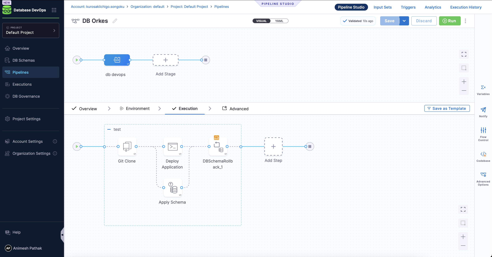

import Tabs from '@theme/Tabs';
import TabItem from '@theme/TabItem';

Modern applications are tightly coupled with the databases they rely on. Deploying a new version of an application often requires a corresponding schema update in the database. If these two changes are not coordinated properly, it can lead to application downtime, data inconsistencies, or failed deployments.

Harness Database DevOps enables you to **orchestrate database and application changes in a single pipeline**, ensuring both layers evolve together in a controlled and reliable manner. In this guide, we'll walk through the process of creating a pipeline that coordinates both application and database changes.

## Why Coordinate App and DB Deployments?

- **Eliminate drift**: Prevent mismatches between application code and database schema.  
- **Zero downtime**: Support phased rollouts with pre-validated schema updates.  
- **Rollback safety**: Roll back both schema and app changes if deployment fails.  
- **Single source of truth**: Manage all change logic in one pipeline.  

## Pipeline Design Principles

When creating a pipeline that coordinates both application and database changes, consider the following steps:

1. **Clone Application and Schema Repositories** – Fetch the application code and database migration scripts.  
2. **Deploy the Application** – Roll out changes to Kubernetes or another runtime environment.  
3. **Apply Database Schema Changes** – Execute schema migrations aligned with the application version.  
4. **Rollback Strategy** – Define how to roll back schema or application if issues occur.  

### Example Workflow

<Tabs>
  <TabItem value="Visual" label="Visual" default>    
  
  
  </TabItem>
  <TabItem value="Yaml" label="Yaml">

  ```yaml
    pipeline:
    name: DB Orkes
    identifier: DB_Orkes
    projectIdentifier: default_project
    orgIdentifier: default
    tags: {}
    stages:
      - stage:
          name: db devops
          identifier: db_devops
          description: ""
          type: Custom
          spec:
            execution:
              steps:
                - stepGroup:
                    name: test
                    identifier: test
                    steps:
                      - step:
                          type: GitClone
                          name: Git Clone
                          identifier: Git_Clone
                          spec:
                            connectorRef: demodb
                            repoName: orkes
                            build:
                              type: branch
                              spec:
                                branch: main
                      - parallel:
                          - step:
                              type: Run
                              name: Deploy Application
                              identifier: Deploy_Application
                              spec:
                                connectorRef: dockerHarness
                                image: bitnami/kubectl:latest
                                shell: Bash
                                command: |-
                                  cd orkes
                                  echo "Deploying app from GitLab Container Registry..."
                                  kubectl apply -f deployment.yml
                                  kubectl rollout status deployment/go-mongodb-app
                              failureStrategies:
                                - onFailure:
                                    errors:
                                      - Timeout
                                    action:
                                      type: Ignore
                          - step:
                              type: DBSchemaApply
                              name: Apply Schema
                              identifier: Apply_Schema
                              spec:
                                connectorRef: account.harnessImage
                                dbSchema: DB_Orkes
                                dbInstance: mongorelease
                                tag: v1.0.0
                                changeSetFailureStrategy: MARK_NEXT_RUN
                              timeout: 10m
                      - step:
                          type: DBSchemaRollback
                          name: DBSchemaRollback_1
                          identifier: DBSchemaRollback_1
                          spec:
                            connectorRef: account.harnessImage
                            dbSchema: DB_Orkes
                            dbInstance: mongorelease
                            changeSetCount: 1
                          timeout: 10m
                          when:
                            stageStatus: Failure
                    stepGroupInfra:
                      type: KubernetesDirect
                      spec:
                        connectorRef: db
              rollbackSteps: []
            serviceDependencies: []
          tags: {}
  ```
  </TabItem>
</Tabs>

## Key Highlights

- **Parallel Execution**: Application deployment and schema migrations can run in parallel to reduce deployment time.  
- **Schema Failure Strategy**: Use failure strategies such as marking failed changesets for rollback continuity.  
- **Rollback Support**: Schema rollback ensures recovery when deployments fail or validation errors are detected.  
- **Kubernetes Native**: Direct cluster access simplifies application rollouts and coordination. 

## Best Practices

1. **Backward-Compatible Schema Changes** - Always design schema updates that can work with older application versions.  
2. **Feature Flags** - Gate new features until the schema change is fully deployed and validated.  
3. **Version Alignment** - Tag schema migrations (e.g., `v1.0.0`, `v1.0.1`) to match application releases.  
4. **Progressive Rollouts** - Combine with deployment strategies like blue/green or canary rollouts.  
5. **Automated Rollbacks** - Test rollback flows regularly to ensure recovery is reliable.  

## Conclusion

By orchestrating application and database changes together in Harness pipelines, you can deliver **faster, safer, and more resilient deployments**. This approach removes the risks of mismatched deployments and provides a single automated flow for managing complex, interdependent changes.
