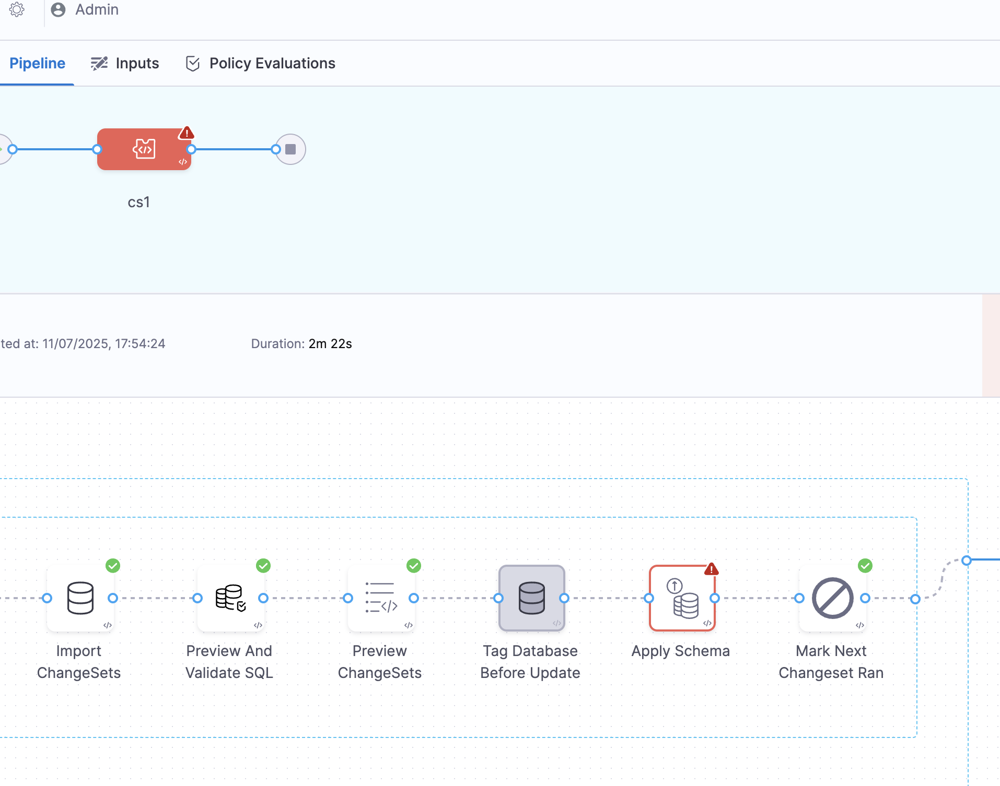
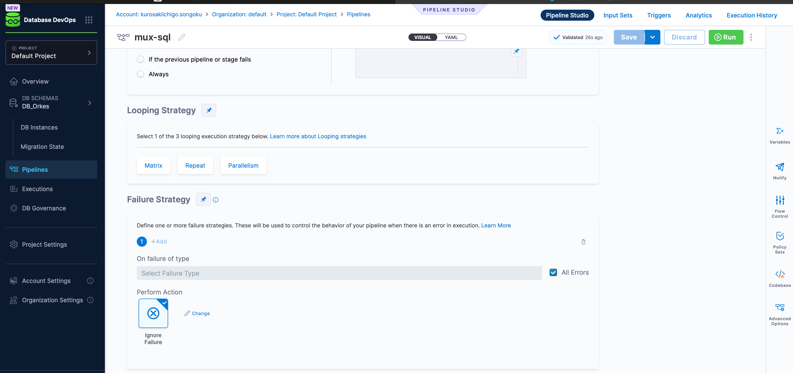

In Database DevOps pipelines, failures may occur during execution due to invalid changes, dependency conflicts, or runtime issues. Harness provides rollback-focused failure strategies to help you manage such cases.

:::info
This document focuses on failure strategies specific to Database DevOps steps. For general failure handling in Harness pipelines, see [Failure Strategies](https://developer.harness.io/docs/platform/pipelines/failure-handling/define-a-failure-strategy-on-stages-and-steps/).
:::

## Supported Failure Strategies

### Mark Failed Changeset Ran
The **Mark Failed Changeset Ran** option is available in the **Apply Schema** step under Harness Database DevOps.  

When enabled, it ensures that failed changesets are marked as **ran** in the database changelog table, even if they don’t execute successfully.  

- **When to use:**  
  Use this option when you want rollback steps to include failed changesets, so that rollback scripts can attempt to clean up any partial changes. This is particularly useful for databases that implicitly commit DML statements (such as Oracle), where rollback logic must handle partial failures.  

- **Outcome:**  
  - The failed changeset is flagged as **ran**, so it won’t be retried in future runs.  
  - If a rollback step exists (and rollback scripts are defined), it will execute rollback logic for the failed changeset.  

:::info
For more details, see [Mark Failed Changeset Ran](../features/mark-failed-changeset-ran.md).
:::

### Ignore
Skips the rollback attempt for the failed changeset.

- **When to use:**  
  If the rollback expression may not be valid due to an earlier failure (for example, if a tag before the update did not execute successfully).  

- **Outcome:**  
  The failed changeset remains as-is, and the pipeline continues execution without reverting it.  

:::caution
Use this strategy carefully. Ignoring a failed rollback can leave your database in a partially applied state.
:::

## Unsupported Failure Strategies
The following strategies are **not supported** in Database DevOps steps:  
- Retry  
- Mark as Success  
- Stage-level failure handling  

If these are configured at higher levels, Harness ignores them during Database DevOps step execution.  

## Best Practices
- Always test rollback scripts alongside forward changes to ensure safe recovery paths.  
- Use `Ignore` only when rollback logic is invalid or unnecessary.  
- Prefer `Mark Failed Changeset Ran` when you want to unblock pipeline execution but avoid reapplying the same changeset.  