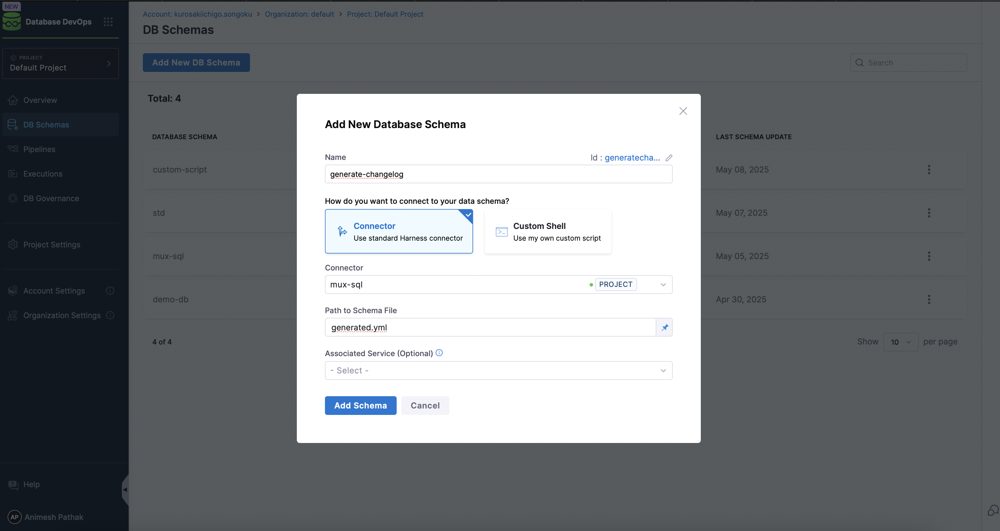
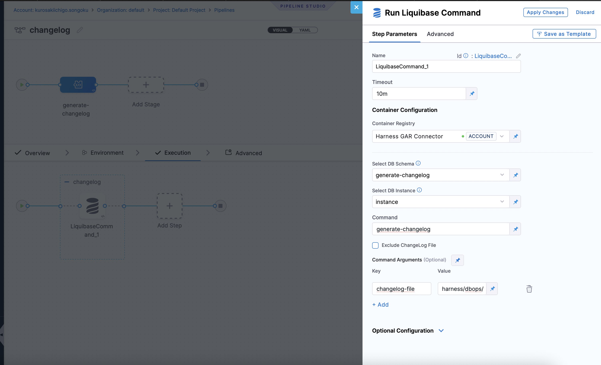
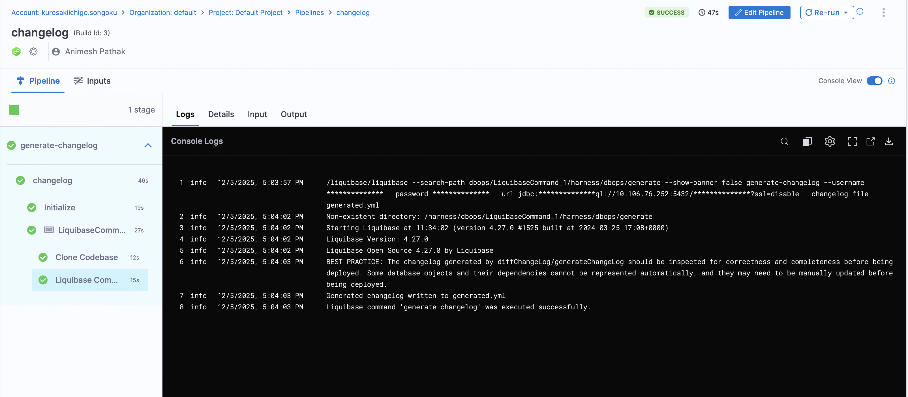

import Tabs from '@theme/Tabs';
import TabItem from '@theme/TabItem';

A changelog is a collection of database changes that can be applied to a database. It serves as a version-controlled record of changes, allowing teams to manage and track modifications to the database schema and data.

Harness DBOps offers multiple methods to generate changelogs for your database. This document outlines the various approaches available and provides step-by-step guidance for each.

- [Generate Changelog from Command](#steps-to-create-a-changelog-with-the-generate-changelog-command)
- [Pointing to SQL Files](#steps-to-create-a-changelog-with-sql-files)

## Setup Changelog

<Tabs>
<TabItem value="Using existing SQL files">

You can create a changelog by pointing to SQL files in your git repository. This method is useful if you have existing SQL scripts that you want to use as changelogs.
This approach allows you to leverage your existing SQL files without needing to convert them into a specific changelog format.

### Steps to Create a Changelog with SQL Files

1. Place your SQL files it in a subfolder named `sql` in git repository.
2. Ensure that the SQL files are named in a way that reflects their order of execution. 
:::info 
For example, you can use a naming convention like `V1__create_table.sql`, `V2__add_column.sql`, etc.
:::
3. Each SQL file should contain the SQL statements that define the changes you want to apply to your database schema.
4. Add `changelog.yml` to your git repository. In this file, include the following configuration to reference the SQL files:

```yaml
databaseChangeLog:
  - includeAll:
      path: sql
      relativeToChangelogFile: true
```
</TabItem>

<TabItem value="Generate Changelog Command">
You can create a changelog by using the `generate-changelog` command. This method is useful if you want to generate a changelog based on the current state of your database. This approach allows you to create a changelog file that reflects the current state of your database schema.

### Steps to Create a Changelog with the `generate-changelog` Command

1. Under `DBOps` in the Harness UI, navigate to `DB Schema`.
2. Click on the `Add DB Schema` button.

3. Click on the `Add DB Instance` button.
4. Go to `Pipeline` and click on the `Create a Pipeline` button.
5. Click on the `Add Stage` button and select `custom stage`.
6. In the `Stage` section, create `Add Step Group` as the stage type.
:::warning note 
Toggle on the "Enable container based execution".
:::
7. In the `Step Group` section, select `Add Step` as the step type. Under "DB DevOps", select `Liquibase Command` as the step type.
8. By default the name is "LiquibaseCommand_1".

- **Select DB Schema**: The DB Schema we created on Step 2.
- **Select DB Instance**: The Instance we created on Step 3.
- **Command**: The command to be executed. In this case, we will use `generate-changelog` to generate a changelog file.
9. Click `Apply Changes` and Save the Pipeline.
10. Click on the `Run` button to run the pipeline.
11. Once the pipeline is executed successfully, you will find the changelog file in the specified path.



</TabItem>
</Tabs>

## How changesets work
A changeset is the smallest deployable unit of change to a database. When using DB DevOps changesets a can be applied or rolled back individually. Which changesets have been applied are tracked inside that database in the `databasechangelog` tracking table. A changeset looks somthing like this:

```yaml
databaseChangeLog:
  - changeSet:
      id: product-table
      author: animesh
      labels: products-api 
      comment: Creating product table for REST API
      changes:
        - createTable:
            tableName: products
            columns:
              - column:
                  name: id
                  type: SERIAL
                  constraints:
                    primaryKey: true
              - column:
                  name: name
                  type: VARCHAR(100)
                  constraints:
                    nullable: false
              - column:
                  name: price
                  type: NUMERIC(10,2)
                  constraints:
                    nullable: false
                  defaultValue: 0.00
```

When using DB DevOps changesets can be applied or rolled back individually, which changesets have been applied are tracked inside that database in the `databasechangelog` tracking table. It only executes new changesets or those with modified checksums and records successful executions in the tracking table. If a changeset fails, it will not be recorded in the tracking table, and you can re-run it later. This allows for easy rollback and re-application of changesets as needed.