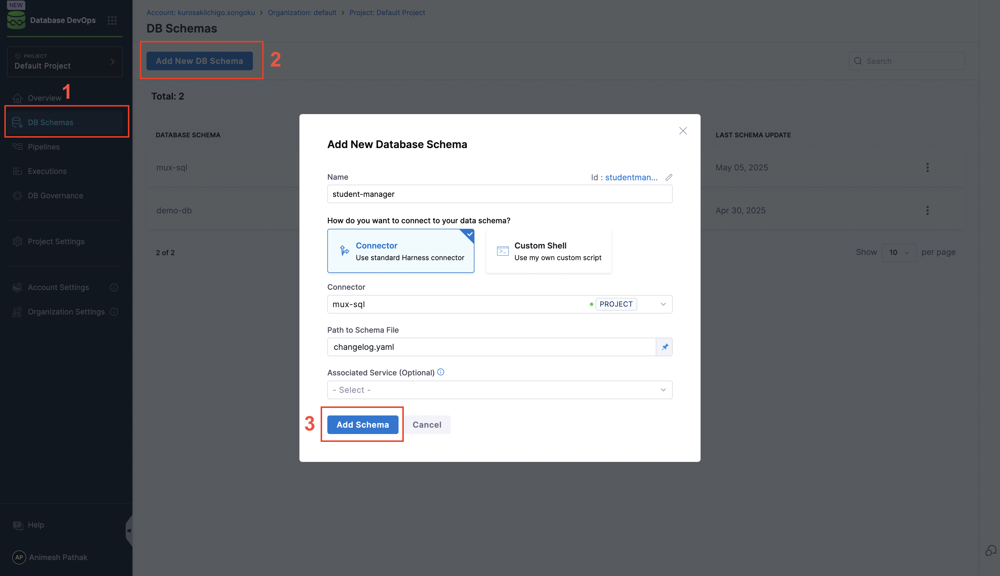

Harness Database DevOps supports managing database changes using **environment-specific branches**. This approach allows you to maintain different configurations for development, staging, and production environments directly in your Git repository.

## Why Use Environment Branches in Harness Database DevOps?

Here are several reasons why teams opt for a branch-per-environment strategy:

- **Consistency with Application Deployment**: If you're already managing app deployments using environment-specific branches, aligning your DB changes keeps both layers synchronized.
- **Environment-Specific Configurations**: Maintain isolated configurations or schema changes for dev, staging, and production environments.
- **Controlled Progression**: Promote and test changes in lower environments before merging them into production.
- **Audit Trail**: Each branch maintains a commit history that improves traceability and accountability for schema changes.

## What Are the Tradeoffs of Branch Per Environment?

While beneficial, this approach introduces some complexity:

- **Increased Complexity**: Managing multiple branches requires rigorous Git hygiene.
- **Potential for Drift**: Without strict coordination, environments can diverge.
- **Merge Conflicts**: More branches = more chances for conflict.
- **Overhead**: Requires additional team effort to maintain branches and reviews.
- **Unintentional Promotion of Dev-Only Changes**: If you're managing dev/staging-only changes (like test tables or mock data), they may unintentionally get merged into higher environments.  

::: note
**Recommendation**: Use the `context` field on the database instance to restrict execution, even when the change exists in the branch. You can adopt this model if your **application deployment already follows a branch-per-environment** structure—ensuring consistency across the stack.
:::

## How to Configure

Follow these steps to configure environment-based deployments in Harness Database DevOps:

### 1. **Set Up Your Git Branches**
Create separate branches in your Git repo for each environment: `development`, `staging`, `production`, etc.

### 2. **Define Schema Configuration per Branch**

- Go to **Database DevOps** and Click on **Add DB Schema**.

### 3. **Create a Database Instance**

1. Select the **Database Schema** and click on **Add DB Instances** in Harness.
2. Create a new instance for each environment.
3. Attach the appropriate JDBC connector and context labels.

### 4. **Configure a Git Trigger**

1. Navigate to **Pipeline Studio > Triggers**.

2. Add a new **Git trigger** that listens for changes on each environment branch.
  - For example, `dev` trigger watches `dev` branch merges.
3. Select the **Git repository** and specify the **Event** type (e.g., `Push`).

4. Click on Continue and Configure the conditions for the trigger:
   - **Branch Name**: Specify the branch to watch (e.g., `dev`, `staging`, `prod`).
   - **Changed Files**: Optionally, specify file patterns to filter changes (e.g., `schemas/*.sql`).

    
5. Enter the Pipeline Inputs that the trigger will use:
   - **Trigger Branch**: This is the branch that the trigger will monitor.
   - **Rollback Tag (Optional)**: Optionally, specify a tag to use for rollbacks.
   - **Tag (Optional)**: Optionally, specify a tag to apply to the deployment.

   

::: note
You can learn more about triggers in Harness Database DevOps [Learn how to configure Git triggers →](https://developer.harness.io/docs/platform/triggers/tutorial-cd-trigger/)
:::

### 5. **Design Your Pipeline**

1. In **Pipelines**, create a pipeline that includes a `DBSchemaApply` step.
2. Set up the pipeline to:
  - Deploy using the associated schema and DB instance.
  - Apply only the changes in that branch.
  - Optionally include approvals, rollback, and verification steps.

### 6. **Manage Promotion Between Environments**

1. Use Git pull requests to promote changes between branches. e.g., `dev` → `staging` or `staging` → `prod`
2. Harness will auto-detect the merged changes via the trigger and deploy accordingly.

## Conclusion

Deploying by environment branches in Harness Database DevOps provides alignment with traditional application deployment strategies and gives teams clear separation of concerns. While it introduces more Git management overhead, it enables safer promotion paths and more isolated testing.

Just ensure to manage drift carefully, use [contexts](../../../concepts-and-features/glossary/context.md) to limit dev-only changes, and maintain strong PR discipline when promoting between branches.
