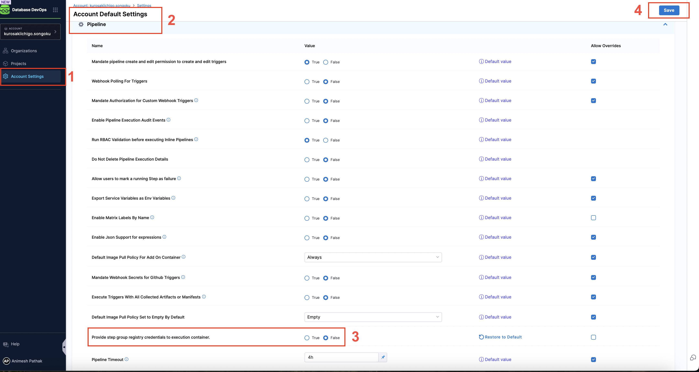
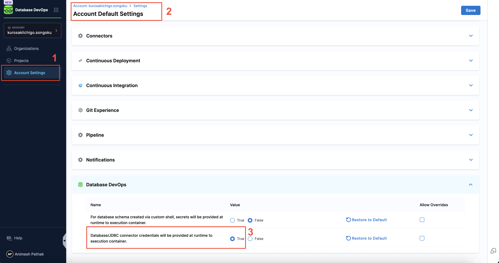
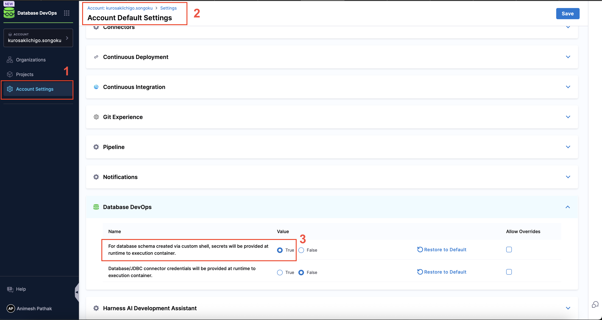

import Tabs from '@theme/Tabs';
import TabItem from '@theme/TabItem';

## Overview

This guide explains how secrets (like registry credentials, clone script secrets, and database passwords) are managed securely at runtime in DBOps pipelines within Harness.

## Why Runtime Secrets Matter

In Harness DBOps pipelines, secrets like container registry credentials, database passwords, and script tokens are needed to run your workflows. By default, these secrets are stored as Kubernetes Secrets and attached to the pods when they run.

However, For organizations with stricter compliance requirements or a desire to minimize secrets exposure, this feature lets you pass secrets directly to containers only when they’re needed-without saving them in pod specs, Kubernetes manifests.

:::info note
Once the step is completed, the pods are terminated, and the secrets are removed from memory. This means that even if someone gains access to the pod, they won't be able to retrieve the secrets.
:::

## Supported Secret Types

In DBOps workflows, the following types of secrets are typically required:

1. **Container Registry** – used to pull images from private or public registries.
2. **Schema Repo Clone Secrets** – used by scripts to fetch schema definitions from source control.
3. **Database Passwords** – used for authenticating with databases via JDBC or similar connectors.


### How it Works

<Tabs>
<TabItem value="Container Registry">
By default, Kubernetes can pull public images from Docker Hub or similar public registries. However, for accessing private registries, explicit authentication is required.

Harness gives you the flexibility to skip passing container registry credentials from the pipeline - if your Kubernetes cluster is already configured to authenticate using a service account. This is done by creating a Kubernetes secret and attaching it to the service account used by the pods. This way, all pods using that service account can pull images from the private registry without needing to specify `imagePullSecrets` in each pod spec. 

To configure Provide step group registry credentials to execution container, follow these steps:

1. Go to `Account Settings`.
2. Navigate to the Default setting and click on `Pipeline`.
3. Select the value `False` for **Provide step group registry credentials to execution container**. (Default value is `True`)



To manually configure registry access in your cluster:

1. Create the secret:

```bash
kubectl create secret generic registry-credential \
  --from-file=.dockerconfigjson=<path/to/.docker/config.json> \
  --type=kubernetes.io/dockerconfigjson
```

2. Attach the secret to a service account:

```bash
kubectl patch serviceaccount default \
  -p '{"imagePullSecrets": [{"name": "registry-credential"}]}'
```

Once this setup is complete, all new pods using this service account will automatically use the secret to pull images from the private registry without needing `imagePullSecrets` in each pod spec.

</TabItem>

<TabItem value="Database Passwords">
Similar to how secrets are handled in custom scripts, Harness injects database passwords securely at runtime.
By default, the database password is passed as an environment variable to the step container. 

To enable runtime secret injection for database credentials, follow these steps:

1. Go to `Account Settings`.
2. Navigate to the Default setting and click on `Database DevOps`.
3. Select the value `True` for **Inject database secrets at runtime**.



</TabItem>

<TabItem value="Custom Script Secrets">

With Harness, secrets used in DBSchema clone scripts are injected dynamically at runtime, meaning that they are not stored in:
- Pod spec
- Persistent environment variables

To enable runtime secret injection for database credentials, follow these steps:

1. Go to `Account Settings`.
2. Navigate to the Default setting and click on `Database DevOps`.
3. Select the value `True` for **Inject custom shell script secrets** at runtime.



Secrets are not retained after process execution. Even if someone runs `kubectl exec` into the pod, these values remain inaccessible.

:::info important
This feature only applies to DBSchema clone scripts. It does not apply to GitClone or Artifactory connector secrets.
To understand how to add and reference file secrets in Harness pipelines, refer to the official documentation:  
[Add and reference file secrets](https://developer.harness.io/docs/platform/secrets/add-file-secrets#reference-by-id)
:::

</TabItem>
</Tabs>

## Benefits

- Secrets are not stored in Kubernetes or pod specs.
- Enhanced security as secrets only live in memory for the duration of execution.
- Reduced surface area for secret leakage or misuse.
- With the ability to inject secrets at runtime, teams no longer need to hardcode sensitive values or manage additional Kubernetes constructs like imagePullSecrets in every pod definition.

:::info Note
These benefits are realized only when runtime secret injection settings are explicitly enabled in the Database DevOps module under Account Settings.
:::