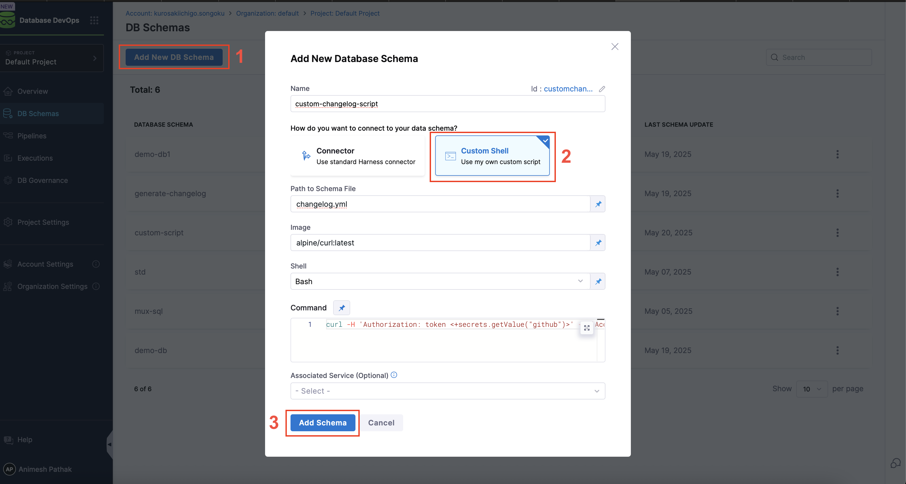
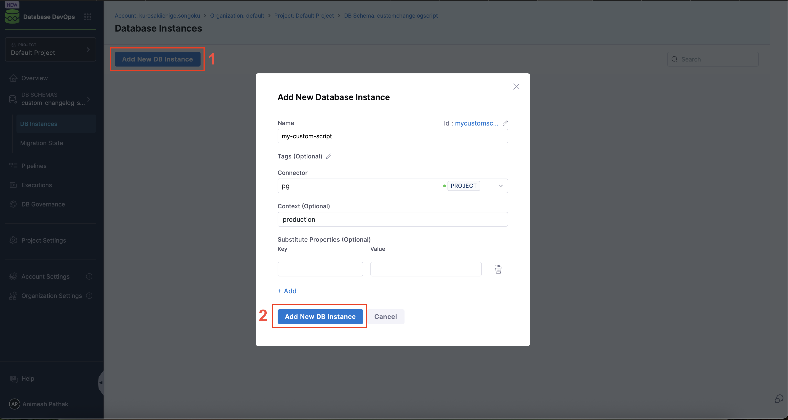
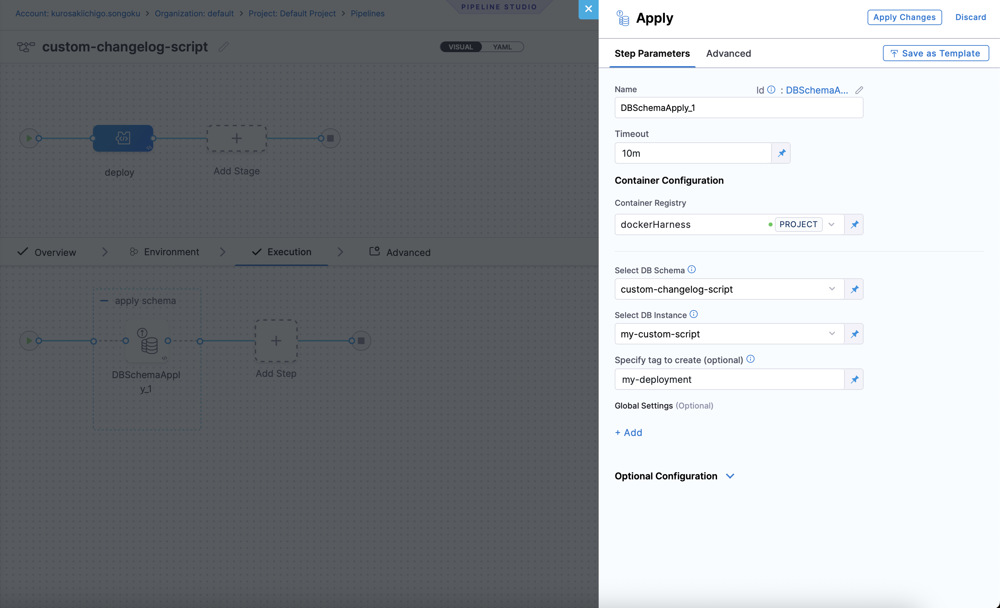
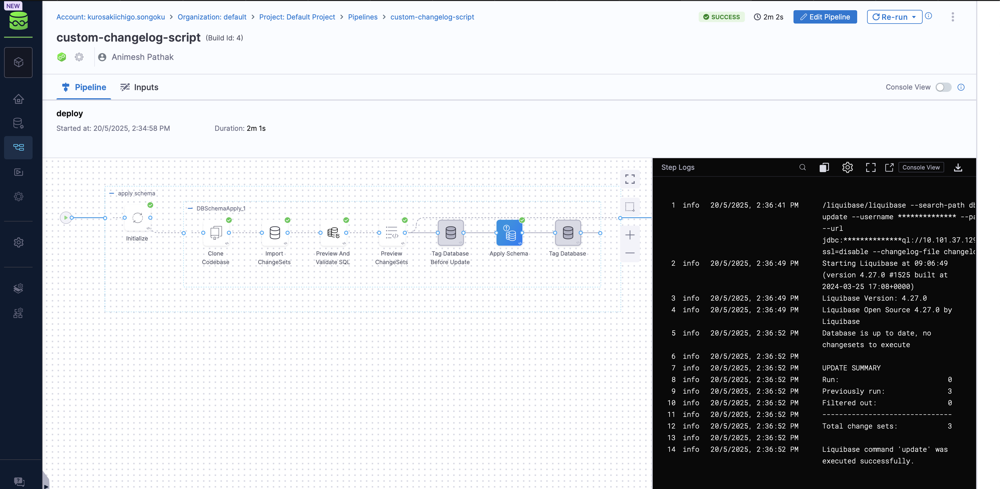

## Overview

In certain Database DevOps workflows, users may prefer or require a **custom script** to retrieve and manage their Liquibase changelog rather than using a connector or direct integration.  

This guide provides a comprehensive overview of how to use a custom script for Database DevOps, including the creation of a DB Schema, deployment of the schema, and the use of pipeline variables.

## Use Case

This guide supports the following scenario:

- The customer maintains a Liquibase changelog in a remote repository (e.g., GitHub, JFrog). This is particularly useful when the changelog is stored in a repository for which Harness does not provide a native connector.
- They want to download and extract this changelog dynamically via a custom shell script.
- The script can reference **pipeline variables**, such as build versions or access tokens.

:::info
Before proceeding, ensure you have set up a **Docker Registry Connector** to define the custom base image used in your pipeline. Follow the official [Harness documentation](https://developer.harness.io/docs/platform/connectors/cloud-providers/ref-cloud-providers/docker-registry-connector-settings-reference/) to configure this connector.
:::

## Step by Step Guide
By following these steps, you can effectively manage your database changes and streamline your DevOps processes.

### Create a DB Schema
1. Under `Database DevOps` in the Harness UI, navigate to `DB Schema`.
2. Click on the `Add New DB Schema` button.

- **Connect to Data Schema**: Connect via Harness Connector or use a custom script to connect to the database schema stored in a remote repository.
- **Schema Path**: The path to the schema file in the repository. This is where the custom scripts writes the changelog files that DB DevOps should use during pipeline execution. 
- **Image**: The Docker image to be used for the custom script. This should be a base image that has the necessary tools and libraries installed to execute your script.
- **Shell**: The shell to be used for executing the script. This can be `bash`or `sh`which are supported by the Docker image.
- **Script**: The custom script that will be executed. This script should include the logic to download and extract the changelog file from the remote repository. For example:
    ```sh
    curl -H 'Authorization: token <+secrets.getValue("github")>'
     -H 'Accept: application/vnd.github.v3.raw'
     -L https://api.github.com/repos/Sonichigo/mux-sql/contents/liquibase.yml?ref=main -o changelog.yml
    ```
    :::info
     If your custom script requires variables or parameters, you can reference them using JEXL expressions. For example, you can reference file secrets securely by their ID. Learn more about [referencing file secrets](https://developer.harness.io/docs/platform/secrets/add-file-secrets#reference-by-id). To learn how DB DevOps supports runtime secrets specifically, see the [Runtime Secrets](https://developer.harness.io/docs/database-devops/use-database-devops/get-started/runtime-secrets) guide.
    :::
3. Click on the `Save` button.
4. The DB Schema will be created and you can see the details in the UI.
5. Select the `DB Schema` and Click on the `Add New DB Instance` button.

- **Name of DB Instance**: The name of the DB Instance. This is the name that will be used in the pipeline to refer to this DB Instance.
- **Tags (optional)**: Tags to be used for the DB Instance. This can be used to change which instances are shown on the migration state dashboard. If left blank, the tags will be automatically generated.
- **Connector**: The JDBC Connector to be used for the DB Instance. This is the connector that will be used to connect to the database instance.
- **Context**: The context is used to control which changelogs are deployed to which environments. This is useful when you have multiple environments (e.g., dev, test, prod) and you want to deploy different changelogs to each environment.

### Deployment Pipeline
1. Under `Database DevOps` in the Harness UI, navigate to `Pipelines`.
2. Click on the `Create a Pipeline` button.
3.  Click on the `Add Stage` button and select `custom stage`.
4. In the `Stage` section, create `Add Step Group` as the stage type.
:::warning note 
Toggle on the "Enable container based execution".
:::
5. In the `Step Group` section, select `Add Step` as the step type. Under "DB DevOps", select `Apply Schema` as the step type.

- **Select DB Schema**: The DB Schema we created earlier.
- **Select DB Instance**: The Name of the DB Instance, which was created earlier in our DB Schema.
- **Tags (optional)**: Tags to be used for the DB Instance. This can be used to identify the DB Instance in the pipeline. If left blank, the tags will be automatically generated.

6. Click on the `Apply Changes` button, and then click on the `Save` button.
7. The pipeline will be created and you can see the details in the UI.
8. Click on the `Run` button to run the pipeline.



That's it! You have successfully created a DB Schema and deployed it using a custom script. You can now use this pipeline to deploy your DB Schema to the database instance.
