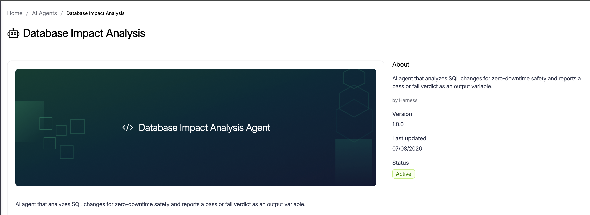
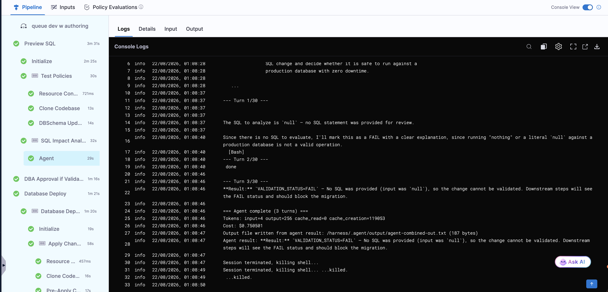
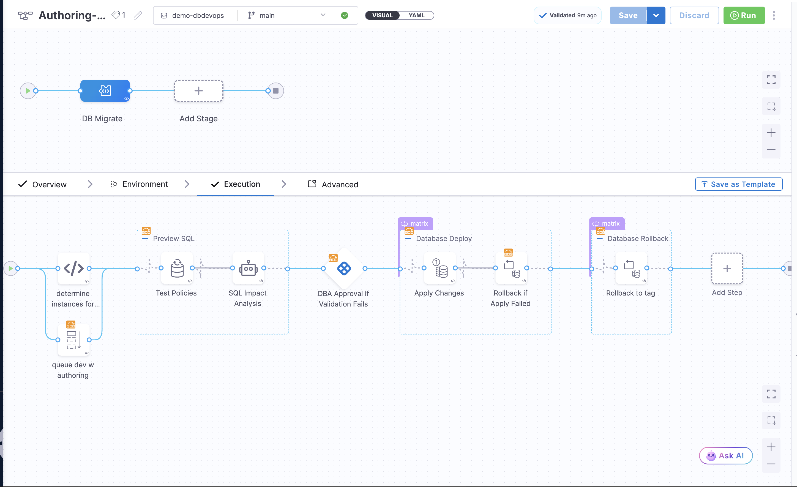

import Tabs from '@theme/Tabs';
import TabItem from '@theme/TabItem';

The **Database Impact Analysis** agent reviews SQL changes against zero-downtime safety criteria and emits a `VALIDATION_STATUS` of `PASS` or `FAIL`. When you wire this agent between a Preview SQL step and a conditional Harness Approval step, your pipeline applies safe changes automatically and escalates risky changes to a DBA for review.



## Before you begin

- **Database DevOps pipeline:** You need an existing or new pipeline with a Custom stage. Go to [Create a pipeline in Database DevOps](/docs/database-devops/gitops/create-a-pipeline) to set one up.
- **Kubernetes infrastructure:** The Preview SQL and Agent steps run in a step group with Kubernetes infrastructure. Go to [Set up connectors](/docs/database-devops/use-database-devops/set-up-connectors) to configure the required connectors.
- **LLM connector:** The agent requires an Anthropic or Bedrock LLM connector. Go to [Configure LLM for Database DevOps](/docs/database-devops/use-database-devops/configure-llm-for-database-devops) to create one.
- **Approver user group:** The conditional approval step routes to a user group. Create or confirm your DBA user group exists in Harness before adding the step.

## How the pipeline works

The pattern uses three sequential steps:

1. **Preview SQL** - generates the SQL Harness will apply, without touching the database.
2. **Database Impact Analysis agent** - receives the generated SQL and evaluates it against zero-downtime safety criteria. It writes `VALIDATION_STATUS=PASS` or `VALIDATION_STATUS=FAIL` and a `SUMMARY` to its output variables.
3. **Conditional approval** - runs only when `VALIDATION_STATUS` is not `PASS`. The approval message includes both the agent's summary and the raw SQL so the approver has full context.

If the agent returns `PASS`, the pipeline skips the approval step and proceeds directly to apply the schema change.

## Add the preview SQL step

Place the Preview SQL step in a step group with Kubernetes infrastructure. This step group also holds the agent step.

1. In your pipeline, select the Custom stage, then select the **Execution** tab.
2. Select **Add Step Group**, enter a name such as `Preview SQL`, and select **Kubernetes** as the infrastructure type.
3. Configure the Kubernetes connector and namespace for the step group.
4. Inside the step group, select **Add Step** and select **DB Schema Update SQL** (Preview SQL).
5. Configure the step:
   - **Connector:** select your container image connector (for example, `account.harnessImage`).
   - **DB Schema:** enter or reference your schema identifier.
   - **DB Instance:** enter the target instance, or use an expression such as `<+pipeline.variables.dbInstance>`.
6. Note the step's identifier - you need it to reference the SQL output in the next step. For example, `Test_Policies`.

## Add the Database Impact Analysis agent step

Add the agent step inside the same step group, after the Preview SQL step.

1. Inside the `Preview SQL` step group, select **Add Step** and select **Agent**.
2. In the **Agent Name** field, enter `databaseImpactAnalysis`.
3. Configure the agent settings:
   - **LLM Connector:** select your Anthropic or Bedrock connector (for example, `account.harnessAnthropic`).
   - **Model Name:** enter the model identifier (for example, `global.anthropic.claude-haiku-4-5-20251001-v1:0`).
   - **SQL:** pass the output from the Preview SQL step using the expression:
     ```
     <+execution.steps.Preview_SQL.steps.Test_Policies.output.sqlCommands>
     ```
     Replace `Preview_SQL` with your step group identifier and `Test_Policies` with your Preview SQL step identifier.
   - **MCP Connectors:** optional. Add MCP connectors if you need additional schema or database context.

The agent step writes two output variables when it completes:

| Variable | Values | Description |
|---|---|---|
| `VALIDATION_STATUS` | `PASS` or `FAIL` | Whether the SQL meets zero-downtime safety criteria. |
| `SUMMARY` | Text | A concise explanation of what the change does and why it is or is not safe. |

## Add the conditional approval step

Add a Harness Approval step after the step group. Configure it to run only when the agent fails validation.

1. Outside the step group, select **Add Step** and select **Harness Approval**.
2. Set the **Timeout** to your required review window (for example, `1d`).
3. In the **Approval Message** field, include both the agent summary and the raw SQL:

   ```text
   Please review the SQL that will be applied and approve or reject the change.

   AI Analysis: <+pipeline.stages.DB_Migrate.spec.execution.steps.Preview_SQL.steps.SQL_Impact_Analysis.steps.agent.output.outputVariables.SUMMARY>

   Raw SQL: <+execution.steps.Preview_SQL.steps.Test_Policies.output.sqlCommands>
   ```

4. Under **Approvers**, select the user group responsible for database changes (for example, `account.DBAs`).
5. Select the **Conditional execution** toggle and enter this condition:

   ```bash
   <+execution.steps.Preview_SQL.steps.SQL_Impact_Analysis.steps.agent.output.outputVariables.VALIDATION_STATUS>!="PASS"
   ```
   Replace `Preview_SQL` and `SQL_Impact_Analysis` with your actual step group and agent step identifiers.

6. Set **Stage Status** to `Success`.

When the pipeline runs, this step only appears when the agent emits `FAIL`. Approved runs proceed to the apply step; rejected runs abort.

## Apply the schema change

Add a DB Schema Apply step after the approval step to deploy the reviewed changes.

Go to [Apply a DB schema step](/docs/database-devops/use-database-devops/step-guide/apply-dbschema-step) to configure the apply step, rollback behavior, and matrix strategy for multiple instances.



## Complete pipeline YAML

The following YAML shows the full pipeline configuration for a single-branch scenario. Adapt the step group names, connectors, and variable references to match your environment.

<Tabs>
<TabItem value="visual" label="visual structure" default>



</TabItem>
<TabItem value="yaml" label="YAML">

```yaml
stages:
  - stage:
      name: DB Migrate
      identifier: DB_Migrate
      type: Custom
      spec:
        execution:
          steps:
            - stepGroup:
                name: Preview SQL
                identifier: Preview_SQL
                steps:
                  - step:
                      type: DBSchemaUpdateSQL
                      name: Test Policies
                      identifier: Test_Policies
                      spec:
                        connectorRef: account.harnessImage
                        dbSchema: <+pipeline.variables.dbSchema>
                        dbInstance: <+pipeline.variables.dbInstance>
                      timeout: 10m
                  - step:
                      type: Agent
                      name: SQL Impact Analysis
                      identifier: SQL_Impact_Analysis
                      spec:
                        agentName: databaseImpactAnalysis
                        agentSettings:
                          llmConnector: account.harnessAnthropic
                          modelName: global.anthropic.claude-haiku-4-5-20251001-v1:0
                          SQL: <+execution.steps.Preview_SQL.steps.Test_Policies.output.sqlCommands>
                stepGroupInfra:
                  type: KubernetesDirect
                  spec:
                    connectorRef: <your_k8s_connector>
                when:
                  stageStatus: Success
                  condition: <+pipeline.variables.branch>=="main"
            - step:
                type: HarnessApproval
                name: DBA Approval if Validation Fails
                identifier: DBA_Approval
                spec:
                  approvalMessage: "Please review the SQL that will be applied and approve or reject the change.\n\nAI Analysis: <+pipeline.stages.DB_Migrate.spec.execution.steps.Preview_SQL.steps.SQL_Impact_Analysis.steps.agent.output.outputVariables.SUMMARY>\n\nRaw SQL: <+execution.steps.Preview_SQL.steps.Test_Policies.output.sqlCommands>"
                  includePipelineExecutionHistory: true
                  isAutoRejectEnabled: false
                  approvers:
                    userGroups:
                      - account.DBAs
                    minimumCount: 1
                    disallowPipelineExecutor: false
                  approverInputs: []
                timeout: 1d
                when:
                  stageStatus: Success
                  condition: <+execution.steps.Preview_SQL.steps.SQL_Impact_Analysis.steps.agent.output.outputVariables.VALIDATION_STATUS>!="PASS"
```

</TabItem>
</Tabs>

## Agent template reference

The Database Impact Analysis agent is a Harness-provided template. You can also install it directly from the Harness AI Agents catalog. The template inputs are:

| Input | Type | Required | Default | Description |
|---|---|---|---|---|
| `sql` | string | Yes | - | The SQL migration or change script to analyze. |
| `llm_connector` | connector | Yes | `account.harnessAnthropic` | The Anthropic or Bedrock LLM connector. |
| `model_name` | string | Yes | `global.anthropic.claude-haiku-4-5-20251001-v1:0` | The model identifier or inference-profile ARN. |
| `mcp_connectors` | array | No | - | MCP connectors for additional schema context. |

The agent evaluates the SQL against these safety criteria:

- Backward compatible with old and new application versions running simultaneously.
- Does not create locks lasting more than 500ms.
- Does not cause data loss or an outage.
- Can be undone.

## Next steps

- Go to [Preview SQL with manual approval](/docs/database-devops/use-database-devops/governance/using-approval-gates-with-harness-ui) to set up approval gates without AI analysis.
- Go to [Apply a DB schema step](/docs/database-devops/use-database-devops/step-guide/apply-dbschema-step) to configure the apply step after approval.
- Go to [Using OPA with Database DevOps](/docs/database-devops/use-database-devops/governance/using-opa-with-database-devops) to add policy enforcement alongside AI analysis.
