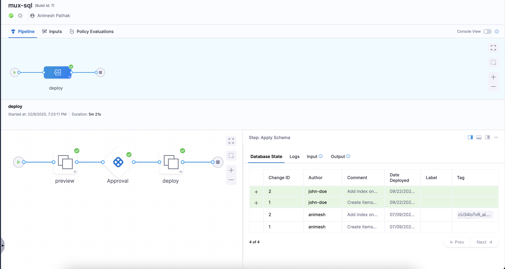

import Tabs from '@theme/Tabs';
import TabItem from '@theme/TabItem';

Harness DB DevOps allows you to integrate a **Preview SQL** step in your pipeline to review generated SQL before applying schema changes to the database.  
This workflow ensures **governance, visibility, and control**, as you can add a **Manual Approval** step between previewing and executing the changes.

The typical workflow looks like this:

1. Clone the Git repository containing migration scripts.
2. Run the **Preview SQL** step to generate SQL for the changes.
3. Pause the pipeline at a **Manual Approval** gate for human verification.
4. After approval, proceed with the **DB Schema Apply** step to deploy the changes.

<Tabs>
<TabItem value="Pipeline Setup" label="Pipeline Setup">


</TabItem>
<TabItem value="YAML Setup" label="YAML Setup">

```yaml
pipeline:
  name: mux-sql
  identifier: muxsql
  projectIdentifier: default_project
  orgIdentifier: default
  tags: {}
  stages:
    - stage:
        name: deploy
        identifier: deploy
        description: "preview SQL changes in Harness DB DevOps pipelines and enforce manual approval before applying schema changes."
        type: Custom
        spec:
          execution:
            steps:
              - stepGroup:
                  name: preview
                  identifier: preview
                  steps:
                    - step:
                        type: LiquibaseCommand
                        name: Preview
                        identifier: Preview
                        spec:
                          connectorRef: account.harnessImage
                          command: " update-sql"
                          dbSchema: cockroachDB
                          dbInstance: cab
                        timeout: 10m
                  stepGroupInfra:
                    type: KubernetesDirect
                    spec:
                      connectorRef: db
              - step:
                  type: HarnessApproval
                  name: Approval
                  identifier: Approval
                  spec:
                    approvalMessage: Please review the following information and approve the pipeline progression
                    includePipelineExecutionHistory: true
                    isAutoRejectEnabled: false
                    approvers:
                      userGroups:
                        - account._account_all_users
                      minimumCount: 1
                      disallowPipelineExecutor: false
                    approverInputs: []
                  timeout: 1d
              - stepGroup:
                  name: deploy
                  identifier: deploy
                  steps:
                    - step:
                        type: DBSchemaApply
                        name: DB Schema Apply
                        identifier: DB_Schema_Apply
                        spec:
                          connectorRef: account.harnessImage
                          dbSchema: cockroachDB
                          dbInstance: cab
                          markNextChangeSetRun: true
                        timeout: 10m
                  stepGroupInfra:
                    type: KubernetesDirect
                    spec:
                      connectorRef: db
            rollbackSteps: []
          serviceDependencies: []
        tags: {}
        delegateSelectors:
          - harness-gke-delegate
```
</TabItem>
</Tabs>

## Setting Up the Workflow

In your pipeline’s **Execution** tab, add the following steps:

| Step            | Description                                                                 |
|-----------------|-----------------------------------------------------------------------------|
| **Git Clone**   | Clones the migration scripts from the connected Git repository.              |
| **Preview SQL** | Generates SQL statements from your changelog or schema definition.           |
| **Approval**    | Adds a manual approval gate where users must review and confirm SQL changes. |
| **DB Schema Apply** | Applies the approved SQL changes to the target database instance.         |

## SQL Preview

The **Preview SQL** step shows a generated SQL script based on the detected changes.  
This allows DBAs and developers to:

- Validate the correctness of the SQL.  
- Identify potential issues such as destructive changes.  
- Ensure compliance with internal policies.

Example output:

```sql
CREATE TABLE products
(
    id SERIAL,
    name TEXT NOT NULL,
    price NUMERIC(10,2) NOT NULL DEFAULT 0.00,
    CONSTRAINT products_pkey PRIMARY KEY (id)
);
```
## Manual Approval Step
The Approval step acts as a gate in the pipeline. When the pipeline reaches this stage:
- A notification is sent to the designated approvers.
- Approvers can review the Preview SQL output before continuing.
- The pipeline proceeds to the DB Schema Apply step only after approval.
This ensures that no schema changes are deployed without human validation.

## Applying Schema Changes
After approval, the pipeline executes the `Apply Schema` step. This deploys the reviewed SQL script to the configured database instance. For example:
- **Preview SQL:** shows the generated ALTER TABLE statement.
- **Approval:** DBA confirms the change is safe.
- **DB Schema Apply:** Executes the approved change on the target database.