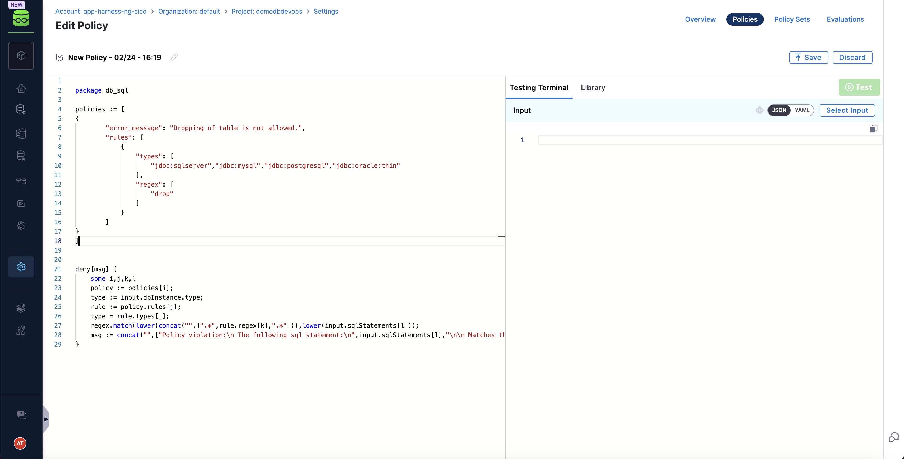
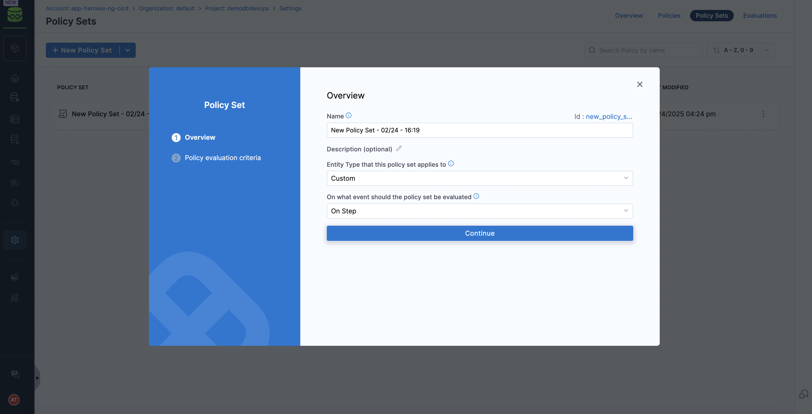
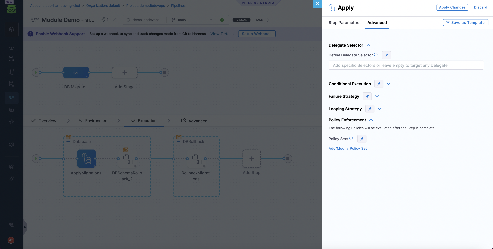
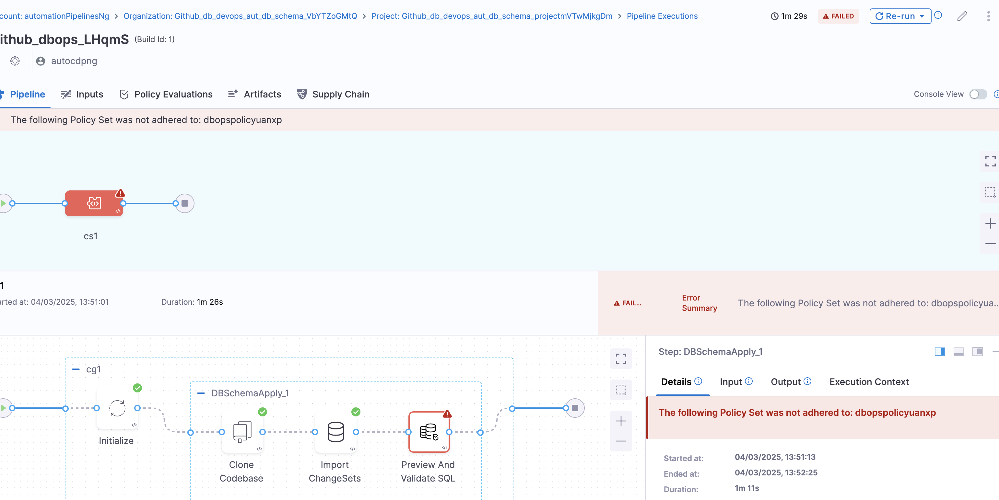

This guide explains how to use **Harness Policy Agent** to enforce policies on **DataBase Devops** steps. Rego is a declarative policy language used by Open Policy Agent (OPA) for policy-based control.

## Pre-requisites
- Basic knowledge of Rego

## Writing a Rego Policy for Database Devops Steps
A Rego policy can validate that changesets conform to specific rules, such as enforcing naming conventions or restricting certain SQL operations.

### Example Policy - Restricting  `DROP TABLE`
Go to DB Governance section and create a new policy

```rego
package db_sql
policies := [
{
        "error_message": "Dropping of table is not allowed.",
        "rules": [
            {
                "types": [
                    "jdbc:sqlserver","jdbc:mysql","jdbc:postgresql","jdbc:oracle:thin"
                ],
                "regex": [
                    "drop"
                ]
            }
        ]
}
]
deny[msg] {
    some i,j,k,l
    policy := policies[i];
    type := input.dbInstance.type;
    rule := policy.rules[j];
    type = rule.types[_];
    regex.match(lower(concat("",[".*",rule.regex[k],".*"])),lower(input.sqlStatements[l]));
    msg := concat("",["Policy violation:\n The following sql statement:\n",input.sqlStatements[l],"\n\n Matches the following regex: \n",rule.regex[k]])
}
```




### Sample Payload:

You can test the polcy on sample payloads

```json
{
  "dbInstance": {
    "dbConnectionUrl": "jdbc:sqlserver://35.xxx.125.32:1433;trustServerCertificate=true;databaseName=db_oajzu",
    "identifier": "enkkMcacHU",
    "name": "enkkMcacHU",
    "tags": {
      "tag1": "val1",
      "tag2": "val2"
    },
    "type": "jdbc:sqlserver"
  },
  "dbSchema": {
    "identifier": "CTJPjhVwkU",
    "name": "CTJPjhVwkU"
  },
  "sqlStatements": [
    "DROP TABLE public;"
  ]
}
```

### Create a custom policy set and attach above policy

)

### Attach the policy set in Database Devops step configuration



## Validating Liquibase Steps with OPA
Run the OPA policy check against the changeset during pipeline run:

If a violation occurs, OPA will output a message indicating the problem (e.g., "Dropping tables is not allowed: users") and result in error / warning as per configuration.



## OPA Policies Examples

### Table Name Limit
The function checks if any of the SQL statements in the input create a table with a name longer than 10 characters. If a match is found, it means that the table name violates the rule and the function returns a message indicating the violation.

```rego
package db_sql

deny[msg] {
    some l
    sql := lower(input.sqlStatements[l])
    
    # Extract table name, handling optional schema (e.g., "public.")
    matches := regex.find_n(`(?i)create\s+table\s+([a-zA-Z0-9_]+\.)?([a-zA-Z0-9_]+)`, sql, -1)

    some j
    table_name := matches[j]  # Extract match

    # If the table has a schema prefix, extract just the table name part
    parts := split(table_name, ".")
    actual_table_name := parts[count(parts) - 1]

    count(actual_table_name) > 10

    msg := sprintf("Table name '%s' exceeds 10 characters, which is not permitted", [actual_table_name])
}
```

### Schema Name Limit

The existing code already has a schema name length check in the "Prevent Data Drop" section, but it could be formalized as a separate policy:

```rego
package db_sql

deny[msg] {
    some l
    sql := lower(input.sqlStatements[l])
    
    # Extract schema name
    matches := regex.find_n(`(?i)create\s+schema\s+([a-zA-Z0-9_]+)`, sql, -1)
    
    some j
    schema_name := matches[j]
    
    count(schema_name) > 30
    
    msg := sprintf("Schema name '%s' exceeds 30 characters, which is not permitted", [schema_name])
}
```

### Prevent Direct System Table Access
This policy checks if any SQL statement attempts to access system tables (e.g., those starting with "sys." in SQL Server). If such access is detected, it returns a violation message.

```rego
package db_sql

deny[msg] {
    some l
    sql := lower(input.sqlStatements[l])
    
    system_tables := [
        "sys\\.", "information_schema\\.", "pg_catalog\\.",
        "sysobjects", "syscolumns", "sysusers"
    ]
    
    some i
    regex.match(concat("", [".*select.*from.*", system_tables[i], ".*"]), sql)
    
    msg := sprintf("Direct access to system tables is not permitted: %s", [sql])
}
```

### Prevent Large Transactions

```rego
package db_sql

deny[msg] {
    count(input.sqlStatements) > 50
    
    msg := "Transaction contains too many statements. Please break it into smaller transactions."
}
```

### DB Policy Populator
The types represent the different types of databases (e.g., sybase, oracle, mssql). The regular expressions represent the SQL statements that are not allowed in each type of database. if a match is found, it means that the SQL statement violates a policy and the function returns a message indicating the violation.

```rego
package db_sql

policies := [
    {
        "error_message": "Switching to system databases is not allowed.",
        "rules": [
            {
                "types": [
                    "sybase"
                ],
                "regex": [
                    "use\\s+master",
                    "use\\s+GDMGAdmin",
                    "use\\s+GDMGSecurity",
                    "use\\s+sybsecurity",
                    "use\\s+sybsystemprocs",
                    "use\\s+SEMSAuditDb"
                ]
            }
        ]
    },
    {
        "error_message": "Creating or dropping users and roles via DDL is not allowed.",
        "rules": [
            {
                "types": [
                    "sybase"
                ],
                "regex": [
                    "sp_addlogin",
                    "sp_adduser",
                    "sp_addalias",
                    "sp_dropuser",
                    "sp_dropalias",
                    "sp_droplogin",
                    "sp_locklogin",
                    "sp_addgroup",
                    "sp_modifylogin",
                    "sp_changegroup",
                    "sp_addrole",
                    "sp_addrolemember",
                    "sp_droprole",
                    "create\\s+role",
                    "create\\s+database"
                ]
            },
            {
                "types": [
                    "oracle"
                ],
                "regex": [
                    "create\\s+user",
                    "drop\\s+user",
                    "alter\\s+user",
                    "create\\s+role",
                    "drop\\s+role"
                ]
            },
            {
                "types": [
                    "mssql"
                ],
                "regex": [
                    "sp_addlogin",
                    "sp_sec_addlogin",
                    "sp_sec_addnotification",
                    "sp_sec_denylogin",
                    "sp_sec_grantlogin",
                    "sp_sec_revokelogin",
                    "sp_sec_returnaccess",
                    "sp_sec_setuppswdproperty",
                    "sp_adduser",
                    "sp_dropuser",
                    "sp_addrole",
                    "sp_addrolemember",
                    "sp_droprole",
                    "sp_droplogin",
                    "sp_sec_modifylogin",
                    "create\\s+role",
                    "sp_changegroup"
                ]
            }
        ]
    },
    {
        "error_message": "Granting or revoking permissions to public roles is not allowed.",
        "rules": [
            {
                "types": [
                    "mssql","oracle","sybase"
                ],
                "regex": [
                    "grant.*to\\s+public",
                    "revoke.*from\\s+public"
                ]
            }
        ]
    },
    {
        "error_message": "Use of certain system stored procedures is not allowed.",
        "rules": [
            {
                "types": [
                    "mssql"
                ],
                "regex": [
                    "sp_password_sec",
                    "xp_cmdshell",
                    "xp_regwrite",
                    "sp_denylogin",
                    "sp_revokelogin",
                    "sp_addlogin_sec",
                    "sp_grantlogin",
                    "sp_changedbowner",
                    "sp_changeobjectowner",
                    "sp_addapprole",
                    "sp_dropapprole",
                    "sp_grantdboaccess",
                    "sp_addsrvrolemember"
                ]
            }
        ]
    },
    {
        "error_message": "Modifying profiles, schemas, tablespaces, databases, and systems are not allowed.",
        "rules": [
            {
                "types": [
                    "oracle"
                ],
                "regex": [
                    "create\\s+(profile|schema|tablespace|system)\\s+[^\\.]+",
                    "alter\\s+(tablespace|system)\\s+[^\\.]+"
                ]
            },
            {
                "types": [
                    "mssql","sybase"
                ],
                "regex": [
                    "create\\s+(database)\\s+[^\\.]+"
                ]
            }
        ]
    }
]

deny[msg] {
    some i
    policy := policies[i];
    type := input.db_instances[_].db_type;
    some j
    rule := policy.rules[j];
    type = rule.types[_];
    some k
    some l
    regex.match(concat("",[".*",rule.regex[k],".*"]),lower(input.sql_statements[l].sql));
    msg := concat("",["Policy violation:\n The following sql statement:\n",input.sql_statements[l].sql,"\n\n Matches the following regex: \n",rule.regex[k]])
  }
```