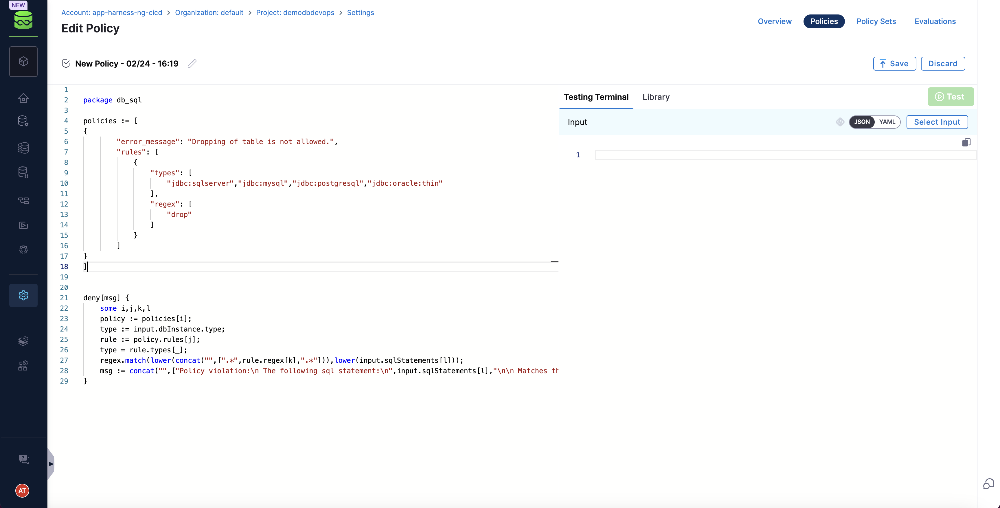
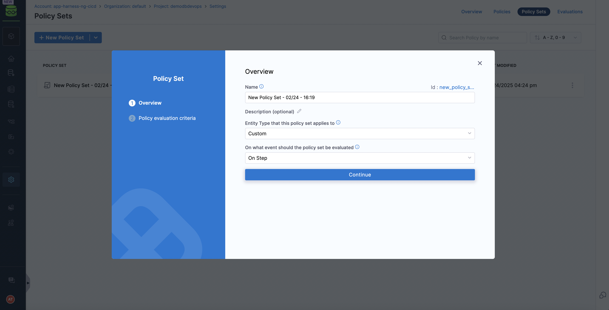
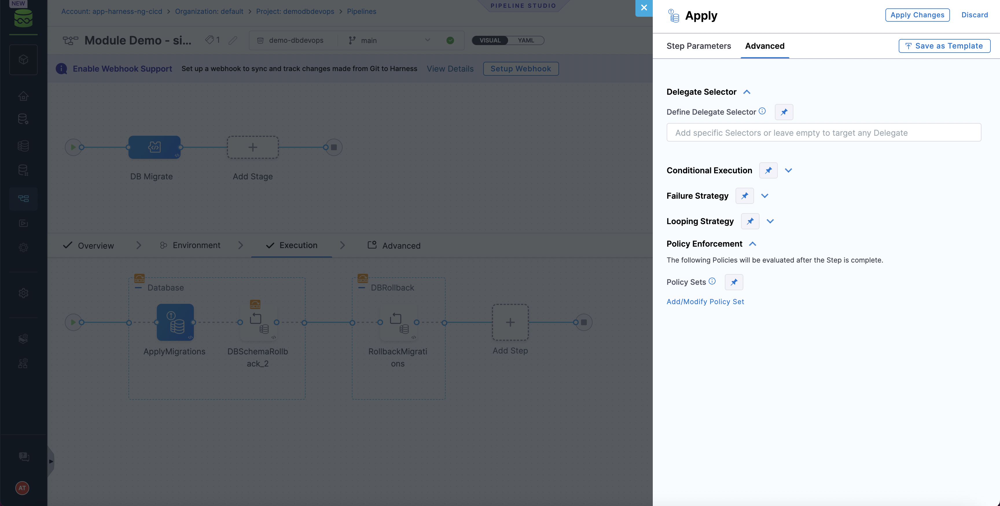
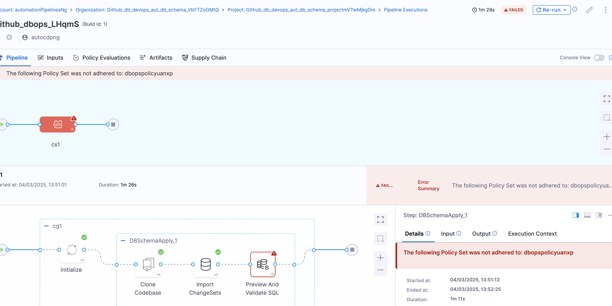

This guide explains how to use **Harness Policy Agent** to enforce policies on **DataBase Devops** steps. Rego is a declarative policy language used by Open Policy Agent (OPA) for policy-based control.

## Prerequisites
- Basic knowledge of Rego

## Writing a Rego Policy for Database Devops Steps
A Rego policy can validate that changesets conform to specific rules, such as enforcing naming conventions or restricting certain SQL operations.

### Example Policy: Restricting  `DROP TABLE`
Go to DB Governance section and create a new policy

```rego
package db_sql
policies := [
{
        “error_message”: “Dropping of table is not allowed.“,
        “rules”: [
            {
                “types”: [
                    “jdbc:sqlserver”,“jdbc:mysql”,“jdbc:postgresql”,“jdbc:oracle:thin”
                ],
                “regex”: [
                    “drop”
                ]
            }
        ]
}
]
deny[msg] {
    some i,j,k,l
    policy := policies[i];
    type := input.dbInstance.type;
    rule := policy.rules[j];
    type = rule.types[_];
    regex.match(lower(concat(“”,[“.*“,rule.regex[k],“.*“])),lower(input.sqlStatements[l]));
    msg := concat(“”,[“Policy violation:\n The following sql statement:\n”,input.sqlStatements[l],“\n\n Matches the following regex: \n”,rule.regex[k]])
}
```




### Sample Payload:

You can test the polcy on sample payloads

```json
{
  "dbInstance": {
    "dbConnectionUrl": "jdbc:sqlserver://35.xxx.125.32:1433;trustServerCertificate=true;databaseName=db_oajzu",
    "identifier": "enkkMcacHU",
    "name": "enkkMcacHU",
    "tags": {
      "tag1": "val1",
      "tag2": "val2"
    },
    "type": "jdbc:sqlserver"
  },
  "dbSchema": {
    "identifier": "CTJPjhVwkU",
    "name": "CTJPjhVwkU"
  },
  "sqlStatements": [
    "DROP TABLE public;"
  ]
}
```

### Create a custom policy set and attach above policy

)

### Attach the policy set in Database Devops step configuration



## Validating Liquibase Steps with OPA
Run the OPA policy check against the changeset during pipeline run:


If a violation occurs, OPA will output a message indicating the problem (e.g., "Dropping tables is not allowed: users") and result in error / warning as per configuration.


