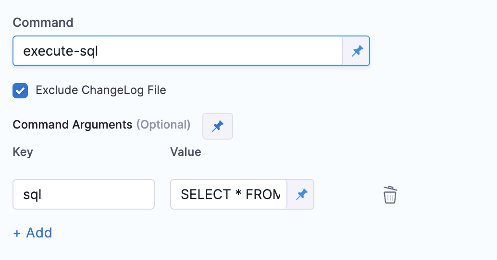
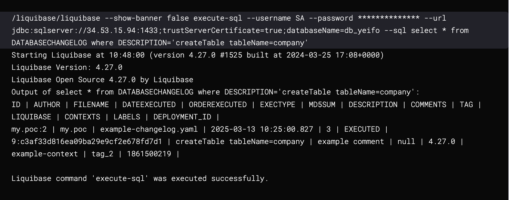

## Pre-requisites
* Liquibase command step is created. You can refer to the Harness documentation detailing how to [Add a Liquibase command step](/docs/database-devops/use-database-devops/liquibase-command-step/add-liquibase-command-step.md)

:::info note
**Minimum versions**
* **drone-liquibase** -  `plugins/drone-liquibase:1.1.0-4.27`
* **drone-liquibase-mongo** -  `plugins/drone-liquibase:1.1.0-4.27-mongo`
* **drone-liquibase-spanner** -  `plugins/drone-liquibase:1.1.0-4.27-spanner`
:::

## Overview

Using the LiquibaseCommand step we can execute arbitrary SQL commands using the execute-sql command. 
This allows users to define raw SQL, simplifying workflows that require direct SQL execution.

## Use Cases
This is useful when we to run a single SQL statement without creating a separate changelog file. 

Examples include:

* Performing one-time data fixes
* Executing a quick schema modification
* Running DDL/DML queries during a deployment pipeline
* check the database data

## Pipeline Configuration
* The command value for LiquibaseCommand Step needs to be `execute-sql`
* `Exclude ChangeLog File` checkbox needs to checked
* The settings configuration will contain key as `sql` and value will contain the sql statement to execute

**The configuration in the pipeline will look like below**



**At the yaml level the configuration will look like below**

```yaml
type: LiquibaseCommand
spec:
  command: execute-sql
  settings:
    sql: SELECT * FROM PERSON;
```

:::info note
The sql statement should not contain double quotes around it
:::

## Conclusion
If everything is configured correctly, the step execution should look like below. 

In the below example we are querying from `DATABASECHANGELOG` table where description is matching a certain value.



## References
* [liquibase_execute_sql](https://docs.liquibase.com/commands/utility/execute-sql.html)
