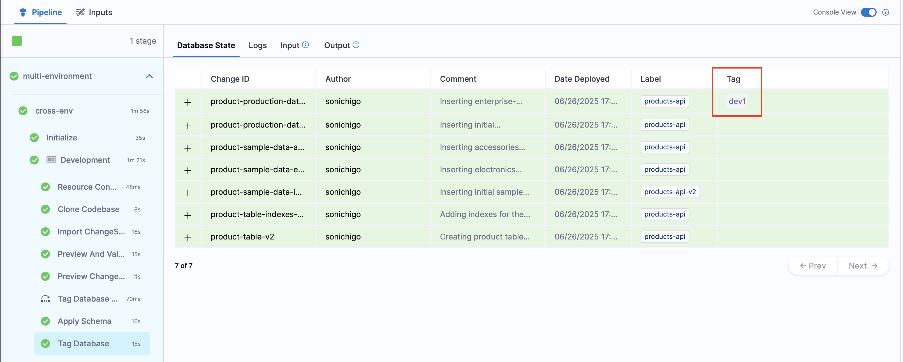
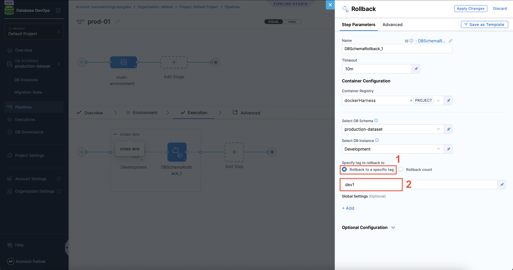
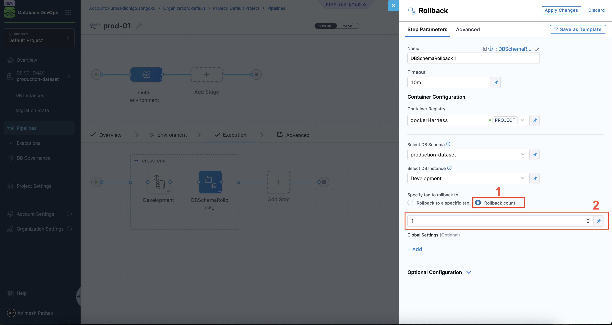
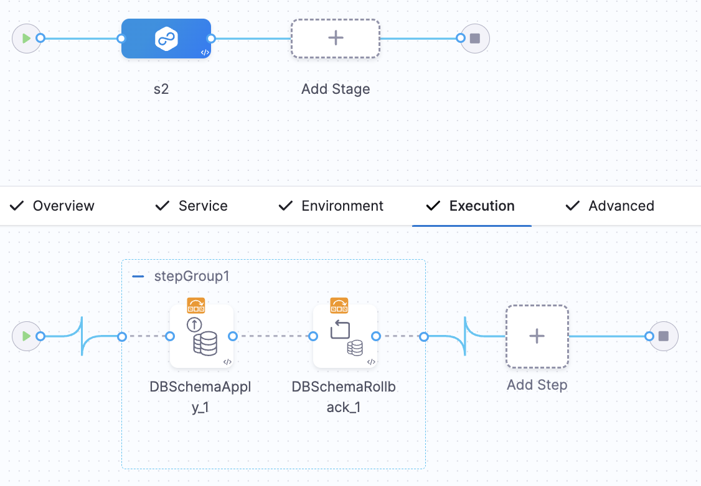

import Tabs from '@theme/Tabs';
import TabItem from '@theme/TabItem';

Harness offers multiple mechanisms for rolling back schema changes—ensuring data integrity and operational resilience. This guide explains how to configure automated rollbacks, including rollback by tag and rollback by count, within your CI/CD pipelines.

## Rollback A Database Schema 

Rollback in Harness Database DevOps refers to reverting one or more [changesets](../concepts/glossary/changeset.md) that were previously applied to a database. There are two primary methods you can use, depending on your rollback strategy and operational context:

- **Rollback to a Tag** – Revert the database to a specific snapshot marked by a previously created Liquibase tag.
- **Rollback by Count** – Revert a specific number of the most recently applied changesets in sequential order.

<Tabs>
<TabItem value="rollback-tag" label="Rollback by Tag">
Here is how you can rollback a database within Harness Database DevOps: 

 1. In Harness, go to the **Database DevOps** module and select your **Project**. 
 2. Determine the tag you want to roll back to. This tag represents a specific state of the database schema that you want to revert to after applying changes. 
 
 3. Select the **Pipelines** tab on the side menu, and open the pipeline in your Harness Database DevOps interface where the rollback will be executed. 
 4. In the configuration for the rollback step, you will need to provide the following details:
 
    - **DB Schema**: Specify the name of the database schema that you want to roll back.
    - **DB Instance**: The name of the DB Instance. This is the Instance that will be used in the pipeline where the rollback will take place. 
    - **Rollback Tag**: Enter the name of the tag to which you want to roll back the schema. See Step 2 for how to determine the tag.
 5. Run the pipeline with the configured rollback step.
 6. After the rollback is complete, verify that the database schema has been reverted to the desired state. This may involve checking the schema structure and ensuring that any changes made after the specified tag have been undone.

</TabItem>
<TabItem value="rollback-count" label="Rollback by Count">
To rollback a database schema by count in Harness Database DevOps, follow these steps:

1. In Harness, go to the **Database DevOps** module and select your **Project**.
2. Select the **Pipelines** tab on the side menu, and open the pipeline in your Harness Database DevOps interface where the rollback will be executed.
3. In the configuration for the rollback step, you will need to provide the following details:

    - **DB Schema**: Specify the name of the database schema that you want to roll back.
    - **DB Instance**: The name of the DB Instance. This is the Instance that will be used in the pipeline where the rollback will take place.
    - **Rollback Count**: Enter the number of changesets you want to roll back.
4. Run the pipeline with the configured rollback step.
5. After the rollback is complete, verify that the database schema has been reverted to the desired state. This may involve checking the schema structure and ensuring that the specified number of changesets have been undone.

</TabItem>
</Tabs>

## Rolling Back to a Previous Database State

The **Apply Schema** step in our deployment pipeline applies database changeSets and provides an expression pointing to the tag marking the database state before deployment.

### How It Works
- If a Liquibase tag exists on the last changeSet, it is captured and exposed in the rollback expression.
- If no tag exists, the Apply Schema step creates one before applying new changes.
- Use this exposed tag as expression to rollback to the previous state.

Expression format:
1. If Apply Schema step run as part of different stage: `<+pipeline.stages.{stageIdentifier}.spec.execution.steps.{stepGroupIdentifier}.steps.{stepIdentifier}.output.preStartTag>`
2. If Apply Schema step run as part of same stage: `<+execution.steps.{stepGroupIdentifier}.steps.{stepIdentifier}.output.preStartTag>`

Example: For the following pipeline configuration, the expressions would be 
- `<+pipeline.stages.s2.spec.execution.steps.stepGroup1.steps.DBSchemaApply_1.output.preStartTag>`
- `<+execution.steps.stepGroup1.steps.DBSchemaApply_1.output.preStartTag>`

## Built in failure strategies including rollback

When managing database schema changes, it’s crucial to have mechanisms in place to handle failures gracefully. Built-in failure strategies, including rollback, are designed to protect your application and data by providing automated responses when something goes wrong during a database update.

Rollback is the process of undoing changes that were made to the database if an error occurs during an update. This ensures that the database is returned to its previous state, preventing partial updates that could lead to inconsistencies or application crashes.

This reduces the risk of downtime or data corruption and allows teams to quickly address issues without having to manually intervene.

## Automated Rollback for Database Schema Changes

When managing database schema changes, the risk of something going wrong is always present. With Harness DB DevOps, you can help mitigate this risk by providing an automated rollback feature. This feature ensures that if a schema change fails, the database can be quickly and automatically restored to its previous state, maintaining stability and data integrity.

### What is Automated Rollback?

Automated rollback is a feature that automatically reverses database changes if an error occurs during a deployment. This prevents partial or inconsistent updates that could disrupt your application or lead to data corruption.

In Harness DB DevOps, automated rollback leverages tags and versioning to ensure a smooth and reliable process. There are two main scenarios where rollback can occur:

 1. **Immediate Rollback**: If a change fails to apply during deployment.
 2. **Delayed Rollback**: If a change is successfully applied, but a rollback is later required.

<Tabs>
<TabItem value="immediate-rollback" label="Immediate Rollback">

By default, if a change fails to apply during deployment, Harness DB DevOps will automatically roll back the change using the database's built-in transaction rollback mechanism. This is known as an **immediate rollback**. It ensures that your database remains in a consistent state by **undoing all changes in the current transaction**.

Immediate rollback is triggered automatically when:
- A changeset fails validation or execution
- A precondition is not met
- A Liquibase error halts schema application
- The database returns an error during DDL or DML execution

Immediate rollback is automatic and requires no manual intervention, which makes it ideal for preventing partial updates during failures in the apply phase of your deployment pipeline.

:::caution
Not all databases support transactional DDL. For example, MySQL with certain storage engines (e.g., MyISAM) may not fully support transactional rollbacks. In such cases, fallback strategies like rollback by tag or count should be considered.
:::

</TabItem>
<TabItem value="delayed-rollback" label="Delayed Rollback">

In some cases, you might need to roll back changes that were successfully applied. This could be due to:

 - A subsequent change in the deployment pipeline failing
 - An application health check failing after deployment
 - Other operational or business reasons

</TabItem>
</Tabs>

---

For these scenarios, Harness DB DevOps provides a 'Rollback Schema' pipeline step. This step can be configured in your pipeline to roll back to a particular tag or number of changeset, allowing you to revert your database schema to a known good state.

:::info
You can also use custom rollback scripts or commands in your pipeline to handle more complex rollback scenarios. Refer to [Custom Rollback Statement](../features/automatic-and-custom-rollback.md#custom-rollback-statements) for more details.
:::

## FAQ

### Can Harness rollback database changes automatically?
Yes. Harness provides built-in support for automated rollbacks during and after deployment failures using rollback tags.

### What is the difference between immediate and delayed rollback?
Immediate rollback occurs when a deployment fails mid-process. Delayed rollback happens after a successful deployment if later steps fail or issues arise.

### Do I need to create rollback tags manually?
Tags can be created manually or automatically as part of the `Apply Schema` step in your pipeline. These tags serve as rollback points.

### Is this compatible with Liquibase?
Absolutely. Harness Database DevOps uses Liquibase under the hood and supports native Liquibase rollback workflows and tagging.

### How do I verify a rollback was successful?
You can monitor the pipeline execution logs and inspect the schema to confirm that changes have been reverted to the desired tag.
