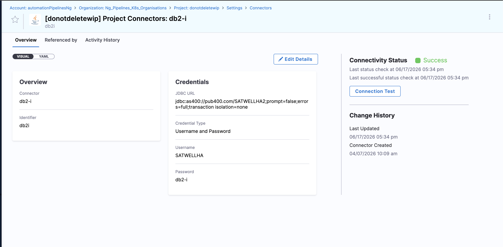
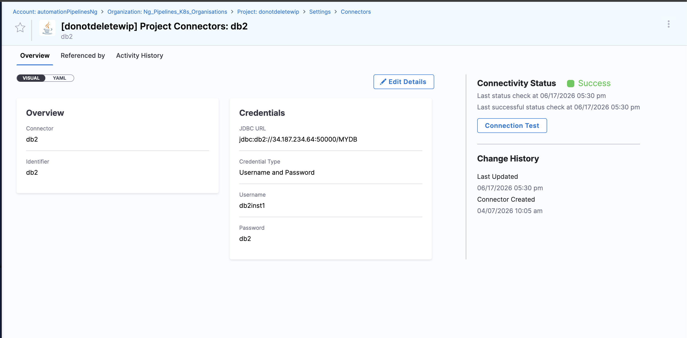

IBM DB2 is a family of data management products that includes three variants, each running on different platforms and requiring different JDBC drivers and connection formats.

Harness DB DevOps supports all three IBM DB2 variants with Liquibase Community for database change management.

## DB2 Variants Supported

Harness DB DevOps supports the following IBM DB2 variants:

- **DB2 LUW**: DB2 for Linux, Unix, and Windows
- **DB2 for i**: DB2 for iSeries (AS/400)
- **DB2 z/OS**: DB2 for IBM Mainframe (requires customer-provided IBM license JAR)

## Prerequisites for IBM DB2

### 1. DB2 LUW

- **JDBC Driver**: IBM JCC driver (`jcc.jar`) is included in Harness DB DevOps
- **Authentication**: Username and password
- **Database Permissions**: The database user must have schema modification permissions including `CREATE`, `ALTER`, `DROP` for tables and indexes, and `SELECT`, `INSERT`, `UPDATE`, `DELETE` on the target schema. For Liquibase change tracking, the user must be able to create and modify the `DATABASECHANGELOG` and `DATABASECHANGELOGLOCK` tables.
- **Network Access**: Delegate must have connectivity to the DB2 instance on port 50000 (default)
- **SSL**: Supported via `sslConnection=true` parameter. Go to [Configure SSL for database connections](/docs/database-devops/use-database-devops/ssl) to set up SSL.

### 2. DB2 for i (iSeries/AS/400)

- **JDBC Driver**: IBM Toolbox for Java (JT400) is included in Harness DB DevOps
- **Authentication**: Username and password
- **Database Permissions**: The database user must have authority to create, alter, and drop objects in the target library. For Liquibase change tracking, the user must be able to create and modify the `DATABASECHANGELOG` and `DATABASECHANGELOGLOCK` tables within the library.
- **Network Access**: Delegate must have connectivity to the IBM i system
- **Library**: IBM i uses libraries instead of databases. Specify the library name in the connection URL.

### 3. DB2 z/OS

- **JDBC Driver**: IBM JCC driver (`jcc.jar`) is included in Harness DB DevOps
- **License Requirement**: Customer must provide IBM DB2 Connect license JAR (`db2jcc_license_cisuz.jar`)
- **Authentication**: Username and password
- **Database Permissions**: The database user must have privileges to create, alter, and drop tables, indexes, and tablespaces in the target database. For Liquibase change tracking, the user must be able to create and modify the `DATABASECHANGELOG` and `DATABASECHANGELOGLOCK` tables. Consult your DBA for appropriate DB2 z/OS authorization grants.
- **Network Access**: Delegate must have connectivity to the DB2 z/OS instance on port 446 (default)
- **SSL**: Supported via `sslConnection=true` parameter. Go to [Configure SSL for database connections](/docs/database-devops/use-database-devops/ssl) to set up SSL.
- **Location Name**: DB2 z/OS uses location names (must be uppercase). Obtain via `SELECT CURRENT SERVER FROM SYSIBM.SYSDUMMY1`.


:::info note
The `translate binary=true` and `date format=iso` parameters are required for Liquibase to work correctly with DB2 for i. Go to [Why are these parameters required?](#why-are-the-translate-binary-and-date-format-parameters-required-for-db2-for-i) for details.
:::


:::warning DB2 z/OS license requirement
DB2 z/OS requires a customer-provided IBM DB2 Connect license JAR (`db2jcc_license_cisuz.jar`). Contact your IBM representative to obtain this license file. Without this license, connections to DB2 z/OS will fail. Go to [Providing the DB2 z/OS License JAR](#providing-the-db2-zos-license-jar) for setup instructions.
:::

:::info note
**DB2 for i library vs. database:** IBM i uses libraries as the schema container, not traditional databases. Specify the library name in the JDBC URL path. For example, `jdbc:as400://myhost/MYLIB` connects to library `MYLIB`.
:::

## Providing the DB2 z/OS License JAR

DB2 z/OS connections require the IBM DB2 Connect license JAR (`db2jcc_license_cisuz.jar`). This license is not included with Harness DB DevOps and must be obtained from IBM and provided to Harness.

### Obtain the license JAR

Contact your IBM representative or IBM support to obtain `db2jcc_license_cisuz.jar`. This license is typically included with IBM DB2 Connect products.

### Prepare the license file

The license JAR must be base64-encoded before it can be mounted into the Harness pipeline execution environment.

On the delegate host or any Linux system, run the following command:

```bash
base64 -w 0 db2jcc_license_cisuz.jar > db2jcc_license_cisuz.b64
```

This creates a base64-encoded text file (`db2jcc_license_cisuz.b64`) that can be safely mounted via `CI_MOUNT_VOLUMES`.

:::info note
**macOS users:** Use `base64 -b 0` instead of `base64 -w 0` on macOS systems.
:::

### Place the encoded file on the delegate

Copy the `.b64` file to a location on the delegate filesystem where the Harness Delegate can access it. For example:

```bash
/opt/harness-delegate/db2-license/db2jcc_license_cisuz.b64
```

Ensure the delegate process has read permissions on this file.

### Configure CI_MOUNT_VOLUMES

In your Harness pipeline, configure the `CI_MOUNT_VOLUMES` environment variable to mount the base64-encoded license file into the pipeline step container.

Set the environment variable in your pipeline step:

```yaml
CI_MOUNT_VOLUMES=/opt/harness-delegate/db2-license/db2jcc_license_cisuz.b64:/etc/license/dbops/db2jcc_license_cisuz.b64
```

**Format:** `<source-path-on-delegate>:<destination-path-in-container>`

The destination path must be `/etc/license/dbops/db2jcc_license_cisuz.b64` for Harness DB DevOps to detect and use the license automatically.

:::info note
The Harness DB DevOps pipeline automatically decodes the base64-encoded license file and places it in the correct location for Liquibase to use during DB2 z/OS operations.
:::

## Verify the connection

After configuring your DB2 connector, use the test connection feature in Harness to verify that the delegate can reach the database.

-  

- 

A successful connection confirms the JDBC URL, credentials, and network access are correctly configured. For DB2 z/OS, a successful test also confirms the license JAR is correctly provisioned.

## FAQs

### Which IBM DB2 variant should I use?

The DB2 variant depends on your IBM platform:

- **DB2 LUW**: Use for DB2 running on Linux, Unix, or Windows servers
- **DB2 for i**: Use for DB2 on IBM i systems (iSeries, AS/400)
- **DB2 z/OS**: Use for DB2 on IBM mainframe systems

If you are unsure, check with your database administrator. The JDBC URL format differs for each variant.

### How do I obtain the DB2 z/OS license JAR?

The IBM DB2 Connect license JAR (`db2jcc_license_cisuz.jar`) is required for DB2 z/OS connections. This license is not included with Harness DB DevOps and must be obtained from IBM.

Contact your IBM representative or IBM support to acquire the license file. The license is typically included with IBM DB2 Connect products.

### What is the difference between database and library in DB2 for i?

IBM i uses the term **library** instead of database or schema. A library is a container for database objects such as tables, views, and procedures.

When connecting to DB2 for i, specify the library name in the JDBC URL. For example:
```
jdbc:as400://myhost/MYLIB
```

This connects to the `MYLIB` library on the IBM i system.

### Why are the translate binary and date format parameters required for DB2 for i?

The `translate binary=true` and `date format=iso` parameters are required for Liquibase to work correctly with DB2 for i:

- `translate binary=true`: Forces EBCDIC to Unicode character conversion for CCSID 65535 fields. Without this, Liquibase change tracking tables may have character encoding issues.
- `date format=iso`: Ensures dates are formatted as YYYY-MM-DD, which Liquibase expects for timestamp handling.

These parameters prevent data corruption and compatibility issues when Liquibase creates and manages its internal change tracking tables.

### Can I connect to DB2 z/OS without the license JAR?

No. The IBM DB2 Connect license JAR is mandatory for DB2 z/OS connections. Without it, the JDBC driver cannot establish a connection to DB2 z/OS instances. This is an IBM licensing requirement, not a Harness limitation.

### What permissions does the database user need?

The database user needs the following permissions:

**For schema changes (migrations):**
- `CREATE TABLE`, `ALTER TABLE`, `DROP TABLE`
- `CREATE INDEX`, `DROP INDEX`
- `SELECT`, `INSERT`, `UPDATE`, `DELETE` on all tables in the target schema

**For Liquibase change tracking:**
- Ability to create and modify `DATABASECHANGELOG` and `DATABASECHANGELOGLOCK` tables

**DB2 z/OS specific:**
- Consult your DBA for appropriate authorization grants, as mainframe security models may require additional privileges.

For read-only operations like policy validation, read permissions on the target schema are sufficient.
