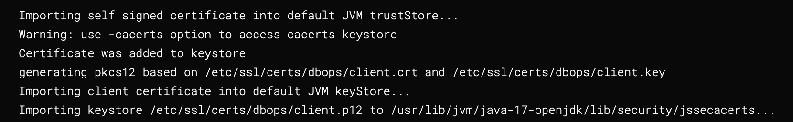

# Introduction

This document provides a comprehensive guide to configuring databases with SSL, including secret and delegate configurations, setting up for JDBC test connections, and pipeline permissions. It covers the necessary steps to set up and manage certificates for secure communication between database and other services.

## Clone
We support two types of cloning **depending on the DB Schema connector type**

* **Git** - In the Git clone step, the certificate is mounted at `/etc/ssl/certs/ca-bundle.crt`.
  For more details, refer to the Info section in [Git Clone Step SSL](https://developer.harness.io/docs/continuous-integration/use-ci/set-up-build-infrastructure/k8s-build-infrastructure/configure-a-kubernetes-build-farm-to-use-self-signed-certificates/)

* **Artifactory** - SSL is not supported

## Database
### Pre-requisites
* `ca.crt` as a part of the `ca.bundle`
  * To know more about generating CA certificates, [create_ca certificate](https://developer.harness.io/docs/platform/delegates/secure-delegates/delegate-mtls-support/#create-a-ca-certificate)
  * To know more about creating and managing secrets with `ca.bundle`, [managing ca bundle](https://developer.harness.io/docs/continuous-integration/use-ci/set-up-build-infrastructure/k8s-build-infrastructure/configure-a-kubernetes-build-farm-to-use-self-signed-certificates/#enable-self-signed-certificates)
* `client.crt` and `client.key` is available
  * To know more about generating client certificates, follow steps: 1 to 3 from [create_client certificate](https://developer.harness.io/docs/platform/delegates/secure-delegates/delegate-mtls-support/#create-a-client-certificate)
* `CI_MOUNT_VOLUMES` and `ADDITIONAL_CERTS_PATH` delegate environment variables

:::info note
We cannot use `DESTINATION_CA_PATH` since we need to mount different certificates to the build pod
:::

:::info note
**Minimum versions**
* **db-devops-service** -  `1.32.x`
* **drone-liquibase** -  `plugins/drone-liquibase:1.1.0-4.27`
* **drone-liquibase-mongo** -  `plugins/drone-liquibase:1.1.0-4.27-mongo`
* **drone-liquibase-spanner** -  `plugins/drone-liquibase:1.1.0-4.27-spanner`
:::

### Secret Configuration

Create a secret using 
* `ca.bundle`
* `client.crt` 
* `client.key`

```shell
kubectl create secret -n namespace generic dbops-ssl-secret --from-file ca.bundle --from-file client.crt --from-file client.key
```

### Delegate Configuration

Modify the delegate manifest file to include a volume mount.

1. Add the following YAML under `spec.template.spec.containers`

```shell
volumeMounts:
  - mountPath: /opt/harness-delegate/ca-bundle/
    name: custom-certs
    readOnly: true
```

2. Add the following under `spec.template.spec`. Add the secret name with the value you used when you created the kubernetes secret.

```shell
volumes:
  - name: custom-certs
    secret:
      secretName: dbops-ssl-secret
      defaultMode: 400
```

3. Add `ADDITIONAL_CERTS_PATH` and `CI_MOUNT_VOLUMES` environment variables

```shell
- name: ADDITIONAL_CERTS_PATH
  value: "/opt/harness-delegate/ca-bundle/ca.bundle"
- name: CI_MOUNT_VOLUMES
  value: "/opt/harness-delegate/ca-bundle/ca.bundle:/etc/ssl/certs/dbops/root_ca.crt,/opt/harness-delegate/ca-bundle/client.key:/etc/ssl/certs/dbops/client.key,/opt/harness-delegate/ca-bundle/client.crt:/etc/ssl/certs/dbops/client.crt"
```

:::info note

* The destination paths in `CI_MOUNT_VOLUMES` **has to be**
  * `/etc/ssl/certs/dbops/root_ca.crt`
  * `/etc/ssl/certs/dbops/client.crt`
  * `/etc/ssl/certs/dbops/client.key`
* `ADDITIONAL_CERTS_PATH` is a mandatory environment variable when `CI_MOUNT_VOLUMES` is provided

:::


### JDBC Test Connection

```shell
- name: INIT_SCRIPT
  value: |-
  openssl pkcs12 -export -in /opt/harness-delegate/ca-bundle/client.crt -inkey /opt/harness-delegate/ca-bundle/client.key -out client.p12 -name client_pkcs12 -password pass:changeit
  keytool -importkeystore -destkeystore $JAVA_HOME/lib/security/jssecacerts -srckeystore client.p12 -srcstoretype PKCS12 -alias client_pkcs12 -storepass changeit -srcstorepass changeit -noprompt
```

The INIT_SCRIPT environment variable in the Harness Delegate is used to execute a startup script that generates `client.p12` from `client.crt` and `client.key` and imports it into java keystore `$JAVA_HOME/lib/security/jssecacerts`

:::info note
* `INIT_SCRIPT` is needed since the JDBC Test Connection runs within a delegate
* `/opt/harness-delegate/ca-bundle/ca.bundle` is automatically imported to the default java trust store `$JAVA_HOME/lib/security/cacerts`  by the delegate

To know more about overriding trust store, refer [override trust store for delegates](https://developer.harness.io/docs/platform/delegates/secure-delegates/trust-store-override-for-delegates/)

:::


## Pipeline Permissions
The **DB step** needs to have access to the build pod to import keys to the default key stores

**For example**, if we want to run the ApplySchema as a root user, the step needs to be configured with `runAsUser` with value 0

```shell
spec:
  runAsUser: "0"
```

## Conclusion
If the setup is successful, logs in the step will look like below


By following this guide, you can securely configure Database with SSL, ensuring encrypted communication and proper authentication between services.

## References
* [Using Self-Signed Certificates in Kubernetes Build Farm](https://developer.harness.io/docs/continuous-integration/use-ci/set-up-build-infrastructure/k8s-build-infrastructure/configure-a-kubernetes-build-farm-to-use-self-signed-certificates/)
* [Installing Delegates with Custom Certificates](https://developer.harness.io/docs/platform/delegates/secure-delegates/install-delegates-with-custom-certs/)
* [Delegate MTLS Support](https://developer.harness.io/docs/platform/delegates/secure-delegates/delegate-mtls-support/)

