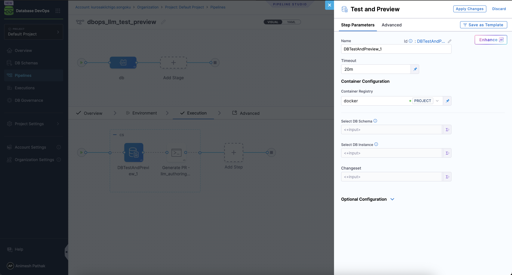

import { Troubleshoot } from '@site/src/components/AdaptiveAIContent';

The **DB Test and Preview** step validates a database changeset generated by the **Author DB Change** feature before the changeset is committed to your Git repository. It runs the candidate migration against the selected DB Instance in a dry-run mode and surfaces the output, errors, and a preview of the SQL that would be applied, allowing you to review and approve the change before it is merged.

:::note
The DB Test and Preview step is exclusively used as part of the **Author DB Change** workflow. It is not a general-purpose apply or validate step. Go to [Configure Author DB Change](/docs/database-devops/use-database-devops/configure-llm-for-database-devops) to set up the full LLM authoring pipeline that uses this step.
:::

## Before you begin

- **Harness AI enabled:** Author DB Change requires Harness AI to be enabled at the account level. Go to [Configure Author DB Change](/docs/database-devops/use-database-devops/configure-llm-for-database-devops) to enable Harness AI and configure the LLM authoring pipeline identifier.
- **LLM authoring pipeline:** This step must be part of the pipeline referenced in **Account Settings > Default Settings > Database DevOps > LLM Authoring Test and Commit Pipeline**. The pipeline identifier must match exactly.

## Add the DB Test and Preview step

The DB Test and Preview step is added to a **Custom Stage** pipeline that serves as the LLM authoring pipeline.

1. In Harness, go to **Database DevOps** and select your project.
2. Create or open the pipeline designated as the LLM authoring pipeline (the identifier must match the one configured in account default settings).
3. Add a **Custom Stage** with a step group.
4. Inside the step group, select **Add Step** and choose **DB Test and Preview**.
5. Configure the step parameters described below.
6. Select **Apply Changes** and save the pipeline.

## Step parameters

1. **Name** -  Display name for the step. Default is `DBTestAndPreview_1`.
2. **Timeout** - Maximum duration before the step times out. Default is `20m`, which accommodates the time needed to spin up a container, run the migration tool, and return output.
3. **Container Registry** - Select the container registry connector that Harness uses to pull the migration container. (Use the Docker Registry)
4. Leave the following fields as runtime inputs (`<+input>`). The Author DB Change workflow populates them automatically when it invokes the pipeline.
  - **Select DB Schema** - The DB Schema against which the generated changeset will be previewed. Set as `<+input>`.
  - **Select DB Instance** - The DB Instance that will receive the preview run. Set as `<+input>`.
  - **Changeset** - The changeset content generated by the LLM. Set as `<+input>`.

## How it fits in the Author DB Change pipeline

A typical LLM authoring pipeline uses two steps:

1. **DB Test and Preview**: validates the generated changeset against the target DB Instance and writes the changeset files to the `dbops/DBTestAndPreview_1` directory in the runner workspace.
2. **Run step**: checks out the generated files, pushes them to a new branch in your Git repository, and opens a Pull Request for human review and CI validation.

Go to [Configure Author DB Change](/docs/database-devops/use-database-devops/configure-llm-for-database-devops) for the full pipeline setup, including the Run step script for GitHub, Bitbucket, and Harness Code.

## Next steps

- Go to [Configure Author DB Change](/docs/database-devops/use-database-devops/configure-llm-for-database-devops) to set up the full LLM authoring pipeline.
- Go to [Apply DB Schema step](/docs/database-devops/use-database-devops/step-guide/apply-dbschema-step) to apply approved changesets to your database instances via a deployment pipeline.
