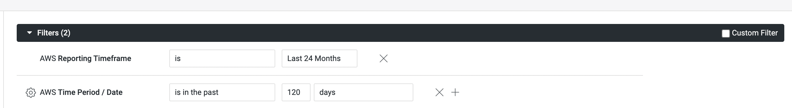
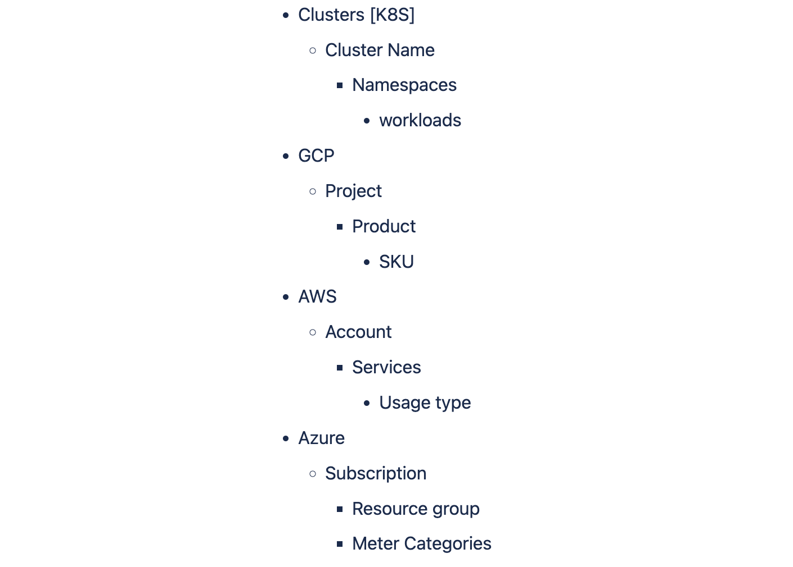

This article addresses some frequently asked questions about Harness Cloud Cost Management (CCM).

### AWS connectors

#### Do I need to create an AWS connector for all my linked accounts?

No. You can create an AWS connector in the master or linked account. CCM requires one connector per AWS account (master or linked).

It is recommended to create a CUR at the master account to avoid the CUR creation step for each linked account. For more information, see [AWS connector requirements](../cloud-cost-management/4-use-ccm-cost-optimization/1-optimize-cloud-costs-with-intelligent-cloud-auto-stopping-rules/1-add-connectors/connect-to-an-aws-connector.md) and [Cost and Usage Reports (CUR) and CCM requirements](../cloud-cost-management/get-started/onboarding-guide/set-up-cost-visibility-for-aws.md#cost-and-usage-reports-cur-and-ccm-requirements).

#### What kind of access does Harness CCM need to the cost and usage reports (CUR)?

If you have a [consolidated billing process](https://docs.aws.amazon.com/awsaccountbilling/latest/aboutv2/useconsolidatedbilling-procedure.html) enabled, then CCM needs read-only access to the cost and usage reports (CUR) stored in the S3 bucket in the master or payer account. This gives access to the cost data for all the accounts (linked/member) in the organization.

If you don't have consolidated billing enabled at the organization level, then you can create the CUR at a linked account level.

#### How does data flow from the source S3 bucket to CCM?

Read [this](https://medium.com/harness-engineering/inner-workings-of-harnesss-cloud-billing-data-ingestion-pipeline-part-2-db82a1f54187) article to understand the flow of data from the S3 bucket to CCM.

#### Do I need to create a CloudFormation stack?

Yes. You need to [create a CloudFormation stack](../cloud-cost-management/get-started/onboarding-guide/set-up-cost-visibility-for-aws.md#create-cross-account-role) to provision IAM Roles and corresponding policies to grant access for the required features.

#### Do you import the data into your account?

The CUR reports are imported into our account. CCM stores them securely with read-only access.

#### How long does it take to show AWS billing data in CCM? Why?

AWS ingests data at source (S3 bucket) multiple times a day. CCM takes up to twenty four hours to make the data available for viewing and analysis once it is available at the source. However, during that time, partial data might be available for viewing. For reporting purposes, if latest timestamp is used, it will pull in the data for current data as well which may be partial as the sync may happen later. For best overall reporting, it's recommended to use a prior day.

#### What AWS access permissions/policies are required for CCM?

See [AWS access permissions](../cloud-cost-management/get-started/onboarding-guide/set-up-cost-visibility-for-aws.md#aws-access-permissions) for the details.

#### To save on S3 storage costs, can I delete CUR files from the source S3 bucket after they've been ingested in CCM?

Yes, the CUR files can be deleted. However, it is recommended that you store the last 6 months of data on the source. CCM keeps a copy of the raw CUR files.

#### Do I require a delegate to connect to AWS?

No. You need a delegate only when connecting to a Kubernetes cluster, such as one running on EKS. ECS cluster costs are pulled through IAM roles.

#### What types of access do you get to my accounts?

CCM gets read-only access to the cost data along with a list of all the member (or linked) accounts. CCM does not get access to any other privileges. However, for AutoStopping, CCM requires additional privileged permissions to orchestrate the underlying infrastructure. See [AWS resource optimization using AutoStopping rules](../cloud-cost-management/get-started/onboarding-guide/set-up-cost-visibility-for-aws.md#aws-resource-optimization-using-autostopping-rules).

#### Can CCM get historical data from the CUR?

Yes, CCM can sync the entire data if CUR files are available at the source. If a new CUR file is made available at source (even for previous months), CCM will sync and correct the data.

### Azure connectors

#### Can I create multiple Azure connectors for each Harness Account?

Yes, you can create multiple Azure connectors for each Harness Account.

* You can create multiple Azure connectors per Azure Tenant with unique subscription IDs.
* If you have separate billing exports for each of your subscriptions in your Azure account, set up separate connectors in Harness to view the cloud cost of all the subscriptions in CCM.
* See [Set up Cloud Cost Management for Azure](../cloud-cost-management/get-started/onboarding-guide/set-up-cost-visibility-for-azure.md).

#### What types of access do you get to my accounts?

CCM gets only read permissions to the storage account in which the billing data export is available.

#### How long does it take to show Azure billing data in CCM? Why?

Azure ingests data at source (storage account) once a day. CCM takes about two hours to make the data available for viewing and analysis once it is available at the source.

#### How does data flow from the source storage account to CCM?

Read [this](https://medium.com/harness-engineering/inner-workings-of-harnesss-cloud-billing-data-ingestion-pipeline-for-azure-a1e6d7fb54c9) article to understand the flow of data from the Azure storage account to CCM.

#### Do I require a delegate to connect to Azure?

No. You need a delegate only when connecting to a Kubernetes cluster, such as one running in AKS.

#### To save on the storage costs, can I delete the billing export from the source storage account after they've been ingested in CCM?

Yes, the billing export can be deleted. However, it is recommended that you store the last 6 months of data on the source. CCM keeps a copy of the raw billing export.

#### Can CCM get historical data from CUR?

Yes, CCM can sync the entire data if CUR files are available at the source without any limits. If a new CUR file is made available at source (even for previous months), CCM will sync and correct the data.

#### The Azure connector fails in the validation step and the message “Authorization permission mismatch” is displayed. What is the reason?

Sometimes, Azure takes time to refresh the access settings on the storage account. Wait for 3–5 minutes and click the **Test** button again in Harness.

### GCP connectors

#### How does data flow from the source billing table (GCP) to the CCM?

Read [this](https://medium.com/harness-engineering/inner-workings-of-harnesss-cloud-billing-data-ingestion-pipeline-part-1-2bce857cd4ec) article to understand the flow of data from GCP to CCM.

#### How long does it take to show GCP billing data in CCM? Why?

GCP ingests data at source (billing data) at less frequent intervals. CCM takes about two hours to make the data available for viewing and analysis once it is available at the source. For the Non-U.S. regions, it may take slightly longer to show up the data.

#### Do I require a delegate to connect to GCP?

No. You need a delegate only when connecting to a Kubernetes cluster, such as one running in GKE.

#### Can CCM get historical data from the GCP billing data?

CCM pulls in data for the last 6 months, however, it can be increased further upon request. Contact [Harness Support](mailto:support@harness.io) to do so.

### Kubernetes cluster connectors

#### How long do I need to wait before data appears for Kubernetes? Why?

Once you enable CCM, for the first cluster the data is available within a few minutes for viewing and analysis. However, you will not see the idle cost because of the lack of utilization data. CCM generates the last 30 days of the cost data based on the events we collect of the initial cluster state at the time of connecting. From the second cluster onwards, it takes about 2–3 hours for the data to be available for viewing and analysis.

#### Do I need to add Kubernetes cloud provider connectors for each Kubernetes cluster?

Yes, you need to add a Kubernetes cloud provider for each Kubernetes cluster. One connector can access only one cluster.

#### Do I need to create a CCM connector for each cluster?

Yes, you need to create a CCM Kubernetes connector for each cluster.

#### Do I require a delegate in order to connect to Kubernetes?

Yes, you need a delegate to get started with Kubernetes clusters.

#### Do I need to ensure that the metrics server is installed only for EKS?

Yes. For GKE and AKS, the metrics server is installed by default.

#### How is the cost calculated for a Kubernetes service/pod?

Node cost:

For GCP, node cost is calculated based on the list pricing API. For AWS and Azure, cost is trued up if the corresponding connector is set up.

Example:


```
Price per hour of  n1-standard-4 in us-central1 from cloud provider pricing API : $0.1900  
  
Cost for 24 hrs : 24 * 0.1900 = $4.56
```
Pod cost:


```
Pod request: max(max(init container requests), sum(container requests))  
Pod cost : max(cost of resource request, cost of utilized resources)
```
Pod cost is considered to be a ratio of the node cost it is running on.


```
Hourly pod cost :  
((podCpu/nodeCpu)  * nodeCpuPricePerHour ) + ((podMemory/nodeMemory)) *  nodeMemoryPricePerHour)
```
#### Is the Kubernetes pod request or limit considered for cost calculations or actual utilization of resources by pod?

Yes, see this formula:


```
Pod cost : max(cost of resource request, cost of utilized resources)
```
#### How does Harness handle scenarios where the cost for pods changes depending on instance type?

In AWS/Azure/GCP, cost should change depending on whether you deploy on the spot instance, on-demand instance, or some reserved instance.

For GCP, Harness identifies the node type the pod is running on and fetches the list pricing.

For AWS/Azure, node cost is trued up from CUR reports. CUR reports take into account RIs, savings plans etc.

#### How's cost calculated for K8s on cloud providers and K8s on bare metal?

* For Kubernetes on cloud providers, the cost calculation process relies on the CUR and Billing Export data to obtain the node cost using the `resource-id`. With this information, Harness CCM calculates the pod cost based on the node pricing.
However, there might be instances where the `resource-id` is not immediately available due to data ingestion delays in the billing reports. In such cases, CCM falls back to using public pricing to calculate the node cost. After the billing report data is ingested, during subsequent runs, the cluster data for previous days are tuned to keep up the updated costs.


* For Kubernetes on bare metal, the cost computation involves using hard-coded values for both node and pod cost calculations.

##### Compute instance pricing
 
   For spot instances, the CPU price per hour is $0.00064 and the memory price per hour is $0.0032.
   For on-demand instances, the CPU price per hour is $0.0016 and the memory price per hour is $0.008.
   
  You have the option to set the pricing for compute instances according to your preference. To do so, you need to submit a ticket to [Harness Support](mailto:support@harness.io).
  

##### ECS Fargate pricing

   For spot instances, the CPU price per hour is $0.01334053 and the memory price per hour is $0.00146489.
   For on-demand instances, the CPU price per hour is $0.04656 and the memory price per hour is $0.00511.

##### Storage Pricing

  Price per hour is computed by using the formula: `storageMb * pricePerMbPerHour`

### AutoStopping Kubernetes cluster

#### Will the AutoStopping Rule YAML need to replace the ingress we currently use? If so, this might be problematic as we are using external Helm charts.

You do not have to replace your current ingress. The AutoStopping Rule configuration will reference your current ingress by name.

#### Does AutoStopping support Fargate for EKS?

Yes, AutoStopping supports EKS with Fargate*.*

#### Namespace in metadata is **default**. Should it be changed to the one where the target service resides?

Yes, AutoStoppingRule’s namespace should be the namespace in which the service is running.

#### How to rotate certificate on Autostopping Proxy?
1. Create new secrets in the cloud provider for certificate and secret
2. Go to the load balancers page
3. Edit the Autostopping proxy
4. Modify the secrets for certificate and secret
5. Save the proxy

#### Why is user traffic not getting detected when custom exclusion/inclusion is enabled?

1. Please make sure the Access logs are enabled in the ALB

2. Please make sure the Harness role has the following permissions

```
s3:ListBucket

s3:GetObject

s3:ListAllMyBuckets

s3:GetBucketLocation
```

#### How do we onboard and access RDS instance/cluster to Autostopping?

1. Access the RDS cluster through Autostopping proxy. The steps to connect using proxy is available in the Autostopping rule details page. As long as someone connects to the RDS cluster through proxy, Harness will keep the RDS cluster running.
2. OR create an uptime fixed schedule for the RDS cluster for the working hours. Harness makes sure that cluster is up and running during the uptime schedule
3. OR Use the RDS Autostopping rule as a dependency to another Autostopping rule (For example, Autostopping rule for an EC2). As long as the parent resource (EC2) is running, Harness makes sure that dependent resource (RDS) is running too.

### General

#### Can I create a cloud cost connector at the project level in Harness?

No. CCM connectors are available only at the account level in Harness. Connectors have 3 features (visibility, inventory, and AutoStopping). You must select at least one feature to create a connector.

#### Does CCM take AWS RI purchases into account?

Yes, CCM reads data from your CUR, which is the source of truth for monthly billing.

#### Does CCM take into account custom discounts, rewards, or credits?

Yes, if they are part of your billing.

#### I do not see hourly options when I set a date range beyond seven days?

Hourly granularity can be accessed only for the last seven days.

#### I have an AWS connector and a Kubernetes connector. Why is my cluster data not available even after a few hours?

In order to true up costs for Kubernetes, we wait until CUR data is also available. If data is not available even after 24 hours, contact [Harness Support](mailto:support@harness.io).

#### Are connectors shared across Harness FirstGen and Harness NextGen?

No, you must create separate connectors for Harness FirstGen and Harness NextGen.

#### If I create a CCM connector in one Harness platform generation (Harness FirstGen or Harness NextGen), will the data obtained through that connector be visible in the other Harness platform generation?

Yes, you can view your cloud cost data across Harness FirstGen and Harness NextGen.

#### What is the limit on connectors per account?

Currently, there is no limit to the number of connectors per account.

#### Can I have the same connector (AWS/GCP/Azure) in Harness FirstGen and Harness NextGen?

There is no restriction, but Harness recommends avoiding having the same connectors in FirstGen and NextGen.

#### How frequently do we ingest AWS EC2/EBS metrics?

All inventory metrics are pulled in once every hour.

#### What is the data retention policy in CCM?

CCM has a data retention policy per edition. After this period, the data is deleted and no longer available.


|  |  |  |
| --- | --- | --- |
| **Free** | **Team** | **Enterprise** |
| 1 month | 5 Years | 5 Years |

:::note 
The hourly granularity of cluster data is retained for 14 days. After 14 days, CCM retains daily granularity of the data.
:::

## On-premises

#### Does CCM support on-premises platform installations?

Currently, no. Harness is working on providing this functionality.

#### Efficiency score

#### Is the efficiency score configurable? Why not?

The efficiency score is not configurable. The efficiency score objectively represents how well your cluster resources are utilized.

5% buffer of the total cost is allowed when computing the unallocated resources and 30% for idle resources. A baseline of 65% is defined for utilized resources. So your utilization need not be at the capacity to get a perfect score.

#### Does the efficiency score take into account overall cloud costs? How is it computed?

The efficiency score takes only the cluster resources into account and not the overall cloud costs. Efficiency score is derived from the total and idle (and or unallocated) spend of your resources.

### Workload recommendations

#### How often do you generate recommendations?

New recommendations are generated daily and existing recommendations are updated as per the latest utilization trends.

#### We only show recommendations that have been updated within the last 72 hours. What could be the reason for this?

Workloads that had not been updated in the last 72 hours were stopped/killed. As a result, no recommendations are generated.

#### How are recommendations calculated when the resource requests and limits are not configured?

The [recommended resource](../cloud-cost-management/4-use-ccm-cost-optimization/1-ccm-recommendations/workload-recommendations.md) is based purely on the utilization metrics pulled from the metrics server. Therefore, it doesn’t make a difference whether or not the resource requests and limits are configured.

#### Do recommendations take burst of CPU into consideration?

Yes, we collect metrics data every minute, and the data sent by the metrics server is the average of the last one-minute window for any container.

#### What if there are multiple containers inside the Pod?

We will get separate recommendations for these individual containers. The recommendations are computed at the container’s level and not at the Pod’s level.

### Node pool recommendations

#### Does Harness support dynamic picking of instance families in Node recommendations to optimize for Reserved Instances (RI) or Savings plan?

No, Harness doesn't support dynamic picking of instance families in node recommendations to optimize for RI or Savings plan.

#### Does Harness take into account Reserved Instances (RI) and Savings Plans when showing potential spend and savings?

Yes, Harness considers RIs and Savings Plans to provide insights into potential spend and savings. 

### Perspectives and Dashboards

#### What is the limit to the number of Perspectives that I can create in an account?

You can create up to 250 Perspectives in an account. See [Create cost perspectives](../cloud-cost-management/3-use-ccm-cost-reporting/1-ccm-perspectives/1-create-cost-perspectives.md).

#### Will I be able to see tags in Perspectives?

CCM unifies tags in AWS/GCP/Azure as labels in Perspectives.

#### Can Perspectives be shared across FirstGen and NextGen?

Yes, you can view the data across the FirstGen and NextGen.

#### Why do I observe difference in costs between the Perspective and Dashboard data?

To resolve any cost differences between the Perspective and Dashboard in Harness CCM, consider the following steps:

* **Time Period Consistency**: Make sure to set the same time period in both Perspective and Dashboard. If you have defined a specific time period (For example, June) in the Perspective, ensure that the Dashboard also uses the same time period for accurate comparisons.
* **Time Range Adjustment**: You must set the following two time filters when you create the dashboard. 

  * Reporting Timeframe
  * Time Period

  If the Dashboard is set to the default **ReportingTimeframe** value (Last 30 days) that does not encompass the specified **Time Period**, adjust the Reporting Timeframe filter to cover a larger interval that includes the Time Period filter. This ensures that the Dashboard data spans the same duration as the Perspective.

  

#### Do the recommendations consider our compute savings plan, RIs, and Savings Plans?

No, the node pool recommendations do not take into account RI (Reserved Instances) and savings plans. The potential monthly spend and savings are calculated using a public pricing API and do not consider any discounts or savings from your compute savings plan.

#### Why do ECS clusters get added automatically to the default perspective while EKS clusters don't?

When you add an AWS account that contains both ECS and EKS clusters, our system will automatically fetch and display ECS cluster data in the Cluster default perspective. To include EKS cluster data, you'll need to set up the K8S connector separately. For setup instructions, please refer to the documentation here.
In the AWS default perspective, users can view the total cost of both ECS and EKS services. However, in the Cluster default perspective, we provide a breakdown of the cost for each cluster, along with the option to drill down for more detailed information.

### Budgets and reports

#### When will I receive notifications for the alerts that I’ve configured in my budgets?

Notifications are sent out daily at 2:30 PM GMT. The budget alerts are sent out when the cost of your budget has crossed the configured threshold.

#### I created a budget and set the budget amount less than the spend of the current period. Why didn’t I get a notification immediately?

The budget alerts are sent out daily at 2.30 p.m. GMT.

#### What is the limit on a budget setup per Perspective?

No limit as of now.


### Anomaly Detection

#### How frequently do you run anomaly detection jobs ?

Anomaly detection jobs are executed once per day.

#### Do we consider seasonal factors while detecting anomalies ?

Yes we do consider daily, weekly and monthly seasonalities while detecting anomalies.

#### Do we support daily alerts for anomalies ?

Yes we do support daily alerts for anomalies

#### We didn’t get the slack/email notifications for anomaly despite the fact that we have we have set up channels for them ?

Please reverify if the Slack and email channels have been properly configured for that specific perspective. If a particular anomaly is associated with multiple perspectives, we only send one notification to avoid redundancy. In this scenario, the notification is sent for the perspective that was created first among all the perspectives that share the same anomaly

#### How much time does it take for sending alerts to the customers for an anomaly ?

As soon as anomalies are detected at our end, we immediately send both slack as well as email notifications to our customers regarding it.

#### Do we support fetching anomalies on perspective made through labels ?

No, currently we do not have support for retrieving anomalies based on perspective labels.

#### Is there a way we can proactively feed data to anomaly detection for future events or holidays ?

No, as of now we don’t support feeding data for future events or holidays.

#### Anomaly drill down from the perspective screen does not seem to be filtering the anomaly list correctly ?

When you perform a drill-down from the perspective screen to view anomalies, we apply a time filter that specifically retrieves all anomalies of that particular day. This process ensures that the anomalies are accurately fetched, and the user is presented with all anomalies from that particular day, allowing them to take appropriate action.

#### I see an anomaly at the AWS usage type level. Why is it that I'm not observing the same anomaly at the AWS service or AWS account level?

We display anomalies at the most granular level of the hierarchy and intentionally exclude them from higher levels. This approach enables customers to precisely identify the root cause of the anomaly." The hierarchy level for clusters and different cloud providers are as follows  



#### I am seeing a large number of anomalies being detected which do not seem like anomalies to me ?

Before proceeding, please double-check whether you have configured a new connector specifically for that particular cloud service. If you have indeed set up a new connector, please be aware that our machine learning models may not yet have sufficient training data for accurately identifying anomalies. To obtain reliable anomaly results, we typically require a minimum of 14 days' worth of training data.

### General AutoStopping rules

This section addresses some frequently asked questions about [Harness intelligent cloud AutoStopping rules](../cloud-cost-management/4-use-ccm-cost-optimization/1-optimize-cloud-costs-with-intelligent-cloud-auto-stopping-rules/1-auto-stopping-rules.md).

#### What are the supported cloud services that AutoStopping works with?

We continuously update the list of services that work with AutoStopping. Here is the current list of supported services across the cloud. For more information, see [Non-cluster support](../first-gen/cloud-cost-management/concepts-ccm/b-cloud-cost-management-overview.md#feature-support-matrix) and [Cluster support](../first-gen/cloud-cost-management/concepts-ccm/b-cloud-cost-management-overview.md#supported-kubernetes-management-platform).


|  |  |
| --- | --- |
| **Cloud Provider** | **AutoStopping - Supported Services** |
| AWS | EC2AutoScaling GroupsKubernetes Clusters (EKS)ECS ServiceRDS Instances |
| Azure | Virtual Machines (On-demand)Kubernetes Clusters (AKS) |
| GCP | Google Compute Engine (GCE) VMsKubernetes Clusters (GKE) |

#### How does AutoStopping add value over Autoscaling?

AutoStopping provides several advantages, and it can work alongside Autoscaling to improve efficiency:

* AutoStopping uses real-time traffic as a signal for activity and usage, whereas Autoscaling relies on CPU/memory usage, which may not be an accurate representation of actual usage. 
* AutoStopping has the ability to scale down the entire task count all the way to zero and back up again when new requests come in, while Autoscaling can only scale down to the minimum task replica count for that service. This means that leaving even a single task running per service can add up at scale, and AutoStopping can help reduce unnecessary costs.
* Dependent services or resources that do not directly receive traffic can also be entirely scaled down to zero or shut down based on traffic received at any endpoint, which can significantly increase overall cost savings. For example, an ECS service with an RDS database located in the same or different cluster can be scaled down or shut down entirely based on traffic received, which is not possible with just native Autoscaling.

#### How does AutoStopping work with on-demand load tests and off-shift/late-shift developers? How can they trigger load tests on a stopped resource?

* AutoStopping will function with real-time requests for on-demand load tests as long as the traffic is HTTP-based; when new requests come, AutoStopping will warm up the necessary services in real-time.
* There are two options for late-shift developers:
	+ If you know the exact schedule ahead of time, you can use [Fixed schedules](../cloud-cost-management/4-use-ccm-cost-optimization/1-optimize-cloud-costs-with-intelligent-cloud-auto-stopping-rules/4-create-auto-stopping-rules/create-autostopping-rules-aws.md#fixed-schedules) to keep the service running during that time.
	+ If the exact duration is unknown:
		- You can use [ECG/heartbeat agent](../cloud-cost-management/4-use-ccm-cost-optimization/1-optimize-cloud-costs-with-intelligent-cloud-auto-stopping-rules/2-configure-ecg-for-auto-stopping-rules.md#configure-ecg) to keep the services up as long as needed by detecting process liveliness or HTTP endpoints that can report the progress of the workers.
		- Alternatively, you can use our [API](https://harness.io/docs/api/tag/Cloud-Cost-AutoStopping-Fixed-Schedules) support to notify of service activity/idleness.

#### Can I shut down entire clusters more easily than creating one rule per service?

Yes, you can use schedules to shut down the entire ECS cluster in fixed windows of time. See [Fixed schedules](../cloud-cost-management/4-use-ccm-cost-optimization/1-optimize-cloud-costs-with-intelligent-cloud-auto-stopping-rules/4-create-auto-stopping-rules/create-autostopping-rules-aws.md#fixed-schedules).

### AWS AutoStopping rules

#### How do AutoStopping Rules access the AWS VMs?

The VMs can be accessed using any of the following methods:

* DNS Link
* SSH/RDP

For more information, see [Set up access for HTTP/HTTPS workload](../cloud-cost-management/4-use-ccm-cost-optimization/1-optimize-cloud-costs-with-intelligent-cloud-auto-stopping-rules/4-create-auto-stopping-rules/create-autostopping-rules-aws.md#set-up-access-for-httphttps-workload) and [Setup Access Using SSH/RDP](../cloud-cost-management/4-use-ccm-cost-optimization/1-optimize-cloud-costs-with-intelligent-cloud-auto-stopping-rules/4-create-auto-stopping-rules/create-autostopping-rules-aws.md#set-up-access-for-tcp-workload-or-sshrdp).

#### Do AutoStopping Rules need a load balancer like Application Load Balancer (ALB) for non-prod workloads?

Yes, you need to create an Application Load Balancer (ALB) for AWS. See [Create an Application Load Balancer for AWS](../cloud-cost-management/4-use-ccm-cost-optimization/1-optimize-cloud-costs-with-intelligent-cloud-auto-stopping-rules/3-load-balancer/create-load-balancer-aws.md).

#### Can I use Route 53 as my DNS provider?

You can use Amazon Route 53 as the DNS service for your domain, such as example.com. When Route 53 is your DNS service, it routes internet traffic to your website by translating friendly domain names (such as `www.example.com`) into the numeric IP addresses (such as `192.0.2.1`) that computers use to connect to each other. See [Configure DNS using Route 53](../cloud-cost-management/4-use-ccm-cost-optimization/1-optimize-cloud-costs-with-intelligent-cloud-auto-stopping-rules/3-load-balancer/create-load-balancer-aws.md#configure-dns-using-route-53).

#### Can I use AutoStoping Rules to manage my resources hosted in the AWS GovCloud?

Yes, the resources hosted in the AWS GovCloud regions can be managed using AutoStopping Rules.

#### How AutoStopping Rules can help when I shut down my VMs during non-working hours?

You can run non-production workloads on fully-orchestrated spot instances and turn them off whenever idle, saving on cloud costs to the most granular extent possible. It’s a dynamic solution to a pressing customer problem or set of them. In particular, Cloud AutoStopping enables customers to solve the following use cases:

* Automatically detect idle times and shut down (on-demand) or terminate (spot) resources.
* Automatically restart resources whenever there is a traffic or usage request.
* Stopped/terminated machines are always accessible using the same access patterns that the team is used to – DNS link, SSH, RDP, and background tasks.
* Enable running workloads on fully-orchestrated spot instances without worrying about spot interruptions.

Together, this helps customers achieve savings that are 2-3x that of any static resource scheduler, with none of the access issues. It also significantly reduces the barrier to adoption across an organization.

#### How AutoStopping Rules can help when I am using Amazon EC2 Reserved Instances (RIs) for non-prod workloads?

Using AutoStopping with either on-demand instances or spot instances will result in 70%+ savings without any long-term commitments or upfront payments. With RIs, you can save up to ~ 60-65% (lower savings) and you have long-term (1-3yrs+) commitments and upfront payments (for highest savings). So it is beneficial to release RIs and use AutoStopping with on-demand or spot.

#### How spot instance interruptions are handled?

In the event of spot interruption, an alternate spot instance is provisioned. In case there is no alternate spot available we fall back to on-demand and continue to poll for spot capacity. Once a spot capacity is available, we do a reverse fall-back from on-demand to spot.

All this is automated, with no manual intervention. See [Review: how spot orchestration works](../cloud-cost-management/4-use-ccm-cost-optimization/1-optimize-cloud-costs-with-intelligent-cloud-auto-stopping-rules/4-create-auto-stopping-rules/create-autostopping-rules-aws.md#how-spot-orchestration-works).

#### I do not use Application Load Balancer. Can I still create AutoStopping Rules?

No. An Application Load Balancer is needed for AutoStopping to work on AWS. See [Create an Application Load Balancer for AWS](../cloud-cost-management/4-use-ccm-cost-optimization/1-optimize-cloud-costs-with-intelligent-cloud-auto-stopping-rules/3-load-balancer/create-load-balancer-aws.md).

#### I have an application running on EC2 and it has a dependency on theRDS instance. Can AutoStopping work when such dependencies exist?

Yes. AutoStopping supports dependency rules to monitor for traffic and can automatically shut down and start both the resources/services.

### Azure AutoStopping rules

#### How do AutoStopping Rules access the AWS VMs?

The VMs can be accessed using any of the following methods:

* DNS Link
* SSH/RDP

#### Do AutoStopping Rules need an Application Gateway or Azure Web Application Firewall (WAF) for non-prod workloads?

Yes, you need to create an Application Gateway for Azure. See [Create an Application Gateway for Azure](../cloud-cost-management/4-use-ccm-cost-optimization/1-optimize-cloud-costs-with-intelligent-cloud-auto-stopping-rules/3-load-balancer/create-an-application-gateway-for-azure.md).

#### How AutoStopping Rules can help when I shut down my VMs during non-working hours?

You can run non-production workloads on fully-orchestrated spot instances and turn them off whenever idle, saving on cloud costs to the most granular extent possible. It’s a dynamic solution to a pressing customer problem or set of them. In particular, Cloud AutoStopping enables customers to solve the following use cases:

* Automatically detect idle times and shut down (on-demand) or terminate (spot) resources.
* Automatically restart resources whenever there is a traffic or usage request.
* Stopped/terminated machines are always accessible using the same access patterns that the team is used to – DNS link, SSH, RDP, and background tasks.
* Enable running workloads on fully-orchestrated spot instances without worrying about spot interruptions.

Together, this helps customers achieve savings that are 2-3x that of any static resource scheduler, with none of the access issues. It also significantly reduces the barrier to adoption across an organization.

#### Can I use a front door designer with backend pools as a load balancer? Will AutoStopping Rules work?

No. Currently, an Application Gateway is required for Azure AS to work. See [Create an Application Gateway for Azure](../cloud-cost-management/4-use-ccm-cost-optimization/1-optimize-cloud-costs-with-intelligent-cloud-auto-stopping-rules/3-load-balancer/create-an-application-gateway-for-azure.md).

### AutoStopping Proxy load balancers

#### What is an Autostopping Proxy load balancer?

It is a custom VM launched in the customer's cloud account which comes pre-installed with the necessary proxy and load balancing services. For more information, visit the following topics: 
* [AutoStopping Proxy for AWS](../cloud-cost-management/4-use-ccm-cost-optimization/1-optimize-cloud-costs-with-intelligent-cloud-auto-stopping-rules/3-load-balancer/create-autoproxy-aws-lb.md) 
* [AutoStopping Proxy for Azure](../cloud-cost-management/4-use-ccm-cost-optimization/1-optimize-cloud-costs-with-intelligent-cloud-auto-stopping-rules/3-load-balancer/create-azure-autoproxy-lb.md)
* [AutoStopping Proxy for GCP](../cloud-cost-management/4-use-ccm-cost-optimization/1-optimize-cloud-costs-with-intelligent-cloud-auto-stopping-rules/3-load-balancer/create-autoproxy-gcp-lb.md)


#### How to provision or size the proxy VM?

You can choose an instance type of your preference as the proxy from the different types of instances offered by each of the cloud provider based on the expected traffic. 

