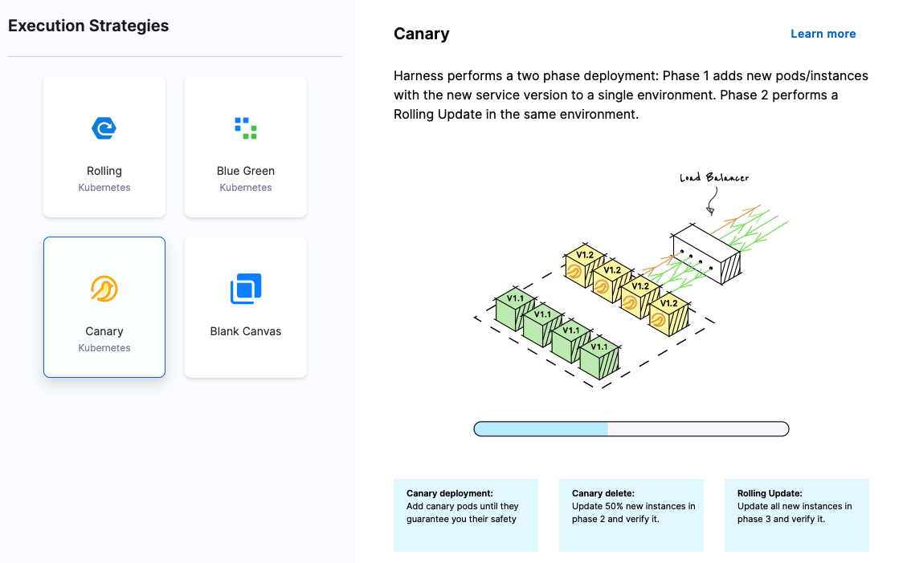

This article addresses some frequently asked questions about Harness Continuous Delivery & GitOps.

For an overview of Harness' support for platforms, methodologies, and related technologies, go to [Supported platforms and technologies](/docs/platform/platform-whats-supported.md).

For a list of CD supported platforms and tools, go to [CD integrations](/docs/continuous-delivery/cd-integrations.md).


#### What is a service instance in Harness?

A service is an independent unit of software you deploy through Harness CD pipelines.

This will typically map to a service in Kubernetes apps, or to an artifact you deploy in traditional VM-based apps.

Service instances represent the dynamic instantiation of a service you deploy with Harness.

For example, for a service representing a Docker image, service instances are the number of pods running the Docker image.


Notes:

* For services with more than 20 service instances - active pods or VMs for that service - additional service licenses will be counted for each 20 service instances. This typically happens when you have large monolith services.
* See the **Pricing FAQ** at [Harness pricing](https://harness.io/pricing/).

#### How does Harness calculate pricing for CD?

See [Service-based licensing and usage for CD](../continuous-delivery/get-started/service-licensing-for-cd.md).

#### My definition of a service differs from the above standard definition. How will pricing work in my case?

Harness allows deployment of various custom technologies such as Terraform scripts, background jobs, and other non-specified deployments. These require custom evaluation to assess the correct Licensing model. Please contact the Harness Sales team to discuss your specific technologies and deployment use cases.

See the **Pricing FAQ** at [Harness pricing](https://harness.io/pricing/).

#### Are there other mechanisms to license Harness CD beyond services?

See the **Pricing FAQ** at [Harness pricing](https://harness.io/pricing/).

Yes, we are happy to have Harness Sales team work with you and understand the specifics of what you are trying to achieve and propose a custom licensing/pricing structure.

#### Do unused/stale services consume a license?

See the **Pricing FAQ** at [Harness pricing](https://harness.io/pricing/).

Harness CD actively tracks and provides visibility into all active services that consume a license.

An active service is defined as a service that has been deployed at least once in the last 30 days. A service deemed inactive (no deployments in the last 30 days), does not consume a license.

#### How will I know if I am exceeding my licensed service usage?

See the **Pricing FAQ** at [Harness pricing](https://harness.io/pricing/).

Harness CD has built-in license tracking and management dashboards that provide you real-time visibility into your license allocation and usage.

If you notice that you are nearing or exceeding your licensed services, please get in touch with Harness Sales team to plan ahead and ensure continued usage and compliance of the product.

#### How many users can I onboard onto Harness CD? Is there a separate pricing for Users?

Harness CD has been designed to empower your entire Engineering and DevOps organization to deploy software with agility and reliability. We do not charge for users who onboard Harness CD and manage various aspects of the deployment process, including looking through deployment summaries, reports, and dashboards. We empower users with control and visibility while pricing only for the actual ‘services’ you deploy as a team.

#### If I procure a certain number of service licenses on an annual contract, and realize that more licenses need to be added, am I able to procure more licenses mid-year through my current contract?

See the **Pricing FAQ** at [Harness pricing](https://harness.io/pricing/).

Yes, Harness Sales team is happy to work with you and help fulfill any Harness-related needs, including mid-year plan upgrades and expansions.

#### If I procure a certain number of service licenses on an annual contract, and realize that I may no longer need as many, am I able to reduce my licenses mid-year through my current contract?

See the **Pricing FAQ** at [Harness pricing](https://harness.io/pricing/).

While an annual contract can not be lowered mid-year through the contract, please contact us and we will be very happy to work with you. In case you are uncertain at the beginning of the contract of how many licenses should be procured - you can buy what you use today to start and expand mid-year as you use more. You can also start with a monthly contract and convert to an annual subscription.

#### What if I am building an open source project?

We love Open Source and are committed to supporting our Community. We recommend the open-source [Gitness](https://gitness.com) for hosting your source code repository as well as CI/CD pipelines.

Contact us and we will be happy to provide you with a no restriction SaaS Plan!

#### What if I add more service instance infrastructure outside of Harness?

See the **Pricing FAQ** at [Harness pricing](https://harness.io/pricing/).

If you increase the Harness-deployed service instance infrastructure outside of Harness, Harness considers this increase part of the service instance infrastructure and licensing is applied.

#### When is a service instance removed?

If Harness cannot find the service instance infrastructure it deployed, it removes it from the Services dashboard.

If Harness cannot connect to the service instance infrastructure, it will retry until it determines if the service instance infrastructure is still there.

#### If the instance/pod is in a failed state does it still count towards the service instance count?

Harness performs a steady state check during deployment and requires that each instance/pod reach a healthy state.

A Kubernetes liveness probe failing later would mean the pod is restarted. Harness continues to count it as a service instance.

A Kubernetes readiness probe failing later would mean traffic is no longer routed to the pods. Harness continues to count pods in that state.

Harness does not count an instance/pod if it no longer exists. For example, if the replica count is reduced.

#### What deployment strategies can I use?

Harness supports all deployment strategies, such as blue/green, rolling, and canary.

See [Deployment concepts and strategies](../continuous-delivery/manage-deployments/deployment-concepts.md).

#### How do I filter deployments on the Deployments page?

You can filter deployments on the the Deployments page according to multiple criteria, and save these filters as a quick way to filter deployments in the future.

#### How do I know which Harness Delegates were used in a deployment?

Harness displays which Delegates performed each task in the Details of each step.


#### Can I restrict deployments to specific User Groups?

Yes, you can enable the Role permission Pipeline Execute and then apply that Role to specific User Groups.


See [Manage roles](../platform/role-based-access-control/add-manage-roles).

#### Can I deploy a service to multiple infrastructures at the same time?

Each stage has a service and target Infrastructure. If your Pipeline has multiple stages, you can deploy the same service to multiple infrastructures.

See [Define your Kubernetes target infrastructure](/docs/continuous-delivery/deploy-srv-diff-platforms/kubernetes/define-your-kubernetes-target-infrastructure.md).

#### Can I re-run a failed deployment?

Yes, select **Re-run Pipeline**.


### Kubernetes

#### What is a Harness Kubernetes deployment?

Harness takes the artifacts and Kubernetes manifests you provide and deploys them to the target Kubernetes cluster. You can simply deploy Kubernetes objects via manifests and you can provide manifests using remote sources and Helm charts.

See the [Kubernetes deployment tutorial](../continuous-delivery/deploy-srv-diff-platforms/kubernetes/kubernetes-cd-quickstart.md) and [Kubernetes deployments overview](../continuous-delivery/deploy-srv-diff-platforms/kubernetes/kubernetes-deployments-overview.md).

For detailed instructions on using Kubernetes in Harness, see the [Kubernetes how-tos](/docs/category/kubernetes).

#### What workloads can Harness deploy in a Kubernetes cluster?

See [What can I deploy in Kubernetes?](../continuous-delivery/deploy-srv-diff-platforms/kubernetes/cd-k8s-ref/what-can-i-deploy-in-kubernetes.md).

#### Does Harness support everything in Kubernetes?

Yes. Any standard Kubernetes features in your Kubernetes manifests will be deployed.

Harness tracks deployment status to ensure pods reach steady state before considering the deployment successful, but other, even unrelated Kubernetes features, are supported. For example, liveness, readiness, and startup probes are supported.

#### For Kubernetes, does Harness count only pods as a service instance (SI)? What about a ConfigMap or a Secret?

Only pods. Only pods will consume SI licenses. ConfigMaps and Secrets do not consume SI licenses.

#### How is Harness sure that a pod is a service instance?

Harness tracks the workloads it deploys. Harness checks every 10 minutes using the Kubernetes API to see how many pods are currently running for the given workload.

#### If I create a pod using Harness and keep managing it, is it still counted as a service instance?

Yes. Sidecar containers within pods (log proxy, service mesh proxy) do not consume SI licenses. Harness licenses by pod, not the number of containers in a pod.

#### Does Harness support OpenShift?

Yes. Harness supports [DeploymentConfig](https://docs.openshift.com/container-platform/4.1/applications/deployments/what-deployments-are.html), [Route](https://docs.openshift.com/enterprise/3.0/architecture/core_concepts/routes.html), and [ImageStream](https://docs.openshift.com/enterprise/3.2/architecture/core_concepts/builds_and_image_streams.html#image-streams) across Canary, Blue Green, and Rolling deployment strategies. Please use `apiVersion: apps.openshift.io/v1` and not `apiVersion: v1`.

You can leverage Kubernetes list objects as needed without modifying your YAML for Harness.

When you deploy, Harness will render the lists and show all the templated and rendered values in the log.

Harness supports:

* List
* NamespaceList
* ServiceList
* For Kubernetes deployments, these objects are supported for all deployment strategies (canary, rolling, blue/green).

If you run `kubectl api-resources` you should see a list of resources, and `kubectl explain` will work with any of these.

#### Can I use Helm?

Yes. Harness Kubernetes deployments support Helm v2 and v3.

Harness supports Helm charts in its Kubernetes implementation.

Harness Kubernetes deployments allow you to use your own Kubernetes manifests or a Helm chart, and Harness executes the Kubernetes API calls to build everything without Helm and Tiller needing to be installed in the target cluster.

Harness Kubernetes deployments also support all deployment strategies (canary, blue/green, rolling, and so on).

#### Should I use Kubernetes or Native Helm?

Harness includes both Kubernetes and Helm deployments, and you can use Helm charts in both. Here's the difference:

* Harness [Kubernetes deployments](../continuous-delivery/deploy-srv-diff-platforms/kubernetes/kubernetes-cd-quickstart.md) allow you to use your own Kubernetes manifests or a Helm chart (remote or local), and Harness executes the Kubernetes API calls to build everything without Helm and Tiller needing to be installed in the target cluster.  
Harness Kubernetes deployments also support all deployment strategies (canary, blue/green, rolling, and so on).
* For Harness [Native Helm deployments](/docs/continuous-delivery/deploy-srv-diff-platforms/helm/native-helm-quickstart), you must always have Helm and Tiller (for Helm v2) running on one pod in your target cluster. Tiller makes the API calls to Kubernetes in these cases. You can perform a Rolling deployment strategy only (no canary or blue/green). For Harness Native Helm v3 deployments, you no longer need Tiller, but you are still limited to the Rolling deployment strategy.
	+ **Versioning:** Harness Kubernetes deployments version all objects, such as ConfigMaps and secrets. Native Helm does not.
	+ **Rollback:** Harness Kubernetes deployments will roll back to the last successful version. Native Helm will not. If you did two bad Native Helm deployments, the second one will roll back to the first. Harness will roll back to the last successful version.

#### Can I deploy Helm charts without adding an artifact source to Harness?

Yes.

Harness Kubernetes deployments using Helm charts can involve adding your artifact (image) to Harness in addition to your chart. The chart refers to the artifact you added to Harness (through its values.yaml file). During deployment, Harness deploys the artifact you added to Harness and uses the chart to manage it.

In addition to this method, you can also deploy the Helm chart without adding your artifact to Harness. Instead, the Helm chart identifies the artifact. Harness installs the chart, gets the artifact from the repo, and then installs the artifact. We call this a *Helm chart deployment*.

See [Deploy helm charts](../continuous-delivery/deploy-srv-diff-platforms/helm/deploy-helm-charts.md).

#### Can I run Kubernetes jobs?

Yes. In Harness Kubernetes deployments, you define jobs in the Harness Service **Manifests**. Next you add the Apply step to your Harness workflow to execute the job.

See [Run Kubernetes jobs](../continuous-delivery/deploy-srv-diff-platforms/kubernetes/kubernetes-executions/run-kubernetes-jobs.md).

#### Can I deploy a Kubernetes resources using CRDs?

Yes. Harness supports all Kubernetes default resources, such as pods, deployments, StatefulSets, DaemonSets, etc. For these resources, Harness supports steady state checking, versioning, displays instances on Harness dashboards, performs rollback, and other enterprise features.

In addition, Harness provides many of the same features for Kubernetes [custom resource](https://kubernetes.io/docs/tasks/extend-kubernetes/custom-resources/custom-resource-definitions/) deployments using Custom Resource Definitions (CRDs). CRDs are resources you create that extend the Kubernetes API to support your application.

:::note 
Harness supports CRDs for both Kubernetes and OpenShift. There is no difference in their custom resource implementation.
:::

#### Can I deploy resources outside of the main Kubernetes workload?

Yes. By default, the Harness Kubernetes workflow will deploy all of the resources you have set up in the Service **Manifests** section.

In some cases, you might have resources that you do not want to deploy as part of the main workflow deployment, but want to apply as another step in the workflow. For example, you might want to deploy an additional resource only after Harness has verified the deployment of the main resources in the Service **Manifests** section.

workflows include an **Apply** step that allows you to deploy any resource you have set up in the Service **Manifests** section.

See [Deploy manifests separately using the Apply step](../continuous-delivery/deploy-srv-diff-platforms/kubernetes/kubernetes-executions/deploy-manifests-using-apply-step.md).

#### Can I ignore a manifest during deployment?

You might have manifest files for resources that you do not want to deploy as part of the main deployment.

Instead, you tell Harness to ignore these files and then apply them separately using the Harness [Kubernetes Apply step](../continuous-delivery/deploy-srv-diff-platforms/kubernetes/cd-k8s-ref/kubernetes-apply-step.md).

Or you can simply ignore them until you wish to deploy them as part of the main deployment.

See [Ignore a manifest file during deployment](../continuous-delivery/deploy-srv-diff-platforms/kubernetes/cd-kubernetes-category/ignore-a-manifest-file-during-deployment.md).

#### Can I pull an image from a private registry?

Typically, If the Docker artifact source is in a private registry, Harness has access to that registry using the credentials set up in the Harness [Artifact connector](/docs/platform/connectors/artifact-repositories/connect-to-an-artifact-repo).

If some cases, your Kubernetes cluster might not have the permissions needed to access a private Docker registry. For these cases, the values.yaml file added in the Service **Manifests** section must contain `dockercfg: <+artifact.imagePullSecret>` . This key will import the credentials from the Docker credentials file in the artifact.

See [Pull an image from a private registry for Kubernetes](../continuous-delivery/deploy-srv-diff-platforms/kubernetes/cd-kubernetes-category/pull-an-image-from-a-private-registry-for-kubernetes.md).

#### Can I use remote sources for my manifests?

You can use your Git repo for the configuration files in **Manifests** and Harness uses them at runtime. You have the following options for remote files:

* **Kubernetes Specs in YAML format** - These files are simply the YAML manifest files stored on a remote Git repo. See [Add Kubernetes manifests](../continuous-delivery/deploy-srv-diff-platforms/kubernetes/cd-kubernetes-category/define-kubernetes-manifests.md).
* **Helm Chart from Helm Repository** - Helm charts files stored in standard Helm syntax in YAML on a remote Helm repo. See [Helm chart deployment tutorial](../continuous-delivery/deploy-srv-diff-platforms/helm/helm-cd-quickstart.md).
* **Kustomization Configuration** — kustomization.yaml files stored on a remote Git repo. See [Kustomize deployment tutorial](/docs/continuous-delivery/deploy-srv-diff-platforms/kustomize/kustomize-quickstart.md).
* **OpenShift Template** — OpenShift params file from a Git repo.

:::note 
Remote files can also use Go templating.
:::

#### Do you support Go templating for Kubernetes manifests?

Yes. you can use [Go templating](https://godoc.org/text/template) and Harness built-in variables in combination in your **Manifests** files.

See [Example Kubernetes manifests using Go templating](../continuous-delivery/deploy-srv-diff-platforms/kubernetes/cd-k8s-ref/example-kubernetes-manifests-using-go-templating.md).

#### Can I provision Kubernetes infrastructure?

Yes, you can use:

- [Terraform](/docs/continuous-delivery/cd-infrastructure/terraform-infra/terraform-provisioning-with-harness)
- [Terragrunt](/docs/continuous-delivery/cd-infrastructure/terragrunt-howtos)
- Azure ARM and Blueprint
- [AWS CloudFormation](/docs/continuous-delivery/cd-infrastructure/cloudformation-infra/cloud-formation-how-tos)
- Shell script (custom)

#### What deployment strategies can I use with Kubernetes?

You can use canary, rolling, and blue/green. See:

* [Create a Kubernetes canary deployment](../continuous-delivery/deploy-srv-diff-platforms/kubernetes/kubernetes-executions/create-a-kubernetes-canary-deployment.md)
* [Create a Kubernetes rolling deployment](../continuous-delivery/deploy-srv-diff-platforms/kubernetes/kubernetes-executions/create-a-kubernetes-rolling-deployment.md)
* [Create a Kubernetes blue/green deployment](../continuous-delivery/deploy-srv-diff-platforms/kubernetes/kubernetes-executions/create-a-kubernetes-blue-green-deployment.md)

#### Can I select namespaces during deployment?

Yes. You can select namespaces on the fly using Harness variables that are evaluated at runtime.

#### Do you support Kustomize?

Yes. Harness supports [Kustomize](https://kustomize.io/) kustomizations in your Kubernetes deployments. You can use overlays, multibase, plugins, sealed secrets, and so on, just as you would in any native kustomization.

See [Kustomize deployment tutorial](/docs/continuous-delivery/deploy-srv-diff-platforms/kustomize/kustomize-quickstart.md).

#### Can I use Ingress traffic routing?

Yes. You can route traffic using the Ingress rules defined in your Harness Kubernetes manifests.

#### Can I scale my pods up and down?

Yes. When you deploy a Kubernetes workload using Harness, you set the number of pods you want in your manifests and in the deployment steps.

With the Scale step, you can scale this number of running pods up or down, by count or percentage.

See [Scale Kubernetes pods](../continuous-delivery/deploy-srv-diff-platforms/kubernetes/kubernetes-executions/scale-kubernetes-replicas.md).


#### Can I prune resources?

Yes. You can manually delete Kubernetes resources using the [Delete](/docs/continuous-delivery/deploy-srv-diff-platforms/kubernetes/kubernetes-executions/delete-kubernetes-resources) step, but you can also set Harness to perform resource pruning during deployment using the **Enable Kubernetes Pruning** setting in the **Rolling Deployment** and **Stage Deployment** (used in blue green deployments) steps.


#### How do I delete Kubernetes resources?

Harness includes a Delegate step to remove any deployed Kubernetes resources.

See [Delete Kubernetes resources](../continuous-delivery/deploy-srv-diff-platforms/kubernetes/kubernetes-executions/delete-kubernetes-resources.md).

#### Can I use Helm 3 with Kubernetes?

Yes. You can use Helm 3 charts.

You can select Helm 3 when you create the service, or upgrade Helm 2 to Helm 3.


See [Deploy Helm charts](../continuous-delivery/deploy-srv-diff-platforms/helm/deploy-helm-charts.md).

#### Can I use Helm Chart Hooks in Kubernetes deployments?

Yes. You can use [Helm chart hooks](https://helm.sh/docs/topics/charts_hooks/) in your Kubernetes deployments to intervene at specific points in a release cycle.

You use a Harness Kubernetes Canary or Blue Green deployment and apply the hooks flexibly with the Apply step.

A Harness Kubernetes deployment runs `kubectl apply` for manifest files. There is no Tiller involved in this process because Harness is not running any Helm commands.

#### Can you tell me which specific authentication flows are supported for OIDC authentication to Kubernetes? Or, are you saying that Harness only supports the Okta identity provider and not any OIDC provider? Also, for authenticating to Kubernetes, I'm assuming based on the UI prompt for client Id and client secret that it should be a Client Credential authentication flow, and that makes sense for system to system authentication.

Currently, Harness supports only [OAuth 2.0 Password Grant Type](https://oauth.net/2/grant-types/password/) password authentication flow. 

`client_id` and `client_secret` are required for the [RFC 6749: The OAuth 2.0 Authorization Framework](https://datatracker.ietf.org/doc/html/rfc6749#section-2.3.1) password authentication flow.

### Terraform

#### How does Harness support Terraform?

Harness lets you use Terraform to provision infrastructure as part of your deployment process. Harness can provision any resource that is supported by a Terraform [provider or plugin](https://www.terraform.io/docs/configuration/providers.html).

For an overview of the process see [Terraform provisioning with Harness](../continuous-delivery/cd-infrastructure/terraform-infra/terraform-provisioning-with-harness.md). 

#### Do I need to deploy an application to use Terraform?

No. You do not need to deploy artifacts through Harness services to use Terraform provisioning in a workflow. You can use Terraform to provision infrastructure without deploying any artifact.

#### Are Harness service instances counted with Terraform provisioning?

Harness service instances (SIs) are not consumed and no additional licensing is required when a Harness pipeline uses Terraform to provision resources. When Harness deploys artifacts through Harness services to the provisioned infrastructure in the same pipeline, SI licensing is consumed.

#### What deployment strategies can I use Terraform with?

You can use Terraform with all strategies.

#### Can I perform a Terraform dry run?

Yes. The Terraform Plan and Terraform Apply steps can be executed as a dry run, just like running the [terraform plan](https://www.terraform.io/docs/commands/plan.html) command.

First, you add the Terraform Plan step and define the Terraform script for it to use.

Next, you add the Terraform Apply step, select **Inherit from Plan** in **Configuration Type**, and reference the Terraform Plan step using the same **Provisioner Identifier.**


#### Can I remove resources provisioned with Terraform?

Yes. You can add a **Terraform Destroy** step to remove any provisioned infrastructure, just like running the `terraform destroy` command. See [destroy](https://www.terraform.io/docs/commands/destroy.html) from Terraform.

See [Remove provisioned infrastructure with the Terraform Destroy step](../continuous-delivery/cd-infrastructure/terraform-infra/remove-provisioned-infra-with-terraform-destroy.md).

### Harness Configure as Code

### Can I create my deployments using YAML?

Yes. Harness allows you to configure settings such as pipelines, triggers, connectors, environments, and services using [YAML in Harness](../platform/pipelines/harness-yaml-quickstart.md). You can use YAML to achieve any configuration for which you would use the Harness platform GUI.


### Harness Git Experience

### Can I sync my Harness project with my repo?

Yes. You can sync your Harness project with a Git repo. The Harness project can be synced with one repo and the connectors used in the project can be synced in the same repo or separately with other repos or branches.

See [Harness Git Experience Quickstart](/docs/platform/git-experience/configure-git-experience-for-harness-entities).


### Azure: general questions

#### Does Harness support Azure Cache?

Azure Cache is not an application that a user deploys. It’s a managed Redis service by Azure. Harness can assist in spinning up Azure Cache by our infrastructure provisioning capabilities:

- [Azure ARM](/docs/continuous-delivery/cd-infrastructure/azure-arm-provisioning) 
- [Azure Blueprint](/docs/continuous-delivery/cd-infrastructure/azure-blueprint-provisioning) 
- [Terraform](/docs/continuous-delivery/cd-infrastructure/terraform-infra/terraform-provisioning-with-harness) 

#### Does Harness support Azure App Services?

No, we do not support Azure App Services as a native swimlane like Azure Web Apps.

We do support [deployment templates](/docs/continuous-delivery/deploy-srv-diff-platforms/custom/custom-deployment-tutorial) to achieve the use case.

Or you can orchestrate the release via: 

- [Azure ARM](/docs/continuous-delivery/cd-infrastructure/azure-arm-provisioning) 
- [Azure Blueprint](/docs/continuous-delivery/cd-infrastructure/azure-blueprint-provisioning) 
- [Terraform](/docs/continuous-delivery/cd-infrastructure/terraform-infra/terraform-provisioning-with-harness)

#### Does Harness support Cosmos DB?

Harness doesn’t do database orchestration out of the box today. To orchestrate the SQL Changes to the database, you need to customize our functionality using the following:

- [Container step](/docs/continuous-delivery/x-platform-cd-features/cd-steps/utilities/container-step)
- [Container step group](/docs/continuous-delivery/x-platform-cd-features/cd-steps/containerized-steps/containerized-step-groups) 
- [Shell Script step](/docs/continuous-delivery/x-platform-cd-features/cd-steps/utilities/shell-script-step) 
- [Shell Script Provisioner](/docs/continuous-delivery/cd-infrastructure/shell-script-provisioning) 

To create a Cosmos DB, we support the creation via:

- [Azure ARM](/docs/continuous-delivery/cd-infrastructure/azure-arm-provisioning) 
- [Azure Blueprint](/docs/continuous-delivery/cd-infrastructure/azure-blueprint-provisioning) 
- [Terraform](/docs/continuous-delivery/cd-infrastructure/terraform-infra/terraform-provisioning-with-harness)


#### Does the Azure connector support service principles? 

Yes. We support System Assigned Managed Identity and User Assigned Managed Identity in the Azure Global and Government environments.

The service principal maps to a managed identity.

#### Does Harness support Azure Kubernetes Infrastructure for deployment targets?

Yes, we do support Azure Kubernetes Infrastructure for deployment targets.

For more information, go to [Deploy Azure ACR to Azure AKS](/docs/continuous-delivery/deploy-srv-diff-platforms/azure/azure-cd-quickstart).

#### Does Harness work with Azure Key Vault?

Yes, we support Azure Key Vault today, which also supports service principles via Managed Identity. We can fetch secrets from your Key Vault. We will not create secrets directly in Key Vault.

For more information, go to [Add an Azure Key Vault secret manager](/docs/platform/secrets/secrets-management/azure-key-vault).

#### Does Harness support deploying to VMs in Azure?

Yes, we do support the deployment of traditional (JAR, WAR, TAR, .ZIP) and Docker artifacts into Azure Managed VMs.

We can perform SSH deployments into Linux hosts managed by Azure.

For more information, go to:

- [VM deployments using SSH](/docs/continuous-delivery/deploy-srv-diff-platforms/traditional/ssh-ng)
- [Windows VM deployments using WinRM](/docs/continuous-delivery/deploy-srv-diff-platforms/traditional/win-rm-tutorial)

### Azure Web Apps

#### Can I deploy Azure Web Apps?

Yes. Harness can deploy a Docker image or non-containerized artifact for your Azure Web App. You can deploy to slots, perform traffic shifting, and swap slots. Harness supports common deployment strategies (basic, canary, and blue green).

For more information, go to [Azure Web Apps deployments](/docs/continuous-delivery/deploy-srv-diff-platforms/azure/azure-web-apps-tutorial).

#### What deployment strategies are supported?

Basic, canary, and blue green.

The Rolling strategy doesn't suit Azure Web App deployments, as they use slots for staging and production environments. The Rolling strategy uses a single environment and roll out a new app version incrementally.

#### What limitations are there?

- App Service on Linux isn't supported on [Shared](https://azure.microsoft.com/pricing/details/app-service/plans/) pricing tier.
- You can't mix Windows and Linux apps in the same App Service plan.
- Within the same resource group, you can't mix Windows and Linux apps in the same region.
- Harness uses the Azure SDK among other methods and Authenticated proxy is not supported for Azure SDK. Consequently, you cannot use Azure connections for artifacts, machine images, etc, that require proxy authentication. This is an Azure limitation, not a Harness limitation. This is a known Azure limitation with Java environment properties and their SDK.

#### How many Azure Web Apps execution steps are there?

There are 4 steps.

  

We support a basic Azure slot deployment, a canary deployment, and a blue green deployment of Azure Web Apps.

We also support automated rollback for Azure Web App.

For more information, go to [Azure Web Apps deployments](/docs/continuous-delivery/deploy-srv-diff-platforms/azure/azure-web-apps-tutorial).


### AWS ASG

#### What is an ASG deployment?

Here's a summary of how Harness deploys new ASG versions:

1. First deployment:
   1. Harness takes the launch template and ASG configuration files you provide and creates a new ASG and its instances in your AWS account and region.
2. Subsequent deployments:
   1. Harness creates a new version of the launch template.
3. Harness uses the new version of the launch template to update the ASG. For example, if you increased the desired capacity (`desiredCapacity`) for the ASG in your ASG configuration file, Harness will create a new version of the ASG with the new desired capacity.
   1. Instance refresh is triggered (a rolling replacement of all or some instances in the ASG).

#### What do I need for an ASG deployment?

1. For the Harness ASG service.
   1. Launch template.
   2. ASG configuration.
   3. Scaling policies (optional).
   4. Scheduled update group action (optional).
   5. The AMI image to use for the ASG as an artifact.
2. Harness ASG environment.
   1. AWS region where you want to deploy.
3. Harness ASG pipeline execution.
   1. Deployment strategy (rolling, canary, blue green). Harness automatically creates the steps to deploy the new ASG.

#### What are the ASG deployment limitations?

AWS has the following limitations to keep in mind:

- You are limited to creating 5000 launch templates per region and 10000 versions per launch template. For more information, go to Launch an instance from a launch template from AWS.
- ASGs per region: 500.
- Launch configurations per region: 200.

### AWS ECS

#### What is a Harness ECS deployment?

You can deploy images to your Amazon Elastic Container Service (ECS) cluster using rolling, canary, and blue green deployment strategies.

Harness supports standard ECS specifications:

* [RegisterTaskDefinition](https://docs.aws.amazon.com/AmazonECS/latest/APIReference/API_RegisterTaskDefinition.html)
* [CreateService](https://docs.aws.amazon.com/AmazonECS/latest/APIReference/API_CreateService.html)
* [RegisterScalableTarget](https://docs.aws.amazon.com/autoscaling/application/APIReference/API_RegisterScalableTarget.html)
* [PutScalingPolicy](https://docs.aws.amazon.com/autoscaling/application/APIReference/API_PutScalingPolicy.html)
* [RunTask](https://docs.aws.amazon.com/AmazonECS/latest/APIReference/API_RunTask.html)


#### What file types can I use?

You can use both JSON and YAML for your task and service definitions.

#### Where can Harness pull files from?

- Harness File Store.
- AWS S3 buckets.
- Git providers.

#### Can I perform auto scaling?

Yes. The ECS service(s) you deploy with Harness can be configured to use AWS Service Auto Scaling to adjust its desired ECS service count up or down in response to CloudWatch alarms. For more information on using Auto Scaling with ECS, go to [Target Tracking Scaling Policies](https://docs.aws.amazon.com/AmazonECS/latest/developerguide/service-autoscaling-targettracking.html) from AWS.

Before you set up Auto Scaling for the ECS service in Harness, you need to obtain the JSON for the Scalable Target and Scalable Policy resources from AWS.

The JSON format used in the **Auto Scaler Configurations** settings should match the AWS standards as described in [ScalableTarget](https://docs.aws.amazon.com/autoscaling/application/APIReference/API_ScalableTarget.html) and [ScalablePolicy](https://docs.aws.amazon.com/autoscaling/application/APIReference/API_ScalingPolicy.html).

#### Can I deploy the same number of service instances as the previous deployments?

Yes. The **Same as already running instances** setting in **ECS Rolling Deploy** sets the number of desired ECS service instances for this stage to the same number as the already running instances. Essentially, it ignores the desired count in the Service Definition of the new deployment.

#### Can I force a deployment?

Yes. By default, deployments aren't forced. You can use the **Force new deployment** setting in **ECS Rolling Deploy** to start a new deployment with no service definition changes. For example, you can update a service's tasks to use a newer Docker image with the same image/tag combination (`my_image:latest`) or to roll Fargate tasks onto a newer platform version.

#### How do ECS blue green deployments work?

<details>
<summary>ECS blue green deployments summary</summary>

ECS Blue/Green deployments use old and new versions of your service running behind the load balancer. Your ELB uses two listeners, Prod and Stage, each forwarding to a different target group where ECS services are run.

Blue/Green deployments are achieved by swapping listeners between the target groups, always pointing the Prod listener to the target group running the latest version.

In Harness, you identify which listeners are the Prod and Stage listeners. When Harness deploys, it uses the target group for the Stage listener (for example, target1) to test the deployment, verifies the deployment, and then swaps the Prod listener to use that target group. Next, the Stage listener now uses the old target group (target2).

When a new version of the service is deployed, the Stage listener and its target group (target2) are first used, then, after verification, the swap happens and the Prod listener forwards to target2 and the Stage listener now forwards to target1.

</details>

#### How does ECS rollback work?

When an ECS deployment fails, the service tasks it was deploying are scaled down to 0.

The service is scaled to its pre-setup number of tasks.

If ECS Service Auto Scaling is configured, it is attached to the last production service at the end of the rollback.

For multi-phase deployments (Canary), not all phases are rolled back at once.

Phases are rolled back in the standard, reverse order. For example, in a 2 phase deployment with 2 rollback phases, the order is P1 → P2 → R2 → R1.

Phases are rolled back in this order regardless of whether ECS Service Auto Scaling is used.

#### Can I run individual tasks separately?

Yes. In addition to deploying tasks as part of your standard ECS deployment, you can use the **ECS Run Task** step to run individual tasks separately as a step in your ECS stage.

The **ECS Run Task** step is available in all ECS strategy types.

An example of when you run a task separately is a one-time or periodic batch job that does not need to keep running or restart when it finishes.

#### Can I use AWS Service Discovery?

Yes. Harness ECS deployments supports deploying of ECS services with AWS Service Discovery.

AWS Service Discovery is a cloud service provided by AWS that makes it easy for microservices applications to discover and communicate with each other. It enables you to manage and discover the addresses of the services within your microservices application without the need for hard-coded IP addresses or hostnames.

You can use AWS Service Discovery as part of the ECS service definition in Harness.

#### Can I use ECS circuit breaker configurations?

Yes. Harness ECS rolling and canary deployments support AWS ECS circuit breaker configurations.

Circuit breaker configuration is implemented in the Harness ECS service **Service Definition**.

Harness deploys the tasks in the ECS service definition containing the circuit breaker configuration. Once deployed, the circuit breaker is activated.

During failure scenarios, ECS circuit breaker performs a rollback automatically based on the threshold configuration.

### AWS Lambda

#### What is a Lambda deployment?

In Harness, you specify the location of the function definition, artifact, and AWS account. Harness will deploy the Lambda function and automatically route the traffic from the old version of the Lambda function to the new version on each deployment.

**Looking for Serverless.com Framework Lambda?** Harness also supports Serverless.com Framework Lambda deployments. For more information, go to [AWS Lambda deployments (Serverless.com Framework)](/docs/continuous-delivery/deploy-srv-diff-platforms/serverless/serverless-lambda-cd-quickstart).

#### What are the limitations?

- Harness' support only deploys and updates Lambda functions. Harness does not update auxiliary event source triggers like the API Gateway, etc.
- Currently, Lambda functions can be packaged as ZIP files in S3 Buckets or as containers in AWS ECR.
  - If Harness were to support another repository, like Nexus, when the container is fetched by the API, AWS spins up AWS resources (S3, ECR) anyways, and so Harness has limited support to S3 and ECR.
  - The containers must exist in ECR. Containers are not supported in other repositories.

#### What are the function definition requirements?

Harness uses the AWS Lambda [Create Function API](https://docs.aws.amazon.com/lambda/latest/dg/API_CreateFunction.html) to create a new Lambda function in the specified AWS account and region.

The API takes a JSON object as input that defines the configuration settings for the Lambda function, such as the function name, runtime environment, handler function, memory allocation, and IAM role. This allows you to use the function definition as a configuration file in your Harness pipelines.

In Harness, you use a JSON configuration file to define the AWS Lambda you wish to deploy. This configuration lets you define all the function settings supported by the Create Function API.

The minimal requirements for an AWS Lambda function definition are:

- Function Name (`FunctionName`): A unique name for your Lambda function.
- Runtime (`Runtime`): The programming language and version that your function code is written in. Lambda supports multiple programming languages, including Node.js, Python, Java, C#, and Go.
- Handler (`Handler`): The name of the function within your code that Lambda should call when the function is invoked.
- AWS IAM role (`Role`): The IAM role that the function should use to access other AWS services or resources. You can create an IAM role specifically for the Lambda function, or you can reuse an existing IAM role if it has the necessary permissions.

For a full list of supported fields, go to [AWS Lambda Create Function Request](https://docs.aws.amazon.com/lambda/latest/dg/API_CreateFunction.html).

Harness supports all of the popular Git platforms for storing your function definition files.

### AWS SAM

#### Can we deploy multiple stacks (multiple SAM build and deployments in a single pipeline) using a single service?

No. We support only one stack in the SAM Deploy step.

#### There is an option to specify multiple manifest files on the service definition. Can we have both the stacks' manifests defined in the same service and use it (any suggestions and examples around this)?

It's not supported. We support deploying to one stack only in the SAM Deploy step. 

For this scenario, we suggest that you have one pipeline with two Deploy stages with two different services and stacks. 

Alternatively, you can have one pipeline with one Deploy stage and specify two different services in the **Service** tab, and in the **SAM Deploy** step > **Stack Name** field, select runtime input. 


### Spot Elastigroup

#### What is a Spot deployment in Harness?

You can deploy AWS ASGs using Harness and the Spot Elastigroup management platform.

#### What are the limitations?

- Currently, Harness integrates with Spot only for Amazon Web Services (AWS) deployments by using Elastigroups.
- Spot Elastigroup deployments support AMI artifacts only.
- Spot Elastigroup deployments support only basic, canary, and blue green execution types.

### Google Cloud Functions

#### What is a Google Cloud Function deployment?

Harness supports deploying Google Functions [1st gen and 2nd gen](https://cloud.google.com/blog/products/serverless/cloud-functions-2nd-generation-now-generally-available).

#### What is the 1st gen support?

Harness supports the following:

- Basic deployments.
  - Harness deploys the new function and terminates the old one by sending 100% of traffic to the new function.
- For rollback, Harness does not perform revision-based rollback. Instead, in case of deployment failure, Harness will take a snapshot of the last known good state of the function and reapply.

#### What is the 2nd gen support?

Harness supports the following:

- Basic, blue green, and canary deployments.
- Harness leverages the Cloud Run revisions capability that Google Cloud offers to configure rollback.

#### What are the limitations?

* For Google Cloud Functions 2nd gen, Harness does not support [Google Cloud Source Repository](https://cloud.google.com/functions/docs/deploy#from-source-repo) at this time. Only Google Cloud Storage is supported.
* For Google Cloud Functions 1st gen, Harness supports both Google Cloud Storage and Google Cloud Source.

### AWS Lambda (Serverless.com Framework)

#### What is a Lambda Serverless.com Framework deployment?

You can deploy a Serverless Lambda application to AWS Lambda using Harness.

#### What is the Serverless.com Framework support?

- Harness supports Serverless framework 1.82 and later.
- Harness supports Serverless framework CLI versions 2.x.x and 3.x.x.
- Harness supports all language runtimes that Serverless supports.
- Harness supports ZIP files and Docker image artifacts only.
  - ZIP files are supported with JFrog Artifactory.
  - Docker images are supported with AWS ECR.

#### How is rollback managed?

In a Serverless CLI rollback (`serverless rollback --timestamp timestamp`), you'd have to manually identify and select the timestamp of the last successful deployment. This can be difficult because you need to know which timestamp to use. With multiple developers deploying, there's the possibility of rolling back to the wrong version.

Harness avoids this issue by automatically identifying the last successful deployment using its timestamp. During the event of a rollback, Harness will automatically rollback to that deployment.

#### How is versioning managed?

Serverless Lambda deployments are versioned using the timestamp of their deployment. This versioning has no relation to the versioning in AWS Lambda.

### Tanzu Application Services (TAS)

### What is a TAS deployment?

You can deploy an image to your TAS space using a TAS manifest, vars files, and AutoScalar.

#### What are the requirements?

You must install the CF CLI v7, autoscaler, and Create-Service-Push plugins on the Harness Delegates that perform deployment.

#### What deployment strategies are supported?

Basic, canary, blue green, and rolling.

### Traditional deployments

#### What are traditional deployments?

SSH and WinRM deployments of traditional packages such as WAR, TAR, JAR, RPM, and ZIP to your hosts running runtime environments such as Tomcat or IIS.

#### What deployment strategies are supported?

Blank canvas, basic, rolling, and canary.

#### How is authentication to the target hosts managed?

- SSH: SSH key or Kerberos.
- WinRM: Kerberos and Windows New Technology LAN Manager (NTLM).


### Uncommon deployment platforms

Harness provides deployment support for all of the major artifact, approval, provisioner, and cloud platforms.

Harness also supports uncommon, custom platforms using platform agnostic connectors and [custom triggers](../platform/triggers/trigger-deployments-using-custom-triggers.md).

#### What is a Harness custom deployment?

Harness provides deployment support for all of the major platforms.

In some cases, you might be using a platform that does not have first class support in Harness. For these situations, Harness provides a custom deployment option.

Custom deployments use shell scripts to connect to target platforms, obtain target host information, and execute deployment steps.

### Harness entities

For an overview of Harness entities, see [Learn Harness' key concepts](/docs/platform/get-started/key-concepts.md).

#### What are organizations and projects?

Harness organizations (orgs) allow you to group projects that share the same goal. For example, all projects for a business unit or division.

Within each org you can add several Harness projects.

A Harness project contains Harness pipelines, users, and resources that share the same goal. For example, a project could represent a business unit, division, or simply a development project for an app.

Think of projects as a common space for managing teams working on similar technologies. A space where the team can work independently and not need to bother account admins or even org admins when new entities like connectors, delegates, or secrets are needed.

Much like account-level roles, project members can be assigned project admin, member, and viewer roles

#### What is a Harness pipeline?

Typically, a pipeline is an end-to-end process that delivers a new version of your software. But a pipeline can be much more: a pipeline can be a cyclical process that includes integration, delivery, operations, testing, deployment, real-time changes, and monitoring.

For example, a pipeline can use the CI module to build, test, and push code, and then a CD module to deploy the artifact to your production infrastructure.

#### What's a Harness stage?

A stage is a subset of a pipeline that contains the logic to perform one major segment of the pipeline process. Stages are based on the different milestones of your pipeline, such as building, approving, and delivering.


Some stages, like a deploy stage, use strategies that automatically add the necessary steps.



#### What are services in Harness?

A service represents your microservices and other workloads logically.

A service is a logical entity to be deployed, monitored, or changed independently.

#### What are service definitions?

When a service is added to the stage in a pipeline, you define its service definition. Service definitions represent the real artifacts, manifests, and variables of a service. They are the actual files and variable values.

You can also propagate and override a service in subsequent stages by selecting its name in that stage's service settings.

#### What artifacts does Harness support?

Harness supports all of the common repos.

See [Connect to an artifact repo](/docs/platform/connectors/artifact-repositories/connect-to-an-artifact-repo).

#### What's a Harness environment?

Environments represent your deployment targets logically (QA, production, and so on). You can add the same environment to as many stages as you need.

#### What are Harness infrastructure definitions?

Infrastructure definitions represent an environment's infrastructure physically. They are the actual clusters, hosts, and so on.

#### What are Harness connectors?

Connectors contain the information necessary to integrate and work with third-party tools.

Harness uses connectors at pipeline runtime to authenticate and perform operations with a third-party tool.

For example, a GitHub connector authenticates with a GitHub account and repo and fetches files as part of a build or deploy stage in a pipeline.

See Harness [Connectors how-tos](/docs/category/connectors).

### Secrets management

#### How does Harness manage secrets?

Harness includes built-in secrets management to store your encrypted secrets, such as access keys, and use them in your Harness account. Harness integrates will all popular secrets managers.

See [Harness secrets management overview](/docs/platform/secrets/secrets-management/harness-secret-manager-overview).

### Harness variables expressions

Harness includes built-in expressions to identify settings.

See [Built-in Harness variables reference](../platform/variables-and-expressions/harness-variables.md).

Most settings in Harness pipelines allow you to use fixed values, runtime inputs, and expressions.

See [Fixed values, runtime inputs, and expressions](/docs/platform/variables-and-expressions/runtime-inputs).

#### Can I reference settings using expressions?

Yes. Everything in Harness can be referenced by a fully qualified name (FQN). The FQN is the path to a setting in the YAML definition of your pipeline.

See [Built-in Harness variables reference](../platform/variables-and-expressions/harness-variables.md).

#### Can I enter values at runtime?

Yes. You can use runtime Inputs to set placeholders for values that will be provided when you start a pipeline execution.

See [Fixed values, runtime inputs, and expressions](/docs/platform/variables-and-expressions/runtime-inputs).

#### Can I evaluate values at run time?

Yes. With expressions, you can use Harness input, output, and execution variables in a setting.

All of these variables represent settings and values in the pipeline before and during execution.

At run time, Harness will replace the variable with the runtime value.

See [Fixed Values, runtime inputs, and expressions](/docs/platform/variables-and-expressions/runtime-inputs).

#### Error evaluating certain expressions in a Harness pipeline

Some customers have raised concerns about errors while trying to evaluable expressions (example: `<+pipeline.sequenceId>`) while similar expressions do get evaluated. In this case the concatenation in the expression `/tmp/spe/<+pipeline.sequenceId>` is not working because a part of expression `<+pipeline.sequenceId>` is integer so the concatenation with `/tmp/spec/` is throwing error because for concat, both the values should be string only. 

So we can invoke the `toString()` on the integer value then our expression should work. So the final expression would be `/tmp/spe/<+pipeline.sequenceId.toString()>`. 

#### How to carry forward the output variable when looping steps?

If you are using looping strategies on steps or step groups in a pipeline, and need to carry forward the output variables to consecutive steps or with in the loop, you can use  `<+strategy.iteration>` to denote the iteration count.

For example, assume a looping strategy is applied to a step with the identifier `my_build_step.` which has an output variable `my_variable` The expression `<+pipeline.stages.my_build_step.output.outputVariables.my_variable>` won't work. Instead, you must append the index value to the identifier in the expression, such as: `<+pipeline.stages.my_build_step_0.output.outputVariables.my_variable>`

If you are using with in the loop you can denote the same as `<+pipeline.stages.my_build_step_<+strategy.iteration>.output.outputVariables.my_variable>`

See [Iteration Counts](/docs/platform/pipelines/looping-strategies/looping-strategies-matrix-repeat-and-parallelism/#iteration-counts)

#### How do I get the output variables from pipeline execution using Harness NG API?

We have an api to get the pipeline summary:
 
https://apidocs.harness.io/tag/Pipeline-Execution-Details#operation/getExecutionDetailV2
 
If you pass the flag `renderFullBottomGraph` as true to this api it also gives you the output variables in the execution. You can parse the response to get the output variables and use it accordingly.

### General FAQs


#### How to handle the scenario where powershell scripts does not correctly return the status code on failure ?

Though it is an issue with Powershell where it does not return the error code correctly we need this for our step to proceed further and reflect the status correctly. Consider wrapping the code like below in the script:

```
$ErrorActionPreference = [System.Management.Automation.ActionPreference]::Stop

<execution code>

exit $LASTEXITCODE
```


#### Can we persist variables in the pipeline after the pipeline run is completed ?

We do not persist the variables and the variables are only accessible during the context of execution. You can make api call to write it as harness config file and later access the Harness file or alternatively you have a config file in git where you can push the var using a shell script and later access the same config file.


#### How do I access one pipeline variables from another pipeline ?

Directly, it may not be possible. 
 
As a workaround, A project or org or account level variable can be created and A shell script can be added in the P1 pipeline after the deployment which can update this variable with the deployment stage status i.e success or failure then the P2 pipeline can access this variable and perform the task based on its value.
 
The shell script will use this API to update the value of the variable - https://apidocs.harness.io/tag/Variables#operation/updateVariable


#### Why some data for the resource configurations returned by api are json but not the get pipeline detail api ?

The reason the get api call for pipeline is returning a yaml because the pipeline is stored as yaml in harness. As this api call is for fetching the pipeline hence it is returning the yaml definition of the pipeline and not the json.
If still you need json representation of the output you can use a parser like yq to convert the response.


#### How to exit a workflow without marking it as failed

You can add a failure strategy in the deploy stage by either ignoring the failure for the shell script or getting a manual intervention where you can mark that step as a success. 


#### 2 Deployments in pipeline, is it possible for me to rollback the stage 1 deployment if the stage 2 tests returned errors?

We do have a pipeline rollback feature that is behind a feature flag. This might work better as you would be able to have both stages separate, with different steps, as you did before, but a failure in the test job stage could roll back both stages.
 
[Documentation](https://developer.harness.io/docs/platform/pipelines/failure-handling/define-a-failure-strategy-for-pipelines)
  
Also, for the kubernetes job, if you use the Apply step instead of Rollout then the step will wait for the job to complete before proceeding, and you would not need the Wait step.


#### CDNG Notifications custom slack notifications

 It is possible to create a shell script that sends notifications through Slack, in this case, we can refer to this article:

 https://discuss.harness.io/t/custom-slack-notifications-using-shell-script/749


#### Creation of environment via API?

We do support API's for the nextgen : https://apidocs.harness.io/tag/Environments#operation/createEnvironmentV2

```
curl -i -X POST \
  'https://app.harness.io/ng/api/environmentsV2?accountIdentifier=string' \
  -H 'Content-Type: application/json' \
  -H 'x-api-key: YOUR_API_KEY_HERE' \
  -d '{
    "orgIdentifier": "string",
    "projectIdentifier": "string",
    "identifier": "string",
    "tags": {
      "property1": "string",
      "property2": "string"
    },
    "name": "string",
    "description": "string",
    "color": "string",
    "type": "PreProduction",
    "yaml": "string"
  }'
```

#### Download artifact for winrm is not working while Nexus if windows machine is behind proxy in CG
Nexus is supported for NG but not in CG, so you can use custom powershell script something like below:
Invoke-WebRequest -Uri "$\{URI}" -Headers $Headers -OutFile "$\{OUT_FILE}" -Proxy "$env:HTTP_PROXY"


#### How can we automatically create a new service whenever a new service yaml is uploaded to my source repo?
We can create a pipeline with api call for service creation and in that pipeline we can add a trigger to our source repo where service yaml is uploaded. Now whenever there will be a new service yaml the pipeline will get triggered and we can fetch this new service yaml using git cli in the shell step and use the yaml to make the api call for service creation.

#### How do I use all environments and only select infrastructure for multiple environment deployments?
Use filtered lists for this purpose. You can specify "Filter on Entities" as Environment in the first filter and select "Type" as all. Now for the infrastructure you can add another filter and provide the tag filter.


#### How do I list Github Tags for custom artifact when the curl returns a json array without any root element?

We cannot provide an array directly to the custom artifact. It needs a root element to parse the json response.


#### How to use the Stage Variable inside the Shell Script?

A variable expression can be used to access stage variables in pipelines.
Just hover over your variable name, and you will see an option to copy the variable expression path, You can reference this path in shell script.


#### How can we return dynamically generated information to a calling application upon the successful completion of pipelines initiated by API calls from other applications?

You can configure pipeline outputs throughout the stages to include all the data you want to compile. Then, upon execution completion, you can include a shell script that references these outputs and sends the compiled information to the desired API.


#### Can we get details what branch did trigger the pipeline and who did it; the time the pipeline failed or terminated,  while using Microsoft Teams Notification 
These details are not available by default as only (status, time, pipeline name url etc) is only sent and if you need these details might ned to use custom shell script


#### How to pass list of multiple domains for allowing whitelisting while using api ?

Domain whitelisting api takes domain as input array. So if we have multiple domains to be passed this needs to be done as coma separeted string entries in the array. Below is a sample for the same:

```
curl -i -X PUT \
  'https://app.harness.io/ng/api/authentication-settings/whitelisted-domains?accountIdentifier=xxxx' \
  -H 'Content-Type: application/json' \
  -H 'x-api-key: REDACTED' \
  -d '["gmail.com","harness.io"]'
```


#### I have a pipeline containing different stages DEV-QA-UAT-PROD. In UAT I'm using Canary deployment and in PROD it's Blue-Green. In these scenarios how Harness provides proper Roll Back strategies?
Harness provides a declarative rollback feature that can perform rollbacks effectively in different deployment scenarios.
 
For Canary deployment in UAT, you can define the percentage of traffic to route to the new version and set up conditions to switch traffic between the old and new versions. If an anomaly is detected during the canary deployment, Harness will automatically trigger a rollback to the previous version.
 
For Blue-Green deployment in PROD, you can define the conditions to switch traffic between the blue and green environments. If an issue is detected in the green environment, you can easily switch back to the blue environment using the declarative rollback feature.
 
You can define the failure strategy on stages and steps in your pipeline to set up proper rollback strategies. You can add a failure strategy in the deploy stage by either ignoring the failure for the shell script or getting a manual intervention where you can mark that step as a success. Additionally, you can use the declarative rollback feature provided by Harness to perform rollbacks effectively in different deployment scenarios.


#### How to pass the dynamic tag of the image from the CI pipeline to the CD Pipeline to pull the image.
A project or org or account level variable can be created and A shell_script/Run Step can be added in the P1 pipeline to export or output the required variable then the P2 pipeline can access this variable and perform the task based on its value.
 
The shell script will use this API to [update the value of the variable](https://apidocs.harness.io/tag/Variables#operation/updateVariable).


#### Where can one find the API request and response demo for execution of Pipeline with Input Set ?

One can use the below curl example to do so :

```sh
curl -i -X POST \
  'https://app.harness.io/pipeline/api/pipeline/execute/{identifier}/inputSetList?accountIdentifier=string&orgIdentifier=string&projectIdentifier=string&moduleType=string&branch=string&repoIdentifier=string&getDefaultFromOtherRepo=true&useFQNIfError=false&notesForPipelineExecution=' \
  -H 'Content-Type: application/json' \
  -H 'x-api-key: YOUR_API_KEY_HERE' \
  -d '{
    "inputSetReferences": [
      "string"
    ],
    "withMergedPipelineYaml": true,
    "stageIdentifiers": [
      "string"
    ],
    "lastYamlToMerge": "string"
  }'
```

Please read more on this in the following documentation on [Execute a Pipeline with Input Set References](https://apidocs.harness.io/tag/Pipeline-Execute/#operation/postPipelineExecuteWithInputSetList).

#### How do we pass the output list of first step to next step looping strategy "repeat", the output can be a list or array which needs to be parsed ?

The Output Variable of the shell script is a string, which you are trying to pass as a list of strings, to avoid this :
- First you need to convert your array list into a string and then pass it as an output variable.
- Then convert this string into a list of string again before passing it to the repeat strategy.

Please read more on this in the following [Documentation](https://developer.harness.io/kb/continuous-delivery/articles/repeat-strategy).

#### I need to run my step in delegate host?

You can create a shell script and select option as execute on delegate under Execution Target


#### How to fetch files from the harness file store in the run step?
To fetch files from the Harness file store in a Run step, you can use the following example:

```
- step:
    type: Run
    name: Fetch Files from File Store
    identifier: fetch_files
    spec:
      shell: Sh
      command: |
        harness file-store download-file --file-name <file_name> --destination <destination_path>
```
Replace "filename" with the name of the file you want to fetch from the file store, and "destinationpath" with the path where you want to save the file on the target host.

#### Does Harness supports multiple IaC provisioners?

Harness does support multiple Iac provisioners, few examples are terraform, terragrunt, cloud formation, shell script provisioning etc. 

#### How do I setup a Pipeline Trigger for Tag and Branch creation in Github?

The out of the box Github Trigger type does not currently support this however, you can use a Custom Webhook trigger and follow the below steps in order to achieve this. 

1. Create a Custom Webhook trigger
2. Copy the Webhook URL of the created trigger
3. Configure a Github Repository Webhook pasting in the URL copied from Step 2 in the Payload URL
4. Set the content type to `application/json`
5. Select `Let me select individual events.` for the `Which events would you like to trigger this webhook?` section
6. Check the `Branch or tag creation` checkbox


#### What are reserved symbols in PowerShell, and how do I handle them in Harness secrets in Powershell scripts?

Symbols such as `|`, `^`, `&`, `<`, `>`, and `%` are reserved in PowerShell and can have special meanings. It's important to be aware of these symbols, especially when using them as values in Harness secrets.

If a reserved symbol needs to be used as a value in a Harness secret for PowerShell scripts, it should be escaped using the `^` symbol. This ensures that PowerShell interprets the symbol correctly and does not apply any special meanings to it.

The recommended expression to reference a Harness secret is `<+secrets.getValue('secretID')>`. This ensures that the secret value is obtained securely and without any issues, especially when dealing with reserved symbols.


#### Which API is utilized for modifying configuration in the update-git-metadata API request for pipelines?

Please find an example API call below:

```sh
curl --location --request PUT 'https://app.harness.io/gateway/pipeline/api/pipelines/<PIPELINE_IDENTIFIER>/update-git-metadata?accountIdentifier=<ACCOUNT_ID>&orgIdentifier=<ORG_ID>&projectIdentifier=<PROJECT_IDENTIFIER>&connectorRef=<CONNECTOR_REF_TO_UPDATE>&repoName=<REPO_NAME_TO_UPDATE>&filePath=<FILE_PATH_TO_UPDATE>' \
  -H 'x-api-key: <API_KEY>' \
  -H 'content-type: application/json' \

```
Please read more on this in the following [Documentation](https://apidocs.harness.io/tag/Pipeline#operation/importPipeline)


#### How do I perform iisreset on a Windows machine?

You can create a WinRM connector and use a powershell script to perform the iisreset. Make sure the user credentials used for the connection have admin access.


#### If the assigned delegate executing a task goes down does the task gets re-assigned to other available delegates?
If a delegate fails or disconnects, then the assigned task will fail. We do not perform the re-assignment. If the step is idempotent then we can use a retry strategy to re-execute the task.


#### If the "All environments" option is used for a multiple environment deployment, why can we not specify infrastructure?
When the "All environments" option is selected we do not provide infrastructure selection in the pipeline editor. The infrastructure options are available in the run form.

#### We have an updated manifest file for deployment, but delegate seems to be fetching old manifest. How can we update this?

You can clear the local cached repo.

Local repository is stored at `/opt/harness-delegate/repository/gitFileDownloads/Nar6SP83SJudAjNQAuPJWg/<connector-id>/<repo-name>/<sha1-hash-of-repo-url>`.


#### Can we get the pipeline execution url from the custom trigger api response?
The custom trigger api response contains a generic url for pipeline execution and not the exact pipeline execution. If we need the exact pipeline execution for any specific trigger we need to use the trigger activity page.

#### Does Harness offer a replay feature similar to Jenkins?

Yes, Harness provides a feature similar to Jenkins' **Replay** option, allowing you to rerun a specific build or job with the same parameters and settings as the previous execution. In Harness, this functionality is known as **Retry Failed Executions**. You can resume pipeline deployments from any stage or from a specific stage within the pipeline.

To learn more about how to utilize this feature in Harness, go to [Resume pipeline deployments](https://developer.harness.io/docs/platform/pipelines/failure-handling/resume-pipeline-deployments/) documentation.


#### How can I handle uppercase environment identifiers in Harness variables and deploy pipelines?

Harness variables provide flexibility in managing environment identifiers, but dealing with uppercase identifiers like UAT and DR can pose challenges. One common requirement is converting these identifiers to lowercase for consistency. Here's how you can address this:

- Using [Ternary Operator](https://developer.harness.io/kb/continuous-delivery/articles/ternary-operator/): While if-else statements aren't directly supported in variables, you can leverage the ternary operator to achieve conditional logic.

- Updating Environment Setup: Another approach is to update your environment setup to ensure identifiers like UAT and DR are stored in lowercase. By maintaining consistency in the environment setup, you can avoid issues with case sensitivity in your deployment pipelines.


#### What does "buffer already closed for writing" mean?

This error occurs in SSH or WinRM connections when some command is still executing and the connection is closed by the host. It needs further debugging by looking into logs and server resource constraints.


#### Where do I get the metadata for the Harness download/copy command?

This metadata is detected in the service used for the deployment. Ideally, you would have already configured an artifact, and the command would use the same config to get the metadata.


#### Can I use SSH to copy an artifact to a target Windows host?

If your deployment type is WinRM, then WinRM is the default option used to connect to the Windows host.


#### Why doesn't the pipeline skip steps in a step group when another step in the group fails?

If you want this to occur, you neeed to define a conditional execution of `<+stage.liveStatus> == "SUCCESS"` on each step in the group.

#### Why am I getting an error that the input set does not exist in the selected Branch?
This happens because pipelines and input sets need to exist in the same branch when storing them in Git. For example, if your pipeline exists in the `dev` branch but your input set exists in the `main` branch, then loading the pipeline in the `dev` branch and attempting to load the input set will cause this error. To fix this, please ensure that both the pipeline and input set exist in the same branch and same repository.

#### When attempting to import a **.yaml file** from GitHub to create a new pipeline, the message `This file is already in use by another pipeline` is displayed. Given that there are no other pipelines in this project, is there a possibility of a duplicate entry that I may not be aware of?

It's possible that there are two pipeline entities in the database, each linked to the same file path from the Harness account and the GitHub URL. Trying to import the file again may trigger the `File Already Imported` pop-up on the screen. However, users can choose to bypass this check by clicking the `Import` button again.

#### How can you seamlessly integrate Docker Compose for integration testing into your CI pipeline without starting from scratch?

Run services for integration in the background using a `docker-compose.yaml` file. Connect to these services via their listening ports. Alternatively, while running `docker-compose up` in CI with an existing `docker-compose.yaml` is possible, it can complicate the workflow and limit pipeline control, including the ability to execute each step, gather feedback, and implement failure strategies.

#### What lead time do customers have before the CI starts running the newer version of images?

Customers typically have a one-month lead time before the CI starts running the newer versions of images. This allows them to conduct necessary tests and security scans on the images before deployment.


#### Can I export my entire FirstGen deployment history and audit trail from Harness?

You can use the following Harness FirstGen APIs to download your FirstGen audit trial and deployment history:

* [FirstGen Audit Trails API](https://developer.harness.io/docs/first-gen/firstgen-platform/techref-category/api/use-audit-trails-api)
* [FirstGen API](https://developer.harness.io/docs/category/harness-api-firstgen)


#### Why does a remote input set need a commit message input?

Harness requires a commit message so Harness can store the input set YAML in your Git Repo by making a commit to your Git repo.


#### What is the difference between "Remote Input Set" and "Import Input Set from Git"?

**Remote Input Set** is used when you create an input set and want to store it remotely in SCM.

**Import Input Set from Git** it is used when you already have an input set YAML in your Git repo that you want to import to Harness. This is a one-time import.

#### Why does the deleted service remain shown on the overview?

The dashboard is based on historical deployment data based on the selected time frame. Once the deleted service is not present in the selected time frame it will stop showing up on the dashboard.

#### In the overview page why Environments always showed 0 when the reality there are some environments?

The overview page offers a summary of deployments and overall health metrics for the project. Currently, the fields are empty as there are no deployments within the project. Once a deployment is in the project, these fields will be automatically updated.


#### What is the log limit of CI step log fetch step and how can one export the logs ?

Harness deployment logging has the following limitations:

- A hard limit of **25MB** for an entire step's logs. Deployment logs beyond this limit are skipped and not available for download.
The log limit for Harness CI steps is **5MB**, and you can export full CI logs to an external cache.
- The Harness log service has a limit of 5000 lines. Logs rendered in the Harness UI are truncated from the top if the logs exceed the 5000 line limit.


#### Does Harness support any scripts available to migrate GCR triggers to GAR ?

No, one can create a script and use the api to re-create them.
Please read more on this in our [API Docs](https://apidocs.harness.io/tag/Triggers#operation/createTrigger).

Please read more on this in the following [Documentation on logs and limitations](https://developer.harness.io/docs/continuous-delivery/manage-deployments/deployment-logs-and-limitations/) and [Truncated execution logs](https://developer.harness.io/kb/continuous-integration/continuous-integration-faqs/#truncated-execution-logs).

#### In a Helm deployment with custom certificates, what is essential regarding DNS-compliant keys? ? How should delegates be restarted after modifying the secret for changes to take effect ?

Please follow below suggestions:

- Ensure that the secret containing custom certificates adheres strictly to DNS-compliant keys, avoiding underscores primarily. Following any modification to this secret, it is imperative to restart all delegates to seamlessly incorporate the changes.
- Helm Installation Command:
```sh
helm upgrade -i nikkelma-240126-del --namespace Harness-delegate-ng --create-namespace \
  Harness-delegate/Harness-delegate-ng \
  --set delegateName=nikkelma-240126-del \
  --set accountId=_specify_account_Id_ \
  --set delegateToken=your_Delegatetoken_= \
  --set managerEndpoint=https://app.Harness.io/gratis \
  --set delegateDockerImage=Harness/delegate:version_mentioned \
  --set replicas=1 --set upgrader.enabled=true \
  --set-literal destinationCaPath=_mentioned_path_to_destination \
  --set delegateCustomCa.secretName=secret_bundle
```
- CA Bundle Secret Creation (Undesirable):
```sh
kubectl create secret generic -n Harness-delegate-ng ca-bundle --from-file=custom_certs.pem=./local_cert_bundle.pem
```
- CA Bundle Secret Creation (Desirable, no underscore in first half of from-file flag):
```sh
kubectl create secret generic -n Harness-delegate-ng ca-bundle --from-file=custom-certs.pem=./local_cert_bundle.pem
```
Please read more on Custom Certs in the following [Documentation](https://developer.harness.io/docs/platform/delegates/secure-delegates/install-delegates-with-custom-certs/).

#### Can we use Continuous Verification inside CD module without any dependency of SRM ?

Yes, one can set up a Monitored Service in the Service Reliability Management module or in the `Verify step` in a CD stage.
Please read more on this in the following [Documentation](https://developer.harness.io/docs/continuous-delivery/verify/configure-cv/verify-deployments-with-new-relic/#review-cv-setup-options).

#### How do I create a Dashboard in NG, which shows all the CD pipelines which are executing currently, in real-time ?

You can use the "status" field in dashboards to get the status of the deployments.


#### How is infra key formed for deployments.

The Infrastructure key (the unique key used to restrict concurrent deployments) is now formed with the Harness account Id + org Id + project Id + service Id + environment Id + connector Id + infrastructure Id.


#### What if the infra key formed in case when account Id + org Id + project Id + service Id + environment Id are same and the deployments are getting queued because of it.

To make the deployment work you can :

1. Add a connector in the select host field and specify the host.
2. Change the secret identifier (create a new with same key but different identifier).


#### I have a terraform code which I will need to use it deploy resources for Fastly service. And, I would like to know should I create a pipeline in CI or CD module and what's the reasoning behind it?

The decision on whether to create your pipeline in the Continuous Deployment (CD) module or Continuous Integration (CI) module depends on your specific use case and deployment strategy.

If your goal is to automate the deployment of infrastructure whenever there are changes in your code, and you are using Terraform for provisioning, it is advisable to create a pipeline in the CD module. This ensures that your application's infrastructure stays current with any code modifications, providing seamless and automated deployment.

Alternatively, if your use of Terraform is focused on provisioning infrastructure for your CI/CD pipeline itself, it is recommended to establish a pipeline in the CI module. This allows you to automate the provisioning of your pipeline infrastructure, ensuring its availability and keeping it up-to-date.

In broad terms, the CI module is typically dedicated to building and testing code, while the CD module is designed for deploying code to production. However, the specific use case and deployment strategy will guide your decision on where to create your pipeline.

It's worth noting that you also have the option to incorporate both types of processes within a single pipeline, depending on your requirements and preferences.


