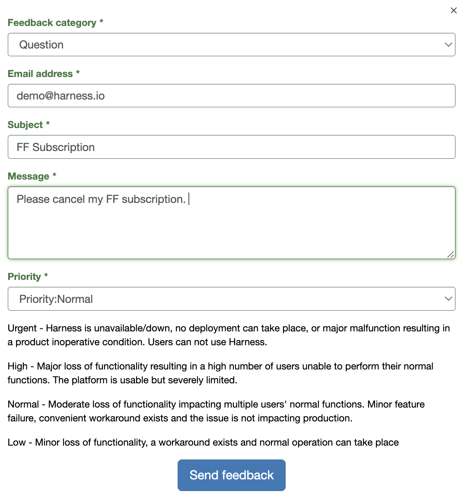

To cancel your subscription: 

1. On the Harness Platform, on the lefthand navigation, click **Help**.
2. Select **Submit a ticket**.
3. Complete the following fields in the form:
	1. **Feedback category**: Select **Question**.
	2. **Email**: Enter your email address.
	3. **Subject**: Enter **FF Subscriptions**.
	4. **Message**: Request a cancelation of your subscription.
	5. **Priority**: Select **Priority:Normal**.
4. Click **Send Feedback.**

*Figure 1: An example of a feedback form.*

